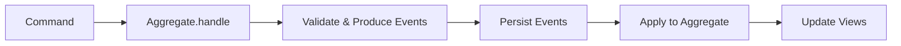
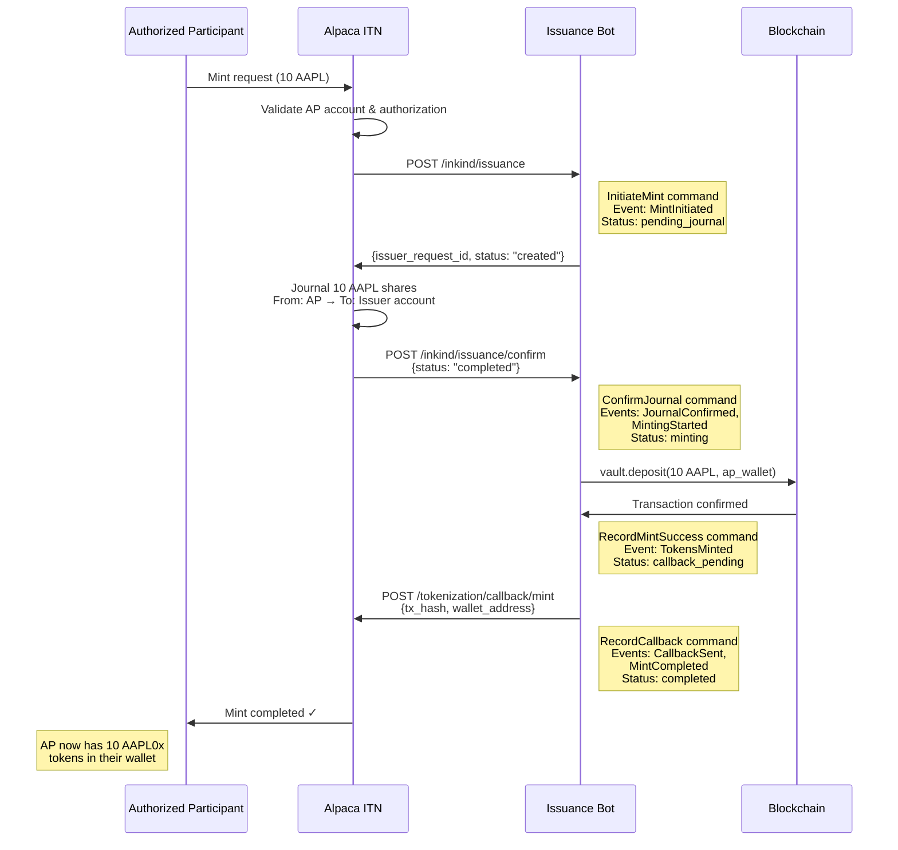
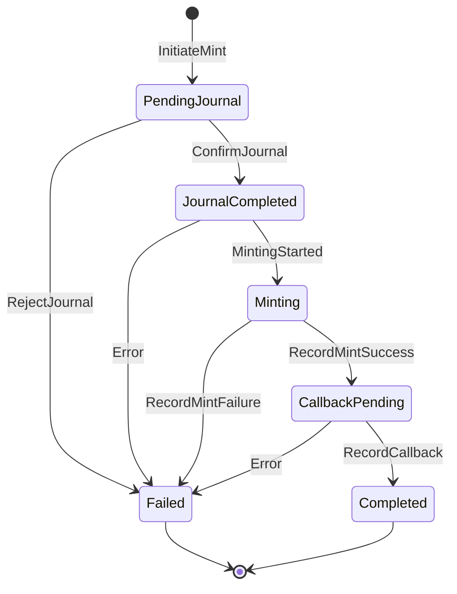
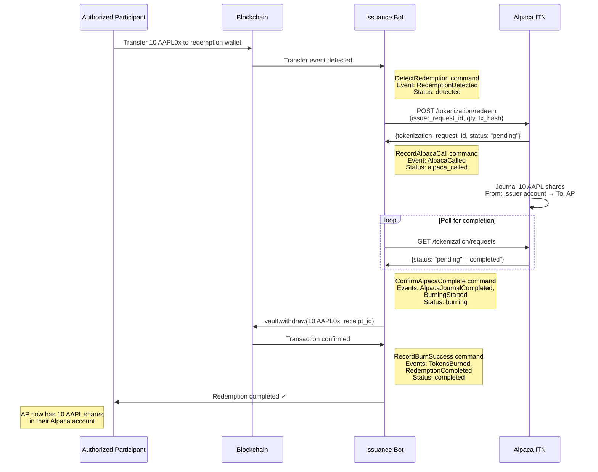
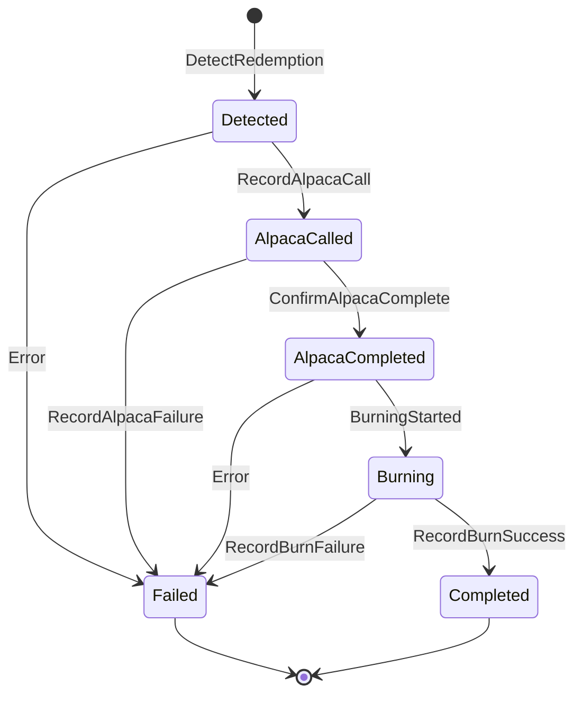

# Issuance Bot Specification

## Overview

The issuance bot acts as the **Issuer** in Alpaca's Instant Tokenization Network
(ITN). It implements the Issuer-side endpoints that Alpaca calls during
mint/redeem operations, and coordinates with the Rain
`OffchainAssetReceiptVault` contracts to execute the actual on-chain minting and
burning of tokenized shares.

**This is general infrastructure** - any Authorized Participant (AP) can use it
to mint and redeem tokenized equities. The issuance bot serves as the bridge
between traditional equity holdings (at Alpaca) and on-chain (semi-fungible)
tokenized representations (Rain SFT contracts).

## Background & Context

**Our Role:** We are the **Issuer** of tokenized equities. Alpaca acts as the
settlement layer between Authorized Participants (APs) and us.

**Flow Summary:**

- **Minting:** AP requests mint → Alpaca calls our endpoint → We validate →
  Alpaca journals shares from AP to our custodian account → Alpaca confirms
  journal → We mint tokens on-chain → We call Alpaca's callback
- **Redeeming:** AP sends tokens to our redemption wallet → We detect redemption
  → We call Alpaca's redeem endpoint → Alpaca journals shares from our account
  to AP → We burn tokens on-chain

**Use Cases:**

- **Market Makers & Arbitrageurs:** Can mint/burn to rebalance inventory and
  maintain price parity across venues
- **Institutions:** Can convert equity holdings to tokenized form for on-chain
  settlement, DeFi integration, or cross-border transfer
- **Retail Platforms:** Can facilitate tokenized equity access for their users
- **Our Arbitrage Bot:** Can use this infrastructure to complete the arbitrage
  cycle by rebalancing on/off-chain holdings. See
  [st0x.liquidity](https://github.com/ST0x-Technology/st0x.liquidity) for more
  details on the bot.

## Architecture

### Off-Chain Infrastructure

**Our HTTP Server:**

- Implements Alpaca ITN Issuer endpoints
- Handles account linking, mint requests, and journal confirmations
- Built with Rust (Axum/Actix web framework)
- SQLite database for tracking operations
- Async runtime for coordination

**Alpaca ITN:**

- Alpaca's settlement layer
- Handles journal transfers between accounts automatically
- Provides endpoints for callbacks and status queries

### On-Chain Infrastructure

**Rain OffchainAssetReceiptVault Contract:**

- ERC-1155 receipts tracking individual deposit IDs
- ERC-20 shares representing vault ownership
- `deposit()` function for minting
- `withdraw()` function for burning

**Redemption Wallet:**

- On-chain address where APs send tokens to redeem
- We monitor this address for incoming transfers

### ES/CQRS Architecture

The issuance bot uses **Event Sourcing (ES)** and **Command Query Responsibility
Segregation (CQRS)** patterns to maintain a complete audit trail, enable
time-travel debugging, and provide a single source of truth for all operations.

**Core Concepts:**

- **Aggregates**: Business entities that encapsulate state and business logic
  (e.g., `Mint`, `Redemption`, `AccountLink`, `TokenizedAsset`)
- **Commands**: Requests to perform actions, representing user or system intent
  (e.g., `InitiateMint`, `ConfirmJournal`)
- **Events**: Immutable facts about what happened, always in past tense (e.g.,
  `MintInitiated`, `JournalConfirmed`)
- **Event Store**: Single source of truth - an append-only log of all domain
  events stored in SQLite
- **Views**: Read-optimized projections built from events for efficient querying
- **Services**: External dependencies that aggregates use (Alpaca API client,
  blockchain client, monitoring service)

**Key Flow:**



**Critical Methods:**

- `handle(command) -> Result<Vec<Event>, Error>`: Business logic lives here.
  Validates the command against current aggregate state and returns a list of
  events (can be 0+ events). For example, `ConfirmJournal` might produce both
  `JournalConfirmed` and `MintingStarted` events.
- `apply(event)`: Deterministically updates aggregate state from events. This
  method is pure and should never fail - events are historical facts that have
  already occurred.

**Benefits:**

- **Complete Audit Trail**: Every state change is captured as an immutable event
- **Time Travel Debugging**: Replay events to reconstruct system state at any
  point in history
- **Testability**: Business logic tested via Given-When-Then pattern (given
  events, when command, then expect events)
- **Rebuild Views**: If a view becomes corrupted or a new projection is needed,
  simply replay all events
- **Multiple Projections**: Same events can feed different views (operational
  dashboard, analytics, Grafana metrics)
- **Single Source of Truth**: Event store is authoritative; all other data is
  derived

## Data Types

Throughout this specification, we use newtypes to provide type safety and
prevent mixing up different kinds of identifiers and values:

```rust
use rust_decimal::Decimal;
use chrono::{DateTime, Utc};

struct TokenizationRequestId(String);
struct IssuerRequestId(String);
struct ClientId(String);
struct AlpacaAccountNumber(String);
struct UnderlyingSymbol(String);
struct TokenSymbol(String);
struct Network(String);
struct Quantity(Decimal);
struct Email(String);
```

## Aggregates

This section defines the domain aggregates, their commands, and the events they
produce. Each aggregate represents a business concept with its own lifecycle and
invariants.

### Mint Aggregate

The `Mint` aggregate manages the complete lifecycle of a mint operation, from
initial request through journal confirmation to on-chain minting and callback.

**Aggregate State:**

- `issuer_request_id`: Our unique identifier for this mint
- `tokenization_request_id`: Alpaca's identifier
- `qty`, `underlying`, `token`, `network`, `client_id`, `wallet`: Request
  details
- `status`: Current state in the mint lifecycle
- `tx_hash`, `receipt_id`, `shares_minted`: On-chain transaction details
- Timestamps for each lifecycle stage

**Commands:**

- `InitiateMint { tokenization_request_id, qty, underlying, token, network, client_id, wallet }` -
  Create a new mint request from Alpaca
- `ConfirmJournal { issuer_request_id }` - Alpaca confirmed shares journal
  transfer
- `RejectJournal { issuer_request_id, reason }` - Alpaca rejected shares journal
  transfer
- `RecordMintSuccess { issuer_request_id, tx_hash, receipt_id, shares_minted, gas_used, block_number }` -
  On-chain mint transaction succeeded
- `RecordMintFailure { issuer_request_id, error }` - On-chain mint transaction
  failed
- `RecordCallback { issuer_request_id }` - Alpaca callback sent successfully
- `MarkFailed { issuer_request_id, reason }` - Mark the mint as failed for any
  reason

**Events:**

- `MintInitiated { issuer_request_id, tokenization_request_id, qty, underlying, token, network, client_id, wallet }` -
  Mint request created
- `JournalConfirmed { issuer_request_id }` - Alpaca journal transfer confirmed
- `JournalRejected { issuer_request_id, reason }` - Alpaca journal transfer
  rejected
- `MintingStarted { issuer_request_id }` - Beginning on-chain mint operation
- `TokensMinted { issuer_request_id, tx_hash, receipt_id, shares_minted, gas_used, block_number }` -
  On-chain mint succeeded
- `MintingFailed { issuer_request_id, error }` - On-chain mint failed
- `CallbackSent { issuer_request_id }` - Alpaca callback completed
- `MintCompleted { issuer_request_id }` - Entire mint flow completed
  successfully
- `MintFailed { issuer_request_id, reason }` - Mint flow failed

**Command → Event Mappings:**

| Command             | Events Produced                         | Notes                                                           |
| ------------------- | --------------------------------------- | --------------------------------------------------------------- |
| `InitiateMint`      | `MintInitiated`                         | Single event - mint request created                             |
| `ConfirmJournal`    | `JournalConfirmed`<br/>`MintingStarted` | Two events - journal confirmed AND we're starting on-chain mint |
| `RejectJournal`     | `JournalRejected`<br/>`MintFailed`      | Two events - journal rejected AND mint failed                   |
| `RecordMintSuccess` | `TokensMinted`                          | Single event - on-chain mint succeeded                          |
| `RecordMintFailure` | `MintingFailed`<br/>`MintFailed`        | Two events - on-chain mint failed AND overall mint failed       |
| `RecordCallback`    | `CallbackSent`<br/>`MintCompleted`      | Two events - callback sent AND mint fully completed             |
| `MarkFailed`        | `MintFailed`                            | Single event - mark mint as failed                              |

Note: A single command can produce multiple events when one action has several
state consequences.

### Redemption Aggregate

The `Redemption` aggregate manages the redemption lifecycle, from detecting an
on-chain transfer through calling Alpaca to burning tokens.

**Aggregate State:**

- `issuer_request_id`: Our unique identifier for this redemption
- `tokenization_request_id`: Alpaca's identifier (received after calling their
  API)
- `underlying`, `token`, `wallet`, `qty`: Redemption details
- `detected_tx_hash`: On-chain transfer that triggered redemption
- `status`: Current state in the redemption lifecycle
- `burn_tx_hash`, `receipt_id`, `shares_burned`: Burn transaction details
- Timestamps for each lifecycle stage

**Commands:**

- `DetectRedemption { underlying, token, wallet, qty, tx_hash, block_number }` -
  Transfer to redemption wallet detected
- `RecordAlpacaCall { issuer_request_id, tokenization_request_id }` - Alpaca
  redeem API called successfully
- `RecordAlpacaFailure { issuer_request_id, error }` - Alpaca redeem API call
  failed
- `ConfirmAlpacaComplete { issuer_request_id }` - Alpaca journal transfer
  completed
- `RecordBurnSuccess { issuer_request_id, burn_tx_hash, receipt_id, shares_burned, gas_used, block_number }` -
  On-chain burn succeeded
- `RecordBurnFailure { issuer_request_id, error }` - On-chain burn failed
- `MarkFailed { issuer_request_id, reason }` - Mark redemption as failed

**Events:**

- `RedemptionDetected { issuer_request_id, underlying, token, wallet, qty, tx_hash, block_number }` -
  Transfer to redemption wallet detected
- `AlpacaCalled { issuer_request_id, tokenization_request_id }` - Alpaca redeem
  endpoint called
- `AlpacaCallFailed { issuer_request_id, error }` - Alpaca API call failed
- `AlpacaJournalCompleted { issuer_request_id }` - Alpaca confirmed journal
  transfer
- `BurningStarted { issuer_request_id }` - Beginning on-chain burn operation
- `TokensBurned { issuer_request_id, burn_tx_hash, receipt_id, shares_burned, gas_used, block_number }` -
  On-chain burn succeeded
- `BurningFailed { issuer_request_id, error }` - On-chain burn failed
- `RedemptionCompleted { issuer_request_id }` - Entire redemption flow completed
- `RedemptionFailed { issuer_request_id, reason }` - Redemption flow failed

**Command → Event Mappings:**

| Command                 | Events Produced                               | Notes                                                 |
| ----------------------- | --------------------------------------------- | ----------------------------------------------------- |
| `DetectRedemption`      | `RedemptionDetected`                          | Single event - transfer to redemption wallet detected |
| `RecordAlpacaCall`      | `AlpacaCalled`                                | Single event - Alpaca redeem API called               |
| `RecordAlpacaFailure`   | `AlpacaCallFailed`<br/>`RedemptionFailed`     | Two events - API call failed AND redemption failed    |
| `ConfirmAlpacaComplete` | `AlpacaJournalCompleted`<br/>`BurningStarted` | Two events - Alpaca done AND we're starting burn      |
| `RecordBurnSuccess`     | `TokensBurned`<br/>`RedemptionCompleted`      | Two events - burned AND redemption fully done         |
| `RecordBurnFailure`     | `BurningFailed`<br/>`RedemptionFailed`        | Two events - burn failed AND redemption failed        |
| `MarkFailed`            | `RedemptionFailed`                            | Single event - mark redemption as failed              |

### AccountLink Aggregate

The `AccountLink` aggregate manages the relationship between AP accounts and our
system.

**Aggregate State:**

- `client_id`: Our identifier for the linked account
- `email`: AP's email address
- `alpaca_account`: Alpaca account number
- `status`: Active, suspended, or inactive
- Timestamps

**Commands:**

- `LinkAccount { email, alpaca_account }` - Create new account link
- `UnlinkAccount { client_id }` - Remove account link
- `SuspendAccount { client_id, reason }` - Temporarily suspend account
- `ReactivateAccount { client_id }` - Reactivate suspended account

**Events:**

- `AccountLinked { client_id, email, alpaca_account }` - Account successfully
  linked
- `AccountUnlinked { client_id }` - Account link removed
- `AccountSuspended { client_id, reason }` - Account suspended
- `AccountReactivated { client_id }` - Account reactivated

**Command → Event Mappings:**

| Command             | Events Produced      | Notes                         |
| ------------------- | -------------------- | ----------------------------- |
| `LinkAccount`       | `AccountLinked`      | New account link created      |
| `UnlinkAccount`     | `AccountUnlinked`    | Account link removed          |
| `SuspendAccount`    | `AccountSuspended`   | Account temporarily suspended |
| `ReactivateAccount` | `AccountReactivated` | Suspended account reactivated |

### TokenizedAsset Aggregate

The `TokenizedAsset` aggregate manages which assets are supported for
tokenization.

**Aggregate State:**

- `underlying`, `token`: Symbol identifiers
- `network`: Blockchain network
- `vault_address`: On-chain vault contract address
- `enabled`: Whether asset is currently available for minting/redeeming
- Timestamps

**Commands:**

- `AddAsset { underlying, token, network, vault_address }` - Add new supported
  asset
- `EnableAsset { underlying }` - Enable asset for minting/redeeming
- `DisableAsset { underlying, reason }` - Disable asset temporarily
- `UpdateVaultAddress { underlying, vault_address }` - Update vault contract
  address

**Events:**

- `AssetAdded { underlying, token, network, vault_address }` - New asset added
- `AssetEnabled { underlying }` - Asset enabled
- `AssetDisabled { underlying, reason }` - Asset disabled
- `VaultAddressUpdated { underlying, vault_address, previous_address }` - Vault
  address changed

**Command → Event Mappings:**

| Command              | Events Produced       | Notes                                       |
| -------------------- | --------------------- | ------------------------------------------- |
| `AddAsset`           | `AssetAdded`          | New tokenized asset added to supported list |
| `EnableAsset`        | `AssetEnabled`        | Asset enabled for minting/redeeming         |
| `DisableAsset`       | `AssetDisabled`       | Asset temporarily disabled                  |
| `UpdateVaultAddress` | `VaultAddressUpdated` | Vault contract address changed              |

## Services

Aggregates use services to interact with external systems while keeping business
logic testable and isolated.

**AlpacaService:**

- HTTP client for Alpaca API
- Methods: `call_redeem_endpoint()`, `send_mint_callback()`,
  `poll_request_status()`
- Handles authentication, retries, and error mapping

**BlockchainService:**

- RPC client for blockchain interaction
- Methods: `mint_tokens()`, `burn_tokens()`, `estimate_gas()`,
  `get_receipt_balance()`
- Manages transaction signing, gas estimation, and receipt parsing

**MonitorService:**

- Watches redemption wallet for incoming transfers
- Methods: `watch_transfers()`, `get_transfer_details()`
- Uses a WebSocket subscription to detect redemption events

These services are injected into aggregate command handlers, making aggregates
testable with mock services.

## Core Functionality

### 1. Account Linking (Handshake Process)

Before an AP can mint or redeem tokens, Alpaca needs to link the AP's Alpaca
account with their account on our platform.

**Endpoint:** `POST /accounts/connect`

**Request Body:**

```json
{
  "email": "customer@firm.com",
  "account": "alpaca_account_number"
}
```

**Our Response:**

```json
{
  "client_id": "5505-1234-ABC-4G45"
}
```

**Status Codes:**

- `200`: Successful link
- `404`: Email not found on our platform
- `409`: Account already linked

**Data Structure:**

```rust
struct AccountLinkRequest {
    email: Email,
    account: AlpacaAccountNumber,
}

struct AccountLinkResponse {
    client_id: ClientId,
}
```

### 2. Tokenized Assets Data Endpoint

Alpaca needs to query which assets we support:

**Endpoint:** `GET /tokenized-assets`

**Our Response:**

```json
[
  {
    "underlying_symbol": "AAPL",
    "token_symbol": "AAPL0x",
    "network": "base"
  },
  {
    "underlying_symbol": "TSLA",
    "token_symbol": "TSLA0x",
    "network": "base"
  }
]
```

**Data Structure:**

```rust
struct TokenizedAsset {
    #[serde(rename = "underlying_symbol")]
    underlying: UnderlyingSymbol,
    #[serde(rename = "token_symbol")]
    token: TokenSymbol,
    network: Network,
}
```

### 3. Token Minting (Alpaca ITN Flow)

#### Complete Mint Flow



#### Step 1: Receive Mint Request from Alpaca

**Endpoint:** `POST /inkind/issuance`

**Request Body:**

```json
{
  "tokenization_request_id": "12345-678-90AB",
  "qty": "1.23",
  "underlying_symbol": "TSLA",
  "token_symbol": "TSLAx",
  "network": "solana",
  "client_id": "98765432",
  "wallet_address": "<AP's wallet address to deposit the tokenized asset>"
}
```

**Our Validation:**

1. Verify `underlying_symbol` is supported
2. Verify `token_symbol` matches our convention
3. Verify `network` is supported (our EVM chain)
4. Verify `client_id` is a valid/linked AP
5. Verify `wallet_address` is valid Ethereum address
6. Verify `qty` is reasonable (positive, not exceeding limits)

**Note:** We do NOT check if we have sufficient off-chain shares at this stage.
The AP is supposed to have sent shares to Alpaca, and Alpaca will journal them
to us. We simply validate the request format and respond. If the journal fails
in Step 2, we'll find out in Step 3.

**Our Response:**

```json
{
  "issuer_request_id": "123-456-ABCD-7890",
  "status": "created"
}
```

**Status Codes:**

- `200`: Request validated and created
- `400`: Invalid request with specific error:
  - "Invalid Wallet: Wallet does not belong to client"
  - "Invalid Token: Token not available on the network"
  - "Insufficient Eligibility: Client not eligible"
  - "Failed Validation: Invalid data payload"

**Data Storage:** Store in database with status `pending_journal`

**Data Structures:**

```rust
struct AlpacaMintRequest {
    tokenization_request_id: TokenizationRequestId,
    qty: Quantity,
    #[serde(rename = "underlying_symbol")]
    underlying: UnderlyingSymbol,
    #[serde(rename = "token_symbol")]
    token: TokenSymbol,
    network: Network,
    client_id: ClientId,
    #[serde(rename = "wallet_address")]
    wallet: Address,
}

struct MintRequestResponse {
    issuer_request_id: IssuerRequestId,
    status: String,  // "created"
}
```

#### Step 2: Alpaca Journals Shares

**Alpaca's Action:** Automatically journals the underlying shares from the AP's
account into our designated tokenization account at Alpaca.

**Our Action:** None - we wait for confirmation in Step 3

#### Step 3: Receive Journal Confirmation from Alpaca

**Endpoint:** `POST /inkind/issuance/confirm`

**Request Body:**

```json
{
  "tokenization_request_id": "12345-678-90AB",
  "issuer_request_id": "ABC-123-DEF-456",
  "status": "completed"
}
```

**Status Values:**

- `completed`: Journal succeeded, proceed to mint tokens on-chain
- `rejected`: Journal failed, mark request as failed and do NOT mint

**Our Response:** `200 OK` (acknowledge receipt)

**Our Actions:**

- If `completed`: Update database status to `journal_completed` and proceed to
  Step 4
- If `rejected`: Update database status to `failed` with reason
  "journal_rejected"

**Data Structure:**

```rust
enum AlpacaConfirmationStatus {
    Completed,
    Rejected,
}

struct AlpacaJournalConfirmation {
    tokenization_request_id: TokenizationRequestId,
    issuer_request_id: IssuerRequestId,
    status: AlpacaConfirmationStatus,
}
```

#### Step 4: Mint Tokens On-Chain

Once journal is confirmed, we mint tokens using the Rain vault.

**On-Chain Call:** `OffchainAssetReceiptVault.deposit()`

**Parameters:**

- `assets`: Quantity to mint (convert from string to U256, handling decimals)
- `receiver`: AP's wallet address from original request
- `receiptInformation`: Metadata bytes (see structure below)

**Receipt Information Structure:**

```rust
struct ReceiptInformation {
    alpaca_tokenization_request_id: TokenizationRequestId,
    issuer_request_id: IssuerRequestId,
    #[serde(rename = "underlying_symbol")]
    underlying: UnderlyingSymbol,
    quantity: Quantity,
    operation_type: OperationType,
    timestamp: chrono::DateTime<Utc>,
    notes: Option<String>,
}

enum OperationType {
    Mint,
    Redeem,
}
```

**Metadata for this mint:**

- Alpaca `tokenization_request_id`
- Our `issuer_request_id`
- Symbol and quantity
- Timestamp
- Operation type: "mint"

**Authorization Check:** Before attempting to mint, verify that our operator
address is authorized for the `DEPOSIT` permission on the vault. The
`OffchainAssetReceiptVault` uses an authorizer contract to control permissions.
If not authorized, the transaction will revert.

**Gas Management:**

- Estimate gas before submitting transaction
- Use reasonable gas price (e.g., median + 10% from recent blocks)
- Set appropriate gas limit with buffer (e.g., estimated * 1.2)
- Monitor for stuck transactions and implement escalation if needed
- Track gas costs per operation for operational metrics

**On Success:**

- Parse transaction receipt to extract:
  - Receipt ID created (from deposit event)
  - Shares minted (from deposit event)
  - Gas used
  - Block number
- Update database status to `callback_pending`
- Store transaction details (tx hash, receipt ID, shares, gas used, block
  number)
- Proceed to Step 5

**Data Structure:**

```rust
struct MintResult {
    tx_hash: B256,
    receipt_id: U256,
    shares_minted: U256,
    gas_used: u64,
    block_number: u64,
}
```

#### Step 5: Callback to Alpaca

After successful on-chain minting, we call Alpaca's callback endpoint to confirm
completion.

**Endpoint:** `POST /v1/accounts/{account_id}/tokenization/callback/mint`

Where `{account_id}` is our designated tokenization account ID at Alpaca.

**Request Body:**

```json
{
  "tokenization_request_id": "12345-678-90AB",
  "client_id": "5505-1234-ABC-4G45",
  "wallet_address": "<AP's wallet address where tokens were deposited>",
  "tx_hash": "0x12345678",
  "network": "base"
}
```

**On Success:**

- Update database status to `completed`
- Record completion timestamp

**On Failure:**

- Retry with exponential backoff
- If persistent failure, alert operators (mint succeeded on-chain but Alpaca not
  notified)
- Keep status as `callback_pending` until successful

#### Mint Request State Machine



**Data Structures:**

```rust
struct StoredMintRequest {
    id: i64,
    tokenization_request_id: TokenizationRequestId,
    issuer_request_id: IssuerRequestId,
    qty: Quantity,
    underlying: UnderlyingSymbol,
    token: TokenSymbol,
    network: Network,
    client_id: ClientId,
    wallet: Address,
    status: MintStatus,
    created_at: DateTime<Utc>,
    updated_at: DateTime<Utc>,
}

enum MintStatus {
    PendingJournal,
    JournalCompleted,
    Minting,
    CallbackPending,
    Completed,
    Failed(String),
}
```

### 4. Token Redemption (Alpaca ITN Flow)

#### Complete Redemption Flow



#### Step 1: Monitor Redemption Wallet

We continuously monitor our designated redemption wallet for incoming token
transfers.

**Monitoring Approach:**

- Subscribe to `Transfer` events for the vault's ERC-20 shares
- Filter for transfers where `to` address is our redemption wallet
- Can use WebSocket subscription or polling depending on infrastructure

**On Detection:**

- Parse transfer details (from address, amount, tx hash, block number)
- Determine symbol from vault/token context
- Convert amount from U256 to decimal quantity string
- Generate our internal `issuer_request_id`
- Store in database with status `detected`
- Proceed to Step 2

**Data Structure:**

```rust
struct TransferEvent {
    from: Address,      // AP's wallet that sent the tokens
    to: Address,        // Our redemption wallet
    amount: U256,       // Token amount transferred
    tx_hash: B256,
    block_number: u64,
    block_timestamp: u64,
}
```

#### Step 2: Call Alpaca's Redeem Endpoint

When we detect a redemption, we notify Alpaca.

**Endpoint:** `POST /v1/accounts/{account_id}/tokenization/redeem`

Where `{account_id}` is our designated tokenization account ID at Alpaca.

**Request Body:**

```json
{
  "issuer_request_id": "ABC-123-DEF-456",
  "underlying_symbol": "AAPL",
  "token_symbol": "AAPL0x",
  "client_id": "5505-1234-ABC-4G45",
  "qty": "1.23",
  "network": "base",
  "wallet_address": "<the originating wallet address for the redeemed tokens>",
  "tx_hash": "0x12345678"
}
```

**Alpaca's Response:**

```json
{
  "tokenization_request_id": "12345-678-90AB",
  "issuer_request_id": "ABCDEF123",
  "created_at": "2025-09-12T17:28:48.642437-04:00",
  "type": "redeem",
  "status": "pending",
  "underlying_symbol": "TSLA",
  "token_symbol": "TSLAx",
  "qty": "123.45",
  "issuer": "xstocks",
  "network": "base",
  "wallet_address": "0x1234567A",
  "tx_hash": "0x1234567A",
  "fees": "0.567"
}
```

**Status Values:**

- `pending`: Redemption request received, journal in progress
- `completed`: Journal completed successfully
- `rejected`: Redemption rejected

**Our Actions:**

- Store `tokenization_request_id` from response
- Update database status to `alpaca_called`
- Proceed to Step 3 (polling for completion)

**Client ID Lookup:** We need to look up the AP's `client_id` based on their
wallet address. This requires maintaining a mapping between wallet addresses and
client IDs from the account linking process.

**Data Structures:**

```rust
struct AlpacaRedeemRequest {
    issuer_request_id: IssuerRequestId,
    #[serde(rename = "underlying_symbol")]
    underlying: UnderlyingSymbol,
    #[serde(rename = "token_symbol")]
    token: TokenSymbol,
    client_id: ClientId,
    qty: Quantity,
    network: Network,
    #[serde(rename = "wallet_address")]
    wallet: Address,
    tx_hash: B256,
}

enum RedeemRequestType {
    Redeem,
}

enum RedeemRequestStatus {
    Pending,
    Completed,
    Rejected,
}

struct Fees(Decimal);

struct AlpacaRedeemResponse {
    tokenization_request_id: TokenizationRequestId,
    issuer_request_id: IssuerRequestId,
    created_at: DateTime<Utc>,
    request_type: RedeemRequestType,
    status: RedeemRequestStatus,
    #[serde(rename = "underlying_symbol")]
    underlying: UnderlyingSymbol,
    #[serde(rename = "token_symbol")]
    token: TokenSymbol,
    qty: Quantity,
    issuer: String,
    network: Network,
    #[serde(rename = "wallet_address")]
    wallet: Address,
    tx_hash: B256,
    fees: Fees,
}
```

#### Step 3: Poll for Journal Completion

**Alpaca's Action:** Automatically journals the underlying shares from our
tokenization account to the AP's account.

**Our Action:** Poll Alpaca's list endpoint to check status.

**Endpoint:** `GET /v1/accounts/{account_id}/tokenization/requests`

**Polling Strategy:**

- Start with 5-second intervals
- Exponential backoff up to 30-second max
- Timeout after 1 hour
- Update database status to `alpaca_completed` when status is "completed"
- Handle "rejected" status by marking redemption as failed

#### Step 4: Burn Tokens On-Chain

Once Alpaca confirms the journal is completed, we burn the tokens on-chain.

**On-Chain Call:** `OffchainAssetReceiptVault.withdraw()`

**Parameters:**

- `assets`: Quantity to burn (convert from string to U256)
- `receiver`: Can be zero address (tokens going off-chain)
- `owner`: Our redemption wallet (owns the shares)
- `id`: Receipt ID to burn from (need to track which receipt to use)
- `receiptInformation`: Metadata bytes (similar structure to mint)

**Receipt Tracking:** We need to determine which receipt ID has sufficient
balance to burn from. This requires:

- Maintaining an inventory of active receipt IDs
- Querying on-chain balances for the redemption wallet
- Selecting an appropriate receipt with sufficient balance

**Authorization Check:** Verify our operator address is authorized for the
`WITHDRAW` permission on the vault.

**Gas Management:** Same strategy as minting:

- Estimate gas before submitting
- Use reasonable gas price with buffer
- Monitor and escalate if stuck
- Track costs

**On Success:**

- Parse transaction receipt to extract shares burned and gas used
- Update database status to `completed`
- Record completion timestamp

**Data Structure:**

```rust
struct BurnResult {
    tx_hash: B256,
    receipt_id: U256,
    shares_burned: U256,
    gas_used: u64,
    block_number: u64,
}
```

#### Redemption Request State Machine



**Data Structures:**

```rust
struct StoredRedemption {
    id: i64,
    issuer_request_id: IssuerRequestId,
    tokenization_request_id: Option<TokenizationRequestId>,
    underlying: UnderlyingSymbol,
    token: TokenSymbol,
    wallet: Address,
    tx_hash: B256,
    qty: Quantity,
    status: RedemptionStatus,
    detected_at: DateTime<Utc>,
    alpaca_called_at: Option<DateTime<Utc>>,
    alpaca_completed_at: Option<DateTime<Utc>>,
    burned_at: Option<DateTime<Utc>>,
}

enum RedemptionStatus {
    Detected,
    AlpacaCalled,
    AlpacaCompleted,
    Burning,
    Completed,
    Failed(String),
}
```

## Alpaca ITN Integration Details

### Endpoints We Implement

We run an HTTP server that implements these endpoints for Alpaca to call:

1. **`POST /accounts/connect`** - Account linking
2. **`GET /tokenized-assets`** - List supported assets
3. **`POST /inkind/issuance`** - Mint request from Alpaca
4. **`POST /inkind/issuance/confirm`** - Journal confirmation from Alpaca

### Endpoints We Call

We call these Alpaca endpoints:

1. **`POST /v1/accounts/{account_id}/tokenization/callback/mint`** - Confirm
   mint completed
2. **`POST /v1/accounts/{account_id}/tokenization/redeem`** - Initiate
   redemption
3. **`GET /v1/accounts/{account_id}/tokenization/requests`** - List/poll
   requests

### Authentication

- **OAuth 2.0** for calling Alpaca endpoints
- **API Key** or **mTLS** for Alpaca calling our endpoints
- Store tokens securely with encryption
- Handle token refresh before expiration

### Error Handling

**Mint Request Errors (400 responses):**

- "Invalid Wallet: Wallet does not belong to client"
- "Invalid Token: Token not available on the network"
- "Insufficient Eligibility: Client not eligible"
- "Failed Validation: Invalid data payload"

**Redemption Errors:**

- Journal failed/rejected
- Insufficient balance in tokenization account
- Unknown client_id
- Invalid transaction hash

**Recovery Strategies:**

1. **Journal Failed**: Mark mint as failed, do not mint tokens
2. **Callback Failed**: Retry callback with exponential backoff, alert if
   persistent
3. **Burn Failed**: Tokens stuck in redemption wallet, manual intervention
   needed
4. **Alpaca Redeem Failed**: Tokens in redemption wallet but no journal,
   reconciliation required

## Database Schema

The database uses **SQLite** with an event sourcing architecture. The event
store is the single source of truth, and all other tables are read-optimized
views derived from events.

### Event Store Tables

These tables store the immutable event log that serves as the authoritative
source of truth.

```sql
-- Events table: stores all domain events
CREATE TABLE events (
    aggregate_type TEXT NOT NULL,      -- 'Mint', 'Redemption', 'AccountLink', 'TokenizedAsset'
    aggregate_id TEXT NOT NULL,        -- Unique identifier for the aggregate instance
    sequence BIGINT NOT NULL,          -- Sequence number for this aggregate (starts at 1)
    event_type TEXT NOT NULL,          -- Event name (e.g., 'MintInitiated', 'TokensMinted')
    event_version TEXT NOT NULL,       -- Event schema version (e.g., '1.0')
    payload JSON NOT NULL,             -- Event data as JSON
    metadata JSON NOT NULL,            -- Correlation IDs, timestamps, user context, etc.
    PRIMARY KEY (aggregate_type, aggregate_id, sequence)
);

CREATE INDEX idx_events_type ON events(aggregate_type);
CREATE INDEX idx_events_aggregate ON events(aggregate_id);

-- Snapshots table: aggregate state cache for performance
CREATE TABLE snapshots (
    aggregate_type TEXT NOT NULL,
    aggregate_id TEXT NOT NULL,
    last_sequence BIGINT NOT NULL,    -- Last event sequence included in this snapshot
    payload JSON NOT NULL,             -- Serialized aggregate state
    timestamp TEXT NOT NULL,
    PRIMARY KEY (aggregate_type, aggregate_id)
);
```

**Note on Snapshots**: The snapshots table is a performance optimization that
caches aggregate state at specific sequence numbers. When loading an aggregate,
the framework loads the latest snapshot (if any) and replays only events since
that snapshot, rather than replaying all events from the beginning. Snapshots
can be deleted at any time - aggregates can always be rebuilt from the event
store alone.

### View Tables

These tables are read-optimized projections built from events. They can be
rebuilt at any time by replaying events.

```sql
-- Mint view: current state of mint operations
CREATE TABLE mint_view (
    view_id TEXT PRIMARY KEY,         -- issuer_request_id
    version BIGINT NOT NULL,          -- Last event sequence applied to this view
    payload JSON NOT NULL             -- Current mint state as JSON
);

CREATE INDEX idx_mint_view_payload ON mint_view(json_extract(payload, '$.status'));
CREATE INDEX idx_mint_view_client ON mint_view(json_extract(payload, '$.client_id'));
CREATE INDEX idx_mint_view_symbol ON mint_view(json_extract(payload, '$.underlying'));

-- Redemption view: current state of redemption operations
CREATE TABLE redemption_view (
    view_id TEXT PRIMARY KEY,         -- issuer_request_id
    version BIGINT NOT NULL,
    payload JSON NOT NULL
);

CREATE INDEX idx_redemption_view_payload ON redemption_view(json_extract(payload, '$.status'));
CREATE INDEX idx_redemption_view_symbol ON redemption_view(json_extract(payload, '$.underlying'));

-- Account link view: current account links
CREATE TABLE account_link_view (
    view_id TEXT PRIMARY KEY,         -- client_id
    version BIGINT NOT NULL,
    payload JSON NOT NULL             -- {email, alpaca_account, status, timestamps}
);

CREATE INDEX idx_account_link_email ON account_link_view(json_extract(payload, '$.email'));
CREATE INDEX idx_account_link_alpaca ON account_link_view(json_extract(payload, '$.alpaca_account'));
CREATE INDEX idx_account_link_status ON account_link_view(json_extract(payload, '$.status'));

-- Tokenized asset view: current supported assets
CREATE TABLE tokenized_asset_view (
    view_id TEXT PRIMARY KEY,         -- underlying symbol
    version BIGINT NOT NULL,
    payload JSON NOT NULL             -- {token, network, vault_address, enabled, timestamps}
);

CREATE INDEX idx_asset_view_enabled ON tokenized_asset_view(json_extract(payload, '$.enabled'));

-- Receipt inventory view: built from TokensMinted and TokensBurned events
CREATE TABLE receipt_inventory_view (
    view_id TEXT PRIMARY KEY,         -- receipt_id:vault_address
    version BIGINT NOT NULL,
    payload JSON NOT NULL             -- {receipt_id, vault_address, symbol, initial_amount, current_balance, timestamps}
);

CREATE INDEX idx_receipt_vault ON receipt_inventory_view(json_extract(payload, '$.vault_address'));
CREATE INDEX idx_receipt_symbol ON receipt_inventory_view(json_extract(payload, '$.symbol'));

-- Inventory snapshot view: periodic inventory metrics for Grafana
CREATE TABLE inventory_snapshot_view (
    view_id TEXT PRIMARY KEY,         -- symbol:timestamp
    version BIGINT NOT NULL,
    payload JSON NOT NULL             -- {symbol, onchain_balance, offchain_balance, total_balance, onchain_ratio, timestamp}
);

CREATE INDEX idx_snapshot_symbol ON inventory_snapshot_view(json_extract(payload, '$.symbol'));
CREATE INDEX idx_snapshot_timestamp ON inventory_snapshot_view(json_extract(payload, '$.timestamp'));
```

**Note on Views**: All view tables follow the same pattern - `view_id` (primary
key), `version` (last event sequence applied), and `payload` (JSON containing
the view state). Views implement the `View` trait and are automatically updated
by `GenericQuery` processors when events are committed. If a view becomes
corrupted or a new projection is needed, simply drop the table and replay all
events to rebuild it.

## Views and Queries

Views are read models that listen to events and maintain queryable state. Each
view implements the `View` trait with an `update()` method that processes
events.

**How Views Work:**

1. When events are committed to the event store, the `CqrsFramework` dispatches
   them to all registered queries
2. Each `GenericQuery` loads the current view state, applies the new events via
   the `update()` method, and persists the updated view
3. Views track the last event sequence they've processed to ensure exactly-once
   processing
4. If a view is missing or outdated, it can be rebuilt by replaying all events
   for that aggregate type

**Example View Implementations:**

**MintView** - Maintains current state of mint operations:

- Listens to: `MintInitiated`, `JournalConfirmed`, `TokensMinted`,
  `MintCompleted`, etc.
- Updates: Status, timestamps, transaction details
- Used for: Querying current mint status, operational dashboards, API responses

**RedemptionView** - Maintains current state of redemptions:

- Listens to: `RedemptionDetected`, `AlpacaCalled`, `TokensBurned`,
  `RedemptionCompleted`, etc.
- Updates: Status, timestamps, transaction details
- Used for: Tracking redemption progress, status queries

**ReceiptInventoryView** - Tracks receipt balances:

- Listens to: `TokensMinted` (increases balance), `TokensBurned` (decreases
  balance)
- Updates: Current balance for each receipt ID
- Used for: Selecting which receipt to burn from, inventory management

**InventorySnapshotView** - Periodic inventory metrics:

- Listens to: `TokensMinted`, `TokensBurned`
- Updates: Calculates periodic snapshots of on-chain vs off-chain inventory
- Used for: Grafana dashboards, monitoring, alerting

**AccountLinkView** - Current account links:

- Listens to: `AccountLinked`, `AccountUnlinked`, `AccountSuspended`,
  `AccountReactivated`
- Updates: Account status, relationship data
- Used for: Validating client IDs, looking up accounts by email or Alpaca
  account number

**TokenizedAssetView** - Supported assets:

- Listens to: `AssetAdded`, `AssetEnabled`, `AssetDisabled`,
  `VaultAddressUpdated`
- Updates: Asset configuration, enabled status
- Used for: Validating mint/redemption requests, listing available assets

## Configuration

### Environment Variables

```bash
# HTTP Server Configuration
SERVER_HOST=0.0.0.0
SERVER_PORT=8080
SERVER_API_KEY=<our_api_key_for_alpaca_to_call_us>

# Alpaca Configuration
ALPACA_API_KEY=<api_key>
ALPACA_API_SECRET=<api_secret>
ALPACA_BASE_URL=https://broker-api.alpaca.markets
ALPACA_TOKENIZATION_ACCOUNT_ID=<our_designated_tokenization_account_at_alpaca>

# Blockchain Configuration
RPC_WS_URL=<ethereum_websocket_url>
CHAIN_ID=8453  # Base
CHAIN_NAME=base
VAULT_ADDRESS=<offchain_asset_receipt_vault_address>
REDEMPTION_WALLET_ADDRESS=<address_where_aps_send_tokens_to_redeem>

# Database
DATABASE_URL=sqlite:issuance.db

# Encryption
ENCRYPTION_KEY=<32_byte_hex_key>

# Operational Parameters
MAX_GAS_PRICE_GWEI=100
REDEMPTION_POLL_INTERVAL=30  # seconds between checking for redemptions
ALPACA_STATUS_POLL_INTERVAL=5  # seconds between status checks
ALPACA_STATUS_POLL_TIMEOUT=3600  # max seconds to wait for redemption completion

# Monitoring
LOG_LEVEL=info
METRICS_PORT=9090
```

### Private Key Management

**TBD** - Private key management strategy needs to be worked out in greater
detail including:

- Storage approach (encrypted file, HSM, KMS)
- Access controls
- Rotation procedures
- Backup and recovery
- Separation between minting and burning keys if needed

This is a critical security consideration that requires careful planning.
