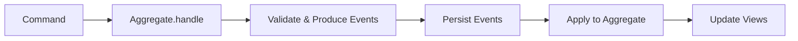
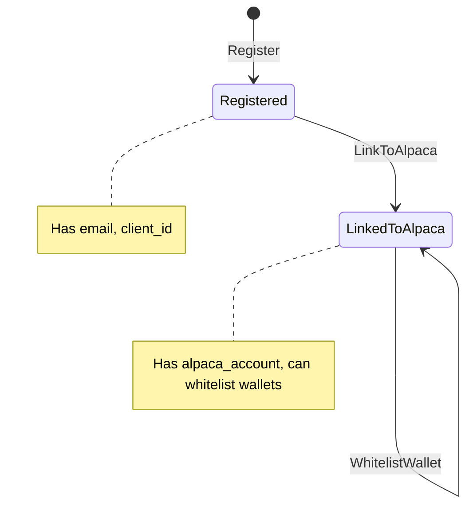
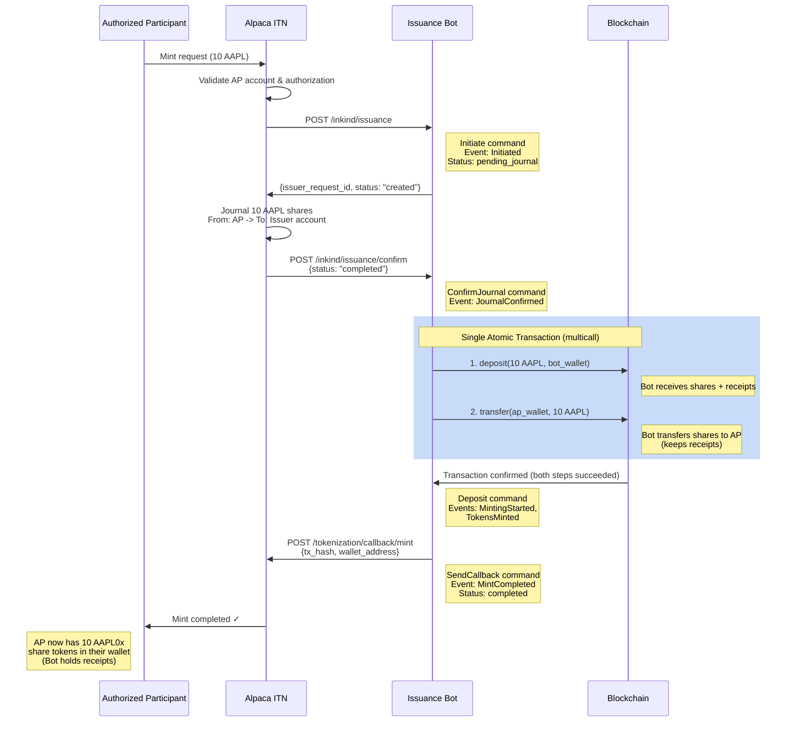
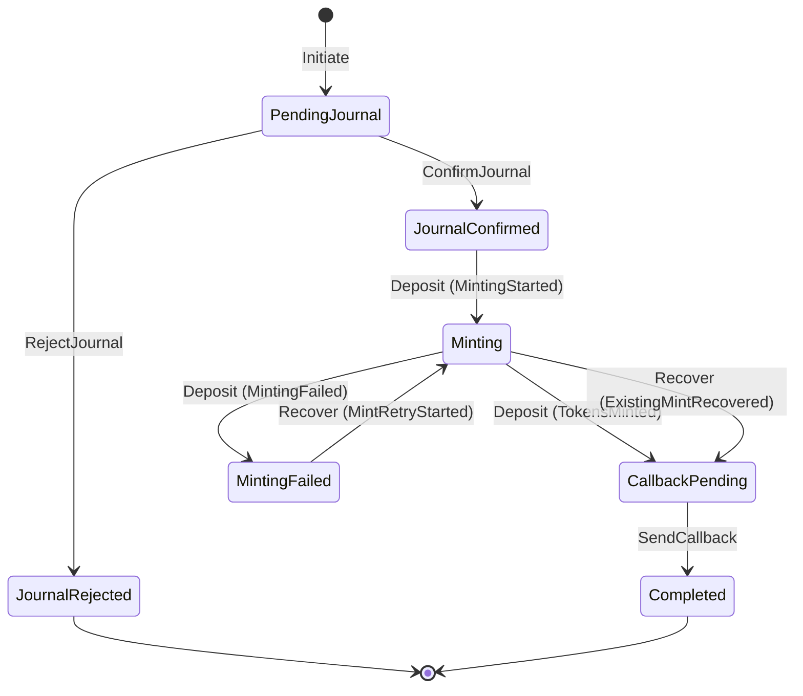
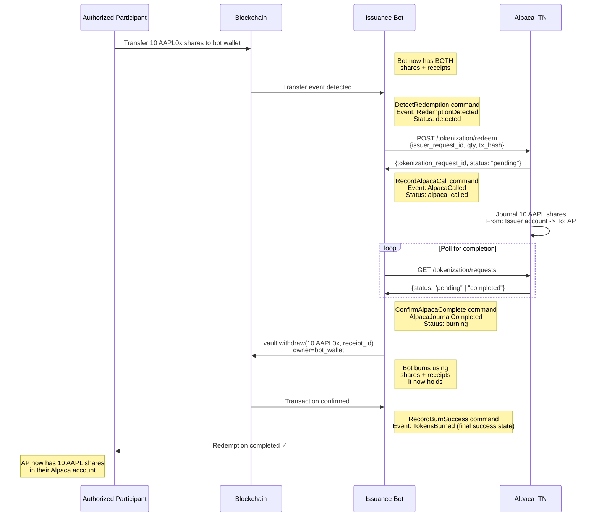
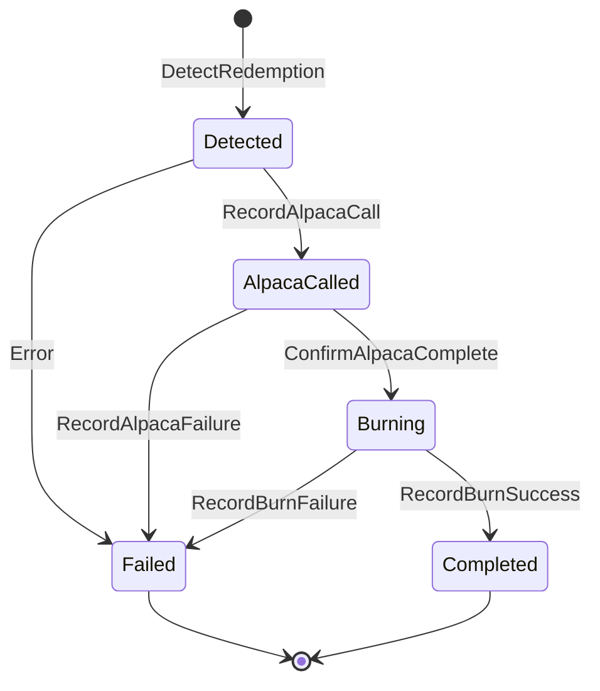
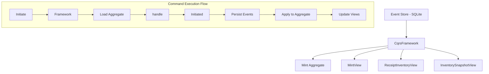

# Issuance Bot Specification

## Overview

The issuance bot acts as the **Issuer** in Alpaca's Instant Tokenization Network
(ITN). It implements the Issuer-side endpoints that Alpaca calls during
mint/redeem operations, and coordinates with the Rain
`OffchainAssetReceiptVault` contracts to execute the actual on-chain minting and
burning of tokenized shares.

**This is general infrastructure** - any Authorized Participant (AP) can use it
to mint and redeem tokenized equities. The issuance bot serves as the bridge
between traditional equity holdings (at Alpaca) and on-chain (semi-fungible)
tokenized representations (Rain SFT contracts).

## Background & Context

**Our Role:** We are the **Issuer** of tokenized equities. Alpaca acts as the
settlement layer between Authorized Participants (APs) and us.

**Flow Summary:**

- **Minting:** AP requests mint -> Alpaca calls our endpoint -> We validate ->
  Alpaca journals shares from AP to our custodian account -> Alpaca confirms
  journal -> We mint tokens on-chain -> We call Alpaca's callback
- **Redeeming:** AP sends tokens to our redemption wallet -> We detect
  redemption -> We call Alpaca's redeem endpoint -> Alpaca journals shares from
  our account to AP -> We burn tokens on-chain

**Use Cases:**

- **Market Makers & Arbitrageurs:** Can mint/burn to rebalance inventory and
  maintain price parity across venues
- **Institutions:** Can convert equity holdings to tokenized form for on-chain
  settlement, DeFi integration, or cross-border transfer
- **Retail Platforms:** Can facilitate tokenized equity access for their users
- **Our Arbitrage Bot:** Can use this infrastructure to complete the arbitrage
  cycle by rebalancing on/off-chain holdings. See
  [st0x.liquidity](https://github.com/ST0x-Technology/st0x.liquidity) for more
  details on the bot.

## Architecture

### Off-Chain Infrastructure

**Our HTTP Server:**

- Implements Alpaca ITN Issuer endpoints
- Handles account linking, mint requests, and journal confirmations
- Built with Rust (Rocket.rs web framework)
- SQLite database for tracking operations
- Async runtime for coordination

**Alpaca ITN:**

- Alpaca's settlement layer
- Handles journal transfers between accounts automatically
- Provides endpoints for callbacks and status queries

### On-Chain Infrastructure

**Rain OffchainAssetReceiptVault Contract:**

- ERC-1155 receipts tracking individual deposit IDs
- ERC-20 shares representing vault ownership
- `deposit()` function for minting
- `withdraw()` function for burning

**Redemption Wallet:**

- On-chain address where APs send tokens to redeem
- We monitor this address for incoming transfers

### ES/CQRS Architecture

The issuance bot uses **Event Sourcing (ES)** and **Command Query Responsibility
Segregation (CQRS)** patterns to maintain a complete audit trail, enable
time-travel debugging, and provide a single source of truth for all operations.

**Core Concepts:**

- **Aggregates**: Business entities that encapsulate state and business logic
  (e.g., `Mint`, `Redemption`, `Account`, `TokenizedAsset`)
- **Commands**: Requests to perform actions, representing user or system intent
  (e.g., `Initiate`, `ConfirmJournal`, `Deposit`)
- **Events**: Immutable facts about what happened, always in past tense (e.g.,
  `Initiated`, `JournalConfirmed`, `TokensMinted`)
- **Event Store**: Single source of truth - an append-only log of all domain
  events stored in SQLite
- **Views**: Read-optimized projections built from events for efficient querying
- **Services**: External dependencies that aggregates use (Alpaca API client,
  blockchain client, monitoring service)

**Key Flow:**



**Critical Methods:**

- `handle(command) -> Result<Vec<Event>, Error>`: Business logic lives here.
  Validates the command against current aggregate state and returns a list of
  events (can be 0+ events). Most commands produce a single event, but some
  commands may produce multiple events when one action has several state
  consequences.
- `apply(event)`: Deterministically updates aggregate state from events. This
  method is pure and should never fail - events are historical facts that have
  already occurred.

**Benefits:**

- **Complete Audit Trail**: Every state change is captured as an immutable event
- **Time Travel Debugging**: Replay events to reconstruct system state at any
  point in history
- **Testability**: Business logic tested via Given-When-Then pattern (given
  events, when command, then expect events)
- **Rebuild Views**: If a view becomes corrupted or a new projection is needed,
  simply replay all events
- **Multiple Projections**: Same events can feed different views (operational
  dashboard, analytics, Grafana metrics)
- **Single Source of Truth**: Event store is authoritative; all other data is
  derived

## Data Types

Throughout this specification, we use newtypes to provide type safety and
prevent mixing up different kinds of identifiers and values:

```rust
use rust_decimal::Decimal;
use chrono::{DateTime, Utc};

struct TokenizationRequestId(String);

/// Mint operations use a UUID-based issuer request ID.
/// Serializes as a UUID string, e.g. "a1b2c3d4-e5f6-7890-abcd-ef1234567890"
struct IssuerMintRequestId(Uuid);

/// Redemption operations derive their issuer request ID from the first 4 bytes
/// of the on-chain tx_hash that triggered the redemption.
/// Serializes as "red-{hex}", e.g. "red-574378e0"
struct IssuerRedemptionRequestId(FixedBytes<4>);

struct ClientId(String);
struct AlpacaAccountNumber(String);
struct UnderlyingSymbol(String);
struct TokenSymbol(String);
struct Network(String);
struct Quantity(Decimal);
struct Email(String);
```

## Aggregates

This section defines the domain aggregates, their commands, and the events they
produce. Each aggregate represents a business concept with its own lifecycle and
invariants.

### Mint Aggregate

The `Mint` aggregate manages the complete lifecycle of a mint operation, from
initial request through journal confirmation to on-chain minting and callback.

**Aggregate State:**

- `issuer_request_id: IssuerMintRequestId`: Our unique identifier for this mint
- `tokenization_request_id`: Alpaca's identifier
- `quantity`, `underlying`, `token`, `network`, `client_id`, `wallet`: Request
  details
- `status`: Current state in the mint lifecycle
- `tx_hash`, `receipt_id`, `shares_minted`: On-chain transaction details
- Timestamps for each lifecycle stage

**Commands:**

- `Initiate { tokenization_request_id, quantity, underlying, token, network, client_id, wallet }` -
  Create a new mint request from Alpaca
- `ConfirmJournal { issuer_request_id }` - Alpaca confirmed shares journal
  transfer
- `RejectJournal { issuer_request_id, reason }` - Alpaca rejected shares journal
  transfer
- `Deposit { issuer_request_id }` - Execute the on-chain deposit (minting)
  operation via the vault service
- `SendCallback { issuer_request_id }` - Send the callback to Alpaca confirming
  mint completion
- `Recover { issuer_request_id }` - Recover a mint stuck in an incomplete state.
  Invoked at startup by the mint recovery process for any mint in
  `JournalConfirmed`, `Minting`, `MintingFailed`, or `CallbackPending` state.
  Queries the receipt inventory for a receipt matching the `issuer_request_id`.
  If a matching receipt is found, the mint already succeeded on-chain, so
  recovery records the existing mint (`ExistingMintRecovered`) and proceeds to
  callback. If no receipt is found, recovery retries the on-chain deposit
  (`MintRetryStarted`). This prevents double-minting after crashes while
  ensuring stuck mints eventually complete

**Events:**

- `Initiated` - Mint request created (carries all request details)
- `JournalConfirmed` - Alpaca journal transfer confirmed
- `JournalRejected` - Alpaca journal transfer rejected (terminal)
- `MintingStarted` - On-chain minting operation started
- `TokensMinted` - On-chain mint succeeded (carries tx details)
- `MintingFailed` - On-chain mint failed
- `MintCompleted` - Alpaca callback sent, mint fully completed (terminal)
- `ExistingMintRecovered` - Existing on-chain mint discovered during recovery
  (carries tx details)
- `MintRetryStarted` - Mint retry started during recovery

**Command -> Event Mappings:**

| Command          | Events             | Notes                    |
| ---------------- | ------------------ | ------------------------ |
| `Initiate`       | `Initiated`        | Mint request created     |
| `ConfirmJournal` | `JournalConfirmed` | Journal confirmed        |
| `RejectJournal`  | `JournalRejected`  | Terminal failure         |
| `Deposit`        | See below          | Calls vault service      |
| `SendCallback`   | `MintCompleted`    | Calls Alpaca callback    |
| `Recover`        | See below          | Checks receipt inventory |

`Deposit` emits `MintingStarted`, then either `TokensMinted` (success) or
`MintingFailed` (failure).

`Recover` checks the receipt inventory for a receipt matching the
`issuer_request_id`. If found, emits `ExistingMintRecovered`. If not found,
emits `MintRetryStarted` then follows the same path as `Deposit`
(`MintingStarted`, then `TokensMinted` or `MintingFailed`).

### Redemption Aggregate

The `Redemption` aggregate manages the redemption lifecycle, from detecting an
on-chain transfer through calling Alpaca to burning tokens.

**Aggregate State:**

- `issuer_request_id: IssuerRedemptionRequestId`: Our unique identifier for this
  redemption
- `tokenization_request_id`: Alpaca's identifier (received after calling their
  API)
- `underlying`, `token`, `wallet`, `quantity`: Redemption details
- `detected_tx_hash`: On-chain transfer that triggered redemption
- `status`: Current state in the redemption lifecycle
- `burn_tx_hash`, `receipt_id`, `shares_burned`: Burn transaction details
- Timestamps for each lifecycle stage

**Commands:**

- `DetectRedemption` - Transfer to redemption wallet detected
- `RecordAlpacaCall` - Alpaca redeem API called successfully
- `RecordAlpacaFailure` - Alpaca redeem API call failed
- `ConfirmAlpacaComplete` - Alpaca journal transfer completed
- `RecordBurnSuccess` - On-chain burn succeeded
- `RecordBurnFailure` - On-chain burn failed
- `MarkFailed` - Mark redemption as failed

**Events:**

- `RedemptionDetected` - Transfer to redemption wallet detected
- `AlpacaCalled` - Alpaca redeem endpoint called
- `AlpacaCallFailed` - Alpaca API call failed (terminal)
- `AlpacaJournalCompleted` - Alpaca confirmed journal transfer
- `TokensBurned` - On-chain burn succeeded, redemption complete (terminal
  success). Payload contains `burns: Vec<BurnRecord>` where each `BurnRecord`
  has `receipt_id` and `shares_burned`, supporting multi-receipt burns when a
  single redemption spans multiple ERC-1155 receipts
- `BurningFailed` - On-chain burn failed (terminal)

**Command -> Event Mappings:**

| Command                 | Events                   | Notes                                |
| ----------------------- | ------------------------ | ------------------------------------ |
| `DetectRedemption`      | `RedemptionDetected`     | Transfer detected                    |
| `RecordAlpacaCall`      | `AlpacaCalled`           | Alpaca API called                    |
| `RecordAlpacaFailure`   | `AlpacaCallFailed`       | Terminal failure                     |
| `ConfirmAlpacaComplete` | `AlpacaJournalCompleted` | Journal complete                     |
| `RecordBurnSuccess`     | `TokensBurned`           | Multi-receipt burn, terminal success |
| `RecordBurnFailure`     | `BurningFailed`          | Terminal failure                     |

### Account Aggregate

The `Account` aggregate manages the relationship between AP accounts and our
system. The account lifecycle follows these steps:

1. **Registration**: We manually create an account for the AP with their email,
   generating a `client_id`.
2. **Alpaca Linking**: When Alpaca calls `/accounts/connect` with email +
   account number, we look up the account by email and link it to the Alpaca
   account.
3. **Wallet Whitelisting**: APs whitelist wallet addresses they'll use for
   minting and redemption.

**Aggregate State:**

- `client_id`: Our identifier for the account
- `email`: AP's email address (set at registration)
- `alpaca_account`: Alpaca account number (set when linked)
- `whitelisted_wallets`: List of on-chain wallet addresses authorized for
  minting and redemptions
- Timestamps

**Commands:**

- `Register { email }` - Create a new AP account (before Alpaca linking)
- `LinkToAlpaca { alpaca_account }` - Link existing account to Alpaca account
  number
- `WhitelistWallet { wallet }` - Authorize a wallet address for minting and
  redemptions

**Events:**

- `Registered { client_id, email, registered_at }` - New AP account created
- `LinkedToAlpaca { alpaca_account, linked_at }` - Account linked to Alpaca
  account number
- `WalletWhitelisted { wallet, whitelisted_at }` - Wallet address authorized for
  minting and redemptions

**Command -> Event Mappings:**

| Command           | Events Produced     | Notes                                |
| ----------------- | ------------------- | ------------------------------------ |
| `Register`        | `Registered`        | New AP account created with email    |
| `LinkToAlpaca`    | `LinkedToAlpaca`    | Existing account linked to Alpaca    |
| `WhitelistWallet` | `WalletWhitelisted` | Wallet authorized (multiple allowed) |

**Account State Machine:**



### TokenizedAsset Aggregate

The `TokenizedAsset` aggregate manages which assets are supported for
tokenization.

**Aggregate State:**

- `underlying`, `token`: Symbol identifiers
- `network`: Blockchain network
- `vault_address`: On-chain vault contract address
- `enabled`: Whether asset is currently available for minting/redeeming
- Timestamps

**Commands:**

- `AddAsset { underlying, token, network, vault_address }` - Add new supported
  asset
- `EnableAsset { underlying }` - Enable asset for minting/redeeming
- `DisableAsset { underlying, reason }` - Disable asset temporarily
- `UpdateVaultAddress { underlying, vault_address }` - Update vault contract
  address

**Events:**

- `AssetAdded { underlying, token, network, vault_address }` - New asset added
- `AssetEnabled { underlying }` - Asset enabled
- `AssetDisabled { underlying, reason }` - Asset disabled
- `VaultAddressUpdated { underlying, vault_address, previous_address }` - Vault
  address changed

**Command -> Event Mappings:**

| Command              | Events Produced       | Notes                                       |
| -------------------- | --------------------- | ------------------------------------------- |
| `AddAsset`           | `AssetAdded`          | New tokenized asset added to supported list |
| `EnableAsset`        | `AssetEnabled`        | Asset enabled for minting/redeeming         |
| `DisableAsset`       | `AssetDisabled`       | Asset temporarily disabled                  |
| `UpdateVaultAddress` | `VaultAddressUpdated` | Vault contract address changed              |

## Services

Aggregates use services to interact with external systems while keeping business
logic testable and isolated.

**AlpacaService:**

- HTTP client for Alpaca API
- Methods: `call_redeem_endpoint()`, `send_mint_callback()`,
  `poll_request_status()`
- Handles authentication, retries, and error mapping

**VaultService:**

- RPC client for on-chain vault interaction
- Methods: `deposit()`, `withdraw()`
- Two implementations: local key signing and Fireblocks

**ReceiptService:**

- Tracks on-chain ERC-1155 receipts across all vaults for burn planning and mint
  recovery
- Backfills historic receipts by scanning Deposit events from a configurable
  start block
- Monitors new receipts in real time via event subscription
- Plans multi-receipt burns: selects receipts in descending balance order and
  allocates burn amounts across them
- Methods:
  - `register_minted_receipt()` - Registers a newly minted receipt immediately
    (avoids waiting for backfill/monitor)
  - `for_burn(vault, shares_to_burn, dust) -> BurnPlan` - Plans a burn across
    multiple receipts, returning allocations (receipt_id, burn_amount) per
    receipt
  - `find_by_issuer_request_id(vault, id) -> Option<RecoveredReceipt>` - Looks
    up a receipt by ITN issuer_request_id for mint recovery
- Indexes ITN receipts by `issuer_request_id` to detect whether a mint succeeded
  on-chain during recovery

These services are injected into aggregate command handlers, making aggregates
testable with mock services.

## Core Functionality

### 1. Account Lifecycle

The account lifecycle has three phases:

1. **Registration** - We manually create an account for the AP (before Alpaca
   involvement)
2. **Alpaca Linking** - Alpaca calls `/accounts/connect` to link their account
3. **Wallet Whitelisting** - We whitelist wallet addresses for the AP

#### Phase 1: Account Registration (Internal)

Before an AP can be linked to Alpaca, we must first create an account for them.
This is a manual internal process where we create an account with the AP's email
and generate a `client_id`.

**Endpoint:** `POST /accounts` (internal, not exposed to Alpaca)

**Request Body:**

```json
{
  "email": "customer@firm.com"
}
```

**Our Response:**

```json
{
  "client_id": "5505-1234-ABC-4G45"
}
```

**Status Codes:**

- `201`: Account created
- `409`: Email already registered

**Data Structure:**

```rust
struct RegisterAccountRequest {
    email: Email,
}

struct RegisterAccountResponse {
    client_id: ClientId,
}
```

#### Phase 2: Alpaca Linking

When an AP tells Alpaca they want to use our tokenization services, Alpaca calls
this endpoint to link their Alpaca account with the AP's existing account on our
platform. Using the email, we look up the account and return the `client_id`
that Alpaca will use for subsequent mint/redeem requests.

**Endpoint:** `POST /accounts/connect`

**Request Body:**

```json
{
  "email": "customer@firm.com",
  "account": "alpaca_account_number"
}
```

**Our Response:**

```json
{
  "client_id": "5505-1234-ABC-4G45"
}
```

**Status Codes:**

- `200`: Successful link
- `404`: Email not found on our platform (AP must register with us first)
- `409`: Account already linked to Alpaca

**Data Structure:**

```rust
struct AccountLinkRequest {
    email: Email,
    account: AlpacaAccountNumber,
}

struct AccountLinkResponse {
    client_id: ClientId,
}
```

#### Phase 3: Wallet Whitelisting

After account linking, APs must whitelist their wallet addresses before they can
mint or redeem tokens. This is an internal endpoint (not exposed to Alpaca).

**Endpoint:** `POST /accounts/{client_id}/wallets` (internal, not exposed to
Alpaca)

**Request Body:**

```json
{
  "wallet": "0x1234567890abcdef1234567890abcdef12345678"
}
```

**Our Response:**

```json
{
  "success": true
}
```

**Status Codes:**

- `200`: Wallet successfully whitelisted (or already whitelisted - idempotent)
- `404`: Client ID not found

**Data Structure:**

```rust
struct WhitelistWalletRequest {
    wallet: Address,
}

struct WhitelistWalletResponse {
    success: bool,
}
```

**Notes:**

- An account can have multiple whitelisted wallets
- Wallet addresses must be whitelisted before minting or redeeming
- During minting, we validate the provided `wallet_address` is whitelisted for
  the `client_id`
- During redemption, we look up which `client_id` owns the wallet that sent the
  tokens

### 2. Tokenized Assets Data Endpoint

Alpaca needs to query which assets we support:

**Endpoint:** `GET /tokenized-assets`

**Our Response:**

```json
[
  {
    "underlying_symbol": "AAPL",
    "token_symbol": "AAPL0x",
    "network": "base"
  },
  {
    "underlying_symbol": "TSLA",
    "token_symbol": "TSLA0x",
    "network": "base"
  }
]
```

**Data Structure:**

```rust
struct TokenizedAsset {
    #[serde(rename = "underlying_symbol")]
    underlying: UnderlyingSymbol,
    #[serde(rename = "token_symbol")]
    token: TokenSymbol,
    network: Network,
}
```

#### Adding Tokenized Assets

**Endpoint:** `POST /tokenized-assets`

**Request:**

```json
{
  "underlying": "AAPL",
  "token": "tAAPL",
  "network": "base",
  "vault": "0x..."
}
```

**Response:** `201 Created` for new assets, `200 OK` if asset already exists
(idempotent).

```json
{
  "underlying": "AAPL"
}
```

### 3. Token Minting (Alpaca ITN Flow)

#### Receipts and Backing

ERC-1155 receipts are the on-chain proof that tokenized shares are backed by
real underlying shares held in a traditional brokerage account. Each receipt
tracks a specific deposit (mint) — how many shares were deposited, when, and by
whom.

- **Receipts are created during mints** — when underlying shares are deposited
  into the vault, the contract mints both ERC-20 shares (fungible, transferable
  to the user) and ERC-1155 receipts (non-fungible proof of the deposit).
- **Receipts are burned during redemptions** — when shares are redeemed, the
  vault burns the receipt alongside the shares, removing the proof of backing
  because the underlying shares are being returned to the brokerage account.
- **`ReceiptInformation`** is metadata about the receipt (the deposit that
  created it). It is serialized to JSON bytes and passed to the vault's
  `deposit()` call, which emits it as an on-chain event. This metadata links the
  on-chain receipt to the off-chain Alpaca tokenization request.

The vault's `withdraw()` also accepts a `receiptInformation` bytes parameter
(emitted as an event). When burning, we pass the original mint's
`ReceiptInformation` — the metadata that was recorded when the receipt was
created — because it identifies the receipt being burned.

#### Receipt Custody Model

**IMPORTANT:** The bot's wallet retains custody of all ERC-1155 receipts while
users hold ERC-20 shares. This design:

- Allows the bot to manage burns while only receiving a share transfer (it holds
  both shares and receipts during redemption)
- Maintains a clear audit trail (all receipts remain with the issuer)

**Mint Flow:** Bot receives shares + receipts -> Bot transfers shares to user ->
Bot keeps receipts

**Redemption Flow:** User sends shares to bot -> Bot has both shares + receipts
-> Bot burns

#### Complete Mint Flow



#### Step 1: Receive Mint Request from Alpaca

**Endpoint:** `POST /inkind/issuance`

**Request Body:**

```json
{
  "tokenization_request_id": "12345-678-90AB",
  "qty": "1.23",
  "underlying_symbol": "TSLA",
  "token_symbol": "TSLAx",
  "network": "solana",
  "client_id": "98765432",
  "wallet_address": "<AP's wallet address to deposit the tokenized asset>"
}
```

**Note:** The JSON uses `qty` but our internal code uses `quantity` with
`#[serde(rename = "qty")]` to maintain API compatibility.

**Our Validation:**

1. Verify `underlying_symbol` is supported
2. Verify `token_symbol` matches our convention
3. Verify `network` is supported (our EVM chain)
4. Verify `client_id` is a valid/linked AP
5. Verify `wallet_address` is a valid EVM address whitelisted for the AP
6. Verify `qty` is reasonable (positive, not exceeding limits)

**Note:** We do NOT check if we have sufficient off-chain shares at this stage.
The AP is supposed to have sent shares to Alpaca, and Alpaca will journal them
to us. We simply validate the request format and respond. If the journal fails
in Step 2, we'll find out in Step 3.

**Our Response:**

```json
{
  "issuer_request_id": "a1b2c3d4-e5f6-7890-abcd-ef1234567890",
  "status": "created"
}
```

**Status Codes:**

- `200`: Request validated and created
- `400`: Invalid request with specific error:
  - "Invalid Wallet: Wallet does not belong to client"
  - "Invalid Token: Token not available on the network"
  - "Insufficient Eligibility: Client not eligible"
  - "Failed Validation: Invalid data payload"

**Data Storage:** Store in database with status `pending_journal`

**Data Structures:**

```rust
struct AlpacaMintRequest {
    tokenization_request_id: TokenizationRequestId,
    #[serde(rename = "qty")]
    quantity: Quantity,
    #[serde(rename = "underlying_symbol")]
    underlying: UnderlyingSymbol,
    #[serde(rename = "token_symbol")]
    token: TokenSymbol,
    network: Network,
    client_id: ClientId,
    #[serde(rename = "wallet_address")]
    wallet: Address,
}

struct MintRequestResponse {
    issuer_request_id: IssuerMintRequestId,
    status: String,  // "created"
}
```

#### Step 2: Alpaca Journals Shares

**Alpaca's Action:** Automatically journals the underlying shares from the AP's
account into our designated tokenization account at Alpaca.

**Our Action:** None - we wait for confirmation in Step 3

#### Step 3: Receive Journal Confirmation from Alpaca

**Endpoint:** `POST /inkind/issuance/confirm`

**Request Body:**

```json
{
  "tokenization_request_id": "12345-678-90AB",
  "issuer_request_id": "a1b2c3d4-e5f6-7890-abcd-ef1234567890",
  "status": "completed"
}
```

**Status Values:**

- `completed`: Journal succeeded, proceed to mint tokens on-chain
- `rejected`: Journal failed, mark request as failed and do NOT mint

**Our Response:** `200 OK` (acknowledge receipt)

**Our Actions:**

- If `completed`: Update database status to `journal_completed` and proceed to
  Step 4
- If `rejected`: Update database status to `failed` with reason
  "journal_rejected"

**Data Structure:**

```rust
enum AlpacaConfirmationStatus {
    Completed,
    Rejected,
}

struct AlpacaJournalConfirmation {
    tokenization_request_id: TokenizationRequestId,
    issuer_request_id: IssuerMintRequestId,
    status: AlpacaConfirmationStatus,
}
```

#### Step 4: Mint Tokens On-Chain

Once journal is confirmed, we mint tokens using the Rain vault.

**On-Chain Call:** `OffchainAssetReceiptVault.multicall()`

To ensure atomicity, we use the vault's `multicall()` function to execute both
deposit and transfer in a single transaction:

**Parameters:**

- `data`: Array of two encoded calls:
  1. `deposit(assets, bot_wallet, minShareRatio, receiptInformation)`
  2. `transfer(user_wallet, assets)`

**Key Design Points:**

- **Atomicity:** Both operations succeed or both fail - no intermediate state
- **1:1 Share Ratio:** We always use `minShareRatio = 1e18`, giving 1 share per
  asset. This allows us to know the transfer amount (`assets`) when encoding the
  multicall.
- **Result:** Bot's wallet receives ERC1155 receipts, user's wallet receives
  ERC20 shares

**Multicall Execution:**

1. `deposit(assets, bot_wallet, ...)` - Bot receives both shares and receipts
2. `transfer(user_wallet, assets)` - Bot transfers shares (keeping receipts)
3. Both succeed in same transaction, or entire transaction reverts

**Result:** AP receives shares, bot retains receipts. This separation enables
the redemption flow where the bot can atomically burn (it will have both shares
and receipts once the AP sends shares back).

**Receipt Information Structure:**

```rust
struct ReceiptInformation {
    tokenization_request_id: TokenizationRequestId,
    issuer_request_id: IssuerMintRequestId,
    underlying: UnderlyingSymbol,
    quantity: Quantity,
    timestamp: DateTime<Utc>,
    notes: Option<String>,
}
```

**Metadata for this mint (stored on-chain with the receipt):**

- Alpaca `tokenization_request_id`
- Our `issuer_request_id` (typed as `IssuerMintRequestId` since receipts are
  only created during mints)
- Symbol and quantity
- Timestamp

**Authorization Check:** Before attempting to mint, verify that our operator
address is authorized for the `DEPOSIT` permission on the vault. The
`OffchainAssetReceiptVault` uses an authorizer contract to control permissions.
If not authorized, the transaction will revert.

**Gas Management:**

- Estimate gas before submitting transaction
- Use reasonable gas price (e.g., median + 10% from recent blocks)
- Set appropriate gas limit with buffer (e.g., estimated * 1.2)
- Monitor for stuck transactions and implement escalation if needed
- Track gas costs per operation for operational metrics

**On Success:**

- Parse transaction receipt to extract:
  - Receipt ID created (from deposit event)
  - Shares minted (from deposit event)
  - Gas used
  - Block number
- Update database status to `callback_pending`
- Store transaction details (tx hash, receipt ID, shares, gas used, block
  number)
- Proceed to Step 5

**Data Structure:**

```rust
struct MintResult {
    tx_hash: B256,
    receipt_id: U256,
    shares_minted: U256,
    gas_used: u64,
    block_number: u64,
}
```

#### Step 5: Callback to Alpaca

After successful on-chain minting, we call Alpaca's callback endpoint to confirm
completion.

**Endpoint:** `POST /v1/accounts/{account_id}/tokenization/callback/mint`

Where `{account_id}` is our designated tokenization account ID at Alpaca.

**Request Body:**

```json
{
  "tokenization_request_id": "12345-678-90AB",
  "client_id": "5505-1234-ABC-4G45",
  "wallet_address": "<AP's wallet address where tokens were deposited>",
  "tx_hash": "0x12345678",
  "network": "base"
}
```

**On Success:**

- Update database status to `completed`
- Record completion timestamp

**On Failure:**

- Retry with exponential backoff
- If persistent failure, alert operators (mint succeeded on-chain but Alpaca not
  notified)
- Keep status as `callback_pending` until successful

#### Mint Request State Machine



**Data Structures:**

```rust
struct StoredMintRequest {
    id: i64,
    tokenization_request_id: TokenizationRequestId,
    issuer_request_id: IssuerMintRequestId,
    quantity: Quantity,
    underlying: UnderlyingSymbol,
    token: TokenSymbol,
    network: Network,
    client_id: ClientId,
    wallet: Address,
    status: MintStatus,
    created_at: DateTime<Utc>,
    updated_at: DateTime<Utc>,
}

enum MintStatus {
    PendingJournal,
    JournalCompleted,
    Minting,
    CallbackPending,
    Completed,
    Failed(String),
}
```

### 4. Token Redemption (Alpaca ITN Flow)

#### Complete Redemption Flow



#### Step 1: Monitor Bot Wallet for Redemptions

We continuously monitor the bot's wallet for incoming share transfers (which
signal redemption requests).

**Monitoring Approach:**

- Subscribe to `Transfer` events for the vault's ERC-20 shares
- Filter for transfers where `to` address is the bot's wallet
- Can use WebSocket subscription or polling depending on infrastructure

**Note:** The bot's wallet serves as the redemption destination. When users send
shares to this wallet, they're initiating a redemption. Since the bot already
holds the corresponding ERC1155 receipts (from the original mint), it can
atomically burn both shares and receipts once Alpaca confirms the journal.

**On Detection:**

- Parse transfer details (from address, amount, tx hash, block number)
- Determine symbol from vault/token context
- Convert amount from U256 to decimal quantity string
- Generate our internal `issuer_request_id`
- Store in database with status `detected`
- Proceed to Step 2

**Data Structure:**

```rust
struct TransferEvent {
    from: Address,      // AP's wallet that sent the tokens
    to: Address,        // Our redemption wallet
    amount: U256,       // Token amount transferred
    tx_hash: B256,
    block_number: u64,
    block_timestamp: u64,
}
```

#### Step 2: Call Alpaca's Redeem Endpoint

When we detect a redemption, we notify Alpaca.

**Endpoint:** `POST /v1/accounts/{account_id}/tokenization/redeem`

Where `{account_id}` is our designated tokenization account ID at Alpaca.

**Request Body:**

```json
{
  "issuer_request_id": "red-574378e0",
  "underlying_symbol": "AAPL",
  "token_symbol": "AAPL0x",
  "client_id": "5505-1234-ABC-4G45",
  "qty": "1.23",
  "network": "base",
  "wallet_address": "<the originating wallet address for the redeemed tokens>",
  "tx_hash": "0x12345678"
}
```

**Alpaca's Response:**

```json
{
  "tokenization_request_id": "12345-678-90AB",
  "issuer_request_id": "red-574378e0",
  "created_at": "2025-09-12T17:28:48.642437-04:00",
  "type": "redeem",
  "status": "pending",
  "underlying_symbol": "TSLA",
  "token_symbol": "TSLAx",
  "qty": "123.45",
  "issuer": "xstocks",
  "network": "base",
  "wallet_address": "0x1234567A",
  "tx_hash": "0x1234567A",
  "fees": "0.567"
}
```

**Status Values:**

- `pending`: Redemption request received, journal in progress
- `completed`: Journal completed successfully
- `rejected`: Redemption rejected

**Our Actions:**

- Store `tokenization_request_id` from response
- Update database status to `alpaca_called`
- Proceed to Step 3 (polling for completion)

**Client ID Lookup:** We need to look up the AP's `client_id` based on their
wallet address. This requires maintaining a mapping between wallet addresses and
client IDs from the account linking process.

**Data Structures:**

```rust
struct AlpacaRedeemRequest {
    issuer_request_id: IssuerRedemptionRequestId,
    #[serde(rename = "underlying_symbol")]
    underlying: UnderlyingSymbol,
    #[serde(rename = "token_symbol")]
    token: TokenSymbol,
    client_id: ClientId,
    #[serde(rename = "qty")]
    quantity: Quantity,
    network: Network,
    #[serde(rename = "wallet_address")]
    wallet: Address,
    tx_hash: B256,
}

enum TokenizationRequestType {
    Mint,
    Redeem,
}

enum RedeemRequestStatus {
    Pending,
    Completed,
    Rejected,
}

struct Fees(Decimal);

struct AlpacaRedeemResponse {
    tokenization_request_id: TokenizationRequestId,
    issuer_request_id: IssuerRedemptionRequestId,
    created_at: DateTime<Utc>,
    #[serde(rename = "type")]
    r#type: TokenizationRequestType,
    status: RedeemRequestStatus,
    #[serde(rename = "underlying_symbol")]
    underlying: UnderlyingSymbol,
    #[serde(rename = "token_symbol")]
    token: TokenSymbol,
    #[serde(rename = "qty")]
    quantity: Quantity,
    issuer: String,
    network: Network,
    #[serde(rename = "wallet_address")]
    wallet: Address,
    tx_hash: B256,
    fees: Fees,
}
```

#### Step 3: Poll for Journal Completion

**Alpaca's Action:** Automatically journals the underlying shares from our
tokenization account to the AP's account.

**Our Action:** Poll Alpaca's list endpoint to check status.

**Endpoint:** `GET /v1/accounts/{account_id}/tokenization/requests`

**Polling Strategy:**

- Start with 250ms intervals
- Exponential backoff up to 30-second max
- Timeout after 1 hour
- Execute `ConfirmAlpacaComplete` command when status is "completed"
- Handle "rejected" status by marking redemption as failed

**On Completion:** A polling manager listens for `AlpacaCalled` events, polls
until the status is "completed", then executes the `ConfirmAlpacaComplete`
command. This produces the `AlpacaJournalCompleted` event and transitions the
aggregate to `Burning` state. A burn manager then orchestrates the on-chain
token burning.

#### Step 4: Burn Tokens On-Chain

Once Alpaca confirms the journal is completed, we burn the tokens on-chain.

**On-Chain Call:** `OffchainAssetReceiptVault.withdraw()`

**Parameters:**

- `assets`: Quantity to burn (convert from string to U256)
- `receiver`: Can be zero address (tokens going off-chain)
- `owner`: Bot's wallet (owns both the shares AND receipts - received during
  mint, shares returned during redemption)
- `id`: Receipt ID to burn from (need to track which receipt to use)
- `receiptInformation`: The original mint's `ReceiptInformation` for the receipt
  being burned

**Key Design Point:** The burn succeeds because the bot's wallet holds both:

1. **ERC20 shares** - Received from the AP during the transfer that initiated
   redemption
2. **ERC1155 receipts** - Retained from the original mint operation

The `OffchainAssetReceiptVault.withdraw()` function requires the `owner` to hold
both shares and receipts. Our receipt custody model ensures this invariant is
satisfied.

**Receipt Tracking:** We need to determine which receipt ID has sufficient
balance to burn from. This requires:

- Maintaining an inventory of active receipt IDs
- Querying on-chain balances for the bot's wallet
- Selecting an appropriate receipt with sufficient balance

**Authorization Check:** Verify our operator address is authorized for the
`WITHDRAW` permission on the vault.

**Gas Management:** Same strategy as minting:

- Estimate gas before submitting
- Use reasonable gas price with buffer
- Monitor and escalate if stuck
- Track costs

**On Success:**

- Parse transaction receipt to extract shares burned and gas used
- Update database status to `completed`
- Record completion timestamp

**Data Structure:**

```rust
struct BurnResult {
    tx_hash: B256,
    receipt_id: U256,
    shares_burned: U256,
    gas_used: u64,
    block_number: u64,
}
```

#### Redemption Request State Machine



**Data Structures:**

```rust
struct StoredRedemption {
    id: i64,
    issuer_request_id: IssuerRedemptionRequestId,
    tokenization_request_id: Option<TokenizationRequestId>,
    underlying: UnderlyingSymbol,
    token: TokenSymbol,
    wallet: Address,
    tx_hash: B256,
    quantity: Quantity,
    status: RedemptionStatus,
    detected_at: DateTime<Utc>,
    alpaca_called_at: Option<DateTime<Utc>>,
    alpaca_completed_at: Option<DateTime<Utc>>,
    burned_at: Option<DateTime<Utc>>,
}

enum RedemptionStatus {
    Detected,
    AlpacaCalled,
    Burning,
    Completed,
    Failed(String),
}
```

## Alpaca ITN Integration Details

### Endpoints We Implement

We run an HTTP server that implements these endpoints.

**Endpoints Alpaca calls:**

1. **`POST /accounts/connect`** - Link existing account to Alpaca (looks up by
   email)
2. **`GET /tokenized-assets`** - List supported assets
3. **`POST /inkind/issuance`** - Mint request from Alpaca
4. **`POST /inkind/issuance/confirm`** - Journal confirmation from Alpaca

**Internal endpoints (not exposed to Alpaca):**

1. **`POST /accounts`** - Register new AP account with email
2. **`POST /accounts/{client_id}/wallets`** - Whitelist wallet address for AP
3. **`POST /tokenized-assets`** - Add a new tokenized asset

### Endpoints We Call

We call these Alpaca endpoints:

1. **`POST /v1/accounts/{account_id}/tokenization/callback/mint`** - Confirm
   mint completed
2. **`POST /v1/accounts/{account_id}/tokenization/redeem`** - Initiate
   redemption
3. **`GET /v1/accounts/{account_id}/tokenization/requests`** - List/poll
   requests

### Authentication

**For calling Alpaca endpoints:**

- **OAuth 2.0** with API key and secret
- Store credentials securely
- Handle token refresh before expiration

**For Alpaca calling our endpoints:**

- **API Key** authentication via `X-API-KEY: <key>` header
- **IP Whitelisting** to restrict requests to Alpaca's known IP ranges
- Rate limiting on failed authentication attempts
- Comprehensive audit logging of all authentication attempts

### Error Handling

**Mint Request Errors (400 responses):**

- "Invalid Wallet: Wallet does not belong to client"
- "Invalid Token: Token not available on the network"
- "Insufficient Eligibility: Client not eligible"
- "Failed Validation: Invalid data payload"

**Redemption Errors:**

- Journal failed/rejected
- Insufficient balance in tokenization account
- Unknown client_id
- Invalid transaction hash

**Recovery Strategies:**

1. **Journal Failed**: Mark mint as failed, do not mint tokens
2. **Callback Failed**: Retry callback with exponential backoff, alert if
   persistent
3. **Burn Failed**: Tokens stuck in redemption wallet, manual intervention
   needed
4. **Alpaca Redeem Failed**: Tokens in redemption wallet but no journal,
   reconciliation required
5. **Failed Mint with On-Chain Receipt**: When a mint is marked as
   `MintingFailed` but the on-chain transaction actually succeeded (e.g., the
   transaction was submitted but the service failed before confirming it), the
   receipt monitor detects the Deposit event, discovers the receipt with a
   matching `issuer_request_id`, and triggers mint recovery. Recovery finds the
   existing receipt, transitions through `ExistingMintRecovered` ->
   `CallbackPending` -> `MintCompleted`, completing the flow without waiting for
   a service restart.

## Database Schema

The database uses **SQLite** with an event sourcing architecture. The event
store is the single source of truth, and all other tables are read-optimized
views derived from events.

### Event Store Tables

These tables store the immutable event log that serves as the authoritative
source of truth.

```sql
-- Events table: stores all domain events
CREATE TABLE events (
    aggregate_type TEXT NOT NULL,      -- 'Mint', 'Redemption', 'Account', 'TokenizedAsset'
    aggregate_id TEXT NOT NULL,        -- Unique identifier for the aggregate instance
    sequence BIGINT NOT NULL,          -- Sequence number for this aggregate (starts at 1)
    event_type TEXT NOT NULL,          -- Event name (e.g., 'MintInitiated', 'TokensMinted')
    event_version TEXT NOT NULL,       -- Event schema version (e.g., '1.0')
    payload JSON NOT NULL,             -- Event data as JSON
    metadata JSON NOT NULL,            -- Correlation IDs, timestamps, user context, etc.
    PRIMARY KEY (aggregate_type, aggregate_id, sequence)
);

CREATE INDEX idx_events_type ON events(aggregate_type);
CREATE INDEX idx_events_aggregate ON events(aggregate_id);

-- Snapshots table: aggregate state cache for performance
CREATE TABLE snapshots (
    aggregate_type TEXT NOT NULL,
    aggregate_id TEXT NOT NULL,
    last_sequence BIGINT NOT NULL,    -- Last event sequence included in this snapshot
    payload JSON NOT NULL,             -- Serialized aggregate state
    timestamp TEXT NOT NULL,
    PRIMARY KEY (aggregate_type, aggregate_id)
);
```

**Note on Snapshots**: The snapshots table is a performance optimization that
caches aggregate state at specific sequence numbers. When loading an aggregate,
the framework loads the latest snapshot (if any) and replays only events since
that snapshot, rather than replaying all events from the beginning. Snapshots
can be deleted at any time - aggregates can always be rebuilt from the event
store alone.

### View Tables

All view tables follow the same pattern: `view_id` (primary key), `version`
(last event sequence applied), and `payload` (JSON containing the view state).
Views implement the `View` trait and are automatically updated by `GenericQuery`
processors when events are committed. If a view becomes corrupted or a new
projection is needed, simply drop the table and replay all events to rebuild it.

See `migrations/` for exact table definitions and indexes.

## Views and Queries

Views are read models that listen to events and maintain queryable state. Each
view implements the `View` trait with an `update()` method that processes
events.

**How Views Work:**

1. When events are committed to the event store, the `CqrsFramework` dispatches
   them to all registered queries
2. Each `GenericQuery` loads the current view state, applies the new events via
   the `update()` method, and persists the updated view
3. Views track the last event sequence they've processed to ensure exactly-once
   processing
4. If a view is missing or outdated, it can be rebuilt by replaying all events
   for that aggregate type

**Example View Implementations:**

**MintView** - Maintains current state of mint operations:

- Listens to: `Initiated`, `JournalConfirmed`, `MintingStarted`, `TokensMinted`,
  `MintingFailed`, `MintCompleted`, `JournalRejected`, `ExistingMintRecovered`,
  `MintRetryStarted`
- Updates: Status, timestamps, transaction details
- Used for: Querying current mint status, operational dashboards, API responses

**RedemptionView** - Maintains current state of redemptions:

- Listens to: `RedemptionDetected`, `AlpacaCalled`, `AlpacaJournalCompleted`,
  `TokensBurned`, `AlpacaCallFailed`, `BurningFailed`
- Updates: Status, timestamps, transaction details
- Used for: Tracking redemption progress, status queries

**ReceiptInventoryView** - Tracks receipt balances through state transitions:

- Listens to: `MintEvent::Initiated` (captures underlying/token),
  `MintEvent::TokensMinted` (creates active receipt),
  `RedemptionEvent::TokensBurned` (decreases balance, transitions to Depleted)
- State transitions: Unavailable -> Pending -> Active -> Depleted
- Updates: Accumulates data across event sequence to track each receipt's
  lifecycle from creation through complete depletion
- Used for: Selecting which receipt to burn from during redemptions, inventory
  management

**InventorySnapshotView** - Periodic inventory metrics:

- Listens to: `TokensMinted`, `TokensBurned`
- Updates: Calculates periodic snapshots of on-chain vs off-chain inventory
- Used for: Grafana dashboards, monitoring, alerting

**AccountView** - Current accounts:

- Listens to: `Registered`, `LinkedToAlpaca`, `WalletWhitelisted`
- Updates: Account status, relationship data, whitelisted wallets
- Used for: Validating client IDs, looking up accounts by email or Alpaca
  account number, checking wallet whitelisting

**TokenizedAssetView** - Supported assets:

- Listens to: `AssetAdded`, `AssetEnabled`, `AssetDisabled`,
  `VaultAddressUpdated`
- Updates: Asset configuration, enabled status
- Used for: Validating mint/redemption requests, listing available assets

## Framework Wiring

The CQRS framework ties together the event store, aggregates, and views into a
cohesive system.

**Implementation Note:** While `cqrs-es` doesn't officially support SQLite, the
`mysql-es` crate uses `sqlx` which supports SQLite as a backend. We'll implement
our own `SqliteEventRepository` and `SqliteViewRepository` following the pattern
from `mysql-es` since it uses sqlx (which has SQLite support).

**Setup Steps:**

1. **Configure Event Repository:**
   - Create SQLite connection pool using `sqlx`
   - Implement `SqliteEventRepository` following the `mysql-es` pattern
   - Wrap in `PersistedEventStore`

2. **Create View Repositories:**
   - For each view, implement a `SqliteViewRepository` following the `mysql-es`
     pattern
   - Each repository handles loading, updating, and persisting view state

3. **Wrap Views in GenericQuery:**
   - Create view instance implementing `View` trait
   - Wrap in `GenericQuery` with corresponding view repository
   - `GenericQuery` handles the mechanics of loading, updating, and saving views

4. **Create CQRS Framework:**
   - Instantiate `CqrsFramework` with event store and vector of queries
   - Separate frameworks for each aggregate type (Mint, Redemption, Account,
     TokenizedAsset)
   - Or single framework if using the same event store for all aggregates

5. **Execute Commands:**
   - `cqrs.execute(&aggregate_id, command)` - Execute without metadata
   - `cqrs.execute_with_metadata(&aggregate_id, command, metadata)` - Execute
     with correlation IDs, etc.
   - Framework loads aggregate (from snapshot + events), calls `handle()`,
     persists events, applies to aggregate, updates views

**Example Wiring:**



## Testing Domain Logic

ES/CQRS enables highly testable business logic through the Given-When-Then
pattern.

**Testing Approach:**

- **Given**: Set up initial aggregate state by providing previous events
- **When**: Execute a command
- **Then**: Assert expected events are produced (or expected error)

**Example Tests:**

```rust
// Happy path: mint initiated successfully
#[test]
fn test_initiate_mint() {
    MintTestFramework::with(mock_services)
        .given_no_previous_events()
        .when(Initiate {
            tokenization_request_id: "alp-123",
            quantity: Decimal::from(100),
            // ...
        })
        .then_expect_events(vec![
            Initiated { /* ... */ }
        ]);
}

// Journal confirmed
#[test]
fn test_journal_confirmed() {
    MintTestFramework::with(mock_services)
        .given(vec![
            Initiated { issuer_request_id: "iss-456", /* ... */ }
        ])
        .when(ConfirmJournal { issuer_request_id: "iss-456" })
        .then_expect_events(vec![
            JournalConfirmed { /* ... */ }
        ]);
}

// Journal rejected (terminal failure)
#[test]
fn test_journal_rejected() {
    MintTestFramework::with(mock_services)
        .given(vec![
            Initiated { issuer_request_id: "iss-789", /* ... */ }
        ])
        .when(RejectJournal {
            issuer_request_id: "iss-789",
            reason: "insufficient funds"
        })
        .then_expect_events(vec![
            JournalRejected { reason: "insufficient funds" }
        ]);
}

// Error case: can't confirm journal for non-existent mint
#[test]
fn test_journal_confirmed_for_missing_mint() {
    MintTestFramework::with(mock_services)
        .given_no_previous_events()
        .when(ConfirmJournal { issuer_request_id: "unknown" })
        .then_expect_error("Mint not found or already completed");
}
```

## Configuration

### Environment Variables

```bash
# HTTP Server Configuration
SERVER_HOST=0.0.0.0
SERVER_PORT=8080

# Authentication (for Alpaca calling our endpoints)
ISSUER_API_KEY=<api_key_that_alpaca_uses_to_authenticate>
ALPACA_IP_RANGES=<comma_separated_cidr_ranges>  # e.g., "1.2.3.0/24,5.6.7.8/32"

# Alpaca Configuration
ALPACA_API_KEY=<api_key>
ALPACA_API_SECRET=<api_secret>
ALPACA_BASE_URL=https://broker-api.alpaca.markets
ALPACA_TOKENIZATION_ACCOUNT_ID=<our_designated_tokenization_account_at_alpaca>

# Blockchain Configuration
RPC_WS_URL=<ethereum_websocket_url>
CHAIN_ID=8453  # Base
CHAIN_NAME=base
VAULT_ADDRESS=<offchain_asset_receipt_vault_address>
REDEMPTION_WALLET_ADDRESS=<address_where_aps_send_tokens_to_redeem>

# Database
DATABASE_URL=sqlite:issuance.db

# Encryption
ENCRYPTION_KEY=<32_byte_hex_key>

# Operational Parameters
MAX_GAS_PRICE_GWEI=100
REDEMPTION_POLL_INTERVAL=30  # seconds between checking for redemptions
ALPACA_STATUS_POLL_INTERVAL=5  # seconds between status checks
ALPACA_STATUS_POLL_TIMEOUT=3600  # max seconds to wait for redemption completion

# Monitoring
LOG_LEVEL=info
METRICS_PORT=9090
```

### Private Key Management

**TBD** - Private key management strategy needs to be worked out in greater
detail including:

- Storage approach (encrypted file, HSM, KMS)
- Access controls
- Rotation procedures
- Backup and recovery
- Separation between minting and burning keys if needed

This is a critical security consideration that requires careful planning.
