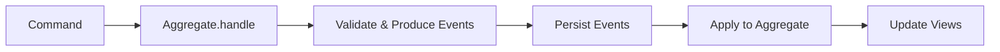
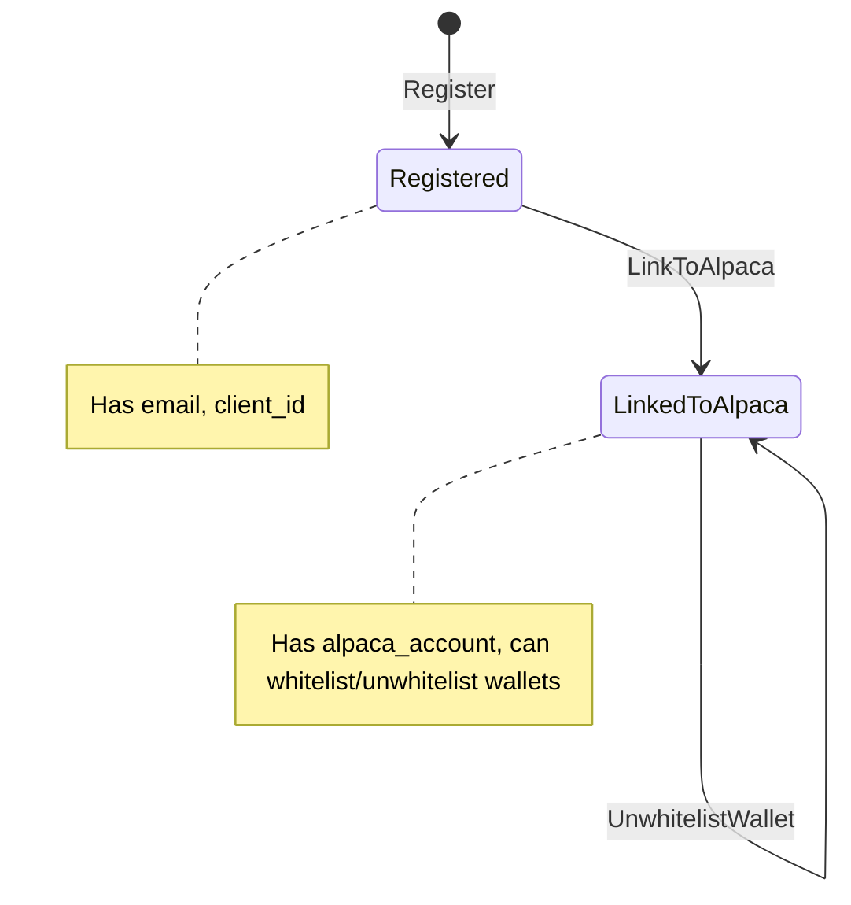
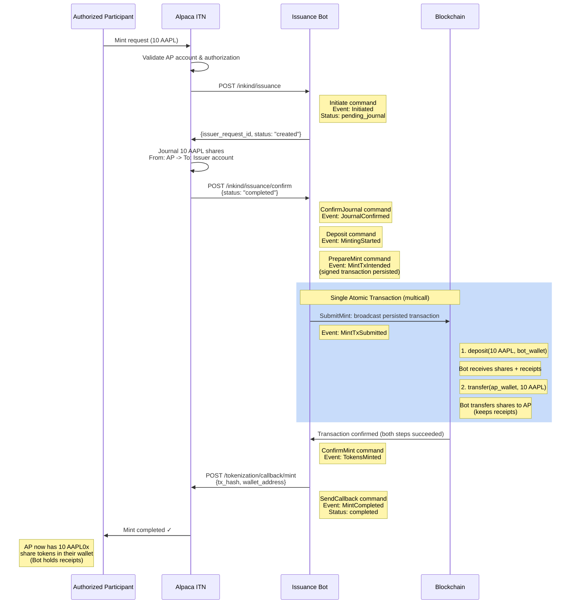
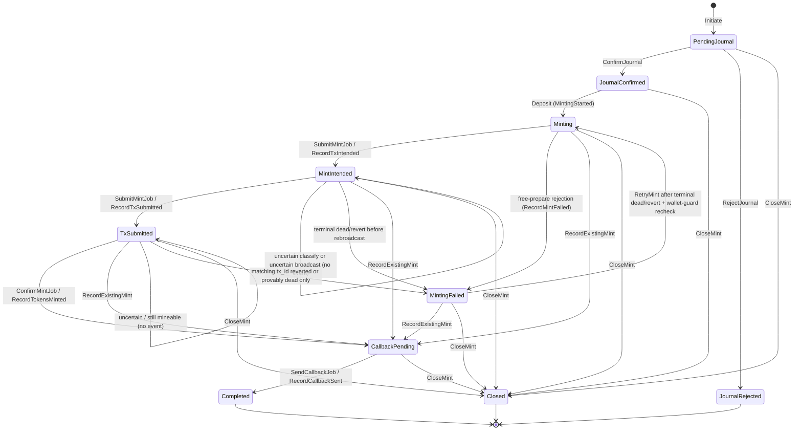
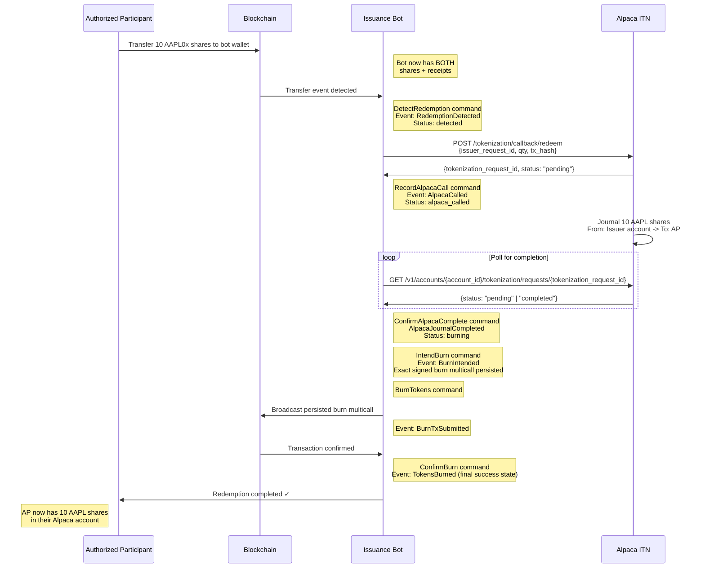
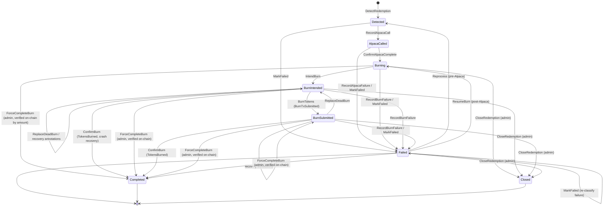
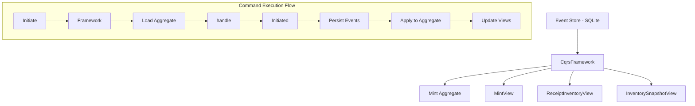

# Issuance Bot Specification

## Overview

The issuance bot acts as the **Issuer** in Alpaca's Instant Tokenization Network
(ITN). It implements the Issuer-side endpoints that Alpaca calls during
mint/redeem operations, and coordinates with the Rain
`OffchainAssetReceiptVault` contracts to execute the actual on-chain minting and
burning of tokenized shares.

**This is general infrastructure** - any Authorized Participant (AP) can use it
to mint and redeem tokenized equities. The issuance bot serves as the bridge
between traditional equity holdings (at Alpaca) and on-chain (semi-fungible)
tokenized representations (Rain SFT contracts).

## Background & Context

**Our Role:** We are the **Issuer** of tokenized equities. Alpaca acts as the
settlement layer between Authorized Participants (APs) and us.

**Flow Summary:**

- **Minting:** AP requests mint -> Alpaca calls our endpoint -> We validate ->
  Alpaca journals shares from AP to our custodian account -> Alpaca confirms
  journal -> We mint tokens on-chain -> We call Alpaca's callback
- **Redeeming:** AP sends tokens to our redemption wallet -> We detect
  redemption -> We call Alpaca's redeem endpoint -> Alpaca journals shares from
  our account to AP -> We burn tokens on-chain

**Use Cases:**

- **Market Makers & Arbitrageurs:** Can mint/burn to rebalance inventory and
  maintain price parity across venues
- **Institutions:** Can convert equity holdings to tokenized form for on-chain
  settlement, DeFi integration, or cross-border transfer
- **Retail Platforms:** Can facilitate tokenized equity access for their users
- **Our Arbitrage Bot:** Can use this infrastructure to complete the arbitrage
  cycle by rebalancing on/off-chain holdings. See
  [st0x.liquidity](https://github.com/ST0x-Technology/st0x.liquidity) for more
  details on the bot.

## Architecture

### Off-Chain Infrastructure

**Our HTTP Server:**

- Implements Alpaca ITN Issuer endpoints
- Handles account linking, mint requests, and journal confirmations
- Built with Rust (Rocket.rs web framework)
- SQLite database for tracking operations
- Async runtime for coordination

**Alpaca ITN:**

- Alpaca's settlement layer
- Handles journal transfers between accounts automatically
- Provides endpoints for callbacks and status queries

### On-Chain Infrastructure

**Rain OffchainAssetReceiptVault Contract:**

- ERC-1155 receipts tracking individual deposit IDs
- ERC-20 shares representing vault ownership
- `deposit()` function for minting
- `withdraw()` function for burning

**Redemption Wallet:**

- On-chain address where APs send tokens to redeem
- We monitor this address for incoming transfers

### ES/CQRS Architecture

The issuance bot uses **Event Sourcing (ES)** and **Command Query Responsibility
Segregation (CQRS)** patterns to maintain a complete audit trail, enable
time-travel debugging, and provide a single source of truth for all operations.

**Core Concepts:**

- **Aggregates**: Business entities that encapsulate state and business logic
  (e.g., `Mint`, `Redemption`, `Account`, `TokenizedAsset`)
- **Commands**: Requests to perform actions, representing user or system intent
  (e.g., `Initiate`, `ConfirmJournal`, `Deposit`)
- **Events**: Immutable facts about what happened, always in past tense (e.g.,
  `Initiated`, `JournalConfirmed`, `TokensMinted`)
- **Event Store**: Single source of truth - an append-only log of all domain
  events stored in SQLite
- **Views**: Read-optimized projections built from events for efficient querying
- **Services**: External dependencies that aggregates use (Alpaca API client,
  blockchain client, monitoring service)

**Key Flow:**


```mermaid
graph LR
    A[Command] --> B[Aggregate.handle]
    B --> C[Validate & Produce Events]
    C --> D[Persist Events]
    D --> E[Apply to Aggregate]
    E --> F[Update Views]
```

**Critical Methods:**

- `handle(command) -> Result<Vec<Event>, Error>`: Business logic lives here.
  Validates the command against current aggregate state and returns a list of
  events (can be 0+ events). Most commands produce a single event, but some
  commands may produce multiple events when one action has several state
  consequences.
- `apply(event)`: Deterministically updates aggregate state from events. This
  method is pure and should never fail - events are historical facts that have
  already occurred.

**Benefits:**

- **Complete Audit Trail**: Every state change is captured as an immutable event
- **Time Travel Debugging**: Replay events to reconstruct system state at any
  point in history
- **Testability**: Business logic tested via Given-When-Then pattern (given
  events, when command, then expect events)
- **Rebuild Views**: If a view becomes corrupted or a new projection is needed,
  simply replay all events
- **Multiple Projections**: Same events can feed different views (operational
  dashboard, analytics, Grafana metrics)
- **Single Source of Truth**: Event store is authoritative; all other data is
  derived

## Data Types

Throughout this specification, we use newtypes to provide type safety and
prevent mixing up different kinds of identifiers and values:

```rust
use rust_decimal::Decimal;
use chrono::{DateTime, Utc};

struct TokenizationRequestId(String);

/// Mint operations use a UUID-based issuer request ID.
/// Serializes as a UUID string, e.g. "a1b2c3d4-e5f6-7890-abcd-ef1234567890"
struct IssuerMintRequestId(Uuid);

/// Redemption operations derive their issuer request ID from the full on-chain
/// tx_hash that triggered the redemption.
/// Serializes as a 32-byte hash, e.g. "0x1234...abcd".
/// Legacy "red-{first4bytes}" IDs remain readable for historical events.
struct IssuerRedemptionRequestId(TxHash);

struct ClientId(String);
struct AlpacaAccountNumber(String);
struct UnderlyingSymbol(String);
struct TokenSymbol(String);
struct Network(String);
struct Quantity(Decimal);
struct Email(String);
```

## Aggregates

This section defines the domain aggregates, their commands, and the events they
produce. Each aggregate represents a business concept with its own lifecycle and
invariants.

### Mint Aggregate

The `Mint` aggregate manages the complete lifecycle of a mint operation, from
initial request through journal confirmation to on-chain minting and callback.

**Aggregate State:**

- `issuer_request_id: IssuerMintRequestId`: Our unique identifier for this mint
- `tokenization_request_id`: Alpaca's identifier
- `quantity`, `underlying`, `token`, `network`, `client_id`, `wallet`: Request
  details
- `status`: Current state in the mint lifecycle
- `tx_hash`, `receipt_id`, `shares_minted`: On-chain transaction details
- Timestamps for each lifecycle stage

**Durable jobs vs pure commands:** On-chain I/O and Alpaca callbacks are
performed by durable jobs (`SubmitMintJob`, `ConfirmMintJob`, `SendCallbackJob`,
`MintRecoveryJob`). Aggregate commands are pure `Record*` / transition commands:
they validate state and emit events from job-supplied payloads (no network I/O
in the handler). Recovery advances a mint via `drive_one_step` (pure transitions
plus enqueue of the next job), not a wallet-locked aggregate command.

**Commands:**

- `Initiate { tokenization_request_id, quantity, underlying, token, network, client_id, wallet }` -
  Create a new mint request from Alpaca
- `ConfirmJournal { issuer_request_id }` - Alpaca confirmed shares journal
  transfer
- `RejectJournal { issuer_request_id, reason }` - Alpaca rejected shares journal
  transfer
- `Deposit { issuer_request_id }` - Record intent to mint. Pure state transition
  from `JournalConfirmed` to `Minting` — no network call. Produces
  `MintingStarted`. Intent is persisted before the network call so that a crash
  during submission leaves the aggregate in a recoverable `Minting` state rather
  than `JournalConfirmed` (which would lose track of the submission)
- `RecordTxIntended { issuer_request_id, prepared_tx }` - Pure: persists the
  exact signed deposit (`MintTxIntended`) before broadcast. Requires `Minting`.
  Built and signed by `SubmitMintJob` (or recovery enqueue of that job), not by
  a network-calling aggregate command
- `RecordTxSubmitted { issuer_request_id, external_tx_id, tx_id }` - Pure:
  records a successful broadcast (`MintTxSubmitted`). Accepts `Minting` and
  legacy `MintIntended`. Uncertain broadcast with a live prepared identity
  leaves `MintIntended` (no event) so the same bytes are rebroadcast
- `RecordTokensMinted { issuer_request_id, tx_id, ... }` - Pure: records
  on-chain success (`TokensMinted`) from `ConfirmMintJob`. Requires
  `TxSubmitted` and a matching stored `tx_id` (stale confirm jobs are rejected)
- `RecordMintFailed { issuer_request_id, error }` - Pure: records
  `MintingFailed` from a durable job. Observation rules (job-side) allow this
  only for definitive failure (mined revert / provably dead after classify, or
  pre-intent prepare rejection) — never for uncertain receipt/RPC observation
  while a prepared identity is still live
- `RecordCallbackSent { issuer_request_id }` - Pure: records `MintCompleted`
  after `SendCallbackJob` delivers the Alpaca callback
- `RetryMint { issuer_request_id }` - Pure: `MintingFailed` → `Minting`
  (`MintRetryStarted`) before recovery re-enqueues `SubmitMintJob`
- `ManualRetryMint { issuer_request_id, manual_retry_id }` - Operator-authorized
  retry of a `MintingFailed` mint past the exhausted automatic budget, gated on
  the aggregate's own failure provenance (not a snapshot that may be stale by
  execution time). Refused unless the failure chain proves a fresh submission is
  unambiguous: only a `Minting` predecessor with no transaction provenance
  qualifies, since a `MintIntended`/`TxSubmitted` predecessor's transaction may
  still land, and a fresh submission over it could double-mint. Mints initiated
  before the job-based submit flow are refused outright — their provenance
  cannot be proven from event history. Produces the same `MintRetryStarted`
  event as automatic retry
- `RecordExistingMint { issuer_request_id, tx_hash, receipt_id, shares_minted, block_number }` -
  Pure: records an already-mined on-chain deposit (`ExistingMintRecovered`) and
  advances to `CallbackPending` without rebroadcasting. Accepts `Minting`,
  `MintIntended`, `TxSubmitted`, and `MintingFailed` (inventory or confirm
  success under any of those states). Idempotent once already minted /
  callback-pending / completed
- `CloseMint { issuer_request_id, reason, acknowledged_unresolved_mint_tx_hash }` -
  Admin-closes a non-terminal mint. When the mint still holds an unresolved
  deposit identity, `acknowledged_unresolved_mint_tx_hash` must equal that exact
  hash (422 on miss/mismatch). That identity is the prepared hash
  (`MintTxIntended` / `TxSubmitted` with prepared bytes, including via
  `MintingFailed`), and for a legacy `TxSubmitted` carrying no prepared bytes it
  falls back to the stored `tx_id` when that id is a transaction hash — the
  submission is already on the wire and recovery still confirm-polls it, so
  closing it must not be cheaper than closing an intended mint. Omit only when
  there is no such identity (no prepared bytes and no hash `tx_id`); providing a
  hash when none exists is also 422.

**Recovery orchestration (not aggregate commands):** Startup and the scheduled
`MintRecoveryJob` drive any mint in `JournalConfirmed`, `Minting`,
`MintIntended`, `TxSubmitted`, `MintingFailed`, or `CallbackPending` via
`drive_one_step` + enqueue of the matching durable job. Inventory hits use
`RecordExistingMint`; otherwise recovery re-classifies any persisted signed mint
intent under the wallet lock (burn-parity observation below) and only allows a
**new** signed deposit after `MinedReverted` or `ProvablyDead` with a recheck.
Automatic recovery submits up to four replacement transactions after 1m, 10m,
30m, and 1h delays once the prior identity is terminal. Manual admin reprocess
uses the **same** recovery path and **does not** bypass the automatic retry cap:
when automatic retries are `Exhausted`, admin reprocess is `Unrecoverable`
(operator must fix the underlying cause and/or use an explicit close/remediation
path — not another free deposit). Correctness depends on exact-hash rebroadcast
and classification — **not** on `external_tx_id` (the signer does not dedup on
it).

`ConfirmMintJob` observes a submitted `tx_id` by bounded
`eth_getTransactionReceipt(H)` polling as `Option`, not
`PendingTransactionBuilder::get_receipt` as the terminal classifier. The
vault-direct mint recovery model under **Command -> Event Mappings** is the
authoritative statement of what each observation records.

**Events:**

- `Initiated` - Mint request created (carries all request details)
- `JournalConfirmed` - Alpaca journal transfer confirmed
- `JournalRejected` - Alpaca journal transfer rejected (terminal)
- `MintingStarted` - Mint intent recorded (aggregate moves to `Minting`)
- `MintTxIntended` - Exact signed mint transaction persisted before broadcast
  (carries raw bytes, hash, nonce, signing time, and external transaction ID)
- `MintTxSubmitted` - Persisted signed mint transaction broadcast (carries
  `external_tx_id` and `tx_id` — the on-chain tx hash — for crash recovery)
- `TokensMinted` - On-chain mint succeeded (carries tx details)
- `MintingFailed` - On-chain mint failed
- `MintCompleted` - Alpaca callback sent, mint fully completed (terminal)
- `ExistingMintRecovered` - Existing on-chain mint discovered during recovery
  (carries tx details)
- `MintRetryStarted` - Mint retry started during recovery, either automatic or
  operator-authorized. An operator-authorized retry carries a `manual_retry_id`
  correlating the command with the event it commits, so queue dispatch can
  distinguish a successful transition from an idempotent no-op against
  already-advanced state

Newly persisted transaction IDs use an explicitly tagged `hash` or `legacy`
representation so replay preserves the original `TxId` variant, including a
legacy ID whose text is valid 32-byte hex. Replay also accepts the historical
flat-string representation; because those rows have no variant discriminator,
32-byte hex flat strings retain the historical hash inference. Legacy
`FireblocksSubmitted` events and their `fireblocks_tx_id` field replay as
`MintTxSubmitted`.

The tagged writer is a one-way persistence cutover. Deployment must stop event
writers, back up the database, replace every service instance with the
dual-format reader, and only then resume traffic. After the first tagged
transaction ID is persisted, a binary that only understands flat strings must
not be restored against that database; recovery is to roll forward with the
dual-format reader or restore the pre-cutover backup.

**Command -> Event Mappings:**

| Command              | Events                  | Notes                                                     |
| -------------------- | ----------------------- | --------------------------------------------------------- |
| `Initiate`           | `Initiated`             | Mint request created                                      |
| `ConfirmJournal`     | `JournalConfirmed`      | Journal confirmed                                         |
| `RejectJournal`      | `JournalRejected`       | Terminal failure                                          |
| `Deposit`            | `MintingStarted`        | Records intent (no network call)                          |
| `RecordTxIntended`   | `MintTxIntended`        | Pure; `SubmitMintJob` signed first                        |
| `RecordTxSubmitted`  | `MintTxSubmitted`       | Pure; job already broadcast                               |
| `RecordTokensMinted` | `TokensMinted`          | Pure; requires matching `tx_id`                           |
| `RecordMintFailed`   | `MintingFailed`         | Pure; job-side observation gates                          |
| `RecordCallbackSent` | `MintCompleted`         | Pure; `SendCallbackJob` already called Alpaca             |
| `RetryMint`          | `MintRetryStarted`      | Pure; recovery before re-enqueue submit                   |
| `RecordExistingMint` | `ExistingMintRecovered` | Pure; `Minting` / `MintIntended` / `TxSubmitted` / failed |
| `CloseMint`          | (closed)                | Admin terminal                                            |

`Deposit` emits only `MintingStarted` (business intent). `SubmitMintJob` builds
and signs the transaction, persists exact bytes via `RecordTxIntended`, then
broadcasts. A crash before `MintTxIntended` cannot have broadcast anything; a
crash after it causes recovery to rebroadcast or poll that same transaction,
never prepare a second one. A crash after broadcast but before `MintTxSubmitted`
therefore remains safe because rebroadcasting identical signed bytes is
idempotent. Preparing, persisting, and initially broadcasting a mint transaction
share one wallet critical section. Startup mint recovery processes its persisted
intents in nonce order before mint states that may prepare a new transaction.
Mint and redemption recovery run concurrently so persisted transactions from
either domain can fill lower nonce gaps while higher transactions await
confirmation. Live mint and burn preparation consult the trigger-maintained
signer-intent reservation and are blocked while any other wallet intent remains
unresolved; this safety check does not depend on a fallible read-model
projection. Together these rules prevent two jobs from signing the same wallet
nonce without relying on in-memory nonce state that would be lost on restart.
Each live burn attempt waits at most 30 seconds behind an earlier unresolved
wallet intent. On timeout it prepares and broadcasts nothing, leaves the
redemption recoverable, and defers the burn to recovery rather than occupying
the live flow indefinitely.

**Cross-instance signer-intent guard.** The pre-check above is an
application-level read; it cannot by itself stop two separate processes from
independently signing the same nonce during the brief overlap between the old
process terminating and its replacement starting. `active_signer_intents` is the
durable, cross-process backstop for that window: one row per network (a signer's
nonce domain), reserved by a trigger in the same transaction that appends
`MintTxIntended` or `BurnIntended`, and released by a trigger on that
aggregate's own definitively-resolved terminal event. The reservation key is
`network` alone, so it is shared between `Mint` and `Redemption` — only one
signer intent per nonce domain can be outstanding at a time, regardless of which
aggregate holds it. This makes the event append itself the durable arbitration
point: a second instance's competing intent is rejected by SQLite before it can
commit, rather than relying on an in-memory lock or a fallible read-model
projection. When the pre-append check finds the network occupied, a mint job
returns `MintJobError::UnresolvedWalletIntent` and refuses to submit rather than
risk a nonce collision, leaving the job to retry once the guard clears. When the
race is lost between that check and the append, the trigger aborts the append
with an explicit signer-reservation error — worded distinctly from a
same-aggregate concurrency conflict so an operator reading the failure is
pointed at the nonce-domain guard, not at a phantom concurrent modification of
the aggregate.

The issuer is a single-writer service: exactly one process may own a given
SQLite event store and signing wallet at a time. Horizontal replicas sharing a
wallet are unsupported because the wallet critical section is process-local.
Deployments must terminate the old process before the replacement begins serving
or recovering work.

`ConfirmMintJob` observes the submitted `tx_id` via bounded
`get_transaction_receipt` polling and records `TokensMinted` only on a mined
success with a valid `Deposit`. It may record `MintingFailed` only for a mined
revert (`status=0`) when the job's `tx_id` matches the mint's current
submission. Uncertain observations (no receipt within the poll budget,
RPC/transport errors, invalid receipt shape, or a mined success body missing
`Deposit` logs) leave the aggregate in `TxSubmitted` — or `MintIntended` if it
was never submitted — with **no** event, never auto-replace. A missing `Deposit`
on a successful receipt is anomalous and requires operator intervention, not a
second deposit.

Vault-direct mint recovery uses the same observation predicate as burn recovery
for a persisted signed identity `(H, N)` of wallet `W` (the signing bot):

```
observe(H, N, W):
  receipt(H) with block + status=1 + Deposit → MinedSuccess
  receipt(H) with block + status=0           → MinedReverted
  receipt None + finalized_nonce(W) ≤ N      → StillMineable
  receipt None + finalized_nonce(W) > N
    then recheck receipt(H):
      Some(...) → reclassify
      None      → then corroborate with transaction(H):
                    None    → ProvablyDead
                    Some(_) → Uncertain (contradictory death signals)
  anything else                             → Uncertain (fail closed; Err)
```

`ProvablyDead` unlocks `RecordMintFailed` and a replacement prepare, so it is
never read out of a single absent receipt: a lagging or load-balanced RPC node
can answer `None` for a receipt that exists. A finalized nonce past `N` says the
nonce is spent; the node having also forgotten the transaction is what says it
was not spent by this one. A node that reports the nonce finalized while still
holding the unmined transaction is contradicting itself, and a death proof
cannot be read out of an inconsistent node — that is `Uncertain`, which
preserves the identity instead of authorizing a second deposit.

`Uncertain` is a fail-closed error classification, not a durable aggregate
state. Every arm that preserves an identity instead of advancing it — uncertain
classify, a recheck that is no longer terminal, an unrecoverable signer, and the
prepare-path equivalents — re-drives recovery before returning, so
re-observation is never left to the periodic reconciler alone. The enqueue
dedups on the mint's idempotency key, so arms that already re-drove cost
nothing. After the first `MintTxIntended`, the persisted signed bytes/hash/nonce
are authoritative for the whole recovery lifetime of that attempt. Fresh signed
mint is allowed only when the exact hash is `MinedReverted` or `ProvablyDead`,
and only after a wallet-guard recheck of hash/nonce/inventory immediately before
`prepare_mint_tx`. `external_tx_id` is **not** vault-direct double-mint
protection.

| State + observation                                                   | Action                                                                                                                                                                                                                                                                                                                                           |
| --------------------------------------------------------------------- | ------------------------------------------------------------------------------------------------------------------------------------------------------------------------------------------------------------------------------------------------------------------------------------------------------------------------------------------------ |
| Inventory hit for `issuer_request_id`                                 | `ExistingMintRecovered` (unchanged)                                                                                                                                                                                                                                                                                                              |
| `MintIntended` + StillMineable / Uncertain                            | Rebroadcast same bytes or wait; no new sign                                                                                                                                                                                                                                                                                                      |
| `MintIntended` + MinedSuccess                                         | Rebroadcast the same bytes, as for StillMineable; the confirm path records the mint. Never a new sign                                                                                                                                                                                                                                            |
| `TxSubmitted` + MinedSuccess                                          | `TokensMinted`                                                                                                                                                                                                                                                                                                                                   |
| `TxSubmitted` + StillMineable                                         | Rebroadcast same bytes and/or re-enqueue confirm; stay `TxSubmitted`                                                                                                                                                                                                                                                                             |
| `TxSubmitted` + Uncertain                                             | No event; retry observe later (scheduled recovery re-polls ~60s)                                                                                                                                                                                                                                                                                 |
| `TxSubmitted` / failed-from-submitted + MinedReverted or ProvablyDead | `MintingFailed` (if not already), then budgeted retry may prepare **new** `MintTxIntended` **only after wallet-guard recheck**. Only the job whose `tx_id` is the mint's current submission may record it — a stale confirm job for a superseded submission re-drives recovery instead, the same identity gate the reverted-confirm path applies |
| `MintingFailed` + MinedSuccess                                        | `ConfirmMintJob` for the prepared hash, **not** `RetryMint`, so `RecordExistingMint` can run. A mined deposit under a failed aggregate resolves forward and does not consume a retry                                                                                                                                                             |
| Pre-intent prep failure (`Minting` never intended)                    | Existing `MintingFailed` + retry schedule (unchanged; no on-chain identity)                                                                                                                                                                                                                                                                      |

Recovery (`drive_one_step` + durable jobs) checks the receipt inventory for a
receipt matching the `issuer_request_id`. If found, records
`ExistingMintRecovered`. If not found and in `Minting` state, `SubmitMintJob`
prepares and persists `MintTxIntended` only when no live prepared identity
remains. If in `MintIntended`, classifies then rebroadcasts the persisted raw
transaction only when StillMineable/MinedSuccess; terminal dead/revert records
`MintingFailed` so a budgeted retry may replace. If in `TxSubmitted` (or
`MintingFailed` with a known prior transaction), re-observes the stored identity
as above rather than treating every confirmation error as terminal failure.
`TxSubmitted` means the persisted transaction was broadcast; it does not mean
the transaction succeeded on-chain. Retry transactions use
`mint-{issuer_request_id}-retry-{n}` where automatic retries use n = 1..4 and
the delay schedule is 1m, 10m, 30m, then 1h — only after the prior identity is
`MinedReverted` or `ProvablyDead`.

The retry-delay/exhaustion schedule is driven by a `MintingFailed` attempt
counter. A free-prepare (no live prepared identity) RPC/rejection records
`MintingFailed`; an uncertain broadcast or prepare-replacement failure while a
prior prepared identity remains live instead preserves that identity (no
`MintingFailed` for uncertain broadcast) so recovery rebroadcasts the exact same
signed bytes without advancing the attempt. A running service keeps driving
deferred retries via `MintRecoveryJob` (also spawned at startup and after a
manual reprocess of an eligible mint), rather than waiting for the next restart.

Uncertain `TxSubmitted` re-polls on the scheduled recovery cadence (~60s). The
no-progress budget (~6h / 360 polls) still applies: prolonged RPC uncertainty
can abandon automatic recovery until process restart. Exhausted automatic
retries remain `Unrecoverable` for admin reprocess as well — that is intentional
correctness: neither automatic nor manual reprocess may authorize unlimited
replacement deposits.

**Duplicate deposit observability:** receipt inventory is 1:1 on
`issuer_request_id`. When backfill or the live monitor discovers a second
Deposit (different `receipt_id` or `tx_hash`) for an already-tracked ITN mint
id, the bot logs an **ERROR** with both identities **and** records
`RecordConflictingItnDeposit` → `ConflictingItnDepositObserved` on that vault's
inventory stream. The event is required because backfill advances its checkpoint
past the block once the pass completes and never re-scans that range: without it
the duplicate would survive only as one log line. `DiscoverReceipt` is still
refused, so the duplicate is recorded as evidence and never becomes tracked,
spendable, or burnable balance. Recording is idempotent on the duplicate's own
`(receipt_id, tx_hash)`, so a re-scanned range cannot grow the log a pass at a
time. The 1:1 index outliving its metadata row counts as a conflict, not as
"nothing tracked" — that is the one shape in which this gate could fail open.
There is no admin health endpoint listing historical duplicates yet — operators
read the event (or the ERROR log) plus on-chain Deposit history, then remediate
excess supply with `issuer burn-excess` (never by forcing another mint). Do not
manually force a second deposit when confirm is uncertain; leave `TxSubmitted`
and wait for re-observe or restart.

**Vault-direct vs orchestrator:** vault-direct mints confirm via vault `Deposit`
logs and receipt inventory. Orchestrator mints (when enabled) use the
orchestrator `Minted` log and authorization nonce recovery surface. The
observation model in this section is **vault-direct only**; orchestrator failure
classification is a separate coordination surface and must not treat RPC
uncertainty as an auto-retryable mint failure.

When the receipt monitor discovers an on-chain receipt for a mint, it enqueues
`MintRecoveryJob` (or the submit path loads inventory). `RecordExistingMint`
accepts `Minting`, `MintIntended`, `TxSubmitted`, and `MintingFailed`, emits
`ExistingMintRecovered`, transitions to `CallbackPending`, then continues
through `SendCallbackJob` → `RecordCallbackSent` / `MintCompleted` without
rebroadcasting. Automated recovery persists the `CallbackPending` boundary
before delivering the callback, so receipt polling and Alpaca requests do not
hold the wallet transaction lock.

### Redemption Aggregate

The `Redemption` aggregate manages the redemption lifecycle, from detecting an
on-chain transfer through calling Alpaca to burning tokens.

**Aggregate State:**

- `issuer_request_id: IssuerRedemptionRequestId`: Our unique identifier for this
  redemption
- `tokenization_request_id`: Alpaca's identifier (received after calling their
  API)
- `underlying`, `token`, `wallet`, `quantity`: Redemption details
- `detected_tx_hash`: On-chain transfer that triggered redemption
- `status`: Current state in the redemption lifecycle
- `burn_tx_hash`, `receipt_id`, `shares_burned`: Burn transaction details
- Timestamps for each lifecycle stage

**Commands:**

- `DetectRedemption` - Transfer to redemption wallet detected
- `RecordAlpacaCall` - Alpaca redeem API called successfully
- `RecordAlpacaFailure` - Alpaca redeem API call failed
- `ConfirmAlpacaComplete` - Alpaca journal transfer completed
- `IntendBurn` - Prepare and sign the exact burn transaction, then persist its
  raw bytes, hash, nonce, and receipt plan in `BurnIntended` before any
  broadcast. Only valid from `Burning`.
- `BurnTokens` - Broadcast the exact transaction persisted by `IntendBurn`.
  Produces `BurnTxSubmitted` on success; it never signs a replacement.
- `ConfirmBurn { tx_id, dust_shares }` - Confirm a previously submitted burn
  transaction. Produces `TokensBurned` on success
- `RecordBurnRecoveryAttempt` - Persist one automatic recovery action before its
  external side effect
- `RecordBurnPreparationRecoveryAttempt` - Persist one automatic retry before
  resuming a failed redemption that has no signed burn transaction
- `ReplaceDeadBurn` - Re-check that the persisted transaction is provably dead,
  then sign and persist a replacement at a fresh nonce
- `RecordBurnRecoveryExhausted` - Persist that the redemption-wide automatic
  recovery budget is spent
- `RecordBurnPreparationRecoveryExhausted` - Persist exhaustion when repeated
  burn preparation failures never produced a transaction identity
- `RecordBurnFailure` - Record on-chain burn failure (from `Burning` or
  `BurnSubmitted` state). Carries optional `tx_id` and `planned_burns` for
  recovery
- `RecordExistingBurn` - Record an existing on-chain burn discovered during
  recovery via on-chain transaction lookup
- `MarkFailed` - Mark redemption as failed
- `Reprocess { issuer_request_id, metadata }` - Reset a failed redemption back
  to `Detected` state for reprocessing. Only valid from `Failed` state when no
  `AlpacaCalled` event exists in the history — post-Alpaca failures use
  `ResumeBurn` instead. The `metadata` field carries the original
  `RedemptionMetadata` (extracted by the API layer from the event store's first
  `Detected` event), since the `Failed` aggregate state does not preserve
  metadata. Emits `Reprocessed` event with the metadata, previous state name,
  and timestamp for audit trail. The existing recovery logic then picks it up
  naturally from `Detected` state.
- `ResumeBurn { issuer_request_id, metadata, tokenization_request_id,
  alpaca_quantity, dust_quantity, called_at, alpaca_journal_completed_at,
  external_tx_id }` -
  Resume a failed redemption directly to `Burning` state, bypassing the Alpaca
  call step. Only valid from `Failed` state. Used for post-Alpaca failures where
  Alpaca has already completed the journal. The API layer polls Alpaca to verify
  journal completion before issuing this command — refuses if Pending or
  Rejected. If the failed redemption already has a terminal failed burn,
  `external_tx_id` is set to the next deterministic retry id:
  `burn-{detected_tx_hash}-retry-{n}`. If a retry submission fails before the
  transaction lands, recovery reuses the same retry id. Emits `BurnResumed`
  event. The admin recovery path immediately invokes burn recovery in-process so
  the on-chain burn does not wait for a service restart.
- `CloseRedemption { issuer_request_id, reason,
  acknowledged_unresolved_burn_tx_hash }` -
  Admin-close a redemption that cannot be automatically recovered, recording an
  operator `reason`. Valid from `Failed`, `Burning`, `BurnIntended`, or
  `BurnSubmitted`. A redemption with a persisted signed transaction is rejected
  by default because that transaction may still land. Closing it requires
  `acknowledged_unresolved_burn_tx_hash` to equal the persisted hash exactly;
  the signed identity is retained across a transition to `Failed`, and the
  acknowledgement is recorded in the terminal event. An acknowledgement is
  rejected when no persisted signed burn exists. This is the honest terminal
  path for a redemption whose burn cannot or should not be re-submitted and is
  **not** verifiable on-chain (e.g. a `Failed -> Burning` recovery regression
  where no burn ever landed, or an ambiguous case pending off-chain
  reconciliation). A held receipt reservation is **left in place** (the
  conservative policy for `Closed`), since an ambiguous burn may still have
  landed. Emits `RedemptionClosed`.
- `ForceCompleteBurn { issuer_request_id, burn_tx_hash, block_number, reason,
  acknowledged_unresolved_burn_tx_hash }` -
  Admin-terminalize a redemption stuck in `Burning`/`BurnIntended`/`BurnSubmitted`
  whose burn **already landed on-chain** but was never
  recorded (e.g. the bot crashed between the burn and `TokensBurned`). The admin
  layer verifies the operator-supplied `burn_tx_hash` on-chain first — the
  receipt must have succeeded and contain a real burn
  (`Transfer(bot_wallet -> 0x0)`) of the vault's shares — then records the
  proving tx hash and block number. The receipt reservation is settled (mirror
  reduced) just like a normal burn completion. Emits `BurnForceCompleted`,
  transitioning to `Completed`. The persisted bytes must decode with matching
  hash and nonce and recover the configured bot wallet as signer; the supplied
  hash must then equal that exact transaction hash unless the operator
  explicitly acknowledges the persisted hash with
  `acknowledged_unresolved_burn_tx_hash`. A different proving hash is rejected
  by default while the persisted transaction may still land. The acknowledgement
  must equal the persisted hash exactly and is recorded in the terminal event.
  The alternate transaction's per-receipt withdrawals, recipient wallet, and
  dust share transfer must also match the persisted burn semantics exactly,
  including the aggregate burned-share total. Its signer nonce must equal the
  persisted transaction's nonce, proving it is a mined replacement rather than
  an unrelated burn and ensuring the acknowledged transaction can no longer
  land. This prevents another redemption's same-vault burn from being used as
  proof. A `Failed` redemption that still carries a persisted signed burn is
  held to the same binding and acknowledgement rules. A legacy `Failed`
  redemption with **no** persisted signed transaction — a custodian-era burn
  identified only by a backend transaction id the current backend cannot look up
  — is force-completed offline via `issuer force-complete-redemption`: the
  operator supplies the on-chain hash, and the CLI proves it is a successful
  burn on the redemption's vault whose per-receipt withdrawals match the burn
  plan persisted by the latest `BurningFailed` event exactly, with the owner
  recovered from the transaction's own signature, and refuses a hash any other
  redemption's history already mentions. When the redemption never persisted a
  burn transaction and has no burn plan either — the recovery timeout orphaned
  it in bare `Burning` before any burn event was written — there is no persisted
  identity to anchor against; the proving tx is instead bound to the redemption
  **by amount**: it must burn exactly the shares owed (`alpaca_quantity`) and
  return exactly the dust (`dust_quantity`), else it is rejected (`422`). No
  acknowledgement is accepted when nothing was persisted, as there is nothing to
  acknowledge. Truly ambiguous states with no verifiable on-chain burn are still
  **not** force-completed; ops use `CloseRedemption` after
  off-chain reconciliation instead.

**Events:**

- `RedemptionDetected` - Transfer to redemption wallet detected
- `AlpacaCalled` - Alpaca redeem endpoint called
- `AlpacaCallFailed` - Alpaca API call failed (terminal)
- `AlpacaJournalCompleted` - Alpaca confirmed journal transfer
- `BurnTxSubmitted` - Persisted signed burn transaction broadcast (carries
  `external_tx_id`, `tx_id` — the pending tx identifier — and `planned_burns`).
  The burn manager reserves the `planned_burns` in the receipt inventory
  **before** this broadcast, so a concurrent redemption that already committed
  the same receipt balance fails to reserve and never submits an unbacked burn.
  On confirmation the reservation is settled (mirror balance reduced); on a
  definitive terminal/reverted failure it is released.
- `BurnIntended` - Persists the exact signed raw transaction and its hash before
  any broadcast attempt. A prepared transaction is immutable: live execution and
  recovery may only broadcast those persisted bytes while they can still land.
  Recovery classifies the hash before acting. A fresh transaction may be signed
  only when the old transaction is provably dead under the replacement predicate
  below. If the RPC result is uncertain, the redemption stays unresolved with
  its receipt reservation held.
- `BurnRecoveryAttempted` - Records one accepted automatic recovery action for
  the persisted transaction, including its hash, nonce, action, and timestamp.
  These events form the durable redemption-wide recovery budget across process
  restarts.
- `BurnPreparationRecoveryAttempted` - Records an automatic retry before a
  failed redemption without a signed burn transaction resumes preparation. These
  attempts share the same redemption-wide budget.
- `BurnRecoveryExhausted` - Records that the automatic recovery budget is spent,
  including the latest hash, nonce, attempt count, and timestamp. It leaves the
  aggregate unresolved and the receipt reservation held for operator recovery.
  Its first persistence emits the single actionable operator error; later
  periodic passes observe the marker and perform no RPC or signing side effects.
- `BurnPreparationRecoveryExhausted` - Records the same durable stop when
  repeated preparation failures never produced a burn hash and nonce.
- `TokensBurned` - On-chain burn succeeded, redemption complete (terminal
  success). Payload contains `burns: Vec<BurnRecord>` where each `BurnRecord`
  has `receipt_id` and `shares_burned`, supporting multi-receipt burns when a
  single redemption spans multiple ERC-1155 receipts
- `BurningFailed` - On-chain burn failed. Carries optional `tx_id` and
  `planned_burns` for recovery of previously submitted transactions
- `ExistingBurnRecovered` - Existing on-chain burn discovered during recovery
- `RedemptionClosed` - Admin-closed redemption (terminal). Carries the operator
  `reason`, `closed_at`, and optional `acknowledged_unresolved_burn_tx_hash`.
  Closed redemptions do not appear in stuck queries. Receipt reservations remain
  held, including after an acknowledged close, because the unresolved
  transaction may still land.
- `BurnForceCompleted` - Admin-recorded terminal success for a stuck
  `BurnIntended`/`BurnSubmitted` redemption whose persisted exact burn was
  verified on-chain. Carries the proving `burn_tx_hash`, `block_number`,
  operator `reason`, optional `acknowledged_unresolved_burn_tx_hash`, and
  `completed_at`. Transitions to `Completed` (terminal success). Its receipt
  reservation is settled after the terminal event, including when the operator
  acknowledged the persisted transaction superseded by the proving same-nonce
  replacement.
- `Reprocessed` - Redemption reset to `Detected` state for reprocessing. Carries
  the original `RedemptionMetadata`, the previous state name, and a timestamp.
  Used for audit trail — shows when and from what state a manual reprocess was
  triggered.
- `BurnResumed` - Redemption resumed directly to `Burning` state from `Failed`.
  Carries the original `RedemptionMetadata`, `tokenization_request_id`,
  `alpaca_quantity`, `dust_quantity`, `called_at` (from the original
  `AlpacaCalled` event), `alpaca_journal_completed_at`, optional retry
  `external_tx_id`, and `resumed_at` timestamp. Used for post-Alpaca recovery
  where the journal already completed.

**Command -> Event Mappings:**

| Command                                  | Events                             | Notes                                             |
| ---------------------------------------- | ---------------------------------- | ------------------------------------------------- |
| `DetectRedemption`                       | `RedemptionDetected`               | Transfer detected                                 |
| `RecordAlpacaCall`                       | `AlpacaCalled`                     | Alpaca API called                                 |
| `RecordAlpacaFailure`                    | `AlpacaCallFailed`                 | Terminal failure                                  |
| `ConfirmAlpacaComplete`                  | `AlpacaJournalCompleted`           | Journal complete                                  |
| `IntendBurn`                             | `BurnIntended`                     | Persist exact signed tx before broadcasting       |
| `BurnTokens`                             | `BurnTxSubmitted`                  | Broadcasts persisted signed transaction           |
| `ConfirmBurn`                            | `TokensBurned`                     | Confirms burn, terminal success                   |
| `RecordBurnRecoveryAttempt`              | `BurnRecoveryAttempted`            | Reserve one durable automatic recovery action     |
| `RecordBurnPreparationRecoveryAttempt`   | `BurnPreparationRecoveryAttempted` | Reserve a retry before burn preparation           |
| `ReplaceDeadBurn`                        | `BurnIntended`                     | Re-check dead predicate, then persist replacement |
| `RecordBurnRecoveryExhausted`            | `BurnRecoveryExhausted`            | Stop automatic recovery durably                   |
| `RecordBurnPreparationRecoveryExhausted` | `BurnPreparationRecoveryExhausted` | Stop preparation retries durably                  |
| `RecordBurnFailure`                      | `BurningFailed`                    | Records failure with optional tx metadata         |
| `RecordExistingBurn`                     | `ExistingBurnRecovered`            | Recovery from Failed with known tx                |
| `Reprocess`                              | `Reprocessed`                      | Reset to Detected for reprocessing                |
| `ResumeBurn`                             | `BurnResumed`                      | Resume to Burning for post-Alpaca recovery        |
| `CloseRedemption`                        | `RedemptionClosed`                 | Admin close an unresolved redemption              |
| `ForceCompleteBurn`                      | `BurnForceCompleted`               | Admin terminalize a verified-on-chain burn        |

Burn transaction recovery runs once during startup and every five minutes while
the service is running. Before any recovery side effect, the issuer classifies
the latest persisted signed transaction `(H, N)` for wallet `W` in this order:

1. A receipt for `H` with a block number and successful status is **mined** and
   is confirmed and recorded; no transaction is signed or re-broadcast.
2. A receipt for `H` with a block number and failed status is **reverted**. The
   nonce is consumed and the failed attempt is recorded before any later retry.
3. With no receipt, if the finalized account nonce for `W` is at most `N`, the
   transaction is **still mineable**. Recovery may only re-broadcast the exact
   persisted bytes, producing the same hash `H`.
4. With no receipt, if the finalized account nonce for `W` is greater than `N`,
   the transaction is **provably dead** and can never land. Only this case
   permits signing a replacement at a fresh nonce. The replacement preserves the
   persisted transaction's destination, value, and calldata exactly; only its
   nonce, gas limit, and fee fields are regenerated. Its fresh nonce is the
   authoritative pending account nonce so it cannot collide with another live
   transaction from the signing wallet.

Equivalently, the exact replacement predicate is
`receipt(H) = None AND finalized_nonce(W) > N`. Receipt lookup is evaluated
before the nonce comparison. A latest-but-unfinalized nonce advance is not proof
of death because a reorganization can remove it. A missing block number,
mismatched receipt hash, provider error, timeout, signer that differs from `W`,
or any other identity/RPC uncertainty is unclassified and fails closed: the old
transaction remains live, no replacement is signed, and its reservation remains
held. Same-nonce fee replacement is not supported.

Automatic recovery is capped at five accepted recovery actions across the
redemption's complete event history, including preparation retries,
re-broadcasts, and fresh-nonce replacements. The initial live submission is not
a recovery action. Once the budget is exhausted, `BurnRecoveryExhausted` or
`BurnPreparationRecoveryExhausted` is persisted once and automatic recovery
stops. An accepted action is resumed after restart without consuming another
budget slot until its side effect is complete: an accepted re-broadcast
resubmits the same bytes, and a persisted replacement intent is submitted as the
continuation of the action that created it only while it remains mineable. If
its nonce became finalized while the service was down, signing a further
replacement requires another budgeted action. Classification and confirmation of
a transaction produced by the fifth action remain allowed because they do not
create another side effect. If that transaction is still non-terminal or
provably dead, the history check persists exhaustion before accepting any
further action. A failed fifth replacement preparation retains the preceding
exact transaction identity long enough to persist exhaustion safely. An
exhausted persisted intent cannot be re-armed through the admin recover
endpoint: the operator must force-complete a verified landed burn or close only
after off-chain reconciliation. At every point there is at most one transaction
hash that can still land for a redemption.

### Account Aggregate

The `Account` aggregate manages the relationship between AP accounts and our
system. The account lifecycle follows these steps:

1. **Registration**: We manually create an account for the AP with their email,
   generating a `client_id`.
2. **Alpaca Linking**: When Alpaca calls `/accounts/connect` with email +
   account number, we look up the account by email and link it to the Alpaca
   account.
3. **Wallet Whitelisting**: APs whitelist wallet addresses they'll use for
   minting and redemption.

**Aggregate State:**

- `client_id`: Our identifier for the account
- `email`: AP's email address (set at registration)
- `alpaca_account`: Alpaca account number (set when linked)
- `whitelisted_wallets`: List of on-chain wallet addresses authorized for
  minting and redemptions
- Timestamps

**Commands:**

- `Register { email }` - Create a new AP account (before Alpaca linking)
- `LinkToAlpaca { alpaca_account }` - Link existing account to Alpaca account
  number
- `WhitelistWallet { wallet }` - Authorize a wallet address for minting and
  redemptions
- `UnwhitelistWallet { wallet }` - Remove a wallet address from the whitelist

**Events:**

- `Registered { client_id, email, registered_at }` - New AP account created
- `LinkedToAlpaca { alpaca_account, linked_at }` - Account linked to Alpaca
  account number
- `WalletWhitelisted { wallet, whitelisted_at }` - Wallet address authorized for
  minting and redemptions
- `WalletUnwhitelisted { wallet, unwhitelisted_at }` - Wallet address removed
  from whitelist

**Command -> Event Mappings:**

| Command             | Events Produced       | Notes                                 |
| ------------------- | --------------------- | ------------------------------------- |
| `Register`          | `Registered`          | New AP account created with email     |
| `LinkToAlpaca`      | `LinkedToAlpaca`      | Existing account linked to Alpaca     |
| `WhitelistWallet`   | `WalletWhitelisted`   | Wallet authorized (multiple allowed)  |
| `UnwhitelistWallet` | `WalletUnwhitelisted` | Wallet removed (idempotent if absent) |

**Account State Machine:**


```mermaid
stateDiagram-v2
    [*] --> Registered: Register
    Registered --> LinkedToAlpaca: LinkToAlpaca
    LinkedToAlpaca --> LinkedToAlpaca: WhitelistWallet
    LinkedToAlpaca --> LinkedToAlpaca: UnwhitelistWallet
    Note right of Registered: Has email, client_id
    Note right of LinkedToAlpaca: Has alpaca_account, can whitelist/unwhitelist wallets
```

### TokenizedAsset Aggregate

The `TokenizedAsset` aggregate manages which assets are supported for
tokenization. The aggregate id is the `AssetKey` — `{underlying}:{network}`
(e.g. `AAPL:base`) — so the same underlying can be listed per network. See the
[Multi-chain](#multi-chain) section for the identity model, and
`docs/runbooks/tokenized-asset-aggregate-rekey.md` for migrating a
pre-multichain store keyed by bare `UnderlyingSymbol`.

**Aggregate State:**

- `underlying`, `token`: Symbol identifiers
- `network`: Blockchain network
- `vault`: On-chain vault contract address
- `added_at`: Timestamp

**Commands:**

- `Add { underlying, token, network, vault }` - Add a new supported asset.
  Re-adding with a different vault updates the vault address; re-adding with the
  same vault is a no-op.

**Events:**

- `Added { underlying, token, network, vault, added_at }` - New asset added
- `VaultAddressUpdated { vault, previous_vault, updated_at }` - Vault address
  changed

**Command -> Event Mappings:**

| Command | Events Produced                 | Notes                                                         |
| ------- | ------------------------------- | ------------------------------------------------------------- |
| `Add`   | `Added` / `VaultAddressUpdated` | New asset, or vault update if re-added with a different vault |

### Underlying Aggregate

The `Underlying` aggregate holds per-underlying state that is a property of the
underlying equity itself, independent of which networks it is tokenized on.
Today that is exactly one thing: the corporate-action freeze status. The
aggregate id is the bare `UnderlyingSymbol` (e.g. `AAPL`).

A scheduled corporate action (dividend record date, split) is an event on the
underlying equity, so it applies to every tokenization of that equity on every
network — two listings of the same underlying with different freeze status
during a corporate action is an invalid state, and keying freeze by
`UnderlyingSymbol` makes it unrepresentable. Per-network state (vault address,
token symbol) stays on `TokenizedAsset`.

**Aggregate State:**

- `status`: `AssetStatus` — `Enabled` (mints accepted) or `Frozen` (mints
  rejected across all networks, but listings stay supported and in-flight
  redemptions still complete)

A stream originates on the first `Frozen` event; an underlying with no stream is
`Enabled` by definition.

**Commands:**

- `Freeze` - Stop accepting new mints for every listing of this underlying
  (idempotent — freezing a frozen underlying is a no-op).
- `Unfreeze` - Resume accepting mints (idempotent; a no-op when no stream
  exists).

**Events:**

- `Frozen { frozen_at }` - Underlying frozen (new mints rejected on all
  networks)
- `Unfrozen { unfrozen_at }` - Underlying unfrozen (mints resume)

**Command -> Event Mappings:**

| Command    | Events Produced | Notes                                    |
| ---------- | --------------- | ---------------------------------------- |
| `Freeze`   | `Frozen`        | No event if already frozen (idempotent)  |
| `Unfreeze` | `Unfrozen`      | No event if already enabled (idempotent) |

**Freeze State Machine:**

```
Enabled ⇄ Frozen
   Freeze:   Enabled -> Frozen
   Unfreeze: Frozen  -> Enabled
```

**Freeze invariant — frozen is not de-listed.** Freezing only gates _new_ mints:
`POST /inkind/issuance` rejects a frozen asset with a distinct `AssetFrozen`
error (separate from `AssetNotAvailable`), so the rejection is observable and
not conflated with de-listing. A frozen asset stays in `list_enabled_assets()`,
so in-flight redemption detection (`src/redemption/`) keeps working — issuance
reacts to on-chain transfers and has no "reject redemption" point. Preventing
_new_ redemptions of a frozen asset is the liquidity rebalance guard's job,
which reads the per-asset status endpoint (see "Tokenized Assets Data
Endpoint"). This issuance-side freeze plus the liquidity guard form the single
dividend freeze/unfreeze mechanism; no on-chain wrapper-contract freeze is
involved here (that is separate, heavier supply-control work and out of scope).

The `Freeze` / `Unfreeze` commands are emitted manually via the issuer-host CLI
in M1 and automatically by the dividend scheduler in M3 — the same command path
either way.

**Issuer CLI.** A dedicated `issuer` binary (separate from the HTTP server
binary) is the M1 manual freeze trigger. It runs on the issuer host (over SSH)
against the local SQLite store, and is where future issuer actions (e.g. `mint`,
`donate`) will live as additional subcommands:

- `issuer freeze <UNDERLYING>` — dispatch the `Freeze` command.
- `issuer unfreeze <UNDERLYING>` — dispatch the `Unfreeze` command.
- `issuer status <UNDERLYING>` — print the underlying's current freeze status.
- `issuer burn-excess internal|external …` — administrative supply correction
  that burns excess shares from a proven duplicate deposit (see **Burn excess
  shares** below). Never calls Alpaca; never opens a `Redemption` aggregate.
- `issuer migrate-receipts <UNDERLYING>` — move a vault's ERC-1155 deposit
  receipts between the Fireblocks and Turnkey wallets. Temporary, for the
  Turnkey signing-backend cutover; removed once every vault has migrated.
- `issuer confirm-custody <UNDERLYING>` — record which wallet holds a vault's
  receipts, after verifying on-chain that it holds exactly every tracked
  balance. The bootstrap that arms the reconciliation displacement guard for
  history predating custody tracking. Temporary, like `migrate-receipts`.
- `issuer verify-custodians <UNDERLYING>` — prove both custodian connections
  before anything moves: authenticate against Fireblocks and resolve the
  whitelisted Receipt contract, and sign the exact rollback-shaped transaction
  with Turnkey without broadcasting it. `--smoke` additionally submits a
  zero-amount transfer through the full Fireblocks path. Temporary, like
  `migrate-receipts`.

The custody subcommands are listing-scoped and therefore take `--network`, plus
`--rpc-url` (the service's own `RPC_URL`) and `--chain-id` (cross-checked
against the chain that endpoint reports). `migrate-receipts` and
`verify-custodians` require both custodians' configurations — the `TURNKEY_*`
group and the `FIREBLOCKS_*` group the retired integration used — all from the
service's own environment. `burn-excess` is listing/network-scoped and takes
`--network` / `--chain-id` (cross-checked against the RPC-reported chain); its
RPC endpoint is **not** a CLI flag — it uses the service environment for that
network (`CHAIN_<NETWORK>_RPC_URL`, with legacy `RPC_URL` as Base fallback), the
same secrets the long-running bot loads.

### Burn excess shares

There is no supported recovery path for an excess successful mint other than
this CLI. A duplicate deposit often mints shares to a mint recipient while the
matching receipt stays in the issuer wallet. Burning that excess via ordinary
redemption would call Alpaca and release backing — wrong for
undercollateralisation — and a raw Transfer of shares **into** the issuer wallet
looks like a real redemption to the transfer poller.

`issuer burn-excess` is an audited administrative supply correction:

1. Prove the **duplicate deposit** (issuer request, deposit tx, receipt id,
   exact shares, strict `receiptInformation` → issuer request, original share
   recipient from the deposit path).
2. Ensure the **issuer wallet** holds exactly the excess shares and enough
   matching receipt (either already true, or after a proven funding Transfer).
3. If (and only if) a funding Transfer into the issuer is part of recovery:
   prove it, persist a durable exclusion so the redemption poller skips **only
   that log**, then burn.
4. Burn via vault `redeem` with persist-before-broadcast. **Never** Alpaca;
   **never** a `Redemption` aggregate for this path.

#### Path selection: required mode keyword

The operator must pick the path with a required mode keyword immediately after
`burn-excess`. The CLI never infers path from balances or from whether a funding
hash happens to be present.

```text
issuer burn-excess <internal|external> [shared args…] [mode-specific…]
```

| Mode keyword | Path               | Meaning                                                                                                                        |
| ------------ | ------------------ | ------------------------------------------------------------------------------------------------------------------------------ |
| `internal`   | A — issuer-held    | Excess shares already sit in the issuer wallet (deposit original recipient must be the issuer); no funding Transfer to exclude |
| `external`   | B — fund-then-burn | Shares were moved into the issuer by a Transfer that would look like a redemption; prove + exclude that log, then burn         |

Shared args (both modes): `--issuer-request-id`, `--deposit-tx-hash`,
`--receipt-id`, `--shares`, `--reason`, `--incident-id`, `--network`,
`--chain-id`, `--execute`, `--close`, plus SignerEnv / DB. RPC comes from the
service environment for `--network` (not passed on the command line).

Mode-specific:

| Mode       | Required                                   | Forbidden                                     |
| ---------- | ------------------------------------------ | --------------------------------------------- |
| `internal` | (none beyond shared)                       | `--funding-tx-hash` is not on this subcommand |
| `external` | `--funding-tx-hash <0x…>` required by clap | —                                             |

**Fresh run:** path is chosen **only** from the mode keyword. Issuer share
balance, original recipient == issuer, freeze status, and funding-hash presence
do **not** select path.

**Resume:** aggregate id is the **deposit tx hash**. When a `BurnExcess` stream
already exists, **stored path wins**. Re-invoke must use the same mode keyword;
switching modes is `PathConflict`. External resumes also require the same
funding tx hash as recorded.

| Aggregate state                 | Locked path  | Required mode            | Funding hash                |
| ------------------------------- | ------------ | ------------------------ | --------------------------- |
| `NotStarted`                    | from keyword | `internal` or `external` | required only if `external` |
| `FundingExcluded`               | External     | `external` only          | must match recorded         |
| `Intended`/`Submitted` External | External     | `external` only          | must match recorded         |
| `Intended`/`Submitted` Internal | Internal     | `internal` only          | N/A                         |
| `Completed` / `Closed`          | locked       | report-only              | no re-path                  |

#### Path behaviour

|                                        | `internal` (Path A)               | `external` (Path B)                                   |
| -------------------------------------- | --------------------------------- | ----------------------------------------------------- |
| Funding                                | N/A                               | Required `--funding-tx-hash`                          |
| Poller exclusion                       | **None**                          | **Yes** — only that verified funding log identity     |
| First irreversible step on `--execute` | Sign + persist `IntendExcessBurn` | Persist `FundingExclusionRecorded`, then later intend |
| Burn                                   | Same `VaultService` redeem        | Same                                                  |

**Freeze is not a gate.** Freeze status may be printed as advisory; a frozen
underlying neither blocks nor unlocks burn-excess. Ops still stop issuance /
pause conflicting producers as needed.

**Exact issuer share balance.** After path-specific funding (Path B) or
immediately (Path A), issuer ERC-20 share balance must **exactly** equal the
excess amount. Any extra shares at the issuer refuse
(`IssuerShareBalanceNotExact`).

**Path A recipient gate.** `internal` refuses when the deposit's original share
recipient is not the issuer wallet (`InternalRequiresIssuerAsRecipient`); ops
must fund shares back and use `external --funding-tx-hash …`.

**Funding exclusion (Path B only).** The proof binds
`(network, vault, tx_hash, log_index, from, to, amount)`; `from`, `to`, and
`amount` are persisted for audit. The durable skip key is
`(network, vault, tx_hash, log_index)`, and the poller skips only logs present
under that key (`SkippedAdminRecovery`). Neighbours in the same tx/block remain
eligible. No block-range skip; no checkpoint jump; no “skip all from address X”.
Exclusion once recorded is permanent for that log (including after burn
complete/close). Engine dual-writes the SQL index after `RecordFundingExclusion`
and refuses prepare if the row is missing (resume re-writes the row from the
recorded event before the presence check). Startup and CLI store open rebuild
the index from every `FundingExclusionRecorded` event so a restored or truncated
index table cannot leave the poller free to open a `Redemption` for an excluded
funding Transfer. If a `Redemption` already exists for that funding tx → refuse
(`FundingAlreadyRedeemed`), re-checked immediately before exclusion record.
Transfer logs without `log_index` fail closed (`MissingLogIndex`) so Detect
cannot open a redemption for an unidentifiable excluded funding log.

**Dead intent / Closed.** `--close` clears the wallet nonce gate only. `Closed`
is report-only terminal for that deposit stream (no re-intend on the same
`deposit_tx_hash`). Reverted/ProvablyDead on resume surfaces `DeadBurnIntent`
with that guidance.

**Post-burn inventory.** After on-chain verify the stream completes, then
inventory is reconciled. Reconcile failure fails the CLI (non-zero) even though
the burn already landed — ops re-run report-only + manual inventory.

**Dry-run (default)** proves and prints the plan (including `mode=` / `path=`
and, for Path B, the funding log id) without events, signing, or exclusion.
Wallet intent gates still run on dry-run (an unresolved mint/burn signer-intent
reservation on the deposit's network, or any unresolved excess intent, refuses
prove) so operators see the same blockers they would hit on `--execute`.
`--execute` requires confirmation before the first irreversible step (Path A:
intend; Path B: exclusion record) and before resume broadcast/confirm of a
persisted `sendable_tx.hash`.

**Wallet intent gates.** An unresolved excess-burn recovery refuses competing
mint prepare and redemption burn prepare/replace paths (same family as mint/burn
intent gates). `BurnExcess` holds no `active_signer_intents` reservation, so it
is checked separately from the network-keyed signer-intent guard rather than
through it. `Intended` / `Submitted` count because they hold a signed nonce.
`FundingExcluded` counts too: it holds no signed transaction yet, but its
exclusion write is already permanent and the stream will sign against the same
issuer wallet, so a Path B recovery abandoned before intend must be resumed or
`--close`d rather than raced. Gates are re-read at the irreversible sign
boundary, together with the issuer receipt and exact share balances — the
operator confirm prompt blocks for an unbounded time, so balances proven at plan
time are re-read immediately before `prepare_burn_tx` signs. Deposit and funding
proofs are mined history and are not re-read.

**The issuer service must be stopped for Path B.** `FundingAlreadyRedeemed` is
re-checked immediately before the exclusion write, but that is a check, not a
cross-process lock: a running transfer poller can open a `Redemption` for the
funding Transfer first and steer incident remediation onto the ordinary Alpaca
path. Poller quiescence is therefore an operator precondition, in the same
family as the `migrate-receipts` sequence, and the Path B plan output states it
before the confirmation prompt.

**Non-goals:** Alpaca journal / release of backing; moving the receipt to a
liquidity wallet; block-range skip or manual checkpoint mutation; general
redemption bypass (exclusion is one verified funding log only); auto dead-tx
replacement; admin HTTP; multi-receipt burns; hard-coded production hashes as
the sole path.

**Production incident bind (Path B shape; values are proven inputs, never typed
addresses as free-form operator targets):**

| Input                   | Value                                                                |
| ----------------------- | -------------------------------------------------------------------- |
| Issuer request          | `d3042b2f-4845-4acd-9a67-92d743e4e58c`                               |
| Duplicate deposit       | `0x1bb6afc590e58095099373a8fea2242017b31acc7940bcd0d6b68820ebeb8ebd` |
| Issuer wallet           | `0x3d0CD66EFA66c05d86c3d4316B03eAE87ab9E8aE`                         |
| Original mint recipient | `0xA9C16673F65AE808688cB18952AFE3d9658C808f`                         |
| Receipt ID              | `7`                                                                  |
| Shares                  | `0.750` (`750000000000000000` raw)                                   |

**No wallet address is ever an argument.** An ERC-1155 transfer to a wrong
address is final — no counterparty, no recovery, and the receipts back tokens
that are still outstanding — so every address is derived, never typed: the
Fireblocks wallet from the Fireblocks API (`fetch_vault_address`), the Turnkey
wallet from `TURNKEY_ADDRESS` (the exact value the service runs with after the
cutover), and the direction from the inventory's recorded custody. Custody at
the Fireblocks wallet → forward transfer, submitted through the Fireblocks API
as a `CONTRACT_CALL` via the whitelisted Receipt contract with a deterministic
`externalTxId` (a retried run resumes the original transaction instead of
double-submitting), polled to a terminal status. Custody at the Turnkey wallet →
rollback, signed by Turnkey back to the API-derived Fireblocks wallet.
Unobserved custody → refuse and demand `confirm-custody`.

**Ownership verification is the check, not address comparison.** The engine
requires the holder to hold exactly every tracked balance on-chain before
submitting (a wrong Fireblocks workspace holds nothing tracked and is refused),
and verifies the recipient's per-identifier gain afterwards. The derived
destination is additionally refused if it is the zero address or the sender
itself, and must be corroborated by the chain (an address with no transaction
history and no native balance is what a corrupted config value looks like) via a
witness type the transfer cannot be reached without.

ERC-1155 lets a balance be moved only by its holder or by an operator the holder
has approved via `setApprovalForAll`, and the migration relies on the holder
case rather than granting any operator approval — ERC-1155 approval is
all-or-nothing across every token the holder owns, so granting it for a one-shot
transfer would be a far wider authorization than the operation needs.

Quiescence is deliberately **not** a freeze check: the `Underlying` freeze means
"corporate action in progress", and a custody migration must neither require
declaring one nor end one that is real. The migration refuses when any of the
following holds, read from the same store the recovery paths read:

- a burn is reserved against the vault's receipts;
- a redemption **for the migrating asset** is between detection and a terminal
  state;
- a mint **for the migrating asset** is between initiation and a terminal state;
- the vault has no tracked receipts with balance (an empty or fully-spent vault
  has nothing to move, and treating it as migratable would let a move "verify"
  on two zero readings).

The in-flight gates are scoped to the asset because stuck work only ever resumes
against its own vault; work that cannot be attributed to an asset counts against
every vault instead of none. Beyond quiescence: the tracked inventory is
cross-checked against on-chain balances, the vault's certification and
owner-freeze gates are re-read immediately before submission, and a completed
move observed again is recorded (idempotently) instead of re-transferred,
reported as `AlreadyMigrated`.

The operator sequence is **pause liquidity rebalancing → stop the issuer service
→ `migrate-receipts` → start the replacement service**. Stopping first keeps the
window clean: startup reads `balanceOf(bot_wallet)` for every tracked receipt
(the backfiller first, then startup reconciliation), and a service still
configured with the outgoing signer reads zero for every one of them after
custody moves. Applying that as depletion is what the custody guard exists to
refuse — the readings are refused at the aggregate, per vault, at ERROR.

Custody is therefore part of the `ReceiptInventory` aggregate's own state,
maintained by two events. `CustodyConfirmed { holder }` records the wallet the
balances were read against, emitted only when custody goes from unobserved to
known or the holder genuinely changes — the periodic reconciler's re-confirms
are no-ops, so the log does not grow per pass.
`CustodyMigrated { from, to, tx_hash }` records a completed move (`tx_hash` is
`None` when the move was verified from balances after the fact rather than
submitted by this binary). Balances in this aggregate are
`balanceOf(holder, id)` readings, so the holder is part of what they mean: a
zero only means "spent" while the holder is unchanged. Once it has rotated, a
zero means "held elsewhere", and depleting on it would erase inventory whose
receipts sit untouched at the previous wallet — permanently, since the receipt
backfiller has already checkpointed past the deposits that created them.

The guard is enforced in the aggregate's `ReconcileBalance` handler itself:
every balance reading carries the wallet it was taken against, and the handler
refuses readings from any wallet other than the recorded holder — and refuses a
destructive zero reading outright while no holder has ever been confirmed
(`issuer confirm-custody` is the bootstrap). Every reader — the startup
backfiller, startup and periodic reconciliation, and any future caller — goes
through this one handler, so no code path can apply a wrong-wallet reading. The
refusal is per vault and writes nothing: the service keeps serving vaults whose
custody matches while a displaced vault fails loudly at ERROR. This is what
makes a single-asset cutover safe — vaults that have not migrated yet are
refused rather than wiped — and it is also what lets the service operate
normally after a bulk cutover while a straggler vault awaits its own migration.
A pass that cannot read every balance confirms nothing, so one flaky call cannot
disarm the guard.

Freeze, unfreeze, and status address the `Underlying` aggregate, so they take no
network argument: one freeze covers every listing of the underlying. The CLI
resolves existence by checking that the underlying has at least one listing (on
any network) and reports "not found" otherwise.

Each subcommand opens the same event store, prints the resolved asset and its
current status, requires confirmation before a mutating action, and dispatches
the CQRS command through the `Store` (never writing the `events` table
directly); freeze/unfreeze are idempotent. The trigger is deliberately a local
action on the issuer host, not a remotely pushable endpoint.

Freeze, unfreeze, and status are deliberately **not** network-aware: they
address the `Underlying` aggregate, and a corporate action applies to every
listing of the underlying, so a per-network freeze is not expressible from the
CLI. Listing-scoped subcommands (asset addition and any future per-listing
action) resolve by `{underlying}:{network}` and take a required
`--network <NETWORK>` flag (wire value) — there is deliberately no default
network so an operator can never target the wrong chain's listing by omission.

## Services

Aggregates use services to interact with external systems while keeping business
logic testable and isolated. Services are injected into aggregate command
handlers, making aggregates testable with mock services.

### AlpacaService

- HTTP client for Alpaca API
- Methods: `call_redeem_endpoint()`, `send_mint_callback()`,
  `poll_request_status()`
- Handles authentication, retries, and error mapping

### VaultService

- RPC client for on-chain vault interaction
- Methods: `deposit()`, `withdraw()`
- Two implementations: local key signing — `EVM_PRIVATE_KEY` or Turnkey —
  `TURNKEY_ORG_ID` + `TURNKEY_API_PRIVATE_KEY` + `TURNKEY_ADDRESS` (prod)
- Turnkey transaction signing uses `ACTIVITY_TYPE_SIGN_TRANSACTION_V2` with the
  exact unsigned EIP-2718 transaction bytes. The returned signed envelope is
  decoded locally and its signature must recover `TURNKEY_ADDRESS` over those
  exact bytes before the transaction is accepted for broadcast. Decode,
  recovery, content, or signer mismatches fail closed, and signed transaction
  response bodies are never logged or embedded in decode errors.

### ReceiptService

Tracks on-chain ERC-1155 receipts across all vaults for burn planning and mint
recovery. Methods:

- `register_minted_receipt()` - Registers a receipt immediately after mint
- `for_burn(vault, shares_to_burn, dust) -> BurnPlan` - Plans a multi-receipt
  burn, selecting receipts in descending balance order
- `find_by_issuer_request_id(vault, id) -> Option<RecoveredReceipt>` - Looks up
  a receipt by ITN issuer_request_id for mint recovery

Receipts enter the inventory through backfill (scanning historic Deposit and
ERC-1155 transfer events at startup from the block after the per-vault
`receipt_backfill` checkpoint stored in the `poll_checkpoints` table), live
monitoring (WebSocket subscription to Deposit and ERC-1155 transfer events at
runtime), or direct registration after a mint. After startup backfill succeeds,
periodic receipt backfill safely scans the small runtime range from the durable
checkpoint to the current block and advances the checkpoint row only after
ordered range processing succeeds. Live monitoring processes observed logs
opportunistically but does not advance the durable checkpoint, because WebSocket
logs can arrive out of order within or across blocks. This prevents long-running
services from restarting with a stale receipt checkpoint that forces a large
historical scan before Rocket can serve requests without allowing one live log
to checkpoint past another unprocessed log in the same block.

The Receipt contract is an ERC-1155 token that emits `TransferSingle` and
`TransferBatch` events on all token movements. The receipt monitor and
backfiller track these events to discover inbound receipt transfers (to ==
bot_wallet) and reconcile outbound transfers (from == bot_wallet). Mint/burn
transfers (from/to == address(0)) are filtered out since those are already
covered by the vault's Deposit/Withdraw events.

Each receipt tracks two quantities: a `balance` that mirrors the on-chain
ERC-1155 balance the bot believes it holds, and a `reserved` map of shares
committed to submitted-but-unconfirmed burns, keyed by the redemption that
submitted them. **Available inventory for burn planning is
`balance - sum(reserved)`**. Keeping the on-chain mirror and reservations
separate is what lets reconciliation compare against the true on-chain balance
without ever clobbering a pending reservation.

Receipts leave the inventory (or have their balance corrected) through
reconciliation — querying `balanceOf(bot_wallet, receipt_id)` on-chain and
emitting `BalanceReconciled` when the on-chain balance falls outside the
`[available, balance]` band. While a submitted burn is pending, on-chain
legitimately sits anywhere in that band (it has not landed yet at `balance`;
once it lands it drops toward `available`), so reconciliation treats those
values as "no external change" and leaves the reservation intact. Settlement,
not reconciliation, consumes a reservation once its burn confirms.
Reconciliation is triggered by:

- **Startup**: After receipt backfill, reconciles all receipts with positive
  aggregate balance before redemption recovery and live monitoring begin
- **Post-burn**: After every burn attempt (successful or failed), reconciles the
  affected vault immediately
- **Live monitoring**: WebSocket subscription to Withdraw events and ERC-1155
  TransferSingle/TransferBatch events. When a Withdraw event fires with
  `owner == bot_wallet`, or an outbound transfer from bot_wallet is detected,
  reconciles the specific receipt. This detects external burns (manual burns by
  stakeholders) and direct token transfers in real time, mirroring the Deposit
  event subscription for receipt discovery

#### ReceiptInventory Aggregate

Commands:

- `DiscoverReceipt` - Register a newly discovered receipt
- `ReconcileBalance { receipt_id, on_chain_balance }` - Correct the mirror
  balance to match on-chain state. No-op if the on-chain balance is within the
  `[available, balance]` band (no external change while a reservation is
  pending) or the receipt is unknown
- `ReserveBurn { redemption_issuer_request_id, burns }` - **Atomic
  clear-and-reserve** issued **before** submitting a burn to the signing
  backend. It drops any prior reservation the redemption held (e.g. from a
  retried attempt that planned different receipts) and installs the new one in a
  single serialized transaction, validated against availability excluding the
  redemption's own prior reservation. Because clear and reserve are one step,
  the prior reservation is never returned to global availability (no concurrent
  redemption can grab it) and no stale reservation can survive to be
  over-consumed at settle. The vault inventory is a single serialized aggregate,
  so a concurrent _different_ redemption that already committed the same balance
  fails to reserve and never submits an unbacked burn. Burn planning
  (`for_burn`) likewise excludes the planning redemption's own reservation, so a
  retry re-plans its full burn
- `ReleaseBurn { redemption_issuer_request_id }` - Clear the redemption's
  reservation (wherever held), restoring availability without changing the
  mirror balance (the burn consumed nothing on-chain). No-op when the redemption
  holds no reservation. Issued **only** on a definitive terminal/reverted
  failure; pending or ambiguous statuses are not released because the burn may
  still land
- `SettleBurn { redemption_issuer_request_id }` - Consume the redemption's
  reservation after its burn confirmed on-chain: clear the reservation and
  reduce the mirror balance by the reserved amount. Idempotent; emits `Depleted`
  for any receipt the settlement empties
- `ConfirmCustody { holder }` - Record the wallet the balances were read
  against, once a reconciliation pass has verified it holds the tracked
  receipts. No-op when the holder is unchanged, so the periodic reconciler
  cannot grow the log a pass at a time
- `RecordCustodyMigration { from, to, tx_hash }` - Record a verified custody
  move (issued by `migrate-receipts` only after post-conditions hold)

Release and settle are keyed only by redemption; `apply` uses the stored
`reserved` amounts, so neither carries a `burns` payload.

Events:

- `Discovered` - Receipt discovered with initial balance
- `BalanceReconciled { receipt_id, previous_balance, on_chain_balance }` -
  Mirror balance corrected to on-chain state (external change outside the
  reservation band). A receipt drained to zero on-chain while it still holds a
  reservation is preserved (mirror set to zero) rather than removed, so the
  reservation can still resolve
- `Depleted` - Receipt fully consumed (mirror balance reached zero) with no
  outstanding reservation
- `BurnReserved { redemption_issuer_request_id, burns }` - Submitted burn
  allocation removed from available inventory (recorded in `reserved`, leaving
  the mirror balance unchanged) so concurrent redemptions cannot reuse it
- `BurnReleased { redemption_issuer_request_id }` - Reservation cleared after a
  definitive terminal/reverted failure, restoring availability
- `BurnSettled { redemption_issuer_request_id }` - Reservation consumed after
  on-chain confirmation; mirror balance reduced by the reserved amount
- `CustodyConfirmed { holder }` - The wallet these balances belong to, emitted
  when custody goes from unobserved to known or the holder changes — never per
  reconciliation pass
- `CustodyMigrated { from, to, tx_hash }` - Custody of every tracked receipt
  moved to a replacement wallet; `from` is where a rollback returns it to, read
  off the aggregate instead of asked for

**Startup reservation recovery** (`recover_stuck_reservations`) runs after
redemption recovery. For each vault it enumerates the redemptions holding a
reservation and resolves each against the redemption's terminal state: a
`Completed` redemption is **settled** (the burn confirmed but settlement was
missed, e.g. a crash in the confirm→settle window). All other states are left
untouched — a definitive failure already released its reservation in the
live/recovery paths, so a reservation surviving on a `Failed`/`Closed`
redemption is from an _ambiguous_ failure whose burn may still have landed;
releasing it would over-credit inventory and risk a duplicate burn, so it is
left for on-chain settlement or manual intervention.

The per-vault receipt backfill cursor (previously `BackfillCheckpoint` events on
this aggregate) is not domain state — it is a single mutable counter with no
audit value, so it is persisted in the `poll_checkpoints` SQL table under the
key `receipt_backfill:<network>:<vault_address_lowercase>`. Each
`(network,
vault)` pair keeps an independent cursor because block numbers are
chain-specific. For Base only, `load_receipt_backfill` falls back to the legacy
vault-only key `receipt_backfill:<vault_address_lowercase>` seeded from
pre-multichain `BackfillCheckpoint` events.

## Core Functionality

### 1. Account Lifecycle

The account lifecycle has three phases:

1. **Registration** - We manually create an account for the AP (before Alpaca
   involvement)
2. **Alpaca Linking** - Alpaca calls `/accounts/connect` to link their account
3. **Wallet Whitelisting** - We whitelist wallet addresses for the AP

#### Phase 1: Account Registration (Internal)

Before an AP can be linked to Alpaca, we must first create an account for them.
This is a manual internal process where we create an account with the AP's email
and generate a `client_id`.

**Endpoint:** `POST /accounts` (internal, not exposed to Alpaca)

**Request Body:**

```json
{
  "email": "customer@firm.com"
}
```

**Our Response:**

```json
{
  "client_id": "5505-1234-ABC-4G45"
}
```

**Status Codes:**

- `201`: Account created
- `409`: Email already registered

**Data Structure:**

```rust
struct RegisterAccountRequest {
    email: Email,
}

struct RegisterAccountResponse {
    client_id: ClientId,
}
```

#### Phase 2: Alpaca Linking

When an AP tells Alpaca they want to use our tokenization services, Alpaca calls
this endpoint to link their Alpaca account with the AP's existing account on our
platform. Using the email, we look up the account and return the `client_id`
that Alpaca will use for subsequent mint/redeem requests.

**Endpoint:** `POST /accounts/connect`

**Request Body:**

```json
{
  "email": "customer@firm.com",
  "account": "alpaca_account_number"
}
```

**Our Response:**

```json
{
  "client_id": "5505-1234-ABC-4G45"
}
```

**Status Codes:**

- `200`: Successful link
- `404`: Email not found on our platform (AP must register with us first)
- `409`: Account already linked to Alpaca

**Data Structure:**

```rust
struct AccountLinkRequest {
    email: Email,
    account: AlpacaAccountNumber,
}

struct AccountLinkResponse {
    client_id: ClientId,
}
```

#### Phase 3: Wallet Whitelisting

After account linking, APs must whitelist their wallet addresses before they can
mint or redeem tokens. This is an internal endpoint (not exposed to Alpaca).

**Endpoint:** `POST /accounts/{client_id}/wallets` (internal, not exposed to
Alpaca)

**Request Body:**

```json
{
  "wallet": "0x1234567890abcdef1234567890abcdef12345678"
}
```

**Our Response:**

```json
{
  "success": true
}
```

**Status Codes:**

- `200`: Wallet successfully whitelisted (or already whitelisted - idempotent)
- `404`: Client ID not found

**Data Structure:**

```rust
struct WhitelistWalletRequest {
    wallet: Address,
}

struct WhitelistWalletResponse {
    success: bool,
}
```

**Notes:**

- An account can have multiple whitelisted wallets
- Wallet addresses must be whitelisted before minting or redeeming
- During minting, we validate the provided `wallet_address` is whitelisted for
  the `client_id`
- During redemption, we look up which `client_id` owns the wallet that sent the
  tokens

#### Un-whitelist Wallet

Removes a wallet from the account's whitelist. After removal, the wallet can no
longer be used for minting or redemption.

**Endpoint:** `DELETE /accounts/{client_id}/wallets/{wallet}` (internal, not
exposed to Alpaca)

**Our Response:**

```json
{
  "success": true
}
```

**Status Codes:**

- `200`: Wallet successfully removed (or already absent - idempotent)
- `404`: Client ID not found

**In-flight Operations:**

Unwhitelisting takes effect immediately in the account view. The impact on
operations already in progress depends on the operation type:

- **Mints**: In-flight mints complete normally. The wallet is only validated at
  initiation (`POST /inkind/issuance`). Once initiated, all subsequent stages
  (journal confirmation, on-chain deposit, callback) use the wallet address
  stored in the mint's events — they do not re-check the account view. This
  means a mint that was authorized before the unwhitelist will still deliver
  shares to the wallet.
- **Redemptions**: In-flight redemptions become stuck. Every stage of the
  redemption flow (detection, Alpaca redeem call, journal polling) looks up the
  wallet via `find_by_wallet` on the account view. After unwhitelist, this
  lookup returns nothing, causing the stage to fail with a logged warning. On
  each service restart, recovery retries stuck redemptions — so re-whitelisting
  the wallet would unblock them automatically.

**Data Structure:**

No request body (wallet is in the URL path). The response reuses the same
`WhitelistWalletResponse` schema as the whitelist endpoint.

### 2. Tokenized Assets Data Endpoint

Alpaca needs to query which assets we support:

**Endpoint:** `GET /tokenized-assets`

**Our Response:**

```json
{
  "tokens": [
    {
      "underlying": "AAPL",
      "token": "tAAPL",
      "networks": ["base"]
    },
    {
      "underlying": "TSLA",
      "token": "tTSLA",
      "networks": ["base"]
    }
  ]
}
```

**Data Structure:**

```rust
struct TokenizedAssetsListResponse {
    tokens: Vec<TokenizedAssetResponse>,
}

struct TokenizedAssetResponse {
    underlying: UnderlyingSymbol,
    token: TokenSymbol,
    networks: Vec<Network>,
}
```

With multichain registration (see the [Multi-chain](#multi-chain) section)
responses **merge rows** when the same `(underlying, token)` is registered on
multiple chains (union of `networks[]`) -- a breaking semantic change for
clients that relied on one row per network -- and `tokens` are sorted by
`(underlying, token)`, each `networks[]` by `Network` wire value for
deterministic ordering.

#### Adding Tokenized Assets

**Endpoint:** `POST /tokenized-assets`

**Request:**

```json
{
  "underlying": "AAPL",
  "token": "tAAPL",
  "network": "base",
  "vault": "0x..."
}
```

**Response:** `201 Created` for new assets, `200 OK` if asset already exists
(idempotent).

```json
{
  "underlying": "AAPL"
}
```

#### Per-Asset Freeze Status

**Endpoint:** `GET /tokenized-assets/<underlying>/status`

Internal service-to-service endpoint (internal auth) consumed by the liquidity
rebalance guard to skip frozen assets before starting a rebalancing flow.
Returns the underlying's `status` (`enabled` or `frozen`), or `404` when the
underlying has no listing on any network (unknown asset).

Freeze status is a property of the `Underlying` aggregate, not of a per-network
listing, so this endpoint takes **no** `network` parameter: one answer covers
every listing of the underlying. The sibling detail lookup
`GET /tokenized-assets/{underlying}` (same internal auth, returning the full
per-network asset record) does require a `?network=` query parameter and returns
`422` when it is missing; its `status` field reports the underlying's freeze
status.

**Response:**

```json
{
  "underlying": "SGOV",
  "status": "frozen"
}
```

- `status` — `"enabled"` when the underlying accepts new mints, or `"frozen"`
  when new mints are gated (the rebalance guard skips frozen assets). A frozen
  asset stays supported/listed (see the freeze invariant under "Underlying
  Aggregate") — freezing gates only new minting, it never de-lists.

**Status Codes:**

- `200`: underlying has at least one listing — returns its `status` (`"enabled"`
  or `"frozen"`)
- `401`: missing or invalid internal API key
- `404`: underlying has no listing on any network (unknown asset)
- `500`: database or view-deserialization failure — the status is
  **indeterminate**. A consumer must NOT treat any non-`404` failure as
  `"enabled"`; treat `500` as "unknown, retry" rather than proceeding.

`status: "enabled"` reflects the **projected** view state and is only as fresh
as the projection. The view is updated asynchronously after a
`Freeze`/`Unfreeze` event commits, so there is a brief window in which a
just-committed freeze still reports `status: "enabled"`. A consumer gating an
irreversible action on this signal (e.g. the rebalance guard) should confirm
propagation — poll until `status: "frozen"`, or apply a safety delay after
issuing a freeze — rather than trusting a single read.

### 3. Token Minting (Alpaca ITN Flow)

#### Receipts and Backing

ERC-1155 receipts are the on-chain proof that tokenized shares are backed by
real underlying shares held in a traditional brokerage account. Each receipt
tracks a specific deposit (mint) — how many shares were deposited, when, and by
whom.

- **Receipts are created during mints** — when underlying shares are deposited
  into the vault, the contract mints both ERC-20 shares (fungible, transferable
  to the user) and ERC-1155 receipts (non-fungible proof of the deposit).
- **Receipts are burned during redemptions** — when shares are redeemed, the
  vault burns the receipt alongside the shares, removing the proof of backing
  because the underlying shares are being returned to the brokerage account.
- **`ReceiptInformation`** is metadata about the receipt (the deposit that
  created it). It is serialized to JSON bytes and passed to the vault's
  `deposit()` call, which emits it as an on-chain event. This metadata links the
  on-chain receipt to the off-chain Alpaca tokenization request.

The vault's `withdraw()` also accepts a `receiptInformation` bytes parameter
(emitted as an event). When burning, we pass the original mint's
`ReceiptInformation` — the metadata that was recorded when the receipt was
created — because it identifies the receipt being burned.

#### Receipt Custody Model

**IMPORTANT:** The bot's wallet retains custody of all ERC-1155 receipts while
users hold ERC-20 shares. This design:

- Allows the bot to manage burns while only receiving a share transfer (it holds
  both shares and receipts during redemption)
- Maintains a clear audit trail (all receipts remain with the issuer)

**Mint Flow:** Bot receives shares + receipts -> Bot transfers shares to user ->
Bot keeps receipts

**Redemption Flow:** User sends shares to bot -> Bot has both shares + receipts
-> Bot burns

#### Complete Mint Flow


```mermaid
sequenceDiagram
    participant AP as Authorized Participant
    participant Alpaca as Alpaca ITN
    participant Us as Issuance Bot
    participant Blockchain as Blockchain

    AP->>Alpaca: Mint request (10 AAPL)
    Alpaca->>Alpaca: Validate AP account & authorization
    Alpaca->>Us: POST /inkind/issuance
    Note right of Us: Initiate command<br/>Event: Initiated<br/>Status: pending_journal
    Us->>Alpaca: {issuer_request_id, status: "created"}

    Alpaca->>Alpaca: Journal 10 AAPL shares<br/>From: AP -> To: Issuer account
    Alpaca->>Us: POST /inkind/issuance/confirm<br/>{status: "completed"}
    Note right of Us: ConfirmJournal command<br/>Event: JournalConfirmed
    Note right of Us: Deposit command<br/>Event: MintingStarted
    Note right of Us: PrepareMint command<br/>Event: MintTxIntended<br/>(signed transaction persisted)

    rect rgb(200, 220, 250)
        Note over Us,Blockchain: Single Atomic Transaction (multicall)
        Us->>Blockchain: SubmitMint: broadcast persisted transaction
        Note right of Us: Event: MintTxSubmitted
        Note right of Blockchain: 1. deposit(10 AAPL, bot_wallet)
        Note right of Blockchain: Bot receives shares + receipts
        Note right of Blockchain: 2. transfer(ap_wallet, 10 AAPL)
        Note right of Blockchain: Bot transfers shares to AP<br/>(keeps receipts)
    end
    Blockchain->>Us: Transaction confirmed (both steps succeeded)
    Note right of Us: ConfirmMint command<br/>Event: TokensMinted

    Us->>Alpaca: POST /tokenization/callback/mint<br/>{tx_hash, wallet_address}
    Note right of Us: SendCallback command<br/>Event: MintCompleted<br/>Status: completed

    Alpaca->>AP: Mint completed ✓
    Note left of AP: AP now has 10 AAPL0x<br/>share tokens in their wallet<br/>(Bot holds receipts)
```

#### Step 1: Receive Mint Request from Alpaca

**Endpoint:** `POST /inkind/issuance`

**Request Body:**

```json
{
  "tokenization_request_id": "12345-678-90AB",
  "qty": "1.23",
  "underlying_symbol": "TSLA",
  "token_symbol": "TSLAx",
  "network": "solana",
  "client_id": "98765432",
  "wallet_address": "<AP's wallet address to deposit the tokenized asset>"
}
```

**Note:** The JSON uses `qty` but our internal code uses `quantity` with
`#[serde(rename = "qty")]` to maintain API compatibility.

**Our Validation:**

1. Verify `underlying_symbol` is supported
2. Verify `token_symbol` matches our convention
3. Verify `network` is supported (our EVM chain)
4. Verify `client_id` is a valid/linked AP
5. Verify `wallet_address` is a valid EVM address whitelisted for the AP
6. Verify `qty` is reasonable (positive, not exceeding limits)

**Note:** We do NOT check if we have sufficient off-chain shares at this stage.
The AP is supposed to have sent shares to Alpaca, and Alpaca will journal them
to us. We simply validate the request format and respond. If the journal fails
in Step 2, we'll find out in Step 3.

**Our Response:**

```json
{
  "issuer_request_id": "a1b2c3d4-e5f6-7890-abcd-ef1234567890",
  "status": "created"
}
```

**Status Codes:**

- `200`: Request validated and created
- `400`: Invalid request with specific error:
  - "Invalid Wallet: Wallet does not belong to client"
  - "Invalid Token: Token not available on the network"
  - "Insufficient Eligibility: Client not eligible"
  - "Failed Validation: Invalid data payload"

**Data Storage:** Store in database with status `pending_journal`

**Data Structures:**

```rust
struct AlpacaMintRequest {
    tokenization_request_id: TokenizationRequestId,
    #[serde(rename = "qty")]
    quantity: Quantity,
    #[serde(rename = "underlying_symbol")]
    underlying: UnderlyingSymbol,
    #[serde(rename = "token_symbol")]
    token: TokenSymbol,
    network: Network,
    client_id: ClientId,
    #[serde(rename = "wallet_address")]
    wallet: Address,
}

struct MintRequestResponse {
    issuer_request_id: IssuerMintRequestId,
    status: String,  // "created"
}
```

#### Step 2: Alpaca Journals Shares

**Alpaca's Action:** Automatically journals the underlying shares from the AP's
account into our designated tokenization account at Alpaca.

**Our Action:** None - we wait for confirmation in Step 3

#### Step 3: Receive Journal Confirmation from Alpaca

**Endpoint:** `POST /inkind/issuance/confirm`

**Request Body:**

```json
{
  "tokenization_request_id": "12345-678-90AB",
  "issuer_request_id": "a1b2c3d4-e5f6-7890-abcd-ef1234567890",
  "status": "completed"
}
```

**Status Values:**

- `completed`: Journal succeeded, proceed to mint tokens on-chain
- `rejected`: Journal failed, mark request as failed and do NOT mint

**Our Response:** `200 OK` (acknowledge receipt)

**Our Actions:**

- If `completed`: Update database status to `journal_completed` and proceed to
  Step 4
- If `rejected`: Update database status to `failed` with reason
  "journal_rejected"

**Data Structure:**

```rust
enum AlpacaConfirmationStatus {
    Completed,
    Rejected,
}

struct AlpacaJournalConfirmation {
    tokenization_request_id: TokenizationRequestId,
    issuer_request_id: IssuerMintRequestId,
    status: AlpacaConfirmationStatus,
}
```

#### Step 4: Mint Tokens On-Chain

Once journal is confirmed, we mint tokens using the Rain vault.

**On-Chain Call:** `OffchainAssetReceiptVault.multicall()`

To ensure atomicity, we use the vault's `multicall()` function to execute both
deposit and transfer in a single transaction:

**Parameters:**

- `data`: Array of two encoded calls:
  1. `deposit(assets, bot_wallet, minShareRatio, receiptInformation)`
  2. `transfer(user_wallet, assets)`

**Key Design Points:**

- **Atomicity:** Both operations succeed or both fail - no intermediate state
- **1:1 Share Ratio:** We always use `minShareRatio = 1e18`, giving 1 share per
  asset. This allows us to know the transfer amount (`assets`) when encoding the
  multicall.
- **Result:** Bot's wallet receives ERC1155 receipts, user's wallet receives
  ERC20 shares

**Multicall Execution:**

1. `deposit(assets, bot_wallet, ...)` - Bot receives both shares and receipts
2. `transfer(user_wallet, assets)` - Bot transfers shares (keeping receipts)
3. Both succeed in same transaction, or entire transaction reverts

**Result:** AP receives shares, bot retains receipts. This separation enables
the redemption flow where the bot can atomically burn (it will have both shares
and receipts once the AP sends shares back).

**Receipt Information Structure:**

```rust
struct ReceiptInformation {
    tokenization_request_id: TokenizationRequestId,
    issuer_request_id: IssuerMintRequestId,
    underlying: UnderlyingSymbol,
    quantity: Quantity,
    timestamp: DateTime<Utc>,
    notes: Option<String>,
}
```

**Metadata for this mint (stored on-chain with the receipt):**

- Alpaca `tokenization_request_id`
- Our `issuer_request_id` (typed as `IssuerMintRequestId` since receipts are
  only created during mints)
- Symbol and quantity
- Timestamp

**Authorization Check:** Before attempting to mint, verify that our operator
address is authorized for the `DEPOSIT` permission on the vault. The
`OffchainAssetReceiptVault` uses an authorizer contract to control permissions.
If not authorized, the transaction will revert.

**Gas Management:**

- Estimate gas before submitting transaction
- Use reasonable gas price (e.g., median + 10% from recent blocks)
- Set appropriate gas limit with buffer (e.g., estimated * 1.2)
- Monitor for stuck transactions and implement escalation if needed
- Track gas costs per operation for operational metrics

**On Success:**

- Parse transaction receipt to extract:
  - Receipt ID created (from deposit event)
  - Shares minted (from deposit event)
  - Gas used
  - Block number
- Update database status to `callback_pending`
- Store transaction details (tx hash, receipt ID, shares, gas used, block
  number)
- Proceed to Step 5

**Data Structure:**

```rust
struct MintResult {
    tx_hash: B256,
    receipt_id: U256,
    shares_minted: U256,
    gas_used: u64,
    block_number: u64,
}
```

#### Step 5: Callback to Alpaca

After successful on-chain minting, we call Alpaca's callback endpoint to confirm
completion.

**Endpoint:** `POST /v1/accounts/{account_id}/tokenization/callback/mint`

Where `{account_id}` is our designated tokenization account ID at Alpaca.

**Request Body:**

```json
{
  "tokenization_request_id": "12345-678-90AB",
  "client_id": "5505-1234-ABC-4G45",
  "wallet_address": "<AP's wallet address where tokens were deposited>",
  "tx_hash": "0x12345678",
  "network": "base"
}
```

**On Success:**

- Update database status to `completed`
- Record completion timestamp

**On Failure:**

- Retry with exponential backoff
- If persistent failure, alert operators (mint succeeded on-chain but Alpaca not
  notified)
- Keep status as `callback_pending` until successful

#### Mint Request State Machine


```mermaid
stateDiagram-v2
    [*] --> PendingJournal: Initiate
    PendingJournal --> JournalConfirmed: ConfirmJournal
    PendingJournal --> JournalRejected: RejectJournal
    JournalConfirmed --> Minting: Deposit (MintingStarted)
    Minting --> MintIntended: SubmitMintJob / RecordTxIntended
    Minting --> MintingFailed: free-prepare rejection (RecordMintFailed)
    Minting --> CallbackPending: RecordExistingMint
    MintIntended --> TxSubmitted: SubmitMintJob / RecordTxSubmitted
    MintIntended --> MintIntended: uncertain classify or uncertain broadcast (no event)
    MintIntended --> MintingFailed: terminal dead/revert before rebroadcast
    MintIntended --> CallbackPending: RecordExistingMint
    TxSubmitted --> CallbackPending: ConfirmMintJob / RecordTokensMinted
    TxSubmitted --> CallbackPending: RecordExistingMint
    TxSubmitted --> TxSubmitted: uncertain / still mineable (no event)
    TxSubmitted --> MintingFailed: matching tx_id reverted or provably dead only
    MintingFailed --> Minting: RetryMint after terminal dead/revert + wallet-guard recheck
    MintingFailed --> CallbackPending: RecordExistingMint
    CallbackPending --> Completed: SendCallbackJob / RecordCallbackSent
    PendingJournal --> Closed: CloseMint
    JournalConfirmed --> Closed: CloseMint
    Minting --> Closed: CloseMint
    MintIntended --> Closed: CloseMint
    TxSubmitted --> Closed: CloseMint
    MintingFailed --> Closed: CloseMint
    CallbackPending --> Closed: CloseMint
    JournalRejected --> [*]
    Completed --> [*]
    Closed --> [*]
```

Automatic retry after `MintingFailed` re-classifies the predecessor's persisted
intent under the wallet lock before any new prepare. Still-mineable or uncertain
observations rebroadcast or wait; they never authorize a different signed
deposit.

**Data Structures:**

```rust
struct StoredMintRequest {
    id: i64,
    tokenization_request_id: TokenizationRequestId,
    issuer_request_id: IssuerMintRequestId,
    quantity: Quantity,
    underlying: UnderlyingSymbol,
    token: TokenSymbol,
    network: Network,
    client_id: ClientId,
    wallet: Address,
    status: MintStatus,
    created_at: DateTime<Utc>,
    updated_at: DateTime<Utc>,
}

enum MintStatus {
    PendingJournal,
    JournalConfirmed,
    JournalRejected,
    Minting,
    MintIntended,
    TxSubmitted,
    MintingFailed,
    CallbackPending,
    Completed,
    Closed,
}
```

### 4. Token Redemption (Alpaca ITN Flow)

#### Complete Redemption Flow


```mermaid
sequenceDiagram
    participant AP as Authorized Participant
    participant Blockchain as Blockchain
    participant Us as Issuance Bot
    participant Alpaca as Alpaca ITN

    AP->>Blockchain: Transfer 10 AAPL0x shares to bot wallet
    Note right of Us: Bot now has BOTH<br/>shares + receipts
    Blockchain->>Us: Transfer event detected
    Note right of Us: DetectRedemption command<br/>Event: RedemptionDetected<br/>Status: detected

    Us->>Alpaca: POST /tokenization/callback/redeem<br/>{issuer_request_id, qty, tx_hash}
    Alpaca->>Us: {tokenization_request_id, status: "pending"}
    Note right of Us: RecordAlpacaCall command<br/>Event: AlpacaCalled<br/>Status: alpaca_called

    Alpaca->>Alpaca: Journal 10 AAPL shares<br/>From: Issuer account -> To: AP

    loop Poll for completion
        Us->>Alpaca: GET /v1/accounts/{account_id}/tokenization/requests/{tokenization_request_id}
        Alpaca->>Us: {status: "pending" | "completed"}
    end

    Note right of Us: ConfirmAlpacaComplete command<br/>AlpacaJournalCompleted<br/>Status: burning

    Note right of Us: IntendBurn command<br/>Event: BurnIntended<br/>Exact signed burn multicall persisted
    Note right of Us: BurnTokens command
    Us->>Blockchain: Broadcast persisted burn multicall
    Note right of Us: Event: BurnTxSubmitted
    Blockchain->>Us: Transaction confirmed
    Note right of Us: ConfirmBurn command<br/>Event: TokensBurned (final success state)

    Us->>AP: Redemption completed ✓
    Note left of AP: AP now has 10 AAPL shares<br/>in their Alpaca account
```

#### Step 1: Monitor Bot Wallet for Redemptions

We continuously monitor the bot's wallet for incoming share transfers (which
signal redemption requests) on **every vault** associated with an enabled
tokenized asset.

**Monitoring Approach:**

- For each enabled tokenized asset, subscribe to `Transfer` events on that
  asset's vault contract
- Filter for transfers where `to` address is the bot's wallet
- Use WebSocket subscription for live monitoring
- At startup, backfill historic Transfer events to detect transfers that
  occurred while the service was down (mirrors the receipt backfilling pattern)

**Transfer Backfilling:**

At startup, the service starts historic Transfer backfill in the background so
HTTP serving and health checks are not blocked by avoidable chain catch-up work.
The backfiller scans Transfer events on **each vault independently** to detect
any redemption transfers that occurred while the service was down. This ensures
no redemptions are silently missed due to downtime.

The configured `backfill_start_block` is only the first-run seed; after a
successful range, the service persists a per-(network, vault)
`transfer_poll:{network}:{vault_address_lowercase}` row in the
`poll_checkpoints` SQL table and the next startup resumes at
`last_processed_block + 1`. On upgrade from the pre-multichain global
`transfer_poll` cursor, `TransferPoller::seed_per_vault_checkpoints` copies that
legacy value onto vaults already monitored at startup and then deletes the
global row — a one-shot migration. Runtime-added vaults deliberately do **not**
inherit the legacy cursor (they scan from `backfill_start_block`) so history
below the old global head is not skipped. The checkpoint advances only after the
requested range succeeds, and writes are monotonic so a shorter later range
cannot move progress backward. Idempotency is still guaranteed by the
`IssuerRedemptionRequestId` derived from each transaction hash — the Redemption
aggregate rejects duplicate detections.

This mirrors the receipt backfill pattern, where per-(network, vault)
checkpoints are tracked under `receipt_backfill:<network>:<vault_lowercase>` in
the same `poll_checkpoints` table, with the legacy
`receipt_backfill:<vault_lowercase>` load-time fallback for Base. Transfer-poll
and receipt-backfill checkpoints are intentionally not event-sourced: they are
single mutable values whose history has no audit worth keeping, and modeling
them as aggregates was the root cause of the 2026-05-19 OOM (RAI-617).

**Note:** The bot's wallet serves as the redemption destination. When users send
shares to this wallet, they're initiating a redemption. Since the bot already
holds the corresponding ERC1155 receipts (from the original mint), it can
atomically burn both shares and receipts once Alpaca confirms the journal.

**On Detection:**

- Parse transfer details (from address, amount, tx hash, block number)
- Determine symbol from vault/token context
- Convert amount from U256 to decimal quantity string
- Generate our internal `issuer_request_id`
- Store in database with status `detected`
- Proceed to Step 2

**Data Structure:**

```rust
struct TransferEvent {
    from: Address,      // AP's wallet that sent the tokens
    to: Address,        // Our redemption wallet
    amount: U256,       // Token amount transferred
    tx_hash: B256,
    block_number: u64,
    block_timestamp: u64,
}
```

#### Step 2: Call Alpaca's Redeem Endpoint

When we detect a redemption, we notify Alpaca.

**Endpoint:** `POST /v1/accounts/{account_id}/tokenization/callback/redeem`

Where `{account_id}` is our designated tokenization account ID at Alpaca.

**Request Body:**

```json
{
  "issuer_request_id": "0x574378e0d4f3a8b9c2e1f0a5b6c7d8e9f0a1b2c3d4e5f6a7b8c9d0e1f2a3b4c5",
  "underlying_symbol": "AAPL",
  "token_symbol": "AAPL0x",
  "client_id": "5505-1234-ABC-4G45",
  "qty": "1.23",
  "network": "base",
  "wallet_address": "<the originating wallet address for the redeemed tokens>",
  "tx_hash": "0x12345678"
}
```

The `network` field must be one of Alpaca's published `TokenizationNetwork` wire
strings (`solana`, `arbitrum`, `ethereum`, `binance`, `base`, `ton`, `tron`,
`mantle` per
[Alpaca's redeem callback OpenAPI](https://docs.alpaca.markets/reference/posttokenizationredeem)).
We currently send `base` or `ethereum` depending on the redemption aggregate's
network.

The `issuer_request_id` is the full redemption tx hash
(`IssuerRedemptionRequestId::Full`). Redemptions recorded before this format
still render legacy `red-{first4bytes}` IDs for their historical events.

**Alpaca's Response:**

```json
{
  "tokenization_request_id": "12345-678-90AB",
  "issuer_request_id": "0x574378e0d4f3a8b9c2e1f0a5b6c7d8e9f0a1b2c3d4e5f6a7b8c9d0e1f2a3b4c5",
  "created_at": "2025-09-12T17:28:48.642437-04:00",
  "type": "redeem",
  "status": "pending",
  "underlying_symbol": "TSLA",
  "token_symbol": "TSLAx",
  "qty": "123.45",
  "issuer": "xstocks",
  "network": "base",
  "wallet_address": "0x1234567A",
  "tx_hash": "0x1234567A",
  "fees": "0.567"
}
```

**Status Values:**

- `pending`: Redemption request received, journal in progress
- `completed`: Journal completed successfully
- `rejected`: Redemption rejected

**Our Actions:**

- Store `tokenization_request_id` from response
- Update database status to `alpaca_called`
- Proceed to Step 3 (polling for completion)

**Client ID Lookup:** We need to look up the AP's `client_id` based on their
wallet address. This requires maintaining a mapping between wallet addresses and
client IDs from the account linking process.

**Data Structures:**

```rust
struct AlpacaRedeemRequest {
    issuer_request_id: IssuerRedemptionRequestId,
    #[serde(rename = "underlying_symbol")]
    underlying: UnderlyingSymbol,
    #[serde(rename = "token_symbol")]
    token: TokenSymbol,
    client_id: ClientId,
    #[serde(rename = "qty")]
    quantity: Quantity,
    network: Network,
    #[serde(rename = "wallet_address")]
    wallet: Address,
    tx_hash: B256,
}

enum TokenizationRequestType {
    Mint,
    Redeem,
}

enum RedeemRequestStatus {
    Pending,
    Completed,
    Rejected,
}

struct Fees(Decimal);

struct AlpacaRedeemResponse {
    tokenization_request_id: TokenizationRequestId,
    issuer_request_id: IssuerRedemptionRequestId,
    created_at: DateTime<Utc>,
    #[serde(rename = "type")]
    r#type: TokenizationRequestType,
    status: RedeemRequestStatus,
    #[serde(rename = "underlying_symbol")]
    underlying: UnderlyingSymbol,
    #[serde(rename = "token_symbol")]
    token: TokenSymbol,
    #[serde(rename = "qty")]
    quantity: Quantity,
    issuer: String,
    network: Network,
    #[serde(rename = "wallet_address")]
    wallet: Address,
    tx_hash: B256,
    fees: Fees,
}
```

#### Step 3: Poll for Journal Completion

**Alpaca's Action:** Automatically journals the underlying shares from our
tokenization account to the AP's account.

**Our Action:** Poll Alpaca's per-request endpoint to check status.

**Endpoint:**
`GET /v1/accounts/{account_id}/tokenization/requests/{tokenization_request_id}`
— returns a single request object. A real HTTP `404` maps to `RequestNotFound`
(the journal loop keeps polling it until timeout rather than aborting, since a
freshly-created request may briefly be invisible — empirical/precautionary
assumption, not a documented Alpaca guarantee).

**Polling Strategy:**

- Start with 250ms intervals
- Exponential backoff up to 30-second max
- Timeout after 1 hour
- Execute `ConfirmAlpacaComplete` command when status is "completed"
- Handle "rejected" status by marking redemption as failed

**On Completion:** A polling manager listens for `AlpacaCalled` events, polls
until the status is "completed", then executes the `ConfirmAlpacaComplete`
command. This produces the `AlpacaJournalCompleted` event and transitions the
aggregate to `Burning` state. A burn manager then orchestrates the on-chain
token burning.

#### Step 4: Burn Tokens On-Chain

Once Alpaca confirms the journal is completed, we burn the tokens on-chain.

**On-Chain Call:** `OffchainAssetReceiptVault.withdraw()`

**Parameters:**

- `assets`: Quantity to burn (convert from string to U256)
- `receiver`: Can be zero address (tokens going off-chain)
- `owner`: Bot's wallet (owns both the shares AND receipts - received during
  mint, shares returned during redemption)
- `id`: Receipt ID to burn from (need to track which receipt to use)
- `receiptInformation`: The original mint's `ReceiptInformation` for the receipt
  being burned

**Key Design Point:** The burn succeeds because the bot's wallet holds both:

1. **ERC20 shares** - Received from the AP during the transfer that initiated
   redemption
2. **ERC1155 receipts** - Retained from the original mint operation

The `OffchainAssetReceiptVault.withdraw()` function requires the `owner` to hold
both shares and receipts. Our receipt custody model ensures this invariant is
satisfied.

**Receipt Tracking:** We need to determine which receipt ID has sufficient
balance to burn from. This requires:

- Maintaining an inventory of active receipt IDs
- Querying on-chain balances for the bot's wallet
- Selecting an appropriate receipt with sufficient balance

**Authorization Check:** Verify our operator address is authorized for the
`WITHDRAW` permission on the vault.

**Gas Management:** Same strategy as minting:

- Estimate gas before submitting
- Use reasonable gas price with buffer
- Monitor and escalate if stuck
- Track costs

**On Success:**

- Parse transaction receipt to extract shares burned and gas used
- Update database status to `completed`
- Record completion timestamp

**Data Structure:**

```rust
struct BurnResult {
    tx_hash: B256,
    receipt_id: U256,
    shares_burned: U256,
    gas_used: u64,
    block_number: u64,
}
```

#### Redemption Request State Machine


```mermaid
stateDiagram-v2
    [*] --> Detected: DetectRedemption
    Detected --> AlpacaCalled: RecordAlpacaCall
    Detected --> Failed: MarkFailed
    AlpacaCalled --> Burning: ConfirmAlpacaComplete
    AlpacaCalled --> Failed: RecordAlpacaFailure / MarkFailed
    Burning --> BurnIntended: IntendBurn
    Burning --> Failed: RecordBurnFailure / MarkFailed
    Burning --> Completed: ForceCompleteBurn (admin, verified on-chain by amount)
    Burning --> Closed: CloseRedemption (admin)
    BurnIntended --> BurnSubmitted: BurnTokens (BurnTxSubmitted)
    BurnIntended --> Completed: ConfirmBurn (TokensBurned, crash recovery)
    BurnIntended --> Failed: RecordBurnFailure
    BurnIntended --> BurnIntended: ReplaceDeadBurn / recovery annotations
    BurnIntended --> Completed: ForceCompleteBurn (admin, verified on-chain)
    BurnIntended --> Closed: CloseRedemption (admin)
    BurnSubmitted --> BurnIntended: ReplaceDeadBurn
    BurnSubmitted --> BurnSubmitted: recovery annotations
    BurnSubmitted --> Completed: ConfirmBurn (TokensBurned)
    BurnSubmitted --> Failed: RecordBurnFailure / MarkFailed
    BurnSubmitted --> Completed: ForceCompleteBurn (admin, verified on-chain)
    BurnSubmitted --> Closed: CloseRedemption (admin)
    Failed --> Failed: MarkFailed (re-classify failure)
    Failed --> Detected: Reprocess (pre-Alpaca)
    Failed --> Burning: ResumeBurn (post-Alpaca)
    Failed --> Completed: ForceCompleteBurn (admin, verified on-chain)
    Failed --> Closed: CloseRedemption (admin)
    Failed --> [*]
    Completed --> [*]
    Closed --> [*]
```

**Data Structures:**

```rust
struct StoredRedemption {
    id: i64,
    issuer_request_id: IssuerRedemptionRequestId,
    tokenization_request_id: Option<TokenizationRequestId>,
    underlying: UnderlyingSymbol,
    token: TokenSymbol,
    wallet: Address,
    tx_hash: B256,
    quantity: Quantity,
    status: RedemptionStatus,
    detected_at: DateTime<Utc>,
    alpaca_called_at: Option<DateTime<Utc>>,
    alpaca_completed_at: Option<DateTime<Utc>>,
    burned_at: Option<DateTime<Utc>>,
}

enum RedemptionStatus {
    Detected,
    AlpacaCalled,
    Burning,
    Completed,
    Failed(String),
}
```

## Alpaca ITN Integration Details

### Endpoints We Implement

We run an HTTP server that implements these endpoints.

**Endpoints Alpaca calls:**

1. **`POST /accounts/connect`** - Link existing account to Alpaca (looks up by
   email)
2. **`GET /tokenized-assets`** - List supported assets
3. **`POST /inkind/issuance`** - Mint request from Alpaca
4. **`POST /inkind/issuance/confirm`** - Journal confirmation from Alpaca

**Internal endpoints (not exposed to Alpaca):**

1. **`POST /accounts`** - Register new AP account with email
2. **`POST /accounts/{client_id}/wallets`** - Whitelist wallet address for AP
3. **`DELETE /accounts/{client_id}/wallets/{wallet}`** - Un-whitelist wallet
   address for AP
4. **`POST /tokenized-assets`** - Add a new tokenized asset
5. **`GET /tokenized-assets/<underlying>/status`** - Per-asset listing + freeze
   status, consumed by the liquidity rebalance guard

### Endpoints We Call

We call these Alpaca endpoints:

1. **`POST /v1/accounts/{account_id}/tokenization/callback/mint`** - Confirm
   mint completed
2. **`POST /v1/accounts/{account_id}/tokenization/callback/redeem`** - Initiate
   redemption
3. **`GET /v1/accounts/{account_id}/tokenization/requests/{tokenization_request_id}`**
   - Poll a single request's status

### Authentication

**For calling Alpaca endpoints:**

- **OAuth 2.0** with API key and secret
- Store credentials securely
- Handle token refresh before expiration

**For Alpaca calling our endpoints:**

- **API Key** authentication via `X-API-KEY: <key>` header
- **IP Whitelisting** to restrict requests to Alpaca's known IP ranges
- Rate limiting on failed authentication attempts
- Comprehensive audit logging of all authentication attempts

### Error Handling

**Mint Request Errors (400 responses):**

- "Invalid Wallet: Wallet does not belong to client"
- "Invalid Token: Token not available on the network"
- "Insufficient Eligibility: Client not eligible"
- "Failed Validation: Invalid data payload"

**Redemption Errors:**

- Journal failed/rejected
- Insufficient balance in tokenization account
- Unknown client_id
- Invalid transaction hash

**Recovery Strategies:**

1. **Journal Failed**: Mark mint as failed, do not mint tokens
2. **Callback Failed**: Retry callback with exponential backoff, alert if
   persistent
3. **Burn Failed (insufficient balance)**: If the bot's on-chain share balance
   is insufficient for a `Burning` redemption, the burn likely already succeeded
   on-chain but wasn't recorded. Auto-fail via `MarkFailed` to prevent infinite
   retries.
4. **Alpaca Redeem Failed (AccountNotFound)**: Redemptions stuck in `Detected`
   or `AlpacaCalled` state where the wallet has no linked account (e.g., old
   wallet redemptions) are auto-failed via `MarkFailed`. The `Failed` state is
   terminal — these operations are never retried.
5. **Failed Mint with On-Chain Receipt**: When a mint is marked as
   `MintingFailed` but the on-chain transaction actually succeeded (e.g., the
   transaction was submitted but the service failed before confirming it), the
   receipt monitor detects the Deposit event, discovers the receipt with a
   matching `issuer_request_id`, and triggers mint recovery. Recovery finds the
   existing receipt, transitions through `ExistingMintRecovered` ->
   `CallbackPending` -> `MintCompleted`, completing the flow without waiting for
   a service restart.
6. **Receipt balance reconciliation**: At startup (after receipt backfill),
   after every burn (both successful and failed), on live Withdraw events, and
   on inbound/outbound ERC-1155 transfers, the service reconciles each receipt's
   aggregate balance against its on-chain `balanceOf`. Emits `BalanceReconciled`
   to correct the inventory in either direction (increases from inbound
   transfers, decreases from burns or outbound transfers). This single mechanism
   handles all balance changes — burns by this service, manual burns by
   stakeholders, direct token transfers, or any other on-chain activity.
7. **BurnFailed auto-fail**: Redemptions stuck in `BurnFailed` state (after a
   `BurningFailed` event) are auto-failed via `MarkFailed` when recovery
   determines they cannot be retried — either because the on-chain share balance
   is insufficient (burn likely already succeeded) or because the receipt
   inventory has insufficient balance. This prevents infinite retry loops where
   the same unrecoverable redemption is attempted every startup.
8. **Post-burn reconciliation**: After every burn attempt (both successful and
   failed), receipt reconciliation is triggered immediately for the affected
   vault. This is the primary mechanism for updating inventory after burns
   performed by this service.
9. **Live transfer monitoring**: The receipt monitor subscribes to Withdraw
   events on each vault contract and ERC-1155 TransferSingle/TransferBatch
   events on the Receipt contract via WebSocket. When a Withdraw event fires
   with `owner == bot_wallet`, or an outbound/inbound transfer involving the bot
   wallet is detected, reconciliation is triggered for that receipt. Inbound
   transfers also attempt discovery (for new receipt IDs). This detects external
   burns, direct token transfers, and inbound receipts in real time.

**Startup view rebuild:** All view tables are cleared before replay on every
startup, ensuring views are rebuilt cleanly from events and eliminating stale or
corrupt view state.

## Database Schema

The database uses **SQLite** with an event sourcing architecture. The event
store is the single source of truth, and all other tables are read-optimized
views derived from events.

### Event Store Tables

These tables store the immutable event log that serves as the authoritative
source of truth.

```sql
-- Events table: stores all domain events
CREATE TABLE events (
    aggregate_type TEXT NOT NULL,      -- 'Mint', 'Redemption', 'Account', 'TokenizedAsset'
    aggregate_id TEXT NOT NULL,        -- Unique identifier for the aggregate instance
    sequence BIGINT NOT NULL,          -- Sequence number for this aggregate (starts at 1)
    event_type TEXT NOT NULL,          -- Event name (e.g., 'MintInitiated', 'TokensMinted')
    event_version TEXT NOT NULL,       -- Event schema version (e.g., '1.0')
    payload JSON NOT NULL,             -- Event data as JSON
    metadata JSON NOT NULL,            -- Correlation IDs, timestamps, user context, etc.
    PRIMARY KEY (aggregate_type, aggregate_id, sequence)
);

CREATE INDEX idx_events_type ON events(aggregate_type);
CREATE INDEX idx_events_aggregate ON events(aggregate_id);

-- Snapshots table: aggregate state cache for performance
CREATE TABLE snapshots (
    aggregate_type TEXT NOT NULL,
    aggregate_id TEXT NOT NULL,
    last_sequence BIGINT NOT NULL,    -- Last event sequence included in this snapshot
    payload JSON NOT NULL,             -- Serialized aggregate state
    timestamp TEXT NOT NULL,
    PRIMARY KEY (aggregate_type, aggregate_id)
);
```

**Note on Snapshots**: The snapshots table is a performance optimization that
caches aggregate state at specific sequence numbers. When loading an aggregate,
the framework loads the latest snapshot (if any) and replays only events since
that snapshot, rather than replaying all events from the beginning. Snapshots
can be deleted at any time - aggregates can always be rebuilt from the event
store alone.

**Snapshot schema versioning**: event-sorcery wraps each aggregate in
`Lifecycle<Entity>` (`Uninitialized` / `Live` / `Failed`). Snapshot payloads
therefore serialize as `{"Live": {<entity>}}`, not as the bare entity enum (e.g.
`{"Completed": {...}}`). A snapshot written before a wire-format change is
incompatible and bricks startup on deserialize.

Each `EventSourced` aggregate declares `SCHEMA_VERSION`. On every
`StoreBuilder::build`, the schema reconciler compares the stored version
(registered in the `SchemaRegistry` event stream) against the code version. When
they differ, all snapshots for that aggregate type are deleted before any load
or projection catch-up runs. **Any change to aggregate snapshot serialization —
including wrapping in `Lifecycle` — MUST bump `SCHEMA_VERSION`.** Startup also
purges any snapshot rows whose payload is not `Lifecycle`-shaped (covers the
case where the registry already records the new version but stale rows remain).
Canonical `Table` projections for the same aggregate are cleared when schema
reconciliation detects a version change, before `StoreBuilder::build` projection
catch-up.

### View Tables

All view tables follow the same pattern: `view_id` (primary key), `version`
(last event sequence applied), and `payload` (JSON containing the view state).
Views implement the `View` trait and are automatically updated by `GenericQuery`
processors when events are committed. If a view becomes corrupted or a new
projection is needed, simply drop the table and replay all events to rebuild it.

See `migrations/` for exact table definitions and indexes.

## Views and Queries

Views are read models that listen to events and maintain queryable state. Each
view implements the `View` trait with an `update()` method that processes
events.

**How Views Work:**

1. When events are committed to the event store, the `CqrsFramework` dispatches
   them to all registered queries
2. Each `GenericQuery` loads the current view state, applies the new events via
   the `update()` method, and persists the updated view
3. Views track the last event sequence they've processed to ensure exactly-once
   processing
4. If a view is missing or outdated, it can be rebuilt by replaying all events
   for that aggregate type

**Example View Implementations:**

**MintView** - Maintains current state of mint operations:

- Listens to: `Initiated`, `JournalConfirmed`, `MintingStarted`, `TokensMinted`,
  `MintingFailed`, `MintCompleted`, `JournalRejected`, `ExistingMintRecovered`,
  `MintRetryStarted`
- Updates: Status, timestamps, transaction details
- Used for: Querying current mint status, operational dashboards, API responses

**RedemptionView** - Maintains current state of redemptions:

- Listens to: `RedemptionDetected`, `AlpacaCalled`, `AlpacaJournalCompleted`,
  `TokensBurned`, `AlpacaCallFailed`, `BurningFailed`
- Updates: Status, timestamps, transaction details
- Used for: Tracking redemption progress, status queries

**ReceiptInventoryView** - Tracks receipt balances through state transitions:

- Listens to: `MintEvent::Initiated` (captures underlying/token),
  `MintEvent::TokensMinted` (creates active receipt),
  `RedemptionEvent::TokensBurned` (decreases balance, transitions to Depleted)
- State transitions: Unavailable -> Pending -> Active -> Depleted
- Updates: Accumulates data across event sequence to track each receipt's
  lifecycle from creation through complete depletion
- Used for: Selecting which receipt to burn from during redemptions, inventory
  management

**InventorySnapshotView** - Periodic inventory metrics:

- Listens to: `TokensMinted`, `TokensBurned`
- Updates: Calculates periodic snapshots of on-chain vs off-chain inventory
- Used for: Grafana dashboards, monitoring, alerting

**AccountView** - Current accounts:

- Listens to: `Registered`, `LinkedToAlpaca`, `WalletWhitelisted`,
  `WalletUnwhitelisted`
- Updates: Account status, relationship data, whitelisted wallets
- Used for: Validating client IDs, looking up accounts by email or Alpaca
  account number, checking wallet whitelisting

**TokenizedAssetView** - Supported assets:

- Listens to: `Added`, `VaultAddressUpdated`, `Frozen`, `Unfrozen`
- Updates: Asset configuration and freeze `status` (`Enabled` / `Frozen`)
- Used for: Validating mint/redemption requests, listing available assets
  (including frozen ones), and serving the per-asset freeze status endpoint

## Framework Wiring

The CQRS framework ties together the event store, aggregates, and views into a
cohesive system.

**Implementation Note:** While `cqrs-es` doesn't officially support SQLite, the
`mysql-es` crate uses `sqlx` which supports SQLite as a backend. We'll implement
our own `SqliteEventRepository` and `SqliteViewRepository` following the pattern
from `mysql-es` since it uses sqlx (which has SQLite support).

**Setup Steps:**

1. **Configure Event Repository:**
   - Create SQLite connection pool using `sqlx`
   - Implement `SqliteEventRepository` following the `mysql-es` pattern
   - Wrap in `PersistedEventStore`

2. **Create View Repositories:**
   - For each view, implement a `SqliteViewRepository` following the `mysql-es`
     pattern
   - Each repository handles loading, updating, and persisting view state

3. **Wrap Views in GenericQuery:**
   - Create view instance implementing `View` trait
   - Wrap in `GenericQuery` with corresponding view repository
   - `GenericQuery` handles the mechanics of loading, updating, and saving views

4. **Create CQRS Framework:**
   - Instantiate `CqrsFramework` with event store and vector of queries
   - Separate frameworks for each aggregate type (Mint, Redemption, Account,
     TokenizedAsset)
   - Or single framework if using the same event store for all aggregates

5. **Execute Commands:**
   - `cqrs.execute(&aggregate_id, command)` - Execute without metadata
   - `cqrs.execute_with_metadata(&aggregate_id, command, metadata)` - Execute
     with correlation IDs, etc.
   - Framework loads aggregate (from snapshot + events), calls `handle()`,
     persists events, applies to aggregate, updates views

**Example Wiring:**


```mermaid
graph TB
    ES[Event Store - SQLite] --> CQRS[CqrsFramework]
    CQRS --> MA[Mint Aggregate]
    CQRS --> MV[MintView]
    CQRS --> RIV[ReceiptInventoryView]
    CQRS --> ISV[InventorySnapshotView]

    subgraph "Command Execution Flow"
        CMD[Initiate] --> FW[Framework]
        FW --> LOAD[Load Aggregate]
        LOAD --> HANDLE[handle]
        HANDLE --> EVENTS[Initiated]
        EVENTS --> PERSIST[Persist Events]
        PERSIST --> APPLY[Apply to Aggregate]
        APPLY --> UPDATE[Update Views]
    end
```

## Testing Domain Logic

ES/CQRS enables highly testable business logic through the Given-When-Then
pattern.

**Testing Approach:**

- **Given**: Set up initial aggregate state by providing previous events
- **When**: Execute a command
- **Then**: Assert expected events are produced (or expected error)

**Example Tests:**

```rust
// Happy path: mint initiated successfully
#[test]
fn test_initiate_mint() {
    MintTestFramework::with(mock_services)
        .given_no_previous_events()
        .when(Initiate {
            tokenization_request_id: "alp-123",
            quantity: Decimal::from(100),
            // ...
        })
        .then_expect_events(vec![
            Initiated { /* ... */ }
        ]);
}

// Journal confirmed
#[test]
fn test_journal_confirmed() {
    MintTestFramework::with(mock_services)
        .given(vec![
            Initiated { issuer_request_id: "iss-456", /* ... */ }
        ])
        .when(ConfirmJournal { issuer_request_id: "iss-456" })
        .then_expect_events(vec![
            JournalConfirmed { /* ... */ }
        ]);
}

// Journal rejected (terminal failure)
#[test]
fn test_journal_rejected() {
    MintTestFramework::with(mock_services)
        .given(vec![
            Initiated { issuer_request_id: "iss-789", /* ... */ }
        ])
        .when(RejectJournal {
            issuer_request_id: "iss-789",
            reason: "insufficient funds"
        })
        .then_expect_events(vec![
            JournalRejected { reason: "insufficient funds" }
        ]);
}

// Error case: can't confirm journal for non-existent mint
#[test]
fn test_journal_confirmed_for_missing_mint() {
    MintTestFramework::with(mock_services)
        .given_no_previous_events()
        .when(ConfirmJournal { issuer_request_id: "unknown" })
        .then_expect_error("Mint not found or already completed");
}
```

## Admin API

Internal endpoints for operational management, protected by `InternalAuth`
(X-API-KEY header + internal IP whitelist).

### Recover Stuck Aggregates

Recovers a stuck or failed aggregate so existing recovery logic picks it up.

**Redemption:** `POST /admin/recover/redemption/<issuer_request_id>`

Auto-detects the right recovery path from the event history:

- **Pre-Alpaca failures** (no `AlpacaCalled` event): Dispatches `Reprocess` to
  reset to `Detected`. `RedeemCallManager` re-calls Alpaca on next restart.
- **Post-Alpaca failures** (`AlpacaCalled` event exists): Polls Alpaca to verify
  journal completion, then dispatches `ResumeBurn` to transition to `Burning`.
  Refuses if Alpaca journal is `Pending` or `Rejected` (to avoid burning without
  backing). `BurnManager` executes the burn immediately in the same recovery
  request.

**Mint:** `POST /admin/reprocess/mint/<aggregate_id>`

Enqueues the same `MintRecoveryJob` / `drive_one_step` path used by automatic
recovery for `JournalConfirmed`, `Minting`, `MintIntended`, `TxSubmitted`,
`MintingFailed`, and `CallbackPending`. Manual reprocess does **not** bypass the
automatic retry cap: when retries are `Exhausted`, the endpoint returns
unrecoverable rather than authorizing unlimited replacement deposits.

**Post-Alpaca with existing on-chain burn:** If a `BurningFailed` event carries
a tx ID, the endpoint scans on-chain for the transaction. If the tx completed
on-chain, dispatches `RecordExistingBurn` → `ExistingBurnRecovered` event →
`Completed` state. This handles the scenario where burns landed on-chain but
weren't recorded (e.g. a crash between submit and confirmation). The completed
transaction receipt must include its block number; recovery fails without
emitting a permanent event when that proof is incomplete. A successfully mined
receipt without a block number returns `500`. A replacement burn is authorized
only after the prior transaction is confirmed reverted. Pending transactions,
RPC failures, unknown outcomes, and legacy transaction IDs that cannot be
verified on-chain return `422`, preserve the failed state and receipt
reservation, and require manual intervention instead of risking a second burn.

**Examples:**

- `POST /admin/recover/redemption/0x61e089c6a1b2c3d4e5f6a7b8c9d0e1f2a3b4c5d6e7f8a9b0c1d2e3f4a5b6c7d8`
  (legacy `red-61e089c6` IDs are also accepted for historical redemptions)
- `POST /admin/reprocess/mint/358508d1-54eb-4e3a-b1c5-c08fb0424f82`

**Status Codes:**

- `200`: Recovery initiated
- `404`: Aggregate not found
- `409`: Aggregate already completed or closed (cannot recover)
- `422`: Aggregate in a state that cannot be recovered, Alpaca journal not
  completed, or prior burn not confirmed reverted (for post-Alpaca redemption
  recovery)
- `500`: A successfully mined burn receipt is missing its block number
- `502`: Failed to poll Alpaca for journal status, or failed to execute the burn
  recovery (post-Alpaca recovery only)

### Close Redemption

Closes a failed redemption that cannot be automatically recovered (e.g., Alpaca
permanently rejected the journal, or tokens were consumed by other operations).

**Endpoint:** `POST /admin/close/redemption/<issuer_request_id>`

**Request body:**
`{ "reason": "string", "acknowledged_unresolved_burn_tx_hash": "0x..." }`. The
acknowledgement is optional unless the redemption has a persisted signed burn
transaction. In that case omission or a hash mismatch returns `422`; the
operator must echo the exact persisted hash shown by `/admin/stuck` after
off-chain reconciliation. Supplying an acknowledgement when no persisted signed
burn exists also returns `422`.

**Commands/Events:**

- `CloseRedemption` → `RedemptionClosed` event → `Closed` state (terminal)

**Status Codes:**

- `200`: Redemption closed
- `409`: Already completed or closed
- `422`: Invalid state, or a persisted signed burn was not acknowledged exactly

Close responses and structured logs include the acknowledged persisted hash when
an override is used. Closing never releases a held receipt reservation.

### Force-complete Redemption Burn

**Endpoint:** `POST /admin/force-complete/redemption/<issuer_request_id>`

**Request body:**
`{ "burn_tx_hash": "0x...", "reason": "string",
"acknowledged_unresolved_burn_tx_hash": "0x..." }`.

The proving `burn_tx_hash` must normally equal the redemption's persisted signed
transaction hash. If a different transaction proves the burn, the request is
rejected unless `acknowledged_unresolved_burn_tx_hash` exactly echoes the
persisted hash being superseded. The terminal event, response, and structured
logs record both identities, and the alternate proof's per-receipt withdrawals,
receiver, dust transfer, and signer nonce must equal the persisted burn
semantics, so the mined proof is a replacement and the persisted transaction can
no longer land. The held receipt reservation is settled after the terminal
event; operators must reconcile the acknowledged transaction before using this
override.

### List Stuck Aggregates

Lists all non-completed aggregates that may need manual intervention.

**Endpoint:** `GET /admin/stuck`

Returns all redemptions in `Failed` or `BurnFailed` state (excluding `Closed`),
and all mints in recoverable states (`JournalConfirmed`, `Minting`,
`MintIntended`, `TxSubmitted` / view `MintTxSubmitted`, `MintingFailed`,
`CallbackPending`). `MintIntended` and `TxSubmitted` surface unresolved
persisted signed transactions so operators can discover wallet-nonce holders via
the stuck list.

## Configuration

### Environment Variables

```bash
# HTTP Server Configuration
SERVER_HOST=0.0.0.0
SERVER_PORT=8080

# Authentication (for Alpaca calling our endpoints)
ISSUER_API_KEY=<api_key_that_alpaca_uses_to_authenticate>
ALPACA_IP_RANGES=<comma_separated_cidr_ranges>  # e.g., "1.2.3.0/24,5.6.7.8/32"

# Alpaca Configuration
ALPACA_API_KEY=<api_key>
ALPACA_API_SECRET=<api_secret>
ALPACA_BASE_URL=https://broker-api.alpaca.markets
ALPACA_TOKENIZATION_ACCOUNT_ID=<our_designated_tokenization_account_at_alpaca>

# Blockchain Configuration
RPC_WS_URL=<ethereum_websocket_url>
CHAIN_ID=8453  # Base
CHAIN_NAME=base
REDEMPTION_WALLET_ADDRESS=<address_where_aps_send_tokens_to_redeem>

# Database
DATABASE_URL=sqlite:issuance.db

# Encryption
ENCRYPTION_KEY=<32_byte_hex_key>

# Operational Parameters
MAX_GAS_PRICE_GWEI=100
REDEMPTION_POLL_INTERVAL=30  # seconds between checking for redemptions
ALPACA_STATUS_POLL_INTERVAL=5  # seconds between status checks
ALPACA_STATUS_POLL_TIMEOUT=3600  # max seconds to wait for redemption completion

# Monitoring
LOG_LEVEL=info
METRICS_PORT=9090
```

### Private Key Management

**TBD** - Private key management strategy needs to be worked out in greater
detail including:

- Storage approach (encrypted file, HSM, KMS)
- Access controls
- Rotation procedures
- Backup and recovery
- Separation between minting and burning keys if needed

This is a critical security consideration that requires careful planning.

### Multi-chain

**MVP scope:** Full multichain operation of the issuance service -- mints,
redemptions, burns, token listing, receipt inventory, and transfer polling
routed by aggregate `network`. Contract deployment on new chains is prerequisite
work delivered via `st0x.deploy`; issuance registers deployed vaults and routes
all side effects through `ChainRegistry`. Base-only config stays identical until
each multichain PR merges.

**Token listing:** Alpaca ITN `GET /tokenized-assets` keeps its JSON shape — a
`tokens` array whose rows each carry a per-token `networks` array — but **row
cardinality changes**: when the same `(underlying, token)` is registered on
multiple chains, responses merge into one row whose `networks` is the union
(single-chain deployments emit one row per registered network). `tokens` are
sorted by `(underlying, token)` ascending; `networks[]` within each row are
sorted by network wire string. Add-asset registers vaults per `network`.

**Redemption + burn:** Detect, Alpaca orchestration, aggregate
`BurnTokens`/`ConfirmBurn`, and BurnManager recovery all sign on the aggregate's
`network` runtime -- not Base by default.

**Architecture:** One issuance process. `ChainRegistry` maps each `Network` to a
`ChainRuntime` — the per-network bundle of everything needed for on-chain side
effects on that chain:

- HTTP JSON-RPC provider (Alloy)
- `VaultService` (Turnkey or local signer, bound to that chain's `chain_id`)
- `backfill_start_block` for receipt backfill
- Subgraph URL for receipt indexing

Constructed once at startup from config; immutable for the process lifetime.
Alpaca calls a single issuer URL; payload `network` selects the runtime.

**ChainRegistry:** Each configured network uses one complete environment group:
`CHAIN_<NETWORK>_RPC_URL`, `CHAIN_<NETWORK>_CHAIN_ID`,
`CHAIN_<NETWORK>_SUBGRAPH_URL`, and `CHAIN_<NETWORK>_BACKFILL_START_BLOCK`.
Supplying any field requires all four, so partial chain configuration fails at
startup. An absent additional-network group keeps that chain disabled.
`CHAIN_<NETWORK>_CHAIN_ID` must be the network's canonical id (Base `8453`,
Ethereum `1`, HyperEVM `999`); a mismatch fails at startup, because the receipt
inventory is keyed by chain id and a mislabeled network orphans every existing
aggregate. The legacy flat `CHAIN_ID` is exempt so local development can point
Base at Anvil. `CHAIN_BASE_*` overrides the legacy flat Base values; when it is
absent, `RPC_URL`, `SUBGRAPH_URL`, `CHAIN_ID`, and `BACKFILL_START_BLOCK`
continue to produce the single Base entry unchanged. This lets one deployed
artifact start Base-only and later activate another chain through a config
update and restart.

Checkpoints are keyed per `(network, vault)`: transfer polling under
`transfer_poll:{network}:{vault_address_lowercase}` and receipt backfill under
`receipt_backfill:<network>:<vault_address_lowercase>`. The pre-multichain
`transfer_poll` row is migrated once by
`TransferPoller::seed_per_vault_checkpoints` (then deleted); receipt backfill
still reads `receipt_backfill:<vault_lowercase>` as a Base-only load-time
fallback. Once staging and production use `CHAIN_BASE_*`, the flat-var mapping
and receipt-backfill legacy fallback can be removed in a separate cutover.

**Asset identity (breaking):** `TokenizedAsset` aggregate id becomes the
`AssetKey` — `{underlying}:{network}` (e.g. `AAPL:base`), and freeze status
moves off `TokenizedAsset` onto the underlying-keyed `Underlying` aggregate (see
the Underlying Aggregate section; the rekey migration re-types shipped
`Frozen`/`Unfrozen` events onto it). The `InternalAuth`-guarded
`GET /tokenized-assets/{underlying}` detail lookup requires `?network=` (422 if
missing). The `GET /tokenized-assets/{underlying}/status` freeze-status
companion — the one route the liquidity freeze guard consumes — stays
underlying-keyed with an unchanged response shape, so `st0x-issuance-client`'s
status call and the liquidity freeze guard are **not** part of the break. Alpaca
ITN list (`GET /tokenized-assets`) keeps `{ tokens, networks[] }`; see token
listing above for merge semantics.

**Cutover:** Issuance deploys with the rekey migration; the liquidity freeze
guard keeps working across the window because the status route's contract is
unchanged. No dual-read or versioned transition is needed for the freeze path.

**Rollback:** Issuance rollback requires the pre-deployment database restore.
Without it, reverted code looks assets up by the old `{underlying}` keys, every
lookup against the rekeyed store returns **404**, and — because the migration
also moved `Frozen`/`Unfrozen` events off the `TokenizedAsset` streams — a
code-only rollback cannot see freeze state at all: consumers read 404 as "asset
unknown" rather than a fail-closed error, silently un-gating frozen assets. Do
not leave a mixed-version window in production. The same cutover applies the
aggregate-store rekey: a code rollback after the rekey has run must be
accompanied by a database restore from the pre-deployment backup. The
backup/restore procedure is the
`docs/runbooks/tokenized-asset-aggregate-rekey.md` runbook, which ships with the
rekey change itself.

**Invariants:**

1. Every on-chain side effect uses the aggregate's persisted `network` runtime.
2. `registry.get(network)` miss -> typed failure; never fall back to Base.
3. Startup fails if a live asset's `network` has no chain config entry.

**Alternatives considered:**

| Alternative                                               | Rejected because                                                                                        |
| --------------------------------------------------------- | ------------------------------------------------------------------------------------------------------- |
| One process per chain                                     | Duplicate SQLite/event store; Alpaca expects one issuer URL                                             |
| Lazy provider connect                                     | Violates fail-fast; hung chain could block unrelated HTTP                                               |
| Shared `VaultService` with runtime chain_id switch        | Signing backends bind `chain_id` at construction; a runtime switch is error-prone                       |
| Optional `?network=` defaulting to `base` for one release | Would decouple the three deployables but hides misconfiguration; lockstep cutover preferred for clarity |
