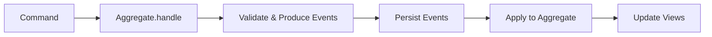
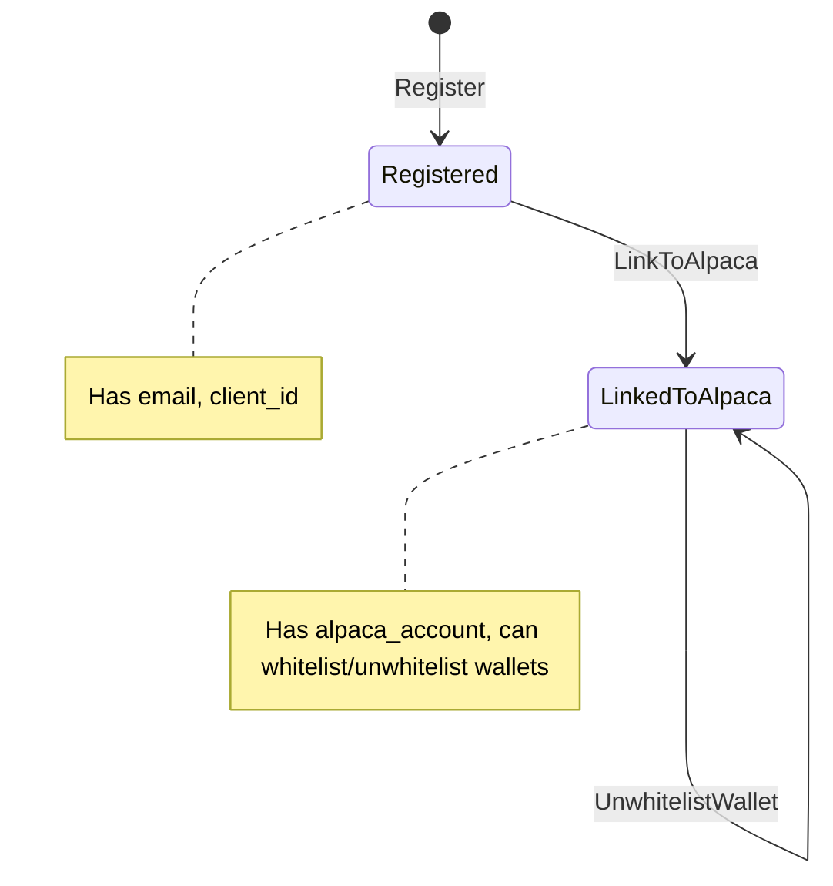
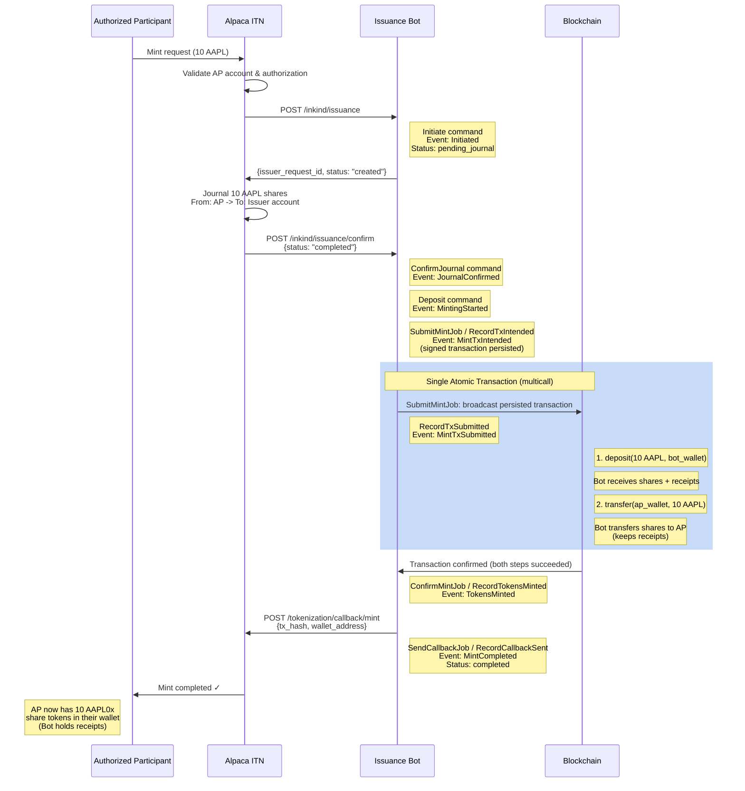
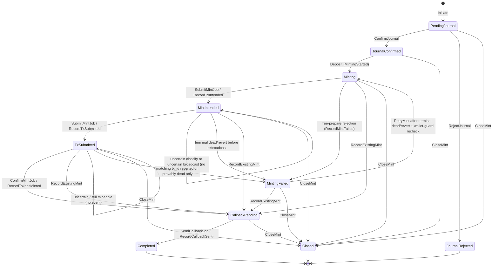
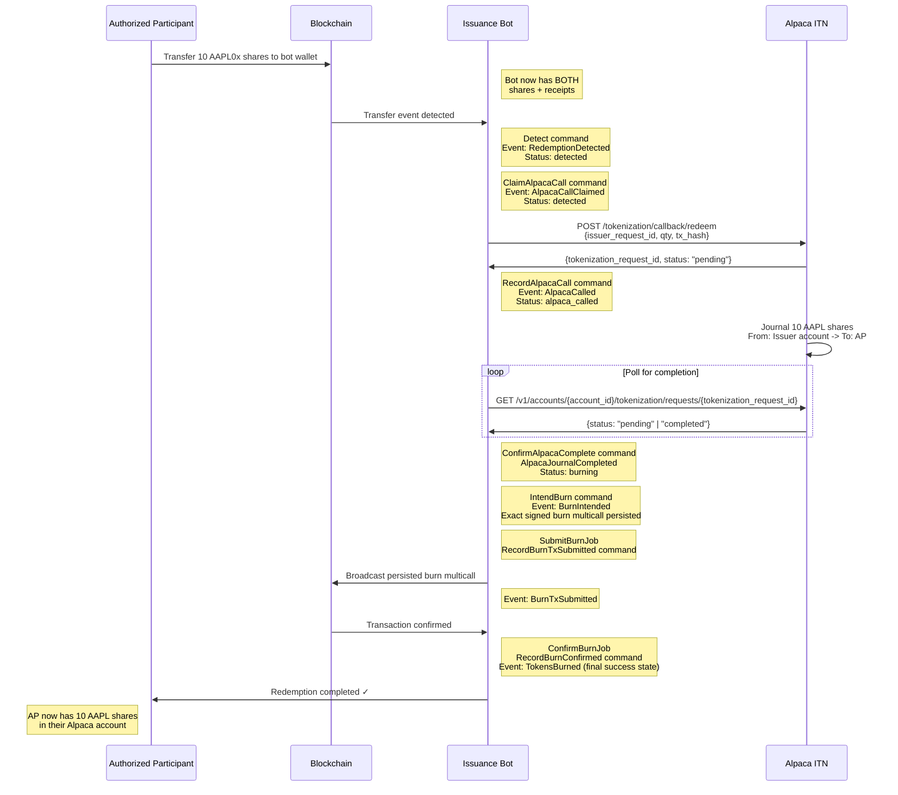
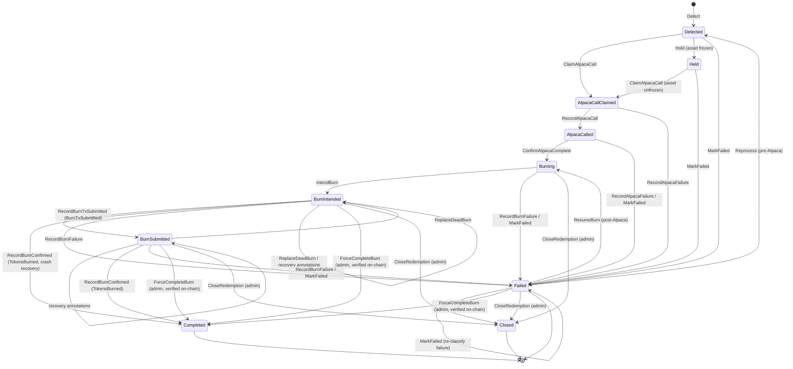
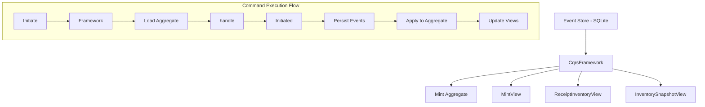

# Issuance Bot Specification

## Overview

The issuance bot acts as the **Issuer** in Alpaca's Instant Tokenization Network
(ITN). It implements the Issuer-side endpoints that Alpaca calls during
mint/redeem operations, and coordinates with the Rain
`OffchainAssetReceiptVault` contracts to execute the actual on-chain minting and
burning of tokenized shares.

**This is general infrastructure** - any Authorized Participant (AP) can use it
to mint and redeem tokenized equities. The issuance bot serves as the bridge
between traditional equity holdings (at Alpaca) and on-chain (semi-fungible)
tokenized representations (Rain SFT contracts).

## Background & Context

**Our Role:** We are the **Issuer** of tokenized equities. Alpaca acts as the
settlement layer between Authorized Participants (APs) and us.

**Flow Summary:**

- **Minting:** AP requests mint -> Alpaca calls our endpoint -> We validate ->
  Alpaca journals shares from AP to our custodian account -> Alpaca confirms
  journal -> We mint tokens on-chain -> We call Alpaca's callback
- **Redeeming:** AP sends tokens to our redemption wallet -> We detect
  redemption -> We call Alpaca's redeem endpoint -> Alpaca journals shares from
  our account to AP -> We burn tokens on-chain

**Use Cases:**

- **Market Makers & Arbitrageurs:** Can mint/burn to rebalance inventory and
  maintain price parity across venues
- **Institutions:** Can convert equity holdings to tokenized form for on-chain
  settlement, DeFi integration, or cross-border transfer
- **Retail Platforms:** Can facilitate tokenized equity access for their users
- **Our Arbitrage Bot:** Can use this infrastructure to complete the arbitrage
  cycle by rebalancing on/off-chain holdings. See
  [st0x.liquidity](https://github.com/ST0x-Technology/st0x.liquidity) for more
  details on the bot.

## Architecture

### Off-Chain Infrastructure

**Our HTTP Server:**

- Implements Alpaca ITN Issuer endpoints
- Handles account linking, mint requests, and journal confirmations
- Built with Rust (Rocket.rs web framework)
- SQLite database for tracking operations
- Async runtime for coordination

**Alpaca ITN:**

- Alpaca's settlement layer
- Handles journal transfers between accounts automatically
- Provides endpoints for callbacks and status queries

### On-Chain Infrastructure

**Rain OffchainAssetReceiptVault Contract:**

- ERC-1155 receipts tracking individual deposit IDs
- ERC-20 shares representing vault ownership
- `deposit()` function for minting
- `withdraw()` function for burning

**Redemption Wallet:**

- On-chain address where APs send tokens to redeem
- We monitor this address for incoming transfers

**ST0xOrchestrator Contract:**

- A singleton contract that holds custody of **all** ERC-1155 receipts across
  every vault, replacing the bot-wallet receipt custody model for the vaults it
  covers. Exposes role-gated `mint()`/`burn()` entry points guarded by
  `MINT_ROLE`, `BURN_ROLE`, and an `EMERGENCY_ROLE` for manual recovery actions
  (e.g. moving receipts, adjusting the burn pointer).
- **Dual-mode, config-selected per asset, default vault-direct.** Each asset
  operates in `vault_direct` mode (today's direct `OffchainAssetReceiptVault`
  multicall flow, described above and in "Complete Mint Flow" / "Complete
  Redemption Flow") or `orchestrator` mode (this contract). The mode is a
  per-asset configuration choice (`[assets.<UNDERLYING>]` in the TOML config
  file, see "Configuration" -> "TOML Configuration File"), not a per-request
  choice. It defaults to `vault_direct` for every asset, so the orchestrator can
  be dark-deployed and exercised before cutover; cutover moves assets into
  orchestrator mode incrementally — a single pilot asset first, then the rest —
  and rollback flips a single asset back. See "Orchestrator Migration
  (ST0xOrchestrator)" for the full design.

### ES/CQRS Architecture

The issuance bot uses **Event Sourcing (ES)** and **Command Query Responsibility
Segregation (CQRS)** patterns to maintain a complete audit trail, enable
time-travel debugging, and provide a single source of truth for all operations.

**Core Concepts:**

- **Aggregates**: Business entities that encapsulate state and business logic
  (e.g., `Mint`, `Redemption`, `Account`, `TokenizedAsset`)
- **Commands**: Requests to perform actions, representing user or system intent
  (e.g., `Initiate`, `ConfirmJournal`, `Deposit`)
- **Events**: Immutable facts about what happened, always in past tense (e.g.,
  `Initiated`, `JournalConfirmed`, `TokensMinted`)
- **Event Store**: Single source of truth - an append-only log of all domain
  events stored in SQLite
- **Views**: Read-optimized projections built from events for efficient querying
- **Services**: External dependencies that aggregates use (Alpaca API client,
  blockchain client, monitoring service)

**Key Flow:**


```mermaid
graph LR
    A[Command] --> B[Aggregate.handle]
    B --> C[Validate & Produce Events]
    C --> D[Persist Events]
    D --> E[Apply to Aggregate]
    E --> F[Update Views]
```

**Critical Methods:**

- `handle(command) -> Result<Vec<Event>, Error>`: Business logic lives here.
  Validates the command against current aggregate state and returns a list of
  events (can be 0+ events). Most commands produce a single event, but some
  commands may produce multiple events when one action has several state
  consequences.
- `apply(event)`: Deterministically updates aggregate state from events. This
  method is pure and should never fail - events are historical facts that have
  already occurred.

**Benefits:**

- **Complete Audit Trail**: Every state change is captured as an immutable event
- **Time Travel Debugging**: Replay events to reconstruct system state at any
  point in history
- **Testability**: Business logic tested via Given-When-Then pattern (given
  events, when command, then expect events)
- **Rebuild Views**: If a view becomes corrupted or a new projection is needed,
  simply replay all events
- **Multiple Projections**: Same events can feed different views (operational
  dashboard, analytics, Grafana metrics)
- **Single Source of Truth**: Event store is authoritative; all other data is
  derived

## Data Types

Throughout this specification, we use newtypes to provide type safety and
prevent mixing up different kinds of identifiers and values:

```rust
use rust_decimal::Decimal;
use chrono::{DateTime, Utc};

struct TokenizationRequestId(String);

/// Mint operations use a UUID-based issuer request ID.
/// Serializes as a UUID string, e.g. "a1b2c3d4-e5f6-7890-abcd-ef1234567890"
struct IssuerMintRequestId(Uuid);

/// Redemption operations derive their issuer request ID from the full on-chain
/// tx_hash that triggered the redemption.
/// Serializes as a 32-byte hash, e.g. "0x1234...abcd".
/// Legacy "red-{first4bytes}" IDs remain readable for historical events.
struct IssuerRedemptionRequestId(TxHash);

struct ClientId(String);
struct AlpacaAccountNumber(String);
struct UnderlyingSymbol(String);
struct TokenSymbol(String);
struct Network(String);
struct Quantity(Decimal);
struct Email(String);
```

## Aggregates

This section defines the domain aggregates, their commands, and the events they
produce. Each aggregate represents a business concept with its own lifecycle and
invariants.

### Mint Aggregate

The `Mint` aggregate manages the complete lifecycle of a mint operation, from
initial request through journal confirmation to on-chain minting and callback.

**Aggregate State:**

- `issuer_request_id: IssuerMintRequestId`: Our unique identifier for this mint
- `tokenization_request_id`: Alpaca's identifier
- `quantity`, `underlying`, `token`, `network`, `client_id`, `wallet`: Request
  details
- `mint_mode: VaultMode`: the asset's resolved `VaultMode` at initiate time.
  Anchors mode-derivation for this mint — see "Orchestrator Migration" ->
  "Recipient Authorization"
- `mint_authorization` (orchestrator mode only): the `MintAuthV1` the liquidity
  bot supplied for this mint via the internal mint-authorization call, absent
  until that call arrives — see "Orchestrator Migration" -> "Recipient
  Authorization"
- `status`: Current state in the mint lifecycle
- `tx_hash`, `receipt_id`, `shares_minted`: On-chain transaction details.
  Orchestrator-mode mints populate the analogous on-chain proof (`nonce` instead
  of `receipt_id`) — lifecycle state names stay backend-agnostic; only the
  audit-data shape differs
- Timestamps for each lifecycle stage

**Durable jobs vs pure commands:** On-chain I/O and Alpaca callbacks are
performed by durable jobs (`SubmitMintJob`, `ConfirmMintJob`, `SendCallbackJob`,
`MintRecoveryJob`). Aggregate commands are pure `Record*` / transition commands:
they validate state and emit events from job-supplied payloads (no network I/O
in the handler). Recovery advances a mint via `drive_one_step` (pure transitions
plus enqueue of the next job), not a wallet-locked aggregate command.

**Commands:**

- `Initiate { tokenization_request_id, quantity, underlying, token, network, client_id, wallet }` -
  Create a new mint request from Alpaca
- `ConfirmJournal { issuer_request_id }` - Alpaca confirmed shares journal
  transfer
- `RejectJournal { issuer_request_id, reason }` - Alpaca rejected shares journal
  transfer
- `AuthorizeMint { issuer_request_id, mint_authorization }` (orchestrator mode
  only) - Associate the liquidity bot's `MintAuthV1` with this mint, delivered
  out-of-band via the internal mint-authorization call after `Initiate`.
  Validates the EIP-712 signature and nonce (see "Recipient Authorization"),
  rejects delivery when this mint's `mint_mode` is `VaultDirect`, and is
  idempotent on redelivery of an identical authorization. Produces
  `MintAuthorizationReceived`. Does not change the lifecycle state
- `Deposit { issuer_request_id }` - Record intent to mint. Pure state transition
  from `JournalConfirmed` to `Minting` — no network call. Produces
  `MintingStarted`. Intent is persisted before the network call so that a crash
  during submission leaves the aggregate in a recoverable `Minting` state rather
  than `JournalConfirmed` (which would lose track of the submission)
- `RecordTxIntended { issuer_request_id, prepared_tx }` - Pure: persists the
  exact signed deposit (`MintTxIntended`) before broadcast. Requires `Minting`.
  Built and signed by `SubmitMintJob` (or recovery enqueue of that job), not by
  a network-calling aggregate command
- `RecordTxSubmitted { issuer_request_id, external_tx_id, tx_id }` - Pure:
  records a successful broadcast (`MintTxSubmitted`). Accepts `Minting` and
  legacy `MintIntended`. Uncertain broadcast with a live prepared identity
  leaves `MintIntended` (no event) so the same bytes are rebroadcast
- `RecordTokensMinted { issuer_request_id, tx_id, ... }` - Pure: records
  on-chain success (`TokensMinted`) from `ConfirmMintJob`. Requires
  `TxSubmitted` and a matching stored `tx_id` (stale confirm jobs are rejected)
- `RecordMintFailed { issuer_request_id, error }` - Pure: records
  `MintingFailed` from a durable job. Observation rules (job-side) allow this
  only for definitive failure (mined revert / provably dead after classify, or
  pre-intent prepare rejection) — never for uncertain receipt/RPC observation
  while a prepared identity is still live
- `RecordCallbackSent { issuer_request_id }` - Pure: records `MintCompleted`
  after `SendCallbackJob` delivers the Alpaca callback
- `RetryMint { issuer_request_id }` - Pure: `MintingFailed` → `Minting`
  (`MintRetryStarted`) before recovery re-enqueues `SubmitMintJob`
- `ManualRetryMint { issuer_request_id, manual_retry_id }` - Operator-authorized
  retry of a `MintingFailed` mint past the exhausted automatic budget, gated on
  the aggregate's own failure provenance (not a snapshot that may be stale by
  execution time). Refused unless the failure chain proves a fresh submission is
  unambiguous: only a `Minting` predecessor with no transaction provenance
  qualifies, since a `MintIntended`/`TxSubmitted` predecessor's transaction may
  still land, and a fresh submission over it could double-mint. Mints initiated
  before the job-based submit flow are refused outright — their provenance
  cannot be proven from event history. Produces the same `MintRetryStarted`
  event as automatic retry
- `RecordExistingMint { issuer_request_id, tx_hash, receipt_id, shares_minted, block_number }` -
  Pure: records an already-mined on-chain deposit (`ExistingMintRecovered`) and
  advances to `CallbackPending` without rebroadcasting. Accepts `Minting`,
  `MintIntended`, `TxSubmitted`, and `MintingFailed` (inventory or confirm
  success under any of those states). Idempotent once already minted /
  callback-pending / completed
- `CloseMint { issuer_request_id, reason, acknowledged_unresolved_mint_tx_hash }` -
  Admin-closes a non-terminal mint. When the mint still holds an unresolved
  deposit identity, `acknowledged_unresolved_mint_tx_hash` must equal that exact
  hash (422 on miss/mismatch). That identity is the prepared hash
  (`MintTxIntended` / `TxSubmitted` with prepared bytes, including via
  `MintingFailed`), and for a legacy `TxSubmitted` carrying no prepared bytes it
  falls back to the stored `tx_id` when that id is a transaction hash — the
  submission is already on the wire and recovery still confirm-polls it, so
  closing it must not be cheaper than closing an intended mint. Omit only when
  there is no such identity (no prepared bytes and no hash `tx_id`); providing a
  hash when none exists is also 422.

**Recovery orchestration (not aggregate commands):** Startup and the scheduled
`MintRecoveryJob` drive any mint in `JournalConfirmed`, `Minting`,
`MintIntended`, `TxSubmitted`, `MintingFailed`, or `CallbackPending` via
`drive_one_step` + enqueue of the matching durable job. Inventory hits use
`RecordExistingMint`; otherwise recovery re-classifies any persisted signed mint
intent under the wallet lock (burn-parity observation below) and only allows a
**new** signed deposit after `MinedReverted` or `ProvablyDead` with a recheck.
Automatic recovery submits up to four replacement transactions after 1m, 10m,
30m, and 1h delays once the prior identity is terminal. Manual admin reprocess
uses the **same** recovery path and **does not** bypass the automatic retry cap:
when automatic retries are `Exhausted`, admin reprocess is `Unrecoverable`
(operator must fix the underlying cause and/or use an explicit close/remediation
path — not another free deposit). Correctness depends on exact-hash rebroadcast
and classification — **not** on `external_tx_id` (the signer does not dedup on
it).

`ConfirmMintJob` observes a submitted `tx_id` by bounded
`eth_getTransactionReceipt(H)` polling as `Option`, not
`PendingTransactionBuilder::get_receipt` as the terminal classifier. The
vault-direct mint recovery model under **Command -> Event Mappings** is the
authoritative statement of what each observation records.

**Events:**

- `Initiated` - Mint request created (carries all request details). Gains one
  additive optional `mint_mode` field (`#[serde(default)]`, `VaultMode`,
  defaulting to `VaultDirect` for historical events, which all predate
  orchestrator mode and so could only have been vault-direct) recording the
  asset's resolved `VaultMode` at initiate time, before any possible mint
  submission; this anchors mode-derivation for the mint the same way
  `RedemptionDetected.burn_mode` anchors it for Redemption
- `MintAuthorizationReceived` (orchestrator mode only) - The liquidity bot's
  validated `MintAuthV1` for this mint, delivered via the internal
  mint-authorization call. Carries
  `{issuer_request_id, mint_authorization, received_at}`. This is the
  persistence point for the nonce — `Initiated` is written on the Alpaca POST,
  strictly before the authorization exists, so it cannot carry one
- `JournalConfirmed` - Alpaca journal transfer confirmed
- `JournalRejected` - Alpaca journal transfer rejected (terminal)
- `MintingStarted` - Mint intent recorded (aggregate moves to `Minting`)
- `MintTxIntended` - Exact signed mint transaction persisted before broadcast
  (carries raw bytes, hash, nonce, signing time, and external transaction ID)
- `MintTxSubmitted` - Persisted signed mint transaction broadcast (carries
  `external_tx_id` and `tx_id` — the on-chain tx hash — for crash recovery)
- `TokensMinted` - On-chain mint succeeded (carries tx details)
- `MintingFailed` - On-chain mint failed. Gains one additive optional
  `classification` field (`#[serde(default)]`, `MintFailureClassification`,
  default `Unclassified`) — see "Orchestrator Migration" -> "Failure States" for
  the decodable on-chain-revert variants (and "Recipient Authorization" ->
  "Nonce" for `NonceConsumedByOtherMint` and `NonceReplayUnresolved`, both
  assigned by recovery's own full-match check rather than decoded from a revert)
  and how retry-exclusion and logging key off it
- `MintCompleted` - Alpaca callback sent, mint fully completed (terminal)
- `ExistingMintRecovered` - Existing on-chain mint discovered during recovery
  (carries tx details)
- `MintRetryStarted` - Mint retry started during recovery, either automatic or
  operator-authorized. An operator-authorized retry carries a `manual_retry_id`
  correlating the command with the event it commits, so queue dispatch can
  distinguish a successful transition from an idempotent no-op against
  already-advanced state
- `MintClosed` - Admin-closed mint (terminal). Carries the operator `reason`,
  `closed_at`, and optional `acknowledged_unresolved_mint_nonce` (present only
  when closing a `NonceReplayUnresolved` mint). Closed mints do not appear in
  stuck queries
- `OrchestratorTokensMinted` (orchestrator mode only) - On-chain orchestrator
  mint succeeded. Carries
  `{issuer_request_id, tx_hash, nonce, shares_minted,
  gas_used, block_number, minted_at}`
  — nonce replaces `receipt_id` since the orchestrator, not the bot, owns
  receipt custody
- `OrchestratorMintRecovered` (orchestrator mode only) - Existing on-chain
  orchestrator mint discovered during recovery, via a proactive `Minted`-log
  query keyed on `(wallet, nonce)` and confirmed by an exact match on this
  mint's own `token` and `amount` (see "Nonce" below — the nonce-uniqueness view
  is `(wallet, nonce)` only, so a bare hit is not sufficient proof) — mirroring
  vault-direct recovery's proactive receipt-inventory check
  (`RecordExistingMint`, see "Recovery orchestration" above). A `NonceReplayed`
  revert is only the fallback signal for a submit/query race, not the primary
  discovery path. Carries
  `{issuer_request_id, tx_hash, nonce, shares_minted, block_number,
  recovered_at}`

Newly persisted transaction IDs use an explicitly tagged `hash` or `legacy`
representation so replay preserves the original `TxId` variant, including a
legacy ID whose text is valid 32-byte hex. Replay also accepts the historical
flat-string representation; because those rows have no variant discriminator,
32-byte hex flat strings retain the historical hash inference. Legacy
`FireblocksSubmitted` events and their `fireblocks_tx_id` field replay as
`MintTxSubmitted`.

The tagged writer is a one-way persistence cutover. Deployment must stop event
writers, back up the database, replace every service instance with the
dual-format reader, and only then resume traffic. After the first tagged
transaction ID is persisted, a binary that only understands flat strings must
not be restored against that database; recovery is to roll forward with the
dual-format reader or restore the pre-cutover backup.

**Command -> Event Mappings:**

| Command              | Events                  | Notes                                                     |
| -------------------- | ----------------------- | --------------------------------------------------------- |
| `Initiate`           | `Initiated`             | Mint request created                                      |
| `ConfirmJournal`     | `JournalConfirmed`      | Journal confirmed                                         |
| `RejectJournal`      | `JournalRejected`       | Terminal failure                                          |
| `Deposit`            | `MintingStarted`        | Records intent (no network call)                          |
| `RecordTxIntended`   | `MintTxIntended`        | Pure; `SubmitMintJob` signed first                        |
| `RecordTxSubmitted`  | `MintTxSubmitted`       | Pure; job already broadcast                               |
| `RecordTokensMinted` | `TokensMinted`          | Pure; requires matching `tx_id`                           |
| `RecordMintFailed`   | `MintingFailed`         | Pure; job-side observation gates                          |
| `RecordCallbackSent` | `MintCompleted`         | Pure; `SendCallbackJob` already called Alpaca             |
| `RetryMint`          | `MintRetryStarted`      | Pure; recovery before re-enqueue submit                   |
| `RecordExistingMint` | `ExistingMintRecovered` | Pure; `Minting` / `MintIntended` / `TxSubmitted` / failed |
| `CloseMint`          | (closed)                | Admin terminal                                            |

`Deposit` emits only `MintingStarted` (business intent). `SubmitMintJob` builds
and signs the transaction, persists exact bytes via `RecordTxIntended`, then
broadcasts. A crash before `MintTxIntended` cannot have broadcast anything; a
crash after it causes recovery to rebroadcast or poll that same transaction,
never prepare a second one. A crash after broadcast but before `MintTxSubmitted`
therefore remains safe because rebroadcasting identical signed bytes is
idempotent. Preparing, persisting, and initially broadcasting a mint transaction
share one wallet critical section. Startup mint recovery processes its persisted
intents in nonce order before mint states that may prepare a new transaction.
Mint and redemption recovery run concurrently so persisted transactions from
either domain can fill lower nonce gaps while higher transactions await
confirmation. Live mint and burn preparation consult the trigger-maintained
signer-intent reservation and are blocked while any other wallet intent remains
unresolved; this safety check does not depend on a fallible read-model
projection. Together these rules prevent two jobs from signing the same wallet
nonce without relying on in-memory nonce state that would be lost on restart.
Each live burn attempt waits at most 30 seconds behind an earlier unresolved
wallet intent. On timeout it prepares and broadcasts nothing, leaves the
redemption recoverable, and defers the burn to recovery rather than occupying
the live flow indefinitely.

**Cross-instance signer-intent guard.** The pre-check above is an
application-level read; it cannot by itself stop two separate processes from
independently signing the same nonce during the brief overlap between the old
process terminating and its replacement starting. `active_signer_intents` is the
durable, cross-process backstop for that window: one row per network (a signer's
nonce domain), reserved by a trigger in the same transaction that appends
`MintTxIntended` or `BurnIntended`, and released by a trigger on that
aggregate's own definitively-resolved terminal event. The reservation key is
`network` alone, so it is shared between `Mint` and `Redemption` — only one
signer intent per nonce domain can be outstanding at a time, regardless of which
aggregate holds it. This makes the event append itself the durable arbitration
point: a second instance's competing intent is rejected by SQLite before it can
commit, rather than relying on an in-memory lock or a fallible read-model
projection. Recovery bookkeeping, including `BurnNonceTooLow`, never releases
this reservation; only a definitively resolved terminal event does. When the
pre-append check finds the network occupied, a mint job returns
`MintJobError::UnresolvedWalletIntent` and refuses to submit rather than risk a
nonce collision, leaving the job to retry once the guard clears. When the race
is lost between that check and the append, the trigger aborts the append with an
explicit signer-reservation error — worded distinctly from a same-aggregate
concurrency conflict so an operator reading the failure is pointed at the
nonce-domain guard, not at a phantom concurrent modification of the aggregate.

The issuer is a single-writer service: exactly one process may own a given
SQLite event store and signing wallet at a time. Horizontal replicas sharing a
wallet are unsupported because the wallet critical section is process-local.
Deployments must terminate the old process before the replacement begins serving
or recovering work.

`ConfirmMintJob` observes the submitted `tx_id` via bounded
`get_transaction_receipt` polling and records `TokensMinted` only on a mined
success with a valid `Deposit`. It may record `MintingFailed` only for a mined
revert (`status=0`) when the job's `tx_id` matches the mint's current
submission. Uncertain observations (no receipt within the poll budget,
RPC/transport errors, invalid receipt shape, or a mined success body missing
`Deposit` logs) leave the aggregate in `TxSubmitted` — or `MintIntended` if it
was never submitted — with **no** event, never auto-replace. A missing `Deposit`
on a successful receipt is anomalous and requires operator intervention, not a
second deposit.

Vault-direct mint recovery uses the same observation predicate as burn recovery
for a persisted signed identity `(H, N)` of wallet `W` (the signing bot):

```
observe(H, N, W):
  receipt(H) with block + status=1 + Deposit → MinedSuccess
  receipt(H) with block + status=0           → MinedReverted
  receipt None + finalized_nonce(W) ≤ N      → StillMineable
  receipt None + finalized_nonce(W) > N
    then recheck receipt(H):
      Some(...) → reclassify
      None      → then corroborate with transaction(H):
                    None    → ProvablyDead
                    Some(_) → Uncertain (contradictory death signals)
  anything else                             → Uncertain (fail closed; Err)
```

`ProvablyDead` unlocks `RecordMintFailed` and a replacement prepare, so it is
never read out of a single absent receipt: a lagging or load-balanced RPC node
can answer `None` for a receipt that exists. A finalized nonce past `N` says the
nonce is spent; the node having also forgotten the transaction is what says it
was not spent by this one. A node that reports the nonce finalized while still
holding the unmined transaction is contradicting itself, and a death proof
cannot be read out of an inconsistent node — that is `Uncertain`, which
preserves the identity instead of authorizing a second deposit.

`Uncertain` is a fail-closed error classification, not a durable aggregate
state. Every arm that preserves an identity instead of advancing it — uncertain
classify, a recheck that is no longer terminal, an unrecoverable signer, and the
prepare-path equivalents — re-drives recovery before returning, so
re-observation is never left to the periodic reconciler alone. The enqueue
dedups on the mint's idempotency key, so arms that already re-drove cost
nothing. After the first `MintTxIntended`, the persisted signed bytes/hash/nonce
are authoritative for the whole recovery lifetime of that attempt. Fresh signed
mint is allowed only when the exact hash is `MinedReverted` or `ProvablyDead`,
and only after a wallet-guard recheck of hash/nonce/inventory immediately before
`prepare_mint_tx`. `external_tx_id` is **not** vault-direct double-mint
protection.

| State + observation                                                   | Action                                                                                                                                                                                                                                                                                                                                           |
| --------------------------------------------------------------------- | ------------------------------------------------------------------------------------------------------------------------------------------------------------------------------------------------------------------------------------------------------------------------------------------------------------------------------------------------ |
| Inventory hit for `issuer_request_id`                                 | `ExistingMintRecovered` (unchanged)                                                                                                                                                                                                                                                                                                              |
| `MintIntended` + StillMineable / Uncertain                            | Rebroadcast same bytes or wait; no new sign                                                                                                                                                                                                                                                                                                      |
| `MintIntended` + MinedSuccess                                         | Rebroadcast the same bytes, as for StillMineable; the confirm path records the mint. Never a new sign                                                                                                                                                                                                                                            |
| `TxSubmitted` + MinedSuccess                                          | `TokensMinted`                                                                                                                                                                                                                                                                                                                                   |
| `TxSubmitted` + StillMineable                                         | Rebroadcast same bytes and/or re-enqueue confirm; stay `TxSubmitted`                                                                                                                                                                                                                                                                             |
| `TxSubmitted` + Uncertain                                             | No event; retry observe later (scheduled recovery re-polls ~60s)                                                                                                                                                                                                                                                                                 |
| `TxSubmitted` / failed-from-submitted + MinedReverted or ProvablyDead | `MintingFailed` (if not already), then budgeted retry may prepare **new** `MintTxIntended` **only after wallet-guard recheck**. Only the job whose `tx_id` is the mint's current submission may record it — a stale confirm job for a superseded submission re-drives recovery instead, the same identity gate the reverted-confirm path applies |
| `MintingFailed` + MinedSuccess                                        | `ConfirmMintJob` for the prepared hash, **not** `RetryMint`, so `RecordExistingMint` can run. A mined deposit under a failed aggregate resolves forward and does not consume a retry                                                                                                                                                             |
| Pre-intent prep failure (`Minting` never intended)                    | Existing `MintingFailed` + retry schedule (unchanged; no on-chain identity)                                                                                                                                                                                                                                                                      |

Recovery (`drive_one_step` + durable jobs) checks the receipt inventory for a
receipt matching the `issuer_request_id`. If found, records
`ExistingMintRecovered`. If not found and in `Minting` state, `SubmitMintJob`
prepares and persists `MintTxIntended` only when no live prepared identity
remains. If in `MintIntended`, classifies then rebroadcasts the persisted raw
transaction only when StillMineable/MinedSuccess; terminal dead/revert records
`MintingFailed` so a budgeted retry may replace. If in `TxSubmitted` (or
`MintingFailed` with a known prior transaction), re-observes the stored identity
as above rather than treating every confirmation error as terminal failure.
`TxSubmitted` means the persisted transaction was broadcast; it does not mean
the transaction succeeded on-chain. Retry transactions use
`mint-{issuer_request_id}-retry-{n}` where automatic retries use n = 1..4 and
the delay schedule is 1m, 10m, 30m, then 1h — only after the prior identity is
`MinedReverted` or `ProvablyDead`.

The retry-delay/exhaustion schedule is driven by a `MintingFailed` attempt
counter. A free-prepare (no live prepared identity) RPC/rejection records
`MintingFailed`; an uncertain broadcast or prepare-replacement failure while a
prior prepared identity remains live instead preserves that identity (no
`MintingFailed` for uncertain broadcast) so recovery rebroadcasts the exact same
signed bytes without advancing the attempt. A running service keeps driving
deferred retries via `MintRecoveryJob` (also spawned at startup and after a
manual reprocess of an eligible mint), rather than waiting for the next restart.

Uncertain `TxSubmitted` re-polls on the scheduled recovery cadence (~60s). The
no-progress budget (~6h / 360 polls) still applies: prolonged RPC uncertainty
can abandon automatic recovery until process restart. Exhausted automatic
retries remain `Unrecoverable` for admin reprocess as well — that is intentional
correctness: neither automatic nor manual reprocess may authorize unlimited
replacement deposits.

**Duplicate deposit observability:** receipt inventory is 1:1 on
`issuer_request_id`. When backfill or the live monitor discovers a second
Deposit (different `receipt_id` or `tx_hash`) for an already-tracked ITN mint
id, the bot logs an **ERROR** with both identities **and** records
`RecordConflictingItnDeposit` → `ConflictingItnDepositObserved` on that vault's
inventory stream. The event is required because backfill advances its checkpoint
past the block once the pass completes and never re-scans that range: without it
the duplicate would survive only as one log line. `DiscoverReceipt` is still
refused, so the duplicate is recorded as evidence and never becomes tracked,
spendable, or burnable balance. Recording is idempotent on the duplicate's own
`(receipt_id, tx_hash)`, so a re-scanned range cannot grow the log a pass at a
time. The 1:1 index outliving its metadata row counts as a conflict, not as
"nothing tracked" — that is the one shape in which this gate could fail open.
There is no admin health endpoint listing historical duplicates yet — operators
read the event (or the ERROR log) plus on-chain Deposit history, then remediate
excess supply with `issuer burn-excess` (never by forcing another mint). Do not
manually force a second deposit when confirm is uncertain; leave `TxSubmitted`
and wait for re-observe or restart.

**Vault-direct vs orchestrator:** vault-direct mints confirm via vault `Deposit`
logs and receipt inventory. Orchestrator mints (when enabled) use the
orchestrator `Minted` log and authorization nonce recovery surface. The
observation model in this section is **vault-direct only**; orchestrator failure
classification is a separate coordination surface and must not treat RPC
uncertainty as an auto-retryable mint failure.

When the receipt monitor discovers an on-chain receipt for a mint, it enqueues
`MintRecoveryJob` (or the submit path loads inventory). `RecordExistingMint`
accepts `Minting`, `MintIntended`, `TxSubmitted`, and `MintingFailed`, emits
`ExistingMintRecovered`, transitions to `CallbackPending`, then continues
through `SendCallbackJob` → `RecordCallbackSent` / `MintCompleted` without
rebroadcasting. Automated recovery persists the `CallbackPending` boundary
before delivering the callback, so receipt polling and Alpaca requests do not
hold the wallet transaction lock.

**Orchestrator mode** adds exactly one new command — `AuthorizeMint`, which
delivers the recipient authorization (see "Recipient Authorization") — and
introduces no new submission or recovery commands: `Deposit`, the pure `Record*`
commands, and the `SubmitMintJob`/`ConfirmMintJob`/`MintRecoveryJob` chain are
reused unchanged, with the jobs branching on `VaultMode` internally to submit
`orchestrator.mint()` calldata instead of the vault multicall and to emit the
orchestrator-mode events above. An orchestrator-mode mint creates no bot-held
receipt for the receipt monitor to discover (the orchestrator custodies it — see
"Orchestrator Migration" -> "Dual-Mode Operation and Cutover"), so the
inventory-backed `RecordExistingMint` short-circuit does not apply; the submit
and recovery paths' existing-mint check instead queries the orchestrator's
`Minted` log by `(wallet, nonce)`, emitting `OrchestratorMintRecovered` only
when the log's `token`/`amount` also exactly match this mint's own request facts
(see "Nonce" below for the full-match rule and its manual-failure fallback). See
"Orchestrator Migration" for the mint flow, failure states
(`BadRecipientSignature`, `RecipientCallbackRejected`, `VaultAmountMismatch`,
`VaultLogicMismatch`/`ReceiptLogicMismatch`), and the full event reuse/new
rationale.

Mirroring the mode-scoping rule given for Redemption below, a mint's mode does
not follow later `VaultMode` flips of its asset: the submit, confirm, and
recovery paths determine which mode to use for a given mint from that mint's own
event history — the `mint_mode` field persisted on its `Initiated` event,
resolved from configuration at initiate time — never re-resolved from the
asset's currently-configured `VaultMode`. This ensures a mint `Initiated` while
its asset was in `vault_direct` mode is still recovered as a vault-direct mint
even after that asset's configured `vault_mode` is later flipped to
orchestrator, exactly as Redemption's persisted `burn_mode` (captured on
`RedemptionDetected`) prevents the analogous mismatch on the Redemption side.

The mode anchor is deliberately **not** the presence of `mint_authorization`.
`Initiated` is written synchronously on Alpaca's `POST /inkind/issuance`, before
the liquidity bot delivers the authorization on the internal mint-authorization
call, and events are immutable — an already-persisted `Initiated` can never grow
an authorization field. Mode (known from config at initiate time) and
authorization (arriving later, on `MintAuthorizationReceived`) are therefore
orthogonal facts on two separate events. An orchestrator-mode mint whose
authorization has not yet arrived is `mint_mode: Orchestrator` with no
`mint_authorization` — it is not, and must never be read as, a vault-direct
mint.

### Redemption Aggregate

The `Redemption` aggregate manages the redemption lifecycle, from detecting an
on-chain transfer through calling Alpaca to burning tokens.

**Aggregate State:**

- `issuer_request_id: IssuerRedemptionRequestId`: Our unique identifier for this
  redemption
- `tokenization_request_id`: Alpaca's identifier (received after calling their
  API)
- `underlying`, `token`, `wallet`, `quantity`: Redemption details
- `detected_tx_hash`: On-chain transfer that triggered redemption
- `burn_mode` (orchestrator migration only): the asset's resolved `VaultMode` at
  detection time, captured on `RedemptionDetected` — the earliest possible point
  in the redemption's lifecycle, before any burn submission. Every
  mode-dependent command (`IntendBurn`, the `Record*` burn submit and confirm
  commands, `ResumeBurn`, `ForceCompleteBurn`) derives mode from this persisted
  fact, never re-resolved from the asset's currently-configured `VaultMode` —
  see "Orchestrator Migration"
- `status`: Current state in the redemption lifecycle
- `burn_tx_hash`, `receipt_id`, `shares_burned`: Burn transaction details.
  Orchestrator-mode burns populate the analogous on-chain proof (a consumed
  receipt pointer range instead of a per-receipt list) — lifecycle state names
  stay backend-agnostic; only the audit-data shape differs
- Timestamps for each lifecycle stage

**Commands:**

- `Detect` - Transfer to redemption wallet detected
- `Hold` - Park a detected redemption of a frozen asset before the Alpaca redeem
  call. Valid from `Detected` (emits `RedemptionHeld`) and idempotent from
  `Held` (no event), so concurrent guard paths cannot race each other. Holding
  happens strictly **before** the Alpaca call: past that boundary Alpaca has
  decremented its side, and holding the burn would leave on-chain supply above
  the Alpaca count — the exact divergence the freeze prevents. A held redemption
  is deferred, never dropped (its tokens are already committed on-chain).
- `ClaimAlpacaCall` - Persist the right to make the external Alpaca call. Valid
  from `Detected` or `Held`; emits `AlpacaCallClaimed` while holding the same
  admission guard used by every operator and corporate-action freeze
  acquisition.
- `RecordAlpacaCall` - Alpaca redeem API called successfully. Valid only from
  `AlpacaCallClaimed`.
- `RecordAlpacaFailure` - Alpaca redeem API call failed (valid only from
  `AlpacaCallClaimed`).
- `ConfirmAlpacaComplete` - Alpaca journal transfer completed
- `IntendBurn` - Prepare and sign the exact burn transaction, then persist its
  raw bytes, hash, nonce, and receipt plan in `BurnIntended` before any
  broadcast. Only valid from `Burning`.
- `RecordBurnTxSubmitted` / `RecordOrchestratorBurnSubmitted` - Record the burn
  broadcast that `SubmitBurnJob` performed via
  `BurnManager::submit_intended_burn`, which calls the vault outside any
  aggregate transition. Pure: emit `BurnTxSubmitted` (vault-direct) or
  `OrchestratorBurnSubmitted` (orchestrator) from the payload. Valid from
  `BurnIntended`; an idempotent no-op once the redemption has advanced, so an
  at-least-once job rerun is safe.
- `RecordBurnConfirmed` / `RecordOrchestratorBurnConfirmed` - Record the burn
  confirmation that `ConfirmBurnJob` performed via
  `BurnManager::confirm_submitted_burn`. Pure: emit `TokensBurned`
  (vault-direct) or `OrchestratorTokensBurned` (orchestrator) from the payload
  after checking the persisted `tx_id`, and for orchestrator mode that
  `shares_burned` equals this redemption's own persisted `alpaca_quantity`. In
  orchestrator mode dust is recorded via
  `OrchestratorTokensBurned.dust_retained`, derived by the handler from this
  redemption's own persisted `AlpacaCalled.dust_quantity` (already computed and
  stored well before any burn submission), not from the vault
- `RecordBurnRecoveryAttempt` - Persist one automatic recovery action before its
  external side effect
- `RecordBurnNonceTooLow` - Persist a deterministic node rejection that proves
  the exact rebroadcast transaction's nonce is already spent. This observation
  consumes no additional recovery action.
- `RecordBurnPreparationRecoveryAttempt` - Persist one automatic retry before
  resuming a failed redemption that has no signed burn transaction
- `ReplaceDeadBurn` - Re-check that the persisted transaction is provably dead,
  then sign and persist a replacement at a fresh nonce
- `ReplaceNonceTooLowBurn` - Sign and persist a fresh-nonce replacement after
  the recovery manager matches a durable `BurnNonceTooLow` observation to this
  redemption's current transaction and supplies a proof marker. The command
  handler re-verifies the marker's request id, hash, and nonce before signing.
- `RecordBurnRecoveryExhausted` - Persist that the redemption-wide automatic
  recovery budget is spent
- `RecordBurnPreparationRecoveryExhausted` - Persist exhaustion when repeated
  burn preparation failures never produced a transaction identity
- `RecordBurnFailure` - Record on-chain burn failure (from `Burning` or
  `BurnSubmitted` state). Carries optional `tx_id` and `planned_burns` for
  recovery
- `RecordExistingBurn` - Record an existing on-chain burn discovered during
  recovery via on-chain transaction lookup
- `MarkFailed` - Mark redemption as failed
- `Reprocess { issuer_request_id, metadata }` - Reset a failed redemption back
  to `Detected` state for reprocessing. Only valid from `Failed` state when no
  `AlpacaCalled` event exists in the history — post-Alpaca failures use
  `ResumeBurn` instead. The `metadata` field carries the original
  `RedemptionMetadata` (extracted by the API layer from the event store's first
  `Detected` event), since the `Failed` aggregate state does not preserve
  metadata. Emits `Reprocessed` event with the metadata, previous state name,
  and timestamp for audit trail. The existing recovery logic then picks it up
  naturally from `Detected` state.
- `ResumeBurn { issuer_request_id, metadata, tokenization_request_id,
  alpaca_quantity, dust_quantity, called_at, alpaca_journal_completed_at,
  external_tx_id }` -
  Resume a failed redemption directly to `Burning` state, bypassing the Alpaca
  call step. Only valid from `Failed` state. Used for post-Alpaca failures where
  Alpaca has already completed the journal. The API layer polls Alpaca to verify
  journal completion before issuing this command — refuses if Pending or
  Rejected. If the failed redemption already has a terminal failed burn,
  `external_tx_id` is set to the next deterministic retry id:
  `burn-{detected_tx_hash}-retry-{n}`. If a retry submission fails before the
  transaction lands, recovery reuses the same retry id. Emits `BurnResumed`
  event. The admin recovery path immediately invokes burn recovery in-process so
  the on-chain burn does not wait for a service restart. The subsequent burn
  submission derives its mode from this redemption's persisted `burn_mode` (see
  "Aggregate State" above), never from the asset's current `VaultMode`.
- `CloseRedemption { issuer_request_id, reason,
  acknowledged_unresolved_burn_tx_hash }` -
  Admin-close a redemption that cannot be automatically recovered, recording an
  operator `reason`. Valid from `Failed`, `Burning`, `BurnIntended`, or
  `BurnSubmitted`. A redemption with a persisted signed transaction is rejected
  by default because that transaction may still land. Closing it requires
  `acknowledged_unresolved_burn_tx_hash` to equal the persisted hash exactly;
  the signed identity is retained across a transition to `Failed`, and the
  acknowledgement is recorded in the terminal event. An acknowledgement is
  rejected when no persisted signed burn exists. This is the honest terminal
  path for a redemption whose burn cannot or should not be re-submitted and is
  **not** verifiable on-chain (e.g. a `Failed -> Burning` recovery regression
  where no burn ever landed, or an ambiguous case pending off-chain
  reconciliation). A held receipt reservation is **left in place** (the
  conservative policy for `Closed`), since an ambiguous burn may still have
  landed. Emits `RedemptionClosed`.
- `ForceCompleteBurn { issuer_request_id, burn_tx_hash, block_number, reason,
  acknowledged_unresolved_burn_tx_hash }` -
  Admin-terminalize a redemption stuck in `BurnIntended`/`BurnSubmitted` whose
  persisted exact burn transaction **already landed on-chain** but was never
  recorded (e.g. the bot crashed between the burn and `TokensBurned`). The admin
  layer verifies the operator-supplied `burn_tx_hash` on-chain first — the
  receipt must have succeeded and contain a real burn of the vault's shares, in
  the shape this redemption's own persisted `burn_mode` expects
  (`Transfer(bot_wallet -> 0x0)` for vault-direct; see "Orchestrator Migration"
  for the orchestrator-mode proof shape) — then records the proving tx hash and
  block number. Settlement is mode-specific: for a vault-direct redemption the
  receipt reservation is settled (mirror reduced) just like a normal burn
  completion; an orchestrator-mode redemption holds no reservation to settle —
  its burn path skips the reserve/settle/release lifecycle entirely (see
  "Redemption Aggregate" above) — so its force completion mutates no receipt
  inventory state. Emits `BurnForceCompleted`, transitioning to `Completed`. The
  persisted bytes must decode with matching hash and nonce and recover the
  configured bot wallet as signer; the supplied hash must then equal that exact
  transaction hash unless the operator explicitly acknowledges the persisted
  hash with `acknowledged_unresolved_burn_tx_hash`. A different proving hash is
  rejected by default while the persisted transaction may still land. The
  acknowledgement must equal the persisted hash exactly and is recorded in the
  terminal event. The alternate transaction's mode-specific calldata and
  resulting transfers (for vault-direct: the per-receipt withdrawals, recipient
  wallet, and dust share transfer) must also match the persisted burn semantics
  exactly, including the aggregate burned-share total. Its signer nonce must
  equal the persisted transaction's nonce, proving it is a mined replacement
  rather than an unrelated burn and ensuring the acknowledged transaction can no
  longer land. This prevents another redemption's same-vault burn from being
  used as proof. A `Failed` redemption that still carries a persisted signed
  burn is held to the same binding and acknowledgement rules. A legacy `Failed`
  redemption with **no** persisted signed transaction — a custodian-era burn
  identified only by a backend transaction id the current backend cannot look up
  — is force-completed offline via `issuer force-complete-redemption`: the
  operator supplies the on-chain hash, and the CLI proves it is a successful
  burn on the redemption's vault whose per-receipt withdrawals match the burn
  plan persisted by the latest `BurningFailed` event exactly, with the owner
  recovered from the transaction's own signature, and refuses a hash any other
  redemption's history already mentions (custodian-era burns predate
  orchestrator mode, so the CLI's vault-direct proof shape is the only one that
  applies). Pre-intent states with no persisted burn plan at all are **not**
  force-completed; ops use `CloseRedemption` after off-chain reconciliation
  instead.

**Pre-call threat and recovery boundary.** The protected asset is the equality
between on-chain supply and Alpaca's share count during a freeze. The credible
abuse cases are temporal tampering (a freeze racing the last status read),
repudiation after a crash (no durable proof that the Alpaca call was admitted),
and duplicate execution by concurrent recovery workers. Every production freeze
acquisition and `ClaimAlpacaCall` uses one issuer-process admission guard. A
freeze that commits first forces `RedemptionHeld`; a claim that commits first is
durable and recovery resumes the external call without re-entering the freeze
gate. A worker that observes another committed claim does not call Alpaca. This
adds no identity, authorization, disclosure, or privilege surface.

The on-call question is "did the freeze or redemption claim win, and did the
winner make progress?" The signals are the structured hold/claim/call lifecycle
logs plus the persisted events. The indexer question is "can the pre-call order
be reconstructed after restart?" It consumes `RedemptionHeld`,
`AlpacaCallClaimed`, `AlpacaCalled`, and the Underlying freeze-hold events; no
raw redemption amounts are emitted in the admission log.

**Events:**

- `RedemptionDetected` - Transfer to redemption wallet detected. Gains one
  additive optional `burn_mode` field (`#[serde(default)]`, `VaultMode`,
  defaulting to `VaultDirect` for historical events, which all predate
  orchestrator mode and so could only have been vault-direct) recording the
  asset's resolved `VaultMode` at detection time, before any possible burn
  submission; this anchors mode-derivation for the redemption the same way
  `Initiated.mint_mode` anchors it for Mint
- `RedemptionHeld` - Redemption of a frozen asset parked before the Alpaca
  redeem call. Carries only `held_at`; detection metadata stays in the aggregate
  from `RedemptionDetected`. The resume driver drains held redemptions in
  detection order once the asset unfreezes.
- `AlpacaCallClaimed` - Durable pre-call admission. Carries `claimed_at`; the
  aggregate retains detection metadata and recovery resumes this state directly.
- `AlpacaCalled` - Alpaca redeem endpoint called
- `AlpacaCallFailed` - Alpaca API call failed (terminal)
- `AlpacaJournalCompleted` - Alpaca confirmed journal transfer
- `BurnTxSubmitted` - Persisted signed burn transaction broadcast (carries
  `external_tx_id`, `tx_id` — the pending tx identifier — and `planned_burns`).
  The burn manager reserves the `planned_burns` in the receipt inventory
  **before** this broadcast, so a concurrent redemption that already committed
  the same receipt balance fails to reserve and never submits an unbacked burn.
  On confirmation the reservation is settled (mirror balance reduced); on a
  definitive terminal/reverted failure it is released.
- `BurnIntended` - Persists the exact signed raw transaction and its hash before
  any broadcast attempt. A prepared transaction is immutable: live execution and
  recovery may only broadcast those persisted bytes while they can still land.
  Recovery classifies the hash before acting. A fresh transaction may be signed
  only when the old transaction is provably dead under the replacement predicate
  below. If the RPC result is uncertain, the redemption stays unresolved with
  its receipt reservation held.
- `BurnRecoveryAttempted` - Records one accepted automatic recovery action for
  the persisted transaction, including its hash, nonce, action, and timestamp.
  These events form the durable redemption-wide recovery budget across process
  restarts.
- `BurnNonceTooLow` - Records that rebroadcasting the exact persisted hash and
  nonce received a deterministic `nonce too low` response. Later passes still
  check the exact hash receipt first, then may use this durable observation as
  proof that a replacement decision is required without spending more
  rebroadcast actions.
- `BurnPreparationRecoveryAttempted` - Records an automatic retry before a
  failed redemption without a signed burn transaction resumes preparation. These
  attempts share the same redemption-wide budget.
- `BurnRecoveryExhausted` - Records that the automatic recovery budget is spent,
  including the latest hash, nonce, attempt count, and timestamp. It leaves the
  aggregate unresolved and the receipt reservation held for operator recovery.
  Its first persistence emits the single actionable operator error. Later
  periodic passes continue read-only exact-hash classification and may record a
  mined transaction, but perform no signing or broadcast side effects.
- `BurnPreparationRecoveryExhausted` - Records the same durable stop when
  repeated preparation failures never produced a burn hash and nonce.
- `TokensBurned` - On-chain burn succeeded, redemption complete (terminal
  success). Payload contains `burns: Vec<BurnRecord>` where each `BurnRecord`
  has `receipt_id` and `shares_burned`, supporting multi-receipt burns when a
  single redemption spans multiple ERC-1155 receipts
- `BurningFailed` - On-chain burn failed. Carries optional `tx_id` and
  `planned_burns` for recovery of previously submitted transactions. Gains one
  additive optional `classification` field (`#[serde(default)]`,
  `BurnFailureClassification`, default `Unclassified`) — see "Orchestrator
  Migration" -> "Failure States" for the decodable variants and how
  retry-exclusion and logging key off it
- `ExistingBurnRecovered` - Existing on-chain burn discovered during recovery
- `RedemptionFailed` - Redemption marked failed (from `MarkFailed`, any
  non-`Failed` state, or to re-classify an existing `Failed` redemption).
  Carries `reason` and `failed_at`
- `RedemptionClosed` - Admin-closed redemption (terminal). Carries the operator
  `reason`, `closed_at`, and optional `acknowledged_unresolved_burn_tx_hash`.
  Closed redemptions do not appear in stuck queries. Receipt reservations remain
  held, including after an acknowledged close, because the unresolved
  transaction may still land.
- `BurnForceCompleted` - Admin-recorded terminal success for a stuck
  `BurnIntended`/`BurnSubmitted` redemption whose persisted exact burn was
  verified on-chain. Carries the proving `burn_tx_hash`, `block_number`,
  operator `reason`, optional `acknowledged_unresolved_burn_tx_hash`, and
  `completed_at`. Transitions to `Completed` (terminal success). Its receipt
  reservation is settled after the terminal event, including when the operator
  acknowledged the persisted transaction superseded by the proving same-nonce
  replacement.
- `Reprocessed` - Redemption reset to `Detected` state for reprocessing. Carries
  the original `RedemptionMetadata`, the previous state name, and a timestamp.
  Used for audit trail — shows when and from what state a manual reprocess was
  triggered. Gains the same additive `#[serde(default)]` `burn_mode` field as
  `RedemptionDetected`, preserving the mode anchor across a reset (the event
  flattens metadata, so without it a reprocessed orchestrator redemption would
  silently replay as vault-direct).
- `BurnResumed` - Redemption resumed directly to `Burning` state from `Failed`.
  Carries the original `RedemptionMetadata`, `tokenization_request_id`,
  `alpaca_quantity`, `dust_quantity`, `called_at` (from the original
  `AlpacaCalled` event), `alpaca_journal_completed_at`, optional retry
  `external_tx_id`, and `resumed_at` timestamp. Used for post-Alpaca recovery
  where the journal already completed. Gains the same additive
  `#[serde(default)]` `burn_mode` field as `RedemptionDetected`, preserving the
  mode anchor across a resume.
- `OrchestratorBurnSubmitted` (orchestrator mode only) - Burn transaction
  submitted to the signing backend. Carries
  `{issuer_request_id,
  external_tx_id, tx_id, submitted_at}` — no
  `planned_burns`, since there is no per-receipt plan to reserve
- `OrchestratorTokensBurned` (orchestrator mode only) - On-chain orchestrator
  burn succeeded, redemption complete (terminal success). Carries
  `{issuer_request_id, tx_hash, shares_burned, burn_range: (start_id,
  end_id), dust_retained, gas_used, block_number, burned_at}`
  — a consumed receipt pointer range instead of a per-receipt `burns` list;
  `shares_burned` keeps the established field name used by `TokensBurned`,
  `BurnRecord`, and the aggregate's own `shares_burned` state field.
  `dust_retained` records the sub-10⁻⁹-token residue kept in the bot wallet:
  derived directly from this redemption's own persisted
  `AlpacaCalled.dust_quantity` (already computed and stored at Alpaca-call time,
  well before any burn submission), converted to share-wei — not recomputed from
  the on-chain `Burned` event or from the vault confirm result. The
  orchestrator's `burn()` has no multicall to atomically return dust through
  (unlike vault-direct's `withdraw()` + `transfer()` multicall), so returning it
  would require a separate non-atomic transaction plus a new
  arbitrary-destination transfer surface in the signing policy —
  disproportionate for an amount below 10⁻⁹ tokens by construction (Alpaca's
  9-decimal truncation). This is an accepted AP-visible behavior change (by <
  10⁻⁹ tokens); see Decision 6 in "Design Decisions" above for the full
  alternative analysis
- `OrchestratorBurnRecovered` (orchestrator mode only) - Existing on-chain
  orchestrator burn discovered during recovery. Carries
  `{issuer_request_id,
  tx_hash, shares_burned, burn_range: (start_id, end_id), dust_retained,
  block_number, recovered_at}`
  — `dust_retained` is derived the same way as on `OrchestratorTokensBurned`
  above (from this redemption's own persisted `AlpacaCalled.dust_quantity`), so
  both paths to the same terminal-success state carry identical audit data

**Command -> Event Mappings:**

| Command                                  | Events                             | Notes                                                                                                                                                                                                                                              |
| ---------------------------------------- | ---------------------------------- | -------------------------------------------------------------------------------------------------------------------------------------------------------------------------------------------------------------------------------------------------- |
| `Detect`                                 | `RedemptionDetected`               | Transfer detected; captures `burn_mode` for later mode derivation                                                                                                                                                                                  |
| `Hold`                                   | `RedemptionHeld`                   | Asset frozen; park pre-Alpaca (idempotent)                                                                                                                                                                                                         |
| `ClaimAlpacaCall`                        | `AlpacaCallClaimed`                | Durable pre-call admission, serialized with every freeze acquisition                                                                                                                                                                               |
| `RecordAlpacaCall`                       | `AlpacaCalled`                     | Alpaca API called after durable admission                                                                                                                                                                                                          |
| `RecordAlpacaFailure`                    | `AlpacaCallFailed`                 | Terminal failure                                                                                                                                                                                                                                   |
| `ConfirmAlpacaComplete`                  | `AlpacaJournalCompleted`           | Journal complete                                                                                                                                                                                                                                   |
| `IntendBurn`                             | `BurnIntended`                     | Persist exact signed tx before broadcasting                                                                                                                                                                                                        |
| `RecordBurnTxSubmitted`                  | `BurnTxSubmitted`                  | Pure: records the broadcast `SubmitBurnJob` performed via `BurnManager::submit_intended_burn`                                                                                                                                                      |
| `RecordBurnConfirmed`                    | `TokensBurned`                     | Pure: records the confirmation `ConfirmBurnJob` performed via `BurnManager::confirm_submitted_burn`; terminal success                                                                                                                              |
| `RecordBurnRecoveryAttempt`              | `BurnRecoveryAttempted`            | Reserve one durable automatic recovery action                                                                                                                                                                                                      |
| `RecordBurnNonceTooLow`                  | `BurnNonceTooLow`                  | Persist deterministic proof that the current transaction's nonce is spent without consuming another action                                                                                                                                         |
| `RecordBurnPreparationRecoveryAttempt`   | `BurnPreparationRecoveryAttempted` | Reserve a retry before burn preparation                                                                                                                                                                                                            |
| `ReplaceDeadBurn`                        | `BurnIntended`                     | Re-check dead predicate, then persist replacement                                                                                                                                                                                                  |
| `ReplaceNonceTooLowBurn`                 | `BurnIntended`                     | Verify the manager-supplied marker matches this redemption and current transaction; recovery only creates it after matching the durable nonce-too-low observation, then persist a replacement                                                      |
| `RecordBurnRecoveryExhausted`            | `BurnRecoveryExhausted`            | Stop automatic recovery durably                                                                                                                                                                                                                    |
| `RecordBurnPreparationRecoveryExhausted` | `BurnPreparationRecoveryExhausted` | Stop preparation retries durably                                                                                                                                                                                                                   |
| `RecordBurnFailure`                      | `BurningFailed`                    | Records failure with optional tx metadata and `classification`                                                                                                                                                                                     |
| `RecordExistingBurn`                     | `ExistingBurnRecovered`            | Recovery from Failed with known tx; carries an `ExistingBurnProof::VaultDirect { burns }` payload cross-checked against the `Failed` state's persisted `burn_mode` anchor                                                                          |
| `MarkFailed`                             | `RedemptionFailed`                 | Marks or reclassifies a failed redemption                                                                                                                                                                                                          |
| `Reprocess`                              | `Reprocessed`                      | Reset to Detected for reprocessing                                                                                                                                                                                                                 |
| `ResumeBurn`                             | `BurnResumed`                      | Resume to Burning for post-Alpaca recovery                                                                                                                                                                                                         |
| `CloseRedemption`                        | `RedemptionClosed`                 | Admin close an unresolved redemption                                                                                                                                                                                                               |
| `ForceCompleteBurn`                      | `BurnForceCompleted`               | Admin terminalize a burn verified against this redemption's persisted `burn_mode`                                                                                                                                                                  |
| `IntendBurn` (orchestrator mode)         | `BurnIntended`                     | Persists the exact signed `orchestrator.burn()` tx with an empty receipt plan                                                                                                                                                                      |
| `RecordOrchestratorBurnSubmitted`        | `OrchestratorBurnSubmitted`        | Pure: records the broadcast `SubmitBurnJob` performed; no per-receipt plan to reserve first                                                                                                                                                        |
| `RecordOrchestratorBurnConfirmed`        | `OrchestratorTokensBurned`         | Pure: records the confirmation `ConfirmBurnJob` performed; carries the consumed pointer range and `dust_retained`                                                                                                                                  |
| `RecordExistingBurn` (orchestrator mode) | `OrchestratorBurnRecovered`        | Recovery via the orchestrator's `Burned` log; carries an `ExistingBurnProof::Orchestrator { shares_burned, burn_range, dust_retained }` payload (cross-checked against the `Failed` state's `burn_mode`); `dust_retained` for success-event parity |

Burn transaction recovery runs once during startup and every five minutes while
the service is running. Before any recovery side effect, the issuer classifies
the latest persisted signed transaction `(H, N)` for wallet `W` in this order:

1. A receipt for `H` with a block number and successful status is **mined** and
   is confirmed and recorded; no transaction is signed or re-broadcast.
2. A receipt for `H` with a block number and failed status is **reverted**. The
   nonce is consumed and the failed attempt is recorded before any later retry.
3. With no receipt, if the finalized account nonce for `W` is at most `N`, the
   transaction is **still mineable**. Recovery may only re-broadcast the exact
   persisted bytes, producing the same hash `H`.
4. With no receipt, if the finalized account nonce for `W` is greater than `N`,
   the transaction is **provably dead** and can never land. Only this case
   permits signing a replacement at a fresh nonce. The replacement preserves the
   persisted transaction's destination, value, and calldata exactly; only its
   nonce, gas limit, and fee fields are regenerated. Its fresh nonce is the
   authoritative pending account nonce so it cannot collide with another live
   transaction from the signing wallet.

Equivalently, the exact replacement predicate is
`receipt(H) = None AND finalized_nonce(W) > N`. Receipt lookup is evaluated
before the nonce comparison. A latest-but-unfinalized nonce advance is not proof
of death because a reorganization can remove it. A deterministic `nonce too low`
response to rebroadcasting the exact persisted bytes is the additional death
proof: recovery durably records it against `(H, N)`, and every later pass still
checks `receipt(H)` before using that observation to select replacement. A
missing block number, mismatched receipt hash, provider error, timeout, signer
that differs from `W`, or any other identity/RPC uncertainty is unclassified and
fails closed: the old transaction remains live, no replacement is signed, and
its reservation remains held. Same-nonce fee replacement is not supported.

Automatic recovery is capped at five accepted recovery actions across the
redemption's complete event history, including preparation retries,
re-broadcasts, and fresh-nonce replacements. The initial live submission is not
a recovery action. Once the budget is exhausted, `BurnRecoveryExhausted` or
`BurnPreparationRecoveryExhausted` is persisted once and automatic recovery
stops. An accepted action is resumed after restart without consuming another
budget slot until its side effect is complete: an accepted re-broadcast
resubmits the same bytes, and a persisted replacement intent is submitted as the
continuation of the action that created it only while it remains mineable. If
its nonce became finalized while the service was down, signing a further
replacement requires another budgeted action. Classification and confirmation of
a transaction produced by the fifth action remain allowed because they do not
create another side effect. If that transaction is still non-terminal or
provably dead, the history check persists exhaustion before accepting any
further action. A failed fifth replacement preparation retains the preceding
exact transaction identity long enough to persist exhaustion safely. An
exhausted persisted intent cannot be re-armed through the admin recover
endpoint: the operator must force-complete a verified landed burn or close only
after off-chain reconciliation. At every point there is at most one transaction
hash that can still land for a redemption. **Orchestrator mode** reuses
`IntendBurn`, `RecordBurnFailure`, and `RecordExistingBurn`, and adds the
orchestrator-mode record commands `RecordOrchestratorBurnSubmitted` and
`RecordOrchestratorBurnConfirmed`. `BurnManager` calls the orchestrator-mode
`VaultService` methods (see "VaultService" below) instead of the vault multicall
and emits the orchestrator-mode events above. The persist-before-broadcast
discipline is identical to vault-direct: `IntendBurn` builds and signs the
`orchestrator.burn()` transaction via `prepare_orchestrator_burn_tx` and
persists it in the existing `BurnIntended` event with `planned_burns: vec![]`
(there is no per-receipt plan; the field is already tolerant of an empty list).
`SubmitBurnJob` then broadcasts those exact bytes through
`BurnManager::submit_intended_burn` (`submit_orchestrator_burn`) and records
`OrchestratorBurnSubmitted` via `RecordOrchestratorBurnSubmitted`;
`ConfirmBurnJob` confirms through `BurnManager::confirm_submitted_burn` and
records `OrchestratorTokensBurned` via `RecordOrchestratorBurnConfirmed`. The
whole `(hash, nonce)` classify/rebroadcast/replace recovery machinery above
therefore applies to orchestrator burns unchanged. `IntendBurn` carries a
mode-specific `BurnParams` enum
(`VaultDirect { vault, burns, dust_shares, owner }` |
`Orchestrator { token,
amount, owner }`), and the burn record commands
cross-check the redemption's persisted `burn_mode` anchor (`BurnModeMismatch`) —
commands are not persisted and may change shape freely per AGENTS.md.
`BurnManager` skips `plan_burn` and the entire reserve/settle/release
reservation lifecycle — the orchestrator custodies receipts directly, so there
is no bot-side inventory to reserve against — and derives the burn amount from
redemption state (`alpaca_quantity` in share-wei; dust stays in the bot wallet).
`RecordBurnFailure`'s existing `planned_burns` field carries `vec![]` for an
orchestrator-mode failure (already `#[serde(default)]`-tolerant of that), and
its `classification` field (see "Failure States") carries
`InsufficientReceipts { shortfall }` or `AllowanceInsufficient` as appropriate.
`IntendBurn`, the burn submit and confirm record commands, and `ResumeBurn` all
derive which mode to use for a given redemption from its own persisted
`burn_mode` (captured on `RedemptionDetected`), never re-resolved from the
asset's currently-configured `VaultMode` — see `ForceCompleteBurn` below for why
this matters across a cutover.

`ForceCompleteBurn`'s on-chain verification (`verify_burn_tx`) is broadened to
additionally recognize `Transfer(bot -> orchestrator)` +
`Transfer(orchestrator -> 0x0)` as orchestrator-mode burn proof — but this
broadening is **mode-scoped, not global**: the admin handler passes the
redemption's own persisted `burn_mode` (captured on `RedemptionDetected` — see
"Aggregate State" above — never re-derived from the asset's currently-configured
`VaultMode`) to `verify_burn_tx`, which accepts only the proof shape matching
that mode. A vault-direct redemption's force-complete is never satisfied by an
orchestrator-shaped burn proof, or vice versa, even while orchestrator-mode
assets run alongside vault-direct assets (see "Dual-Mode Operation and
Cutover"), and even for a redemption that crashed before any submitted-event was
recorded (e.g. mid-`AllowanceInsufficient`) and is only later force-completed
after its asset's cutover or rollback — `burn_mode` was already durably
persisted at detection time, before that crash. Vault-direct verification
(`Transfer(bot_wallet -> 0x0)`) is otherwise unchanged. See "Orchestrator
Migration" for the burn flow, failure states (`InsufficientReceipts`,
`AllowanceInsufficient`, `VaultLogicMismatch`/`ReceiptLogicMismatch`), and the
full event reuse/new rationale.

### Account Aggregate

The `Account` aggregate manages the relationship between AP accounts and our
system. The account lifecycle follows these steps:

1. **Registration**: We manually create an account for the AP with their email,
   generating a `client_id`.
2. **Alpaca Linking**: When Alpaca calls `/accounts/connect` with email +
   account number, we look up the account by email and link it to the Alpaca
   account.
3. **Wallet Whitelisting**: APs whitelist wallet addresses they'll use for
   minting and redemption.

**Aggregate State:**

- `client_id`: Our identifier for the account
- `email`: AP's email address (set at registration)
- `alpaca_account`: Alpaca account number (set when linked)
- `whitelisted_wallets`: List of on-chain wallet addresses authorized for
  minting and redemptions
- Timestamps

**Commands:**

- `Register { email }` - Create a new AP account (before Alpaca linking)
- `LinkToAlpaca { alpaca_account }` - Link existing account to Alpaca account
  number
- `WhitelistWallet { wallet }` - Authorize a wallet address for minting and
  redemptions
- `UnwhitelistWallet { wallet }` - Remove a wallet address from the whitelist

**Events:**

- `Registered { client_id, email, registered_at }` - New AP account created
- `LinkedToAlpaca { alpaca_account, linked_at }` - Account linked to Alpaca
  account number
- `WalletWhitelisted { wallet, whitelisted_at }` - Wallet address authorized for
  minting and redemptions
- `WalletUnwhitelisted { wallet, unwhitelisted_at }` - Wallet address removed
  from whitelist

**Command -> Event Mappings:**

| Command             | Events Produced       | Notes                                 |
| ------------------- | --------------------- | ------------------------------------- |
| `Register`          | `Registered`          | New AP account created with email     |
| `LinkToAlpaca`      | `LinkedToAlpaca`      | Existing account linked to Alpaca     |
| `WhitelistWallet`   | `WalletWhitelisted`   | Wallet authorized (multiple allowed)  |
| `UnwhitelistWallet` | `WalletUnwhitelisted` | Wallet removed (idempotent if absent) |

**Account State Machine:**


```mermaid
stateDiagram-v2
    [*] --> Registered: Register
    Registered --> LinkedToAlpaca: LinkToAlpaca
    LinkedToAlpaca --> LinkedToAlpaca: WhitelistWallet
    LinkedToAlpaca --> LinkedToAlpaca: UnwhitelistWallet
    Note right of Registered: Has email, client_id
    Note right of LinkedToAlpaca: Has alpaca_account, can whitelist/unwhitelist wallets
```

### TokenizedAsset Aggregate

The `TokenizedAsset` aggregate manages which assets are supported for
tokenization. The aggregate id is the `AssetKey` — `{underlying}:{network}`
(e.g. `AAPL:base`) — so the same underlying can be listed per network. See the
[Multi-chain](#multi-chain) section for the identity model, and
`docs/runbooks/tokenized-asset-aggregate-rekey.md` for migrating a
pre-multichain store keyed by bare `UnderlyingSymbol`.

**Aggregate State:**

- `underlying`, `token`: Symbol identifiers
- `network`: Blockchain network
- `vault`: On-chain vault contract address
- `status`: `AssetStatus` — `Enabled` (mints accepted) or `Frozen` (mints
  rejected; the asset stays supported, newly detected redemptions are held
  before the Alpaca call, and redemptions already past it still complete). This
  value is not aggregate-owned freeze state: the `Underlying` aggregate's freeze
  holds are the single cross-network authority, and every freeze gate (mint
  admission, the pre-Alpaca redemption hold) reads the `Underlying` view, never
  a per-listing copy. `status` exists on the wire contract as the projection of
  that underlying state onto each listing.
- `added_at`: Timestamp

**Commands:**

- `Add { underlying, token, network, vault }` - Add a new supported asset.
  Re-adding with a different vault updates the vault address; re-adding with the
  same vault is a no-op.

**Events:**

- `Added { underlying, token, network, vault, added_at }` - New asset added
- `VaultAddressUpdated { vault, previous_vault, updated_at }` - Vault address
  changed

**Command -> Event Mappings:**

| Command | Events Produced                 | Notes                                                         |
| ------- | ------------------------------- | ------------------------------------------------------------- |
| `Add`   | `Added` / `VaultAddressUpdated` | New asset, or vault update if re-added with a different vault |

### Underlying Aggregate

The `Underlying` aggregate holds per-underlying state that is a property of the
underlying equity itself, independent of which networks it is tokenized on.
Today that is exactly one thing: the corporate-action freeze status. The
aggregate id is the bare `UnderlyingSymbol` (e.g. `AAPL`).

A scheduled corporate action (dividend record date, split) is an event on the
underlying equity, so it applies to every tokenization of that equity on every
network — two listings of the same underlying with different freeze status
during a corporate action is an invalid state, and keying freeze by
`UnderlyingSymbol` makes it unrepresentable. Per-network state (vault address,
token symbol) stays on `TokenizedAsset`.

**Aggregate State:**

- `freeze_state`: `Enabled` when no holds exist, or `Frozen` with a non-empty
  set of typed, independently owned `FreezeHoldId`s. Mints are rejected across
  all networks while any hold remains, but listings stay supported and in-flight
  redemptions still complete.

A stream originates on the first legacy `Frozen` or new `FreezeHoldAcquired`
event; an underlying with no stream is `Enabled` by definition.

**Commands:**

- `Freeze` - Acquire the operator hold for every listing of this underlying
  (idempotent when that hold is already active).
- `Unfreeze` - Release only the operator hold. Mints resume only when no other
  hold remains (idempotent when the operator hold is absent).
- `AcquireFreezeHold { hold_id }` - Acquire an independently owned freeze hold.
- `ReleaseFreezeHold { hold_id }` - Release only the named freeze hold.

**Events:**

- `Frozen { frozen_at }` - Legacy operator-freeze event retained for replay.
- `Unfrozen { unfrozen_at }` - Legacy operator-unfreeze event retained for
  replay.
- `FreezeHoldAcquired { hold_id, acquired_at }` - Named freeze hold acquired.
- `FreezeHoldReleased { hold_id, released_at }` - Named freeze hold released.

**Command -> Event Mappings:**

| Command             | Events Produced      | Notes                                                                              |
| ------------------- | -------------------- | ---------------------------------------------------------------------------------- |
| `Freeze`            | `FreezeHoldAcquired` | Acquires the operator hold                                                         |
| `Unfreeze`          | `FreezeHoldReleased` | Releases only the operator hold                                                    |
| `AcquireFreezeHold` | `FreezeHoldAcquired` | No event if that hold is already active or its corporate-action window has elapsed |
| `ReleaseFreezeHold` | `FreezeHoldReleased` | No event if that hold is absent                                                    |

**Freeze State Machine:**

```
Enabled -> Frozen: first hold acquired
Frozen  -> Frozen: additional hold acquired or one of several holds released
Frozen  -> Enabled: final hold released
```

**Freeze invariant — frozen is not de-listed.** Freezing gates _new_ mints and
holds _new_ redemptions at the supply boundary: `POST /inkind/issuance` rejects
a frozen asset with a distinct `AssetFrozen` error (separate from
`AssetNotAvailable`), so the rejection is observable and not conflated with
de-listing. A frozen asset stays in `list_enabled_assets()`, so in-flight
redemption detection (`src/redemption/`) keeps working — issuance reacts to
on-chain transfers and has no "reject redemption" point. A redemption detected
during a freeze window is **held, never dropped**: the `RedeemCallManager` reads
the asset's freeze status in-process before the Alpaca redeem call and
dispatches `Hold` instead of calling Alpaca, so on-chain supply stays equal to
Alpaca's snapshot; held redemptions resume in order on unfreeze. A redemption
already past the Alpaca call completes — holding the burn after Alpaca has
decremented would leave on-chain supply above the Alpaca count, the exact
divergence the freeze prevents. Issuance is the supply authority and this hold
is the authoritative lock; the liquidity bot's guards (the rebalance trigger's
RAI-1038 gate and its redemption send-guard) are the agent declining to send —
defense-in-depth that keeps the bot's own funds out of the wallet mid-freeze,
not the lock itself. No on-chain wrapper-contract freeze is involved here (that
is separate, heavier supply-control work and out of scope).

The issuer-host CLI acquires and releases the operator hold. The dividend
scheduler independently acquires and releases a hold identified by the complete
corporate-action window, preventing either trigger from releasing another
owner's freeze.

**Issuer CLI.** A dedicated `issuer` binary (separate from the HTTP server
binary) is the M1 manual freeze trigger. It runs on the issuer host (over SSH)
against the local SQLite store, and is where future issuer actions (e.g. `mint`,
`donate`) will live as additional subcommands:

- `issuer freeze <UNDERLYING>` — dispatch the `Freeze` command.
- `issuer unfreeze <UNDERLYING>` — dispatch the `Unfreeze` command.
- `issuer status <UNDERLYING>` — print the underlying's current freeze status.
- `issuer burn-excess internal|external …` — administrative supply correction
  that burns excess shares from a proven duplicate deposit (see **Burn excess
  shares** below). Never calls Alpaca; never opens a `Redemption` aggregate.
- `issuer orchestrator-preflight` — the on-chain read-only pre-cutover gate for
  the orchestrator rollout: verifies the Turnkey bot wallet holds `MINT_ROLE`
  and `BURN_ROLE` on the orchestrator, `vaultLogicIsExpected()` is healthy, the
  orchestrator holds `DEPOSIT` and `WITHDRAW` on each vault's authorizer, and
  each checked asset's one-time unlimited approval has been executed. Defaults
  to the assets whose configured `vault_mode` resolves to orchestrator;
  `--asset` narrows or widens the scope. Exits non-zero unless every check
  passes, so runbook steps gate on it.
- `issuer approve-orchestrator <UNDERLYING>` — executes the asset's one-time
  unlimited ERC-20 approval (bot wallet → orchestrator, on the vault share
  token) through the Turnkey signer, after verifying the configured address
  answers as an orchestrator. Idempotent — an already-unlimited allowance sends
  nothing — and success is re-verified by an on-chain allowance read, never
  inferred from the receipt.
- `issuer verify-orchestrator-signing <UNDERLYING>` — signs, WITHOUT
  broadcasting, one transaction per shape the Turnkey signing policy must allow
  before cutover (`orchestrator.mint`, `orchestrator.burn`, `vault.approve`,
  `receipt.safeBatchTransferFrom`), so a policy gap surfaces as a named signing
  refusal instead of during the pilot's first live mint.
- `issuer move-receipts <UNDERLYING>` — moves one vault's tracked deposit
  receipts to a corroborated destination through the Turnkey signer, driving the
  receipt-moving engine (see "Receipt custody"). The destination is stated by
  exactly one of two mutually exclusive flags: `--to-configured-orchestrator`
  reads the `--network`'s `[orchestrator.addresses]` entry from `--config` (the
  cutover path — the orchestrator address is never typed), while
  `--to <ADDRESS>` states an explicit destination (the wallet-rotation path).
  `--to` naming the configured orchestrator address is refused: the cutover path
  must state it through the config flag, so a hand-typed orchestrator address
  never enters the flow. Either way the stated address only becomes reachable as
  a transfer destination through the corroboration witness described under
  "Receipt custody". Before anything is signed the command verifies the
  deployment hold is armed (the hold file present and the readiness marker
  absent — the engine's projection rebuilds must not race a running service),
  verifies the bot wallet's native balance covers a fixed transfer-gas ceiling
  at the current gas price (no per-transaction estimate — estimating a transfer
  of receipts the destination does not hold yet would revert), corroborates the
  destination, and then prompts with the asset, vault, holder, destination and
  its corroborated kind, and the tracked receipt count — the operator confirms
  what was proven, not what was typed. A re-run after a completed move reports
  the already-migrated observation distinctly and submits nothing.
- `issuer confirm-custody <UNDERLYING>` — verifies on-chain that the Turnkey bot
  wallet holds exactly every tracked receipt balance for the asset's vault, then
  records it as the inventory's custody holder. The rollback counterpart of
  `move-receipts`: after an `EMERGENCY_ROLE` `withdrawReceipt` returns a token's
  receipts to the bot wallet, recorded custody still names the old destination,
  so reconciliation stays skipped until this re-confirmation. The holder is
  always the Turnkey wallet (`TURNKEY_ADDRESS`) — never typed — and it cannot be
  recorded wrongly: a wallet that does not hold every tracked balance is refused
  with the first mismatch. Requires the deployment hold armed (the engine's
  quiescence gates and projection rebuilds must not race a running service);
  signs nothing and submits nothing on-chain.

`burn-excess` is listing/network-scoped and takes `--network` / `--chain-id`
(cross-checked against the RPC-reported chain); its RPC endpoint is **not** a
CLI flag — it uses the service environment for that network
(`CHAIN_<NETWORK>_RPC_URL`, with legacy `RPC_URL` as Base fallback), the same
secrets the long-running bot loads.

### Burn excess shares

There is no supported recovery path for an excess successful mint other than
this CLI. A duplicate deposit often mints shares to a mint recipient while the
matching receipt stays in the issuer wallet. Burning that excess via ordinary
redemption would call Alpaca and release backing — wrong for
undercollateralisation — and a raw Transfer of shares **into** the issuer wallet
looks like a real redemption to the transfer poller.

`issuer burn-excess` is an audited administrative supply correction:

1. Prove the **duplicate deposit** (issuer request, deposit tx, receipt id,
   exact shares, strict `receiptInformation` → issuer request, original share
   recipient from the deposit path).
2. Ensure the **issuer wallet** holds exactly the excess shares and enough
   matching receipt (either already true, or after a proven funding Transfer).
3. If (and only if) a funding Transfer into the issuer is part of recovery:
   prove it, persist a durable exclusion so the redemption poller skips **only
   that log**, then burn.
4. Burn via vault `redeem` with persist-before-broadcast. **Never** Alpaca;
   **never** a `Redemption` aggregate for this path.

#### Path selection: required mode keyword

The operator must pick the path with a required mode keyword immediately after
`burn-excess`. The CLI never infers path from balances or from whether a funding
hash happens to be present.

```text
issuer burn-excess <internal|external> [shared args…] [mode-specific…]
```

| Mode keyword | Path               | Meaning                                                                                                                        |
| ------------ | ------------------ | ------------------------------------------------------------------------------------------------------------------------------ |
| `internal`   | A — issuer-held    | Excess shares already sit in the issuer wallet (deposit original recipient must be the issuer); no funding Transfer to exclude |
| `external`   | B — fund-then-burn | Shares were moved into the issuer by a Transfer that would look like a redemption; prove + exclude that log, then burn         |

Shared args (both modes): `--issuer-request-id`, `--deposit-tx-hash`,
`--receipt-id`, `--shares`, `--reason`, `--incident-id`, `--network`,
`--chain-id`, `--execute`, `--close`, plus SignerEnv / DB. RPC comes from the
service environment for `--network` (not passed on the command line).

Mode-specific:

| Mode       | Required                                   | Forbidden                                     |
| ---------- | ------------------------------------------ | --------------------------------------------- |
| `internal` | (none beyond shared)                       | `--funding-tx-hash` is not on this subcommand |
| `external` | `--funding-tx-hash <0x…>` required by clap | —                                             |

**Fresh run:** path is chosen **only** from the mode keyword. Issuer share
balance, original recipient == issuer, freeze status, and funding-hash presence
do **not** select path.

**Resume:** aggregate id is the **deposit tx hash**. When a `BurnExcess` stream
already exists, **stored path wins**. Re-invoke must use the same mode keyword;
switching modes is `PathConflict`. External resumes also require the same
funding tx hash as recorded.

| Aggregate state                 | Locked path  | Required mode            | Funding hash                |
| ------------------------------- | ------------ | ------------------------ | --------------------------- |
| `NotStarted`                    | from keyword | `internal` or `external` | required only if `external` |
| `FundingExcluded`               | External     | `external` only          | must match recorded         |
| `Intended`/`Submitted` External | External     | `external` only          | must match recorded         |
| `Intended`/`Submitted` Internal | Internal     | `internal` only          | N/A                         |
| `Completed` / `Closed`          | locked       | report-only              | no re-path                  |

#### Path behaviour

|                                        | `internal` (Path A)               | `external` (Path B)                                   |
| -------------------------------------- | --------------------------------- | ----------------------------------------------------- |
| Funding                                | N/A                               | Required `--funding-tx-hash`                          |
| Poller exclusion                       | **None**                          | **Yes** — only that verified funding log identity     |
| First irreversible step on `--execute` | Sign + persist `IntendExcessBurn` | Persist `FundingExclusionRecorded`, then later intend |
| Burn                                   | Same `VaultService` redeem        | Same                                                  |

**Freeze is not a gate.** Freeze status may be printed as advisory; a frozen
underlying neither blocks nor unlocks burn-excess. Ops still stop issuance /
pause conflicting producers as needed.

**Exact issuer share balance.** After path-specific funding (Path B) or
immediately (Path A), issuer ERC-20 share balance must **exactly** equal the
excess amount. Any extra shares at the issuer refuse
(`IssuerShareBalanceNotExact`).

**Path A recipient gate.** `internal` refuses when the deposit's original share
recipient is not the issuer wallet (`InternalRequiresIssuerAsRecipient`); ops
must fund shares back and use `external --funding-tx-hash …`.

**Funding exclusion (Path B only).** The proof binds
`(network, vault, tx_hash, log_index, from, to, amount)`; `from`, `to`, and
`amount` are persisted for audit. The durable skip key is
`(network, vault, tx_hash, log_index)`, and the poller skips only logs present
under that key (`SkippedAdminRecovery`). Neighbours in the same tx/block remain
eligible. No block-range skip; no checkpoint jump; no “skip all from address X”.
Exclusion once recorded is permanent for that log (including after burn
complete/close). Engine dual-writes the SQL index after `RecordFundingExclusion`
and refuses prepare if the row is missing (resume re-writes the row from the
recorded event before the presence check). Startup and CLI store open rebuild
the index from every `FundingExclusionRecorded` event so a restored or truncated
index table cannot leave the poller free to open a `Redemption` for an excluded
funding Transfer. If a `Redemption` already exists for that funding tx → refuse
(`FundingAlreadyRedeemed`), re-checked immediately before exclusion record.
Transfer logs without `log_index` fail closed (`MissingLogIndex`) so Detect
cannot open a redemption for an unidentifiable excluded funding log.

**Dead intent / Closed.** `--close` clears the wallet nonce gate only. `Closed`
is report-only terminal for that deposit stream (no re-intend on the same
`deposit_tx_hash`). Reverted/ProvablyDead on resume surfaces `DeadBurnIntent`
with that guidance.

**Post-burn inventory.** After on-chain verify the stream completes, then
inventory is reconciled. Reconcile failure fails the CLI (non-zero) even though
the burn already landed — ops re-run report-only + manual inventory.

**Dry-run (default)** proves and prints the plan (including `mode=` / `path=`
and, for Path B, the funding log id) without events, signing, or exclusion.
Wallet intent gates still run on dry-run (an unresolved mint/burn signer-intent
reservation on the deposit's network, or any unresolved excess intent, refuses
prove) so operators see the same blockers they would hit on `--execute`.
`--execute` requires confirmation before the first irreversible step (Path A:
intend; Path B: exclusion record) and before resume broadcast/confirm of a
persisted `sendable_tx.hash`.

**Wallet intent gates.** An unresolved excess-burn recovery refuses competing
mint prepare and redemption burn prepare/replace paths (same family as mint/burn
intent gates). `BurnExcess` holds no `active_signer_intents` reservation, so it
is checked separately from the network-keyed signer-intent guard rather than
through it. `Intended` / `Submitted` count because they hold a signed nonce.
`FundingExcluded` counts too: it holds no signed transaction yet, but its
exclusion write is already permanent and the stream will sign against the same
issuer wallet, so a Path B recovery abandoned before intend must be resumed or
`--close`d rather than raced. Gates are re-read at the irreversible sign
boundary, together with the issuer receipt and exact share balances — the
operator confirm prompt blocks for an unbounded time, so balances proven at plan
time are re-read immediately before `prepare_burn_tx` signs. Deposit and funding
proofs are mined history and are not re-read.

**The issuer service must be stopped for Path B.** `FundingAlreadyRedeemed` is
re-checked immediately before the exclusion write, but that is a check, not a
cross-process lock: a running transfer poller can open a `Redemption` for the
funding Transfer first and steer incident remediation onto the ordinary Alpaca
path. Poller quiescence is therefore an operator precondition, in the same
family as the `migrate-receipts` sequence, and the Path B plan output states it
before the confirmation prompt.

**Non-goals:** Alpaca journal / release of backing; moving the receipt to a
liquidity wallet; block-range skip or manual checkpoint mutation; general
redemption bypass (exclusion is one verified funding log only); auto dead-tx
replacement; admin HTTP; multi-receipt burns; hard-coded production hashes as
the sole path.

**Production incident bind (Path B shape; values are proven inputs, never typed
addresses as free-form operator targets):**

| Input                   | Value                                                                |
| ----------------------- | -------------------------------------------------------------------- |
| Issuer request          | `d3042b2f-4845-4acd-9a67-92d743e4e58c`                               |
| Duplicate deposit       | `0x1bb6afc590e58095099373a8fea2242017b31acc7940bcd0d6b68820ebeb8ebd` |
| Issuer wallet           | `0x3d0CD66EFA66c05d86c3d4316B03eAE87ab9E8aE`                         |
| Original mint recipient | `0xA9C16673F65AE808688cB18952AFE3d9658C808f`                         |
| Receipt ID              | `7`                                                                  |
| Shares                  | `0.750` (`750000000000000000` raw)                                   |

The orchestrator onboarding and custody subcommands (`orchestrator-preflight`,
`approve-orchestrator`, `verify-orchestrator-signing`, `move-receipts`,
`confirm-custody`) take the same network flags and require the `TURNKEY_*`
group: the facts they verify or establish are keyed to the Turnkey bot wallet,
so a local-key signer is refused. All but `confirm-custody` also take `--config`
(the TOML configuration file; its per-network `[orchestrator.addresses]` map is
the only source of the orchestrator address — never typed); `confirm-custody`
involves no orchestrator address at all. See
`docs/runbooks/orchestrator-onboarding.md` for the ordered onboarding and
per-asset cutover procedures.

### Receipt custody

The receipt-moving engine is vendor-neutral; its operator driver is
`issuer move-receipts`
([RAI-1681](https://linear.app/makeitrain/issue/RAI-1681)), which supplies the
Turnkey signing provider and the stated destination. The engine and custody
state are exercised by end-to-end tests in `tests/receipt_custody.rs`.

An ERC-1155 transfer to a wrong address is final — no counterparty, no recovery,
and the receipts back tokens that are still outstanding. **The destination
safety guarantee**: a destination is reachable as a transfer target only through
a `CorroboratedRecipient` witness the transfer cannot be constructed without,
and the corroboration is as strong as the kind of address it names. The witness
first refuses the zero address and the current holder itself, then splits on
what the chain says the address is:

- **Externally owned account** (no deployed code): refused unless the chain has
  independent evidence it exists — transaction history or native balance. An
  address with neither is precisely what a fat-fingered address looks like,
  since the odds of a typo landing on a used address are negligible. Both
  legitimate EOA destinations clear it: an incoming signing wallet has to be
  funded for gas before it can run the service, and a prior signing wallet has
  already been active on-chain.
- **Contract** (non-empty code): a deployed contract passes the EOA evidence for
  the wrong reason — deployment proves nothing about its ability to receive
  receipts, and ERC-1155 `safeTransferFrom` / `safeBatchTransferFrom` revert
  unless the recipient implements the receiver hooks. So a contract destination
  is refused unless it proves ERC-1155 receiver support up front via ERC-165
  (`supportsInterface(IERC1155Receiver)` returning true; a revert or a false — a
  bare ERC-20, say — is a refusal). Receiver support must be proven before
  submitting, never discovered by a revert. The `ST0xOrchestrator` clears this:
  it implements the receiver hooks (its receiver lowers the per-token burn
  pointer when a receipt arrives below it, which is the documented migration
  path) and answers ERC-165.

The witness records which kind it corroborated, so the driver's confirmation
prompt and the audit trail state the destination's proven kind rather than
assuming one.

`VaultIdentity` is also a corroborated witness rather than a caller-assembled
tuple. Its network must name the requested chain, the provider must report that
chain, and the tokenized-asset listing must bind the underlying to the vault.
The engine rebuilds the listing and in-flight-work projections from events, and
the listing is re-read from the execution store immediately before confirmation
or migration, so an identity cannot be verified against one database and used
against another. Migration requires aggregate custody to be recorded at the
outgoing holder; unobserved or unrelated custody is refused. If custody is
already recorded at the destination, its recorded migration origin must be the
requested source and only an on-chain `AlreadyMigrated` observation is accepted
— no second transfer can be submitted.

**Ownership verification is the check.** Before submitting, the engine requires
the recorded holder to own exactly every tracked balance on-chain. Afterwards,
it verifies the recipient's per-identifier gain rather than relying on address
comparison alone.

ERC-1155 lets a balance be moved only by its holder or by an operator the holder
has approved via `setApprovalForAll`, and the migration relies on the holder
case rather than granting any operator approval — ERC-1155 approval is
all-or-nothing across every token the holder owns, so granting it for a one-shot
transfer would be a far wider authorization than the operation needs.

Quiescence is deliberately **not** a freeze check: the `Underlying` freeze means
"corporate action in progress", and a custody migration must neither require
declaring one nor end one that is real. The engine refuses when any of the
following holds, read from the same store the recovery paths read:

- a burn is reserved against the vault's receipts;
- a redemption **for the migrating asset** is between detection and a terminal
  state;
- a mint **for the migrating asset** is between initiation and a terminal state;
- the vault has no tracked receipts with balance (an empty or fully-spent vault
  has nothing to move, and treating it as migratable would let a move "verify"
  on two zero readings).

The in-flight gates are scoped to the asset because stuck work only ever resumes
against its own vault; work that cannot be attributed to an asset counts against
every vault instead of none. Beyond quiescence, the tracked inventory is
cross-checked against on-chain balances, the vault's certification and
owner-freeze gates are re-read immediately before submission, and a completed
move observed again is recorded idempotently instead of being re-transferred
(`AlreadyMigrated`). A single transfer transaction is limited to the 14-receipt
batch size proven in production; larger inventories move as a sequence of
bounded chunks, each verified per identifier before the next is submitted, with
the custody migration recorded only on full completion. A run interrupted
between chunks resumes via a plain re-run: completed chunks have left the source
on-chain, so reconciliation re-derives exactly the remaining identifiers and can
never re-select a moved one — no resume bookkeeping is persisted anywhere. The
`move-receipts` driver performs the outside-the-engine checks before the generic
engine is invoked: it verifies the deployment hold is armed (hold file present,
readiness marker absent — see `docs/runbooks/deploy-hold.md`), binds the signing
provider to the Turnkey bot wallet (which the engine then independently
corroborates against recorded aggregate custody as the stated holder), verifies
the wallet's native balance covers a fixed transfer-gas ceiling at the current
gas price, and corroborates the destination by kind as described above.

Custody is therefore part of the `ReceiptInventory` aggregate's own state,
maintained by two events. `CustodyConfirmed { holder }` records the wallet the
balances were read against, emitted only when custody goes from unobserved to
known or the holder genuinely changes — the periodic reconciler's re-confirms
are no-ops, so the log does not grow per pass.
`CustodyMigrated { from, to, tx_hash }` records a completed move (`tx_hash` is
`None` when the move was verified from balances after the fact rather than
submitted by this binary). Balances in this aggregate are
`balanceOf(holder, id)` readings, so the holder is part of what they mean: a
zero only means "spent" while the holder is unchanged. Once it has rotated, a
zero means "held elsewhere", and depleting on it would erase inventory whose
receipts sit untouched at the previous wallet — permanently, since the receipt
backfiller has already checkpointed past the deposits that created them.

The guard is enforced in the aggregate's `ReconcileBalance` handler itself:
every balance reading carries the wallet it was taken against, and the handler
refuses readings from any wallet other than the recorded holder — and refuses a
destructive zero reading outright while no holder has ever been confirmed.
Custody is confirmed automatically when startup reconciliation reads every
tracked balance without error; `issuer confirm-custody` drives the same
`confirm_custody_holder` verification manually when automatic confirmation
cannot run (the rollback path below). Confirmation is not retried periodically:
after a startup read failure, correct the cause and restart the service. Every
balance reader goes through this handler, so no code path can apply a
wrong-wallet reading. The refusal is per vault and writes nothing: the service
keeps serving vaults whose custody matches while a displaced vault fails loudly
at ERROR. A pass that cannot read every balance confirms nothing, so one flaky
call cannot disarm the guard. An empty inventory also confirms no custody and
leaves the vault `Unobserved`; confirmation requires at least one tracked
receipt to be read successfully.

**Custody moved by a recorded migration is expected, not displacement.** After
`move-receipts` lands, the vault's recorded holder is the destination (e.g. the
orchestrator), which is not the signing wallet — and that state persists until
the receipt-inventory subsystem retires
([RAI-1223](https://linear.app/makeitrain/issue/RAI-1223)). The periodic
reconciliation and backfill paths therefore skip balance reads for a vault whose
recorded custody holder differs from the signing wallet **when a recorded
`CustodyMigrated` from the signing wallet explains the mismatch**, logging the
skip once at INFO — dispatching those readings would only manufacture
`CustodyDisplaced` errors for a state the operator deliberately created. A
holder mismatch with no recorded migration explaining it is true displacement
and still fails loudly at ERROR.

The skip also defines the rollback recovery: after an `EMERGENCY_ROLE`
`withdrawReceipt` returns a token's receipts to the bot wallet, recorded custody
still names the orchestrator, so reconciliation keeps skipping the vault (and
cannot auto-confirm, since it never reads). The operator runs
`issuer confirm-custody` — which verifies the bot wallet holds exactly every
tracked balance and records it as holder — and reconciliation resumes normally
on the next startup.

Freeze, unfreeze, and status address the `Underlying` aggregate, so they take no
network argument: one freeze covers every listing of the underlying. The CLI
resolves existence by checking that the underlying has at least one listing (on
any network) and reports "not found" otherwise.

Each subcommand opens the same event store, prints the resolved asset and its
current status, requires confirmation before a mutating action, and dispatches
the CQRS command through the `Store` (never writing the `events` table
directly); freeze/unfreeze are idempotent. The trigger is deliberately a local
action on the issuer host, not a remotely pushable endpoint.

Freeze, unfreeze, and status are deliberately **not** network-aware: they
address the `Underlying` aggregate, and a corporate action applies to every
listing of the underlying, so a per-network freeze is not expressible from the
CLI. Listing-scoped subcommands (asset addition and any future per-listing
action) resolve by `{underlying}:{network}` and take a required
`--network <NETWORK>` flag (wire value) — there is deliberately no default
network so an operator can never target the wrong chain's listing by omission.

**Scheduled freeze windows.** For a corporate action known in advance (an
ex-date), the freeze/unfreeze pair can be armed ahead of time instead of fired
by hand at the exact instants. `POST /admin/freeze-schedules` (internal
API-key + IP-allowlist auth, like all admin endpoints) takes an underlying and a
`freeze_at`/`unfreeze_at` window and enqueues two durable apalis jobs — acquire
that window's underlying-scoped hold at `freeze_at` and release it at
`unfreeze_at`. Scheduled transitions survive restarts (apalis persists the due
time), re-posting an identical window is an idempotent no-op while its jobs are
pending or running (jobs are keyed by underlying + both window boundaries), and
overlapping windows remain frozen until the final active hold is released. A
window whose job reached a terminal state (done, killed, or out of retries)
releases its key on re-arm, so an infrastructure failure never permanently
blocks a window. At startup, orphaned `Running` rows reset to `Pending`.
Terminal release rows also reset to `Pending` with a fresh attempt budget and
are replayed because releasing a hold is idempotent and deleting the row could
strand the asset frozen. Terminal acquisition rows remain terminal and are
vacuumed so an elapsed window cannot refreeze the asset; transitions that died
without applying (killed or out of retries) are surfaced at ERROR before their
rows are removed. An underlying with no listing is rejected with 404 (the
`Underlying` commands would succeed for any symbol, so an unchecked typo would
arm a freeze that gates nothing while reporting success; the check lives in the
scheduler itself so every schedule source inherits it); an inverted or
sub-second window is rejected with 422 (apalis schedules at second granularity,
so a sub-second window has no defined execution order); a fully elapsed window
is rejected rather than flapping the asset; a `freeze_at` already in the past
with `unfreeze_at` still ahead (window in progress) freezes immediately. This is
the manual/operator schedule mechanism; the automated corporate-actions feed
uses the same underlying freeze-hold commands through its own action-keyed
alignment jobs.

**Corporate-actions sourcing.** Issuance consumes Alpaca's authenticated Market
Data SSE stream (`GET /v1beta1/events/corporate-actions`) as a durable mutation
source. Production and staging accept only HTTPS on
`stream.data.alpaca.markets`; development may use plain HTTP only when the URL
targets a loopback IP and the request carries no Alpaca credential headers. The
credential-free development transport may establish its initial cursor from the
first validated mock frame through the ordinary decoder and projection path. An
authenticated first install has no provider-certified complete baseline, so it
remains disabled unless an operator explicitly configures one bounded-history
bootstrap timestamp as described below. The accepted contract is exactly
US-region `cash_dividend_corporateaction_event` and
`stock_dividend_corporateaction_event` frames with `insert`, `update`, or
`delete`. Any other mutation kind or discriminator, another region, malformed
identity, or invalid date is a typed poison boundary and cannot advance the
cursor. A valid accepted event for an underlying that issuance does not list is
instead an explicit no-op: the projection transaction records the event with a
typed `no_op_unlisted_underlying` outcome and advances the cursor without
creating an action projection, schedule, transition job, or hold, while
retaining the canonical mutation payload. After an asset listing commits, a
service-owned reactor selects the latest retained mutation per action for that
underlying. It atomically creates pending revisions for the latest non-delete
mutations and records their source event IDs without changing the stream cursor
or rewriting the historical no-op outcomes. The ordinary alignment path then
applies future windows and immediately acquires holds for windows already
active; tests cover both cases. A latest retained delete creates no revision
because no source hold was acquired. Listed events record a `schedule_revision`
outcome with the resulting revision in that same transaction. Each listed
action's stable Alpaca ID owns one source hold and one current schedule
revision, so updates replace that action's prior window and deletes release only
that action's hold. An operator hold or another action on the same underlying is
never affected.

Unlisted canonical state is bounded: one latest row is upserted per
`(region, underlying, action_id)`, while a separate audit row keeps only the
event ID, action ID, mutation kind, typed outcome, payload fingerprint, and
acceptance time. Production requires positive audit-TTL and global
unlisted-action-capacity settings. Expired audit rows may be removed; canonical
rows may be removed only after listing promotion reconciles, or after a
delete/elapsed window has no schedule or hold. Reaching capacity before any row
is eligible blocks the feed rather than silently evicting promotion or release
state. The projection transaction stores the current replay cursor together with
a single durable cursor-echo record containing that event ID and the fixed
32-byte fingerprint of its canonical accepted content. This bounded record is
replaced only when the cursor advances and is never removed by audit compaction,
so inclusive replay can still verify the committed anchor after its audit row
expires.

The streaming decoder bounds untrusted input before JSON decoding: one SSE frame
is at most 64 KiB, with only the separator bytes buffered beyond that limit, and
an Alpaca action ID is 1 through 128 bytes. An oversized frame is a typed poison
boundary before JSON or action allocation and cannot advance the cursor. Empty
or oversized action IDs are likewise typed poison boundaries.

The window is the full UTC ex-date day — freeze at ex-date 00:00 UTC and
unfreeze at 00:00 UTC the next day — which brackets the US/Eastern trading
session on both sides. An immediate idempotent alignment job reconciles a new
revision against the current time and underlying before its boundary jobs run.
The projection transaction persists the mutation, action revision, pending
alignment marker, and replay cursor together. Apalis jobs and aggregate hold
events are recoverable second-phase effects; startup aligns every pending
revision before reconnecting. A null reconciled marker plus a pending or running
alignment row is `pending`; a null marker plus a killed or retry-exhausted row
is `terminal_failed`; a marker equal to the current source event ID is
`reconciled`. Exhausting retries never advances the marker. On startup, issuance
first enqueues one deduplicated sync-failure notification per terminal
alignment, then resets the same keyed job to pending with a fresh retry budget.
Restart tests cover both killed and retry-exhausted rows and prove the marker
stays null until the re-armed alignment succeeds.

Each projected revision enqueues durable `AlignCorporateActionFreeze` jobs keyed
by action ID and event ID. Projection commits and the alignment job's
expected-event check plus action-owned hold effects share one process-wide
revision guard; the single-writer issuer therefore cannot commit a newer
revision between the check and those effects. Insert/update alignment acquires
exactly that Alpaca-owned hold when the current revision is inside its active
window and releases the same hold from any superseded underlying. A delete or
elapsed window schedules release-only alignment. At startup, `Running`
transition and alignment jobs reset to `Pending`; `Killed` or exhausted
alignment jobs are re-armed because the projection remains pending, and each
terminal alignment key enqueues one deduplicated sync-failure lifecycle
notification. `Done` alignment jobs and terminal transition jobs are vacuumed
after dead transitions are logged. A valid mutation for an unlisted underlying
bypasses projection and alignment entirely.

Event IDs are canonical uppercase ULIDs ordered by their encoded value. An exact
replay is a duplicate. The projection transaction looks up its accepted-mutation
row by `event_id`: matching canonical content leaves the mutation, schedule,
revision, and cursor unchanged, while different content for the same ID persists
a typed poison boundary. If compaction removed that row, the current cursor ID
is verified against the durable cursor echo instead. A lower ID with neither a
retained audit row nor the cursor echo cannot be proven to be the same
historical event; it persists a typed replay-evidence-unavailable boundary and
stops the feed rather than being accepted as a duplicate. An unseen lower ID is
a cursor regression. Before a poison or regression stops the feed, issuance
persists the last accepted cursor, an optional canonical provider event ID, the
typed reason, and a fixed 32-byte SHA-256 fingerprint computed incrementally
over the rejected frame. Oversized or malformed frames therefore persist a
blocked boundary even when no event ID can be parsed, without retaining the
frame beyond the decoder limit. Startup refuses to reconnect while that blocked
boundary remains. Operators follow
@docs/runbooks/corporate-action-feed-boundary.md to inspect the exact stored
boundary and cursor, preserve incident evidence, and invoke no unsafe SQL
override. Restart tests cover malformed and oversized frames without an event
ID.

**First-install bootstrap.** Alpaca documents `since=<RFC3339>` but does not
certify complete retention back to an arbitrary timestamp or expose an atomic
snapshot/SSE watermark. Production and staging therefore default to disabled
when no cursor exists. To accept that bounded-history risk explicitly, an
operator may configure `ALPACA_CORPORATE_ACTIONS_BOOTSTRAP_SINCE` with a
non-future RFC3339 instant selected from independently verified operational
history. Before the HTTP service accepts traffic, issuance captures one UTC
cutoff and adds exactly `since=<configured instant>` and `until=<cutoff>` as
replay-boundary parameters (never `since_id` or `Last-Event-Id`). It waits for
Alpaca's documented bounded stream to close after its last inclusive event. EOF
with a buffered partial SSE frame is not successful completion. Every replayed
revision must durably project, enqueue its retry jobs, and synchronously align
its current source-owned hold before startup can continue; any failure aborts
startup. The live connection then uses a committed cursor, or continues from
`since=<cutoff>` after an empty replay until the first validated mutation
establishes one. Projection and hold alignment share the corporate-action
revision guard and freeze-admission guard in that order; mint initiation holds
the same admission guard from freeze-status validation through its event-store
commit. If scheduling or alignment fails after projection commits, the fatal
error retains admission until service shutdown. Issuance logs one structured
WARN with the non-secret boundary and `bounded_history` mode. A malformed or
future instant fails startup. Omitting the setting leaves the feed disabled
without stopping issuance. The operator removes the setting immediately after
verifying the first committed cursor. While it remains configured, the issuer
cannot distinguish an intended first install from a lost, empty, or unmounted
database; an established deployment with a missing cursor is a storage incident
and must not reuse the old lower bound.

Once any cursor exists, the bootstrap setting is ignored: every subsequent
production connection uses inclusive `since_id=<committed-event-id>` replay, and
the first data frame must echo that cursor. A response that ends before echoing
the anchor persists a replay-gap boundary and fails closed rather than being
treated as an ordinary disconnect. `Last-Event-Id` is never sent because Alpaca
gives that header precedence over `since_id`. A rejected anchor or non-echoing
first frame is a replay gap: no later or live event is accepted. A persisted
poison, regression, or replay-gap boundary is never cleared or bypassed by the
bootstrap setting; `load_cursor` rejects that boundary before request
construction.

A replay-retention gap is not repaired by resetting the cursor, reusing the
first-install timestamp, or combining an uncertified GET page set with a live
buffer. Alpaca documents neither a REST snapshot watermark nor a consistency
relationship between GET pagination and an SSE event ID, so an empty buffer, a
first live frame, and `since_id` cannot prove a safe cutover. Issuance remains
gated at the durable replay-gap boundary until an operator restores a full
database backup whose cursor can be echo-verified by inclusive replay, or Alpaca
adds a documented atomic snapshot/replay boundary. Without either input,
recovery is intentionally unavailable.

Every durable ingestion boundary that gates consumption — poison (including
replay-evidence-unavailable), cursor regression, rejected anchor, or replay-
retention gap — owns one active durable operator alert. Its deduplication
identity is `(boundary_kind, stored_cursor_or_none, fingerprint)`, and its
payload includes the typed stored reason, cursor, and fingerprint; reconnect
attempts and notification retries reuse that identity instead of paging
repeatedly. The alert remains active in health and operator status until the
corresponding boundary is removed in the same recovery transaction that records
a restored cursor and a successful inclusive replay verification. Clearing or
acknowledging the alert alone never ungates issuance. Resolution queues one
deduplicated recovery notification for that alert identity.

The Market Data GET endpoint is diagnostic only. Every diagnostic request uses
`region=us`, `data_quality=all`, and exactly
`types=cash_dividend,stock_dividend`, exhausts pagination, and rejects a row
whose declared region is missing or not US. GET rows and absences never mutate
the action projection, release a hold, or advance the SSE cursor.

Only a full backup restore followed by echo-verified inclusive replay, or a
future implementation of a documented provider snapshot/replay boundary, may
clear a replay-gap boundary. Until one is available and validated, a blocked
production feed remains stopped and the corporate-actions feature cannot be
re-enabled by editing its cursor or projection tables.

The reconnect signals answer two separate on-call questions. A structured WARN
with `state=reconnect_threshold_exceeded`, `consecutive_failures`, and
`backoff_secs` answers how long and how aggressively the client has been
retrying. A single `CorporateActionsSyncFailed` lifecycle notification when the
fifth consecutive connection ends without an accepted mutation answers whether
an operator needs to investigate. Backoff is exponential with jitter, bounded
between five and sixty seconds, and both the counter and backoff reset only
after a connection accepts a mutation.

Corporate-action scheduling and failure notifications follow the shared operator
lifecycle notification contract below.

## Operator lifecycle notifications

The V1 corporate-actions workflow sends operator notifications to the same
Telegram chat, topic, and bot used by the liquidity service. Issuance reports a
newly scheduled or approaching corporate action, a freeze or unfreeze that was
applied, a redemption that was held or resumed, and failures in those workflows.
The liquidity dividend-bump command reports the completed NAV bump through that
same channel.

Notifications describe the lifecycle transition and its correlation identifier
but never include wallet balances, raw token quantities, credentials, or signing
material. Delivery happens only after the corresponding durable state transition
succeeds. Telegram unavailability cannot roll back or fail the financial
workflow. A separately queued `SendLifecycleNotification` job returns delivery
failures to apalis so the durable row retries; direct best-effort delivery after
an already-committed transition records a structured error instead. Failure to
queue a notification increments `notification_enqueue_failures` but does not
abort corporate-action processing or prevent the remaining windows from being
armed. If post-commit outcome inspection fails, the applied transition remains
durable, its `FreezeApplied` or `UnfreezeApplied` notification is suppressed,
and a structured ERROR is emitted. A failed freeze transition has one durable
failure notification per underlying, hold, and transition; retries reuse that
row rather than emitting one message per attempt. Replaying an idempotent
command that produces no new domain transition does not emit another
notification.

Telegram configuration is all-or-none: bot token and chat id must either both be
present or both be absent, and the forum topic is optional only when the channel
is configured. Partial configuration fails startup. The bot token is redacted
from all debug and error output.

## Orchestrator Migration (ST0xOrchestrator)

This section specifies `orchestrator` mode, introduced under "Architecture" ->
"On-Chain Infrastructure" -> "ST0xOrchestrator Contract" above: the contract
summary, recipient authorization and approval mechanics, the dual-mode cutover
story, the mint and burn flows it replaces, its failure modes, and the
command/event mapping the aggregates use in orchestrator mode
(`VaultMode::Orchestrator { address }` — see "VaultService" -> "Mode selection"
below for the enum; the per-asset `vault_mode` entries in the TOML config file
select which assets resolve to it, see "Configuration"). Vault-direct mode
(today's `OffchainAssetReceiptVault` multicall flow) is unchanged and remains
fully documented in "Complete Mint Flow" and "Complete Redemption Flow" above.

**Signer backend and sequencing.** This migration is sequenced to land _after_
the issuer wallet moved onto Turnkey (RAI-1123, since landed); the whole
orchestrator stack ships with Turnkey as the production signing backend. Turnkey
resolves into a standard Alloy signing provider (see "VaultService" below), so
the mint/burn flows here are signer-agnostic — they call `orchestrator.mint` /
`orchestrator.burn` through the ordinary sign-and-broadcast path regardless of
who signs. Only the ops and cutover work (RAI-1221, RAI-1222) carries the hard
dependency on Turnkey being live.

### Design Decisions

The seven decisions this migration settles are recorded here (also mirrored in
the RAI-1216 Linear decision log). All seven are settled. Later sections
reference these as "Decision N".

1. **Recipient authorization for ITN mints** — _settled._ For ST0x-operated
   orchestrator-mode mints, the liquidity bot is both the AP and the mint
   recipient — it controls `to`. It therefore produces
   `MintAuthV1 { nonce,
   signature }` itself, by picking a random `bytes32`
   nonce and signing `(token, to, amount, nonce)` with the recipient wallet's
   key, and delivers it to us via the internal mint-authorization call — a small
   addition to the existing internal service-to-service channel the liquidity
   bot already uses to query asset status
   (`GET /tokenized-assets/<underlying>/status`, `InternalAuth`), **not** a
   field on Alpaca's `POST /inkind/issuance`. This removes the prior blocker
   (whether Alpaca's ITN flow can carry an AP-produced signature through to us):
   the signature never goes through Alpaca. We validate the authorization
   (EIP-712/1271 signer check + `nonceUsed()` view) when the liquidity bot
   delivers it, and associate it with the corresponding mint by
   `tokenization_request_id` before the on-chain mint step. It is persisted by
   its own `AuthorizeMint` -> `MintAuthorizationReceived` pair, not on
   `Initiated`, which is already written by the time it arrives. The concrete
   internal-call wire shape and correlation key are settled — see "Recipient
   Authorization" below. **The launch scope is deliberately staged:** this
   migration implements only the liquidity-bot signature path (liquidity bot as
   the sole AP and recipient). A later phase (the Atomic Bridge project) adds an
   atomic-bridge contract as a second recipient type, using the orchestrator's
   `IMintRecipient.authorizeMint` callback path — for that recipient
   `MintAuthV1.signature` is **empty** and the orchestrator gates the mint on
   the contract's own on-chain intent instead of a signature. We do not build
   that now, but we must not preclude it: the issuance bot's authorization
   handling must treat the signature as opaque, tolerate an **empty** signature
   (the callback case), and must not hardcode "the recipient is always the
   liquidity bot." (A third option, the bot self-signing and forwarding, stays a
   last resort only — it defeats the compromised-mint-key protection this
   feature exists for.) Blocks RAI-1220.
2. **Nonce strategy** — _settled._ The nonce is fixed per mint, persisted in the
   event stream on `MintAuthorizationReceived` (before the first submission),
   and reused unchanged on retry, so `NonceReplayed` means the earlier mint
   already landed. Who _chooses_ the nonce follows from Decision 1: since the
   liquidity bot is the recipient producing the signature, it picks the nonce
   itself — a random `bytes32`, inside the signed struct — and delivers it
   alongside the signature via the internal mint-authorization call, before the
   on-chain mint step; a bot-signed or `IMintRecipient` fallback path (see
   Decision 1) would instead derive it deterministically from
   `issuer_request_id`. Recovery still needs an on-chain `Minted`-log lookup
   keyed on the full mint facts (see the `NonceReplayed` failure handling
   below), not just `(to, nonce)`.
3. **VaultService shape** — _settled._ Extend the existing trait with
   orchestrator-mode submit/confirm methods rather than adding a second trait;
   the concrete service implements them under either signing backend (local
   signer or Turnkey), because the signer and the contract path are orthogonal
   axes. Mode is a `VaultMode` config enum resolved **per asset** from the TOML
   config file (`[orchestrator]` + per-asset `vault_mode`, default vault-direct
   for every asset — see Decision 7) threaded to `MintServices` / `BurnManager`,
   which resolve an operation's mode once, at its anchoring point (`Initiated` /
   `RedemptionDetected`), and branch on it. Shared methods (`get_share_balance`,
   `verify_burn_tx`, backend status checks) stay in one place, which the
   recovery/admin layer (RAI-1219) needs across both modes.
4. **Event schema** — _settled._ Add new events only where the existing shape is
   genuinely per-receipt: `OrchestratorTokensMinted`,
   `OrchestratorMintRecovered`, `OrchestratorBurnSubmitted`,
   `OrchestratorTokensBurned`, `OrchestratorBurnRecovered` — plus
   `MintAuthorizationReceived`, which exists because the authorization arrives
   after `Initiated` is already persisted and events are immutable. Existing
   events are reused unchanged except for four additive optional
   `#[serde(default)]` fields (the established pattern): `Initiated` gains
   `mint_mode`, `RedemptionDetected` gains `burn_mode`, and `MintingFailed` /
   `BurningFailed` gain a typed `classification` (see "Command -> Event Mapping
   (Orchestrator Mode)"). No existing event is otherwise modified and no new
   shortfall event is added.
5. **ERC-20 approvals** — _settled._ One-time unlimited approval per token at
   onboarding (an ops step, RAI-1221), not a per-burn approval (which would
   double the signer-backend transaction count on the redemption hot path). It
   grants no trust beyond `BURN_ROLE` (bot-only). The bot also does a pre-burn
   allowance check so a missing approval fails with an actionable error instead
   of an opaque ERC-20 revert.
6. **Dust disposition** — _settled._ Do not return dust to the AP in
   orchestrator mode. Dust is < 10⁻⁹ tokens by construction (9-decimal
   truncation); returning it needs a separate non-atomic transfer per redemption
   plus a new arbitrary-destination transfer policy surface, disproportionate
   for a sub-nanotoken amount. Keep it in the bot wallet and record it as
   `dust_retained` on `OrchestratorTokensBurned`. This is an accepted AP-visible
   behavior change (by < 10⁻⁹ tokens). Alternative, should exact return ever be
   required: a separate post-burn transfer with its own idempotency id and
   events.
7. **Cutover granularity** — _settled._ `VaultMode` is resolved **per asset**,
   not per deployment, from a TOML configuration file (the same pattern the
   liquidity bot uses): each `[assets.<UNDERLYING>]` table may set
   `vault_mode = "orchestrator"`, and `[orchestrator].default_vault_mode` covers
   assets without an override (defaults to `"vault_direct"`; see "Configuration"
   -> "TOML Configuration File"). This exists so the orchestrator can be piloted
   on a single low-volume asset in production — its receipts migrated, its
   mints/burns routed through the orchestrator — while all other assets keep the
   proven vault-direct path, and so rollback is per-asset (flip that asset's
   `vault_mode` back) rather than all-or-nothing. Everything mode-dependent is
   already anchored per operation (Decision 4's `RedemptionDetected.burn_mode`
   and `Initiated.mint_mode` fields), so per-asset resolution adds no new event
   machinery — only the resolution point changes (asset-keyed lookup instead of
   a global). Receipts migrate per token during that asset's cutover window (see
   "Dual-Mode Operation and Cutover"), and the receipt-inventory machinery keeps
   running until the **last** asset leaves vault-direct mode.

The classified failure states (`InsufficientReceipts`, `VaultLogicMismatch` /
`ReceiptLogicMismatch`, `BadRecipientSignature` / `RecipientCallbackRejected`,
`VaultAmountMismatch`) and their recovery paths are specified in "Failure
States" below.

### Contract Summary

Authoritative source: `src/interface/IST0xOrchestratorV1.sol` /
`src/concrete/ST0xOrchestrator.sol` on st0x.deploy `main` (merged via PR #222;
later "st0x.deploy PR #222" citations name that PR as provenance). The summary
below pins the bot-relevant surface only — consult the merged Solidity source
directly for the full ABI (indexed event fields, exact error field shapes)
before implementing against it. The same PR ships integration tests worth
reading as a behavioral spec (`test/src/concrete/integration/`) and the May 2026
st0x.deploy audit report covering the orchestrator.

`ST0xOrchestrator` exposes:

- `mint(token, to, amount, MintAuthV1 mintAuth, bytes receiptInformation)` -
  role-gated by `MINT_ROLE`. Mints `amount` shares of `token` to `to`,
  authorized by `mintAuth` (see "Recipient Authorization" below), and stores
  `receiptInformation` on the underlying receipt the same way vault-direct mode
  does today.
- `burn(token, amount, bytes burnInfo)` - role-gated by `BURN_ROLE`. Pulls
  `amount` shares of `token` from the bot wallet via `transferFrom` (see "ERC-20
  Approval for Burns" below), consumes ERC-1155 receipts the orchestrator
  custodies in ascending receipt-ID order, and advances the per-token burn
  pointer.
- **Units:** `amount` in both `mint()` and `burn()` is a `U256` in 18-decimal
  ERC-20 share-wei (`Quantity::to_u256_with_18_decimals()`, the existing
  vault-direct conversion helper), matching `vault.balanceOf` semantics and
  today's 1:1 `minShareRatio = 1e18` — never a raw asset-quantity string or an
  Alpaca 9-decimal value. Confirmed in `IST0xOrchestratorV1.sol` (st0x.deploy PR
  #222): `mint()` passes `amount` straight through as the vault's own `mint()`
  shares argument, and `burn()`'s receipt walk calls `vault.redeem()` with the
  same shares-unit `amount` — both assert `assets == amount`
  (`VaultAmountMismatch` otherwise), i.e. share-wei, not asset-wei. The
  mint/burn flow diagrams below show human-readable quantities (e.g. "10 AAPL")
  for readability only.
- Views: `nonceUsed(address to, bytes32 nonce) -> bool`,
  `vaultLogicIsExpected() -> bool`,
  `nextBurnReceiptId(address token) ->
  uint256`.
- Events: `Minted(token, to, amount, nonce, ...)`,
  `Burned(token, amount, burn_range,
  ...)` — per `IST0xOrchestratorV1.sol`
  (st0x.deploy PR #222) this is
  `Burned(caller, token, amount, firstReceiptId, nextBurnReceiptIdAfter)`. The
  mapping to `burn_range: (start_id, end_id)` below is
  `start_id = firstReceiptId`, `end_id = nextBurnReceiptIdAfter`, and the spec
  mandates the **half-open** reading `[start_id, end_id)`: `end_id` is the burn
  pointer's new value — the receipt id the _next_ burn resumes from, the same
  value `nextBurnReceiptId(token)` subsequently returns — so the receipt at
  `end_id` is not fully consumed by this burn, and may have been partially
  consumed by it.

  Two consequences the implementation must not confuse. First, the pair records
  **how far the burn pointer moved, not a per-receipt balance proof**. Receipts
  strictly inside `[start_id, end_id)` are drained by this burn; the receipt at
  `end_id` is the partially-consumed boundary, if any, and `start_id` may itself
  have been partially consumed by an _earlier_ burn. Nothing may reconstruct
  per-receipt balances from the range. Second, `shares_burned` — the event's
  `amount`, in share-wei — is the **authoritative burned quantity**, the fact
  that backs 1:1 accounting and the one `OrchestratorTokensBurned` carries as
  its economic value. `burn_range` is audit-trail provenance only: no burned
  quantity may ever be derived from the range width.

  **RAI-1220 acceptance criterion — verified.** This reading is asserted against
  a real `Burned` log emitted by the deployed contract on Anvil
  (`tests/orchestrator_smoke.rs`, `orchestrator_mint_burn_roundtrip`): (a)
  `nextBurnReceiptIdAfter` is exclusive of the receipts the burn fully drained,
  and (b) it equals the post-burn `nextBurnReceiptId(token)` — the receipt the
  subsequent burn resumes from. The same run pins `firstReceiptId` as the
  **pre-burn pointer value** (0 on a fresh orchestrator, where receipt ids start
  at 1), consistent with the pointer-movement reading above.
- Roles: `MINT_ROLE` and `BURN_ROLE` (held by the bot wallet, gating the two
  entry points above), `EMERGENCY_ROLE` (manual recovery: moving receipts
  between wallets, adjusting the burn pointer).
- Decodable revert reasons: `NonceReplayed`, `BadRecipientSignature`,
  `RecipientCallbackRejected`, `InsufficientReceipts`, `VaultLogicMismatch`,
  `ReceiptLogicMismatch`, `VaultAmountMismatch`. See "Failure States" below for
  how the six failure reverts are handled. `NonceReplayed` is not one of them —
  it is not itself a failure classification, but a signal that triggers
  reconciliation (which itself may conclude success or failure) — see "Recipient
  Authorization" -> "Nonce" below.

### Recipient Authorization

**Settled — see Decision 1.** The orchestrator requires an EIP-712
`MintAuthV1 { nonce, signature }` proving the recipient (`to`) authorized the
mint, so that a compromised mint-signing key alone cannot materialize backed
tokens to an arbitrary address. For ST0x-operated orchestrator-mode mints, the
liquidity bot is both the AP and the recipient: it controls `to`, so it produces
`MintAuthV1` itself — picking a random `bytes32` nonce and signing
`(token, to, amount, nonce)` with the recipient wallet's key — and delivers
`{nonce, signature}` to us via the internal mint-authorization call, the same
internal service-to-service channel the liquidity bot already uses to query
per-asset status (`GET /tokenized-assets/<underlying>/status`, `InternalAuth`).
This is an addition to that existing inter-bot channel, **not** a field on
Alpaca's `POST /inkind/issuance` — the Alpaca-facing ITN flow never carries the
signature.

We validate the authorization when the liquidity bot delivers it — recovering
the EIP-712 signer and requiring it to equal `to` (or an EIP-1271 check for
contract wallets), and querying `nonceUsed(to, nonce)` to reject an
already-consumed nonce — and associate it with the corresponding mint by
`tokenization_request_id` before the on-chain mint step. The issuance bot must
mint with exactly the signed `(token, to, amount, nonce)` values, since the
orchestrator verifies the signature against them exactly.

**Correlation key.** Two identifiers operate at two boundaries, deliberately.
`tokenization_request_id` — Alpaca's identifier for the request — is the
**wire** correlation key of the internal mint-authorization call, because it is
the only identifier the liquidity bot holds: Alpaca's AP-facing responses expose
it, never the issuer-generated id (see the Alpaca AP guide). `issuer_request_id`
is the Mint aggregate's own **internal** identity, minted by the issuance bot,
carried by `AuthorizeMint` and `MintAuthorizationReceived`, and never leaving
the Alpaca channel. The endpoint resolves the delivered
`tokenization_request_id` to exactly one mint and dispatches `AuthorizeMint`
with that mint's own `issuer_request_id`. Three rules make the association safe:

- **Resolution.** The `tokenization_request_id` must resolve to exactly ONE live
  Mint aggregate. An unknown id is rejected with an actionable error; an
  ambiguous id (e.g. duplicate issuance POSTs leaving two accepting mints) fails
  closed rather than guessing, because attaching a valid authorization to the
  wrong mint would mint backed tokens against another request's facts. In
  neither case is an authorization stored or an aggregate created.
- **Uniqueness.** At most one `MintAuthorizationReceived` per mint. A second
  `AuthorizeMint` for a mint that already has one is rejected rather than
  overwriting — the nonce is the on-chain idempotency key for that mint's
  submissions (see "Nonce" below), so silently replacing it would strand the
  original nonce and break recovery's ability to reconcile a submission that had
  already gone out. An exact byte-identical redelivery of the same
  `mint_authorization` is idempotent (accepted, no second event), so a retrying
  caller is safe.
- **Mismatch.** The authorization must be signed over the mint's own request
  facts — its asset's token address, its `wallet_address`, and its `qty` scaled
  to 18 decimals. This is enforced by construction: on-chain validation recovers
  the signer over the orchestrator's digest of the RESOLVED mint's
  `(token, to, amount, nonce)`, so a signature over any other tuple fails signer
  recovery and is rejected without storing. Rejection on mode grounds
  (`mint_mode: VaultDirect`) is covered under "Per-asset scope" below.

**Wire shape (settled).** The internal mint-authorization call is
`POST /internal/mints/<tokenization_request_id>/authorization` with body
`{ "nonce": <bytes32 hex>, "signature": <hex bytes> }`, authenticated like the
rest of the internal channel (`InternalAuth`, `X-API-KEY`). The correlation key
is the `tokenization_request_id` — the only mint identifier the liquidity bot
shares with us; `issuer_request_id` is minted here and never leaves the Alpaca
channel. Responses: `200` authorization validated and recorded (idempotent —
redelivering the identical authorization is a no-op `200`); `404` no mint exists
for the tokenization request; `409` a conflicting authorization is already
recorded, or the mint has advanced past intent (its signed transaction already
binds a nonce); `422` the mint is vault-direct, the signer does not recover to
the recipient (or a contract recipient rejects the signature via ERC-1271
`isValidSignature`), or the nonce is already consumed on-chain; `502` the
on-chain validation read failed (retryable).

The authorization is persisted by its own command and event — `AuthorizeMint` ->
`MintAuthorizationReceived` (see "Mint Aggregate" above) — never on `Initiated`.
`Initiated` is written synchronously on Alpaca's `POST /inkind/issuance`, which
strictly precedes this internal call, and events are immutable once written.

**Per-asset scope.** Authorization is required exactly for the assets that
resolve to `VaultMode::Orchestrator` (Decision 7) — a vault-direct asset's mints
neither need nor accept one. The liquidity bot learns which is which from the
same internal per-asset status endpoint it already polls: the
`GET /tokenized-assets/<underlying>/status` response carries the asset's
`vault_mode` (see "Per-Asset Freeze Status"), so the issuance bot's TOML config
stays the single source of truth and the two bots cannot silently disagree
during an incremental cutover. `AuthorizeMint` on a mint whose `Initiated`
carries `mint_mode: VaultDirect` is **rejected with an actionable error**, not
stored — the mode anchor (see "Mint Aggregate") decides what an authorization is
allowed to attach to, not the other way round. Conversely, an orchestrator-mode
mint whose authorization has not arrived by the on-chain mint step does not
submit — it waits (or fails actionably on the internal-call path), never falls
back to vault-direct.

**Staged scope / forward compatibility.** This migration implements only the
liquidity-bot signature path. The orchestrator natively supports a second
recipient shape: when `MintAuthV1.signature` is **empty**, it calls
`IMintRecipient.authorizeMint(digest)` on `to` instead of checking a signature,
letting a keyless contract gate the mint on its own on-chain intent. A future
phase (the Atomic Bridge project) will use that path for an atomic-bridge
contract recipient. We do not build it now, but the issuance-bot authorization
handling must not preclude it: treat the `signature` as opaque bytes, accept an
**empty** signature as valid input (deferring the actual check to the
orchestrator's callback rather than doing an EIP-712 recovery), and avoid
hardcoding "the recipient is always the liquidity bot" anywhere on the mint
path. In practice that means the signer-validation step described above is
skipped for an empty signature, and `to` may be a contract address.

**EIP-712 typed data.** Domain:
`{ name: "ST0xOrchestrator", version: "1",
chainId, verifyingContract: <orchestrator address> }`.
Struct:
`MintAuth(address token, address recipient, uint256 amount, bytes32 nonce)` —
`nonce` is `bytes32` everywhere it appears on-chain (the struct field, and the
`nonceUsed(address, bytes32)` view above); the persisted Rust/domain type for
`MintAuthV1.nonce` and the `nonce` field on `OrchestratorTokensMinted` /
`OrchestratorMintRecovered` is `B256`, matching the existing `tx_hash: B256`
convention used elsewhere in this document. The signature binds `token`,
`recipient` (`to`), and `amount`, not just `nonce`, so an authorization cannot
be replayed across a different token, recipient, or amount. The wire-level
`MintAuthV1 { nonce, signature }` only carries `nonce` and the signature itself;
the orchestrator reconstructs the full struct hash from its own
`mint(token, to, amount, ...)` call parameters plus `mintAuth.nonce`, then
recovers the signer from `mintAuth.signature` against that hash. See
`IST0xOrchestratorV1.sol` (st0x.deploy PR #222) for the exact typehash.

**If a recipient other than the liquidity bot is ever needed** (e.g. a future
non-liquidity-bot AP), the fallback is the bot signing its own authorization (a
weaker security property: the bot's key becomes sufficient to both mint and
authorize) or a dedicated `IMintRecipient` callback contract that approves
mints. See Decision 1 in "Design Decisions" above for the full alternative
analysis.

**Nonce.** The nonce is fixed per mint operation, chosen by whichever party
produces the signature — today, the liquidity bot, as recipient/signer, under
`MintAuthV1` — persisted on `MintAuthorizationReceived` (inside the
`mint_authorization`), which is written when the internal mint-authorization
call arrives and therefore strictly before the first on-chain submission, and
reused unchanged on every retry. It cannot be persisted on `Initiated`, which is
already written by the time the liquidity bot supplies it. A mint with no
`MintAuthorizationReceived` in its history has no nonce and has never submitted,
so recovery has nothing to reconcile on-chain for it: recovery skips the
`Minted`-log query entirely and the mint simply waits for its authorization.
This is what makes `NonceReplayed` a reliable "an earlier mint already landed"
signal — the nonce acts as an on-chain deterministic idempotency key for mint
submissions. **`NonceReplayed` is treated as a recovery-success signal, not an
ordinary failure**: on a mint retry it means the nonce was already consumed by
an earlier transaction, so recovery attempts to reconcile it as
`OrchestratorMintRecovered` via the proactive `Minted`-log lookup below — but
only once the full-match requirement immediately below confirms that earlier
transaction was in fact _this_ mint (never bare `MintingFailed` either way — see
"Full-match requirement" for the alternative outcome). Recovering the details of
that earlier mint (`tx_hash`, `shares_minted`, `block_number`) still requires
querying the orchestrator's `Minted` event log filtered by `(to, nonce)` —
simpler than today's `ReceiptService` mirror, but not lookup-free.

**Full-match requirement.** The nonce-uniqueness view is keyed only on
`(to, nonce)`, but the EIP-712 signature — and this mint's own intent — binds
`token` and `amount` too. Recovery must therefore not treat a `Minted` log at
`(to, nonce)` as proof that _this_ mint landed unless its `token` and exact
18-decimal `amount` also match this mint's own request facts. If
`nonceUsed(to, nonce)` is true (via a `NonceReplayed` revert on submit, or the
proactive check) but no `Minted` log matching `(to, nonce, token, amount)` can
be found, recovery does **not** emit `OrchestratorMintRecovered`: this mint's
shares are not provably backed on-chain, and treating an unverified replay as
success would risk a mis-backed issuance.

**Two outcomes, never conflated.** A failed full match has two causes with
opposite safe responses, so the classification must record which one was
actually observed rather than assuming the worse-understood case:

- **Proven mismatch.** A `Minted` log at `(to, nonce)` _was_ found and its
  `token` or `amount` disagrees with this mint's request facts. That log is
  affirmative proof another mint consumed the pair, so this mint can never land.
  Recorded as `MintingFailed` with
  `classification:
  MintFailureClassification::NonceConsumedByOtherMint`, a
  non-retryable, manual-intervention failure. The nonce can never be reused for
  this mint, so — exactly like `BadRecipientSignature` below — the only
  resolution is `CloseMint` on the stranded (already-journaled) aggregate
  followed by a brand-new `Initiate` paired with fresh authorization (and a
  fresh nonce) from the liquidity bot via the internal mint-authorization call.
- **Inconclusive lookup.** _No_ `Minted` log at `(to, nonce)` was found at all,
  while `nonceUsed(to, nonce)` reports the nonce consumed. The two statements
  cannot both be true of a healthy chain view, so the query itself is untrusted
  — an insufficient block window, an RPC error, or indexer lag. This is an
  **unknown outcome, not proof of anything**, and must never be recorded as
  `NonceConsumedByOtherMint`: this mint may well have landed. Recorded as
  `MintingFailed` with
  `classification:
  MintFailureClassification::NonceReplayUnresolved`, which is
  likewise non-retryable for _submission_ — the nonce is consumed either way, so
  resubmitting can only revert — but is **retryable for reconciliation**:
  recovery re-runs the `Minted`-log query on its normal schedule over a widened
  block window, and a later successful match resolves the mint forward to
  `OrchestratorMintRecovered` exactly as a first-attempt match would. A mint in
  this classification stays visible to stuck queries and **`CloseMint` is
  rejected on it** — closing would defeat the guarded-closure requirement under
  `CloseMint`, since the guard is the very query that just failed, and a
  replacement issuance against an unverified nonce is precisely the double-mint
  this check exists to prevent. Because the bot's own chain view is the very
  thing in doubt, it cannot obtain that proof itself; resolution requires an
  operator who has independently verified the chain state (e.g. against a second
  RPC provider or a block explorer). If the mint did land, they resolve it
  forward through the admin reprocess re-drive once the log is visible again. If
  they confirm the mint genuinely never landed, they close it with an explicit
  acknowledgement parameter on `CloseMint` — mirroring the redemption side's
  `acknowledged_unresolved_burn_tx_hash` (see "Redemption Aggregate" ->
  `ForceCompleteBurn`) — so the override is a deliberate, recorded operator act
  rather than a silent re-read of the failed query.

`ConfirmMintJob` applies this same full-match check, and the same two-outcome
split, when it is the one to observe a `NonceReplayed` revert on a submitted
transaction, rather than recovery.

### ERC-20 Approval for Burns

The orchestrator's `burn()` pulls shares from the bot wallet via `transferFrom`,
so the bot must approve the orchestrator to spend the vault's ERC-20 shares.
This is a **one-time unlimited approval**
(`token.approve(orchestrator, type(uint256).max)`), executed **manually by ops**
as a RAI-1221 runbook step at token onboarding (alongside `TokenizedAsset::Add`)
— **not** automated inside the bot's `TokenizedAsset::Add` command handling, and
not on the per-burn hot path. A per-burn exact approval would double the
policy-gated transaction count on the redemption hot path for no additional
trust boundary beyond what `BURN_ROLE` (held only by the bot wallet) already
implies. The approval itself is a one-off transaction issued by ops through the
Turnkey-signed wallet (its own signing-policy entry, per RAI-1221), not a
`VaultService` method — the bot has no runtime code path that submits
`approve()`. On the local-signing/Anvil dark-deploy exercise path (see
"Dual-Mode Operation and Cutover"), the same one-time
`approve(orchestrator, max)` is issued directly with the local test key (e.g. as
an e2e/setup step) — the mechanism follows the active signing backend either
way. Ops verifies the approval landed as part of the onboarding runbook before
marking a token available in orchestrator mode; the bot does not surface
approval status itself. Before submitting an orchestrator burn, the bot checks
`token.allowance(bot, orchestrator) >= amount`; a missing approval fails as
`AllowanceInsufficient` instead of an opaque ERC-20 allowance revert — see
"Failure States" -> "`AllowanceInsufficient`" below for the exact event, log
level, and recovery path.

### Dual-Mode Operation and Cutover

`VaultMode` (Rust enum: `VaultDirect` | `Orchestrator { address }`; see
"VaultService" -> "Mode selection" below) is resolved **per asset** (Decision 7)
from the TOML configuration file (see "Configuration" -> "TOML Configuration
File"): an asset whose `[assets.<UNDERLYING>]` table sets
`vault_mode = "orchestrator"` routes its mints and burns through the
orchestrator; an asset without an override takes
`[orchestrator].default_vault_mode`, which itself defaults to `"vault_direct"`.
The mode is keyed by symbol alone (it applies on every network the asset is
listed on); the orchestrator **address** is keyed by network via
`[orchestrator.addresses]` — each chain carries its own deployment — and is
resolved at the operation's anchoring point from the operation's own network.
The mapping is loaded once at startup (changing it is a config change + restart,
like any other deploy-time setting) and threaded to the two call sites that
resolve it — `MintServices` and `BurnManager`, each of which resolves a given
operation's mode at that operation's anchoring point (see the mode-scoping rules
under "Mint Aggregate" and "Redemption Aggregate") and never re-resolves it
later. With no config file (or no orchestrator entries) every asset is
vault-direct, so the orchestrator can be dark-deployed and exercised (e.g.
against Anvil) before any cutover without touching production mint/burn traffic.

**Cutover is incremental, one asset at a time.** The intended rollout is a
single low-volume pilot asset first: freeze the asset, drain its in-flight
mints/redemptions, migrate that token's receipts into the orchestrator, set
`vault_mode = "orchestrator"` in its `[assets.<UNDERLYING>]` config table,
redeploy, unfreeze, and observe real production mints and burns for that one
asset while every other asset continues on the proven vault-direct path (the
runbook is authored and executed for the pilot in RAI-1222). Subsequent assets
follow the same per-asset procedure (RAI-1246); the end state flips
`[orchestrator].default_vault_mode` to `"orchestrator"` and drops the per-asset
overrides. Rollback is the same procedure in reverse for just the affected
asset: freeze, flip its `vault_mode` back to `"vault_direct"`, return that
token's receipts to the bot wallet via `EMERGENCY_ROLE`, redeploy, unfreeze — no
other asset is touched. Vault-direct mode's flows, aggregate states, and events
are completely unchanged by this migration.

**Both modes run side by side for the whole rollout.** While any asset remains
vault-direct, `ReceiptInventory` and the receipt-monitoring/backfill machinery
described under "ReceiptService" keep running for those assets exactly as today.
The machinery needs no per-asset gating: a cutover asset's receipts are
transferred out of the bot wallet during its migration step, and the existing
outbound-transfer monitoring/reconciliation observes those transfers and drains
that vault's inventory mirror to zero on its own — after which there is simply
nothing left for the receipt machinery to track or plan against for that asset
(orchestrator-mode mints create no bot-held receipts, and orchestrator-mode
burns never call `plan_burn`). Only once the **last** asset leaves vault-direct
mode does the receipt subsystem become **historical only** — the orchestrator
custodies receipts and plans burns directly, so no new `ReceiptInventoryEvent`s
are produced. Retiring the aggregate is out of scope for this document (see
RAI-1223, which is gated on the full rollout, RAI-1246 — not on the pilot).

### Orchestrator Mint Flow

```mermaid
sequenceDiagram
    participant AP as Authorized Participant (Liquidity Bot)
    participant Alpaca as Alpaca ITN
    participant Us as Issuance Bot
    participant Orchestrator as ST0xOrchestrator

    AP->>Alpaca: Mint request (10 AAPL)
    Alpaca->>Us: POST /inkind/issuance {...}
    Note right of Us: Initiate command<br/>Event: Initiated<br/>Status: pending_journal
    Us->>Alpaca: {issuer_request_id, status: "created"}

    AP->>Us: Internal mint-authorization call:<br/>MintAuthV1 { nonce, signature } for (token, to, amount)
    Us->>Us: Recover EIP-712 signer == to (or EIP-1271 check);<br/>query nonceUsed(to, nonce) - reject if invalid/used
    Note right of Us: AuthorizeMint command<br/>Event: MintAuthorizationReceived<br/>Nonce persisted here, not on Initiated<br/>Status unchanged: pending_journal

    Alpaca->>Alpaca: Journal 10 AAPL shares<br/>From: AP -> To: Issuer account
    Alpaca->>Us: POST /inkind/issuance/confirm<br/>{status: "completed"}
    Note right of Us: ConfirmJournal command<br/>Event: JournalConfirmed
    Note right of Us: Deposit command (no network call)<br/>Event: MintingStarted<br/>Status: minting

    Us->>Orchestrator: vaultLogicIsExpected()?
    alt halted (VaultLogicMismatch / ReceiptLogicMismatch)
        Note right of Us: No submission, no event,<br/>WARN log, retry later
    else healthy
        Us->>Orchestrator: mint(token, wallet, 10 AAPL, mintAuth, receiptInformation)
        alt reverts (BadRecipientSignature / RecipientCallbackRejected /<br/>VaultAmountMismatch)
            Note right of Us: SubmitMintJob/ConfirmMintJob / RecordMintFailed<br/>Event: MintingFailed (classified, not auto-retried)
        else reverts (NonceReplayed)
            Note right of Us: ConfirmMintJob applies the full-match check (to, nonce, token, amount)<br/>Match: Event OrchestratorMintRecovered. Log found but token/amount disagree:<br/>Event MintingFailed (classified NonceConsumedByOtherMint).<br/>No log found at all: Event MintingFailed (classified NonceReplayUnresolved)
        else reverts (VaultLogicMismatch / ReceiptLogicMismatch - post-hoc race)
            Note right of Us: SubmitMintJob/ConfirmMintJob<br/>Event: MintingFailed (classified,<br/>attempts NOT advanced, auto-resumes once healthy)
        else succeeds
            Orchestrator->>Us: Minted(token, wallet, amount, nonce)
            Note right of Us: SubmitMintJob/ConfirmMintJob<br/>Event: OrchestratorTokensMinted
            Us->>Alpaca: POST /tokenization/callback/mint<br/>{tx_hash, wallet_address}
            Note right of Us: SendCallbackJob / RecordCallbackSent<br/>Event: MintCompleted
            Alpaca->>AP: Mint completed ✓
        end
    end
```

### Orchestrator Burn Flow

```mermaid
sequenceDiagram
    participant AP as Authorized Participant
    participant Blockchain as Blockchain
    participant Us as Issuance Bot
    participant Orchestrator as ST0xOrchestrator
    participant Alpaca as Alpaca ITN

    AP->>Blockchain: Transfer 10 AAPL0x shares to bot wallet
    Blockchain->>Us: Transfer event detected
    Note right of Us: Detect command<br/>Event: RedemptionDetected

    Note right of Us: ClaimAlpacaCall command<br/>Event: AlpacaCallClaimed
    Us->>Alpaca: POST /tokenization/callback/redeem<br/>{issuer_request_id, qty, tx_hash}
    Alpaca->>Us: {tokenization_request_id, status: "pending"}
    Note right of Us: RecordAlpacaCall command<br/>Event: AlpacaCalled

    Alpaca->>Alpaca: Journal 10 AAPL shares<br/>From: Issuer account -> To: AP
    loop Poll for completion
        Us->>Alpaca: GET .../requests/{tokenization_request_id}
    end
    Note right of Us: ConfirmAlpacaComplete command<br/>Event: AlpacaJournalCompleted

    Us->>Us: token.allowance(bot, orchestrator) >= amount?
    alt insufficient
        Note right of Us: RecordBurnFailure command<br/>Event: BurningFailed (AllowanceInsufficient, not auto-retried)
    else sufficient
        Us->>Orchestrator: vaultLogicIsExpected()?
        alt halted (VaultLogicMismatch / ReceiptLogicMismatch)
            Note right of Us: No submission, no event,<br/>WARN log, retry later
        else healthy
            Us->>Orchestrator: eth_call simulation of burn(token, amount, burnInfo)
            alt simulation reverts (InsufficientReceipts)
                Note right of Us: RecordBurnFailure command<br/>Event: BurningFailed (classified,<br/>never signed or submitted, not auto-retried)
            else simulation passes
                Note right of Us: IntendBurn command — sign the exact<br/>burn(token, amount, burnInfo) transaction<br/>Event: BurnIntended (persisted bytes,<br/>empty receipt plan)
                Us->>Orchestrator: broadcast the persisted bytes
                    Note right of Us: SubmitBurnJob<br/>RecordOrchestratorBurnSubmitted command<br/>Event: OrchestratorBurnSubmitted
                alt reverts (InsufficientReceipts - pool drained after simulation)
                    Note right of Us: RecordBurnFailure command<br/>Event: BurningFailed (classified, not auto-retried)
                else reverts (VaultLogicMismatch / ReceiptLogicMismatch - post-hoc race)
                    Note right of Us: RecordBurnFailure command<br/>Event: BurningFailed (classified,<br/>not auto-retried; re-driven via ResumeBurn once healthy)
                else succeeds
                    Orchestrator->>Orchestrator: transferFrom(bot, orchestrator, amount);<br/>consume receipts in order; advance nextBurnReceiptId
                    Orchestrator->>Us: Burned(token, amount, burn_range)
                    Note right of Us: ConfirmBurnJob<br/>RecordOrchestratorBurnConfirmed command<br/>Event: OrchestratorTokensBurned<br/>(dust_retained recorded, not returned)
                    Us->>AP: Redemption completed ✓
                end
            end
        end
    end
```

### Failure States

Beyond the state machines in "Mint Aggregate" and "Redemption Aggregate",
orchestrator mode introduces five on-chain/pre-submit failure modes with
distinct recovery treatment, none of which are reachable in vault-direct mode.
Every failure mode that actually reaches a `MintingFailed`/`BurningFailed` event
is recorded as a typed `classification` field (`MintFailureClassification` on
`MintingFailed`, `BurnFailureClassification` on `BurningFailed` — see "Mint
Aggregate" / "Redemption Aggregate" above) — retry-exclusion, log-level
selection, and admin grouping are always keyed off that typed field, never off
parsing the free-text `error: String`. The one exception is
`VaultLogicMismatch`/`ReceiptLogicMismatch`'s **pre-submit** halt gate below,
which never reaches a submitted transaction and therefore never produces a
`MintingFailed`/`BurningFailed` event at all; its **post-submit** case, covered
in the same subsection, does carry a classification like every other reverted
submission.

#### `InsufficientReceipts(token, shortfall)` — token-global, manual recovery

Reverts when the orchestrator's per-token receipt walk cannot cover the
requested burn amount. Once an asset is cut over, the orchestrator holds **all**
receipts for that token, so a shortfall is a token-global anomaly (e.g. an
emergency withdrawal or an external receipt transfer drained the pool, or the
asset was switched to orchestrator mode before its receipt migration completed)
— it fails every redemption of that token, not just the one that triggered the
revert.

A deterministic shortfall is normally caught by the **pre-submit burn
simulation** in `check_orchestrator_burn_readiness` (see "VaultService"), so the
burn is never signed or submitted; the classified `BurningFailed` below is
recorded either way. The post-submit revert decode remains for the race where
the pool is drained between the simulation and the mined transaction.

- Recorded via the existing `RecordBurnFailure` command, producing
  `BurningFailed` with
  `classification:
  BurnFailureClassification::InsufficientReceipts { shortfall }`
  (`token` is already the aggregate's own `token` field, so it is not duplicated
  in the classification; `planned_burns: vec![]` — the field is already
  `#[serde(default)]`-tolerant of an orchestrator-mode redemption that never had
  a per-receipt plan) and an ERROR-level structured log. Confirmed decodable:
  `IST0xOrchestratorV1.sol` (st0x.deploy PR #222) declares
  `error InsufficientReceipts(address token, uint256 shortfall)`, so `shortfall`
  is a plain ABI-decoded `uint256`, not a guessed field.
- **Never auto-retried.** The burn manager classifies this failure as
  not-retryable, the same treatment as the existing
  `RecoveryOutcome::SkippedManualIntervention` path: redemption recovery (run at
  startup, and via the manual admin recovery endpoint) does not resubmit a
  deterministically-reverting burn — only the manual re-drive below does, once
  the underlying shortfall is fixed.
- Recovery is a manual `EMERGENCY_ROLE` action (moving receipts back in, or
  adjusting the burn pointer). Once the operator fixes the shortfall on-chain,
  the existing admin path — `POST /admin/recover/redemption/<id>` ->
  `ResumeBurn` — resumes the redemption. No new recovery machinery.
- Affected redemptions are individually visible today via the existing
  `GET /admin/stuck` (`Failed` state) and are identifiable by their
  `classification: BurnFailureClassification::InsufficientReceipts` field. A
  dedicated admin view that _groups_ these stuck redemptions per token remains
  future work; the RAI-1219 health surface (`GET /admin/orchestrator-health`,
  see "Failure States") reports per-token `nextBurnReceiptId` and orchestrator
  health but does not group stuck redemptions.

#### `AllowanceInsufficient` — pre-submit gate, ops-recoverable

The bot's pre-submit `token.allowance(bot, orchestrator) >= amount` check (see
"ERC-20 Approval for Burns" above) is a bot-side gate, not an on-chain revert.
Unlike the silent `vaultLogicIsExpected()` halt gate below, it is surfaced as an
actionable failure, because recovery requires ops to grant an approval, not
merely to wait out a transient condition.

- Recorded via the existing `RecordBurnFailure` command, producing
  `BurningFailed` with
  `classification:
  BurnFailureClassification::AllowanceInsufficient`
  (`planned_burns: vec![]`, as with `InsufficientReceipts`) and an ERROR-level
  structured log (token, required amount, current allowance).
- **Never auto-retried** — deterministic until ops acts, same not-retryable
  treatment as `InsufficientReceipts`.
- The burn is **not submitted**; no funds are at risk. This check runs after the
  Alpaca journal completed, so the redemption is economically committed but
  fully recoverable, never lost.
- **Re-drive path**: once ops grants the approval (RAI-1221 runbook), the
  existing admin recovery — `POST /admin/recover/redemption/<id>` ->
  `ResumeBurn` — resumes the redemption. No new recovery machinery.

#### `VaultLogicMismatch` / `ReceiptLogicMismatch` — per-orchestrator halt

Revert when the production vault or receipt beacon was upgraded ahead of the
orchestrator's expectations. This is a halt condition scoped to one orchestrator
deployment — one `(network, orchestrator)` pair — not a per-operation failure,
and must not consume any aggregate's retry budget: whether the halt is caught
before submission or discovered as a revert on a transaction that was already
submitted. Under multichain operation each `ChainRuntime` carries its own
`VaultService` and orchestrator (see "Multi-chain"), so the health gate, retry
suppression, and recovery re-checks below all apply per
`(network, orchestrator)`: a mismatch on one chain halts that chain's
orchestrator submissions only and must not suppress submissions, retries, or
recovery on any other chain.

- **Pre-submit health gate (no submission, no event):** before submitting any
  orchestrator mint or burn, the bot checks `vaultLogicIsExpected()`. If it
  returns `false`, the bot does not submit — there is no transaction to record,
  so no `MintingFailed`/`BurningFailed` event is produced, the `attempts`
  counter and its bounded 1m/10m/30m/1h exhaustion schedule do not advance, and
  the bot logs at WARN. A `VaultLogicMismatch`/`ReceiptLogicMismatch` revert
  from the burn readiness simulation (see "VaultService") folds into this same
  halt outcome — the health flag can flip between the explicit check and the
  simulation. Recovery is deferred the same way it already is for each
  aggregate: for mint, the existing background scheduled-recovery task re-checks
  health before its next attempt; for burn (which has no automatic retry loop —
  see "InsufficientReceipts" above), the next startup or manual admin recovery
  attempt re-checks health before resubmitting. No aggregate state changes;
  "orchestrator halted" is an environmental condition of that one
  `(network, orchestrator)` pair, not a domain fact about any one mint or
  redemption.
- **Post-submit revert (transaction was submitted, then reverts):** if the
  beacon upgrade instead lands _between_ the health check and submission, the
  aggregate has already committed `MintTxSubmitted` (mint) or
  `OrchestratorBurnSubmitted` (burn) before the on-chain revert occurs. Both
  entry points are gated by the same on-chain health check
  (`vaultLogicIsExpected()`, see "Contract Summary"), so either can revert with
  **either** `VaultLogicMismatch` or `ReceiptLogicMismatch` — `mint()` writes
  `receiptInformation` onto the receipt as well as touching the vault, and
  `burn()` pulls the vault's ERC-20 shares as well as consuming receipts
  (confirm the exact reachability against `IST0xOrchestratorV1.sol`, st0x.deploy
  PR #222, before implementing). This resolves like any other on-chain revert of
  a submitted transaction: `ConfirmMintJob`/`ConfirmBurnJob` records it via the
  existing failure-recording path, producing `MintingFailed` with
  `classification:
  MintFailureClassification::VaultLogicMismatch` or
  `MintFailureClassification::ReceiptLogicMismatch` (mint) or `BurningFailed`
  with `classification: BurnFailureClassification::ReceiptLogicMismatch` or
  `BurnFailureClassification::VaultLogicMismatch` (burn) — whichever the revert
  actually decodes to; both classifications receive **identical** halt/recovery
  treatment on both aggregates. This classification is an **environmental halt,
  not a mint/burn defect** — as an explicit exception to the "`attempts`
  advances on every failure" rule stated under "Mint Aggregate" -> "Recovery
  orchestration", a `VaultLogicMismatch`- or `ReceiptLogicMismatch`-classified
  `MintingFailed` does **not** advance the `attempts` counter, mirroring the
  pre-submit case's no-counter-advance treatment (burn failures have no
  analogous automatic-retry counter to begin with — see `InsufficientReceipts`
  above). Recovery resumes the same way once `vaultLogicIsExpected()` reports
  healthy again: for mint, the next scheduled or manual recovery attempt
  resubmits the deterministic retry (same `external_tx_id` scheme) without
  having consumed a retry slot; for burn, the existing manual `ResumeBurn`
  re-drive resumes it, exactly as it does for
  `InsufficientReceipts`/`AllowanceInsufficient`.
- **Observable signal:** `vaultLogicIsExpected()` (plus per-token
  `nextBurnReceiptId`) is the concrete data the admin health surface exposes so
  a halted orchestrator is visibly distinct from an ordinary stuck transaction.
  `GET /admin/orchestrator-health` reports, per distinct orchestrator, its
  `vaultLogicIsExpected()` result, and per enabled asset its resolved
  (live-config) `vault_mode` plus — for orchestrator-mode assets — the
  orchestrator address and its `nextBurnReceiptId`. A halted orchestrator shows
  `vault_logic: { "status": "unexpected" }` there (while its redemptions sit
  deferred in `Burning`, not as stuck transactions). An on-chain read failure
  degrades only the affected row to an explicit
  `{ "status": "unavailable", "error": ... }` — never a fabricated health flag —
  so the rest of the surface stays visible during an RPC outage.

#### `BadRecipientSignature` / `RecipientCallbackRejected` / `VaultAmountMismatch` — mint-path on-chain failures

`MintAuthV1` validation when the liquidity bot delivers it (see "Recipient
Authorization") makes these unlikely but not impossible: the on-chain check runs
at **mint** time, after journal confirmation, so an authorization valid when
delivered can still fail on-chain (nonce consumed by an unrelated flow, an
EIP-1271 or `IMintRecipient` callback's authorization logic changed between
authorization and mint, or a rebase mid-flight breaking the 1:1 assertion).

- `BadRecipientSignature` and `RecipientCallbackRejected` are both deterministic
  recipient-authorization reverts — retrying with the same `mint_authorization`
  fails identically. The mint lands in `MintingFailed` with
  `classification:
  MintFailureClassification::BadRecipientSignature` (or
  `RecipientCallbackRejected`), excluded from the automatic retry schedule by
  that typed field. Because shares are already journaled, this is a
  stranded-journal failure — but unlike the other classified failures above, it
  **cannot be resumed on the same aggregate**: the manual admin reprocess path
  (`POST /admin/reprocess/mint/<aggregate_id>` -> recovery re-drive) only
  resubmits the same stored `mint_authorization`/nonce (see "Recipient
  Authorization" -> "Nonce" above — the authorization is fixed per mint and
  persisted on `MintAuthorizationReceived` before the first submission), which
  would fail identically. The only resolution is `CloseMint` on the stranded
  aggregate, followed by a brand-new `Initiate` request (through the normal ITN
  flow), paired with fresh authorization from the liquidity bot via the internal
  mint-authorization call. (The manual reprocess recovery re-drive remains the
  correct re-drive path for _transient_ on-chain failures where the same
  authorization is still valid — it is only these two deterministic
  authorization reverts that need a fresh authorization instead.)
- `VaultAmountMismatch` means the orchestrator's on-chain 1:1 assertion failed —
  a vault/orchestrator invariant break (e.g. a share-ratio rebase landing
  between journal and mint). The mint lands in `MintingFailed` with
  `classification: MintFailureClassification::VaultAmountMismatch`. Not
  auto-retryable; alert-and-investigate. The existing per-asset freeze mechanism
  (see "Per-Asset Freeze Status") is the tool that gates mints during a rebase
  window; the corporate-action/dividend scheduler is expected to freeze the
  asset before triggering one. Unlike `BadRecipientSignature`/
  `RecipientCallbackRejected` above, this revert does not invalidate the AP's
  authorization — only the vault's ratio was temporarily wrong — so once
  investigation confirms the ratio is restored (the freeze lifted), the **same**
  aggregate resumes via the existing manual admin reprocess path
  (`POST /admin/reprocess/mint/<aggregate_id>` -> recovery re-drive), which
  resubmits the identical `mint()` call under the same stored
  authorization/nonce; a fresh `Initiate` is not required.

### Command -> Event Mapping (Orchestrator Mode)

Every event listed below as "reused unchanged" is emitted with the identical
shape it has today; only the additions are new. See "Mint Aggregate" and
"Redemption Aggregate" for how each command's existing event list and mapping
table are extended for orchestrator mode.

**Mint:**

| Event                                                                                                                         | Orchestrator mode                                                                                            | Why                                                                                                                                                                                                                                                                                                                                                                                                                                            |
| ----------------------------------------------------------------------------------------------------------------------------- | ------------------------------------------------------------------------------------------------------------ | ---------------------------------------------------------------------------------------------------------------------------------------------------------------------------------------------------------------------------------------------------------------------------------------------------------------------------------------------------------------------------------------------------------------------------------------------- |
| `Initiated`                                                                                                                   | Reused, plus one additive optional `mint_mode` field (`#[serde(default)]`, `VaultMode`)                      | Anchors mode-derivation for this mint at the earliest possible point, before any mint submission                                                                                                                                                                                                                                                                                                                                               |
| —                                                                                                                             | New: `MintAuthorizationReceived`                                                                             | The `MintAuthV1` (and its nonce) arrives on the internal mint-authorization call, strictly after `Initiated` is persisted; immutable events cannot grow a field, so the authorization needs its own event                                                                                                                                                                                                                                      |
| `JournalConfirmed`, `JournalRejected`, `MintingStarted`, `MintCompleted`, `MintClosed`, `MintRetryStarted`, `MintTxSubmitted` | Reused unchanged                                                                                             | No vault-multicall-specific fields; already backend-agnostic                                                                                                                                                                                                                                                                                                                                                                                   |
| `MintingFailed`                                                                                                               | Reused, plus one additive optional `classification` field (`#[serde(default)]`, `MintFailureClassification`) | Carries values decoded from on-chain reverts (`BadRecipientSignature`/`RecipientCallbackRejected`/`VaultAmountMismatch`/`VaultLogicMismatch`/`ReceiptLogicMismatch` — post-submit race) or assigned by recovery's own full-match check (`NonceConsumedByOtherMint` for a proven mismatch, `NonceReplayUnresolved` for an inconclusive lookup — see "Nonce") so retry-exclusion and admin grouping key off a typed field, never `error: String` |
| `TokensMinted`                                                                                                                | New: `OrchestratorTokensMinted`                                                                              | Existing shape carries `receipt_id`, meaningless once the orchestrator owns receipt custody                                                                                                                                                                                                                                                                                                                                                    |
| `ExistingMintRecovered`                                                                                                       | New: `OrchestratorMintRecovered`                                                                             | Nonce-keyed, discovered via a proactive `Minted`-log query confirmed by an exact `token`/`amount` match (mirrors vault-direct's proactive `find_by_issuer_request_id` check); `NonceReplayed` is only the fallback signal for a submit/query race, not the primary discovery path                                                                                                                                                              |

**Redemption:**

| Event                                                                | Orchestrator mode                                                                                            | Why                                                                                                                                                                                                                                                                                |
| -------------------------------------------------------------------- | ------------------------------------------------------------------------------------------------------------ | ---------------------------------------------------------------------------------------------------------------------------------------------------------------------------------------------------------------------------------------------------------------------------------- |
| `RedemptionDetected`                                                 | Reused, plus one additive optional `burn_mode` field (`#[serde(default)]`, `VaultMode`)                      | Anchors mode-derivation for this redemption at the earliest possible point, before any burn submission                                                                                                                                                                             |
| `AlpacaCalled`, `AlpacaCallFailed`, `AlpacaJournalCompleted`         | Reused unchanged                                                                                             | Pure Alpaca facts, pre-burn                                                                                                                                                                                                                                                        |
| `RedemptionFailed`, `Reprocessed`, `RedemptionClosed`, `BurnResumed` | Reused unchanged                                                                                             | Lifecycle/admin facts that carry no mode-specific burn data. `RedemptionFailed` and `BurnResumed` do span burn states (`MarkFailed` fires from `Burning`/`BurnSubmitted` too), but record only the failure/resume fact, never per-receipt burn detail                              |
| `BurningFailed`                                                      | Reused, plus one additive optional `classification` field (`#[serde(default)]`, `BurnFailureClassification`) | Decodes `InsufficientReceipts`/`AllowanceInsufficient`/`ReceiptLogicMismatch`/`VaultLogicMismatch` (post-submit race) so retry-exclusion and admin grouping key off a typed field, never `error: String`; `planned_burns` is already `#[serde(default)]`-tolerant of an empty plan |
| `BurnTxSubmitted`                                                    | New: `OrchestratorBurnSubmitted`                                                                             | Existing `planned_burns: Vec<BurnRecord>` is a required per-receipt plan; orchestrator mode has none                                                                                                                                                                               |
| `TokensBurned`                                                       | New: `OrchestratorTokensBurned`                                                                              | Existing `burns: Vec<BurnRecord>` is per-receipt; the orchestrator's `Burned` event exposes a consumed pointer range plus `dust_retained`                                                                                                                                          |
| `ExistingBurnRecovered`                                              | New: `OrchestratorBurnRecovered`                                                                             | Same reasoning — existing `burns` field is required and per-receipt; also carries `dust_retained` for parity with `OrchestratorTokensBurned`                                                                                                                                       |
| `BurnForceCompleted`                                                 | Reused unchanged; verification mode-scoped                                                                   | `verify_burn_tx` accepts `Transfer(bot -> orchestrator)` + `Transfer(orchestrator -> 0x0)` only when this redemption's own persisted `burn_mode` is `Orchestrator`; vault-direct's `Transfer(bot_wallet -> 0x0)` check is otherwise unchanged                                      |

No new `BurnShortfallDetected` event: `InsufficientReceipts` is recorded via the
existing `BurningFailed` event, the existing `Failed` state, and the existing
`ResumeBurn` re-drive (see "Failure States" above) — adding a permanent event
for it would violate the events-are-forever discipline for a condition already
expressible with existing machinery.

## Services

Aggregates use services to interact with external systems while keeping business
logic testable and isolated. Services are injected into aggregate command
handlers, making aggregates testable with mock services.

### AlpacaService

- HTTP client for Alpaca API
- Methods: `call_redeem_endpoint()`, `send_mint_callback()`,
  `poll_request_status()`
- Handles authentication, retries, and error mapping

### VaultService

RPC client for on-chain vault (and, in orchestrator mode, `ST0xOrchestrator`)
interaction, implemented by `RealBlockchainService`. Which signing backend is
active is controlled by `SignerConfig` (`Local` — `EVM_PRIVATE_KEY` — or
`Turnkey` — `TURNKEY_ORG_ID` + `TURNKEY_API_PRIVATE_KEY` + `TURNKEY_ADDRESS`,
prod), **independently** of `VaultMode` (`VaultDirect` |
`Orchestrator {
address }`) — the signing backend and the contract target are
orthogonal axes, so orchestrator mode still needs local signing on Anvil and a
policy-gated backend in production, exactly like vault-direct mode today; the
orchestrator methods below do not care which backend signs.

Turnkey transaction signing uses `ACTIVITY_TYPE_SIGN_TRANSACTION_V2` with the
exact unsigned EIP-2718 transaction bytes. The returned signed envelope is
decoded locally and its signature must recover `TURNKEY_ADDRESS` over those
exact bytes before the transaction is accepted for broadcast. Decode, recovery,
content, or signer mismatches fail closed, and signed transaction response
bodies are never logged or embedded in decode errors.

**Vault-direct methods** (multicall-shaped, matching "Complete Mint Flow" /
"Complete Redemption Flow" above):

- `submit_mint(vault, assets, bot, user, receipt_info, external_tx_id)` /
  `confirm_mint(tx_id)` - deposit + share-transfer multicall, parses the vault's
  `Deposit` event
- `submit_burn(MultiBurnParams)` / `confirm_burn(tx_id,
  dust_shares)` -
  multi-receipt redeem + dust-transfer multicall, parses `Withdraw` events
- `get_share_balance(vault, owner)`, `check_tx(tx_id)` - mode-independent;
  recovery/admin needs these working identically regardless of `VaultMode`
- `verify_burn_tx(vault, owner, tx_hash, expected_proof)` - one implementation
  serving recovery/admin in both modes, **not** an unconditional either-shape
  check: `expected_proof: BurnProofKind` (`VaultDirect` |
  `Orchestrator {
  address }`, matching `VaultMode`'s field naming) is supplied
  by the caller, which only accepts the proof shape matching that value
  (`Transfer(bot_wallet -> 0x0)` for `VaultDirect`;
  `Transfer(bot -> orchestrator)` + `Transfer(orchestrator ->
  0x0)` for
  `Orchestrator`). See "Redemption Aggregate" -> `ForceCompleteBurn` for how the
  caller determines a given redemption's expected proof kind, so a vault-direct
  redemption's force-complete is never satisfied by an orchestrator-shaped burn
  proof, or vice versa. The caller always derives `expected_proof` from the
  redemption's own persisted `burn_mode` (captured on `RedemptionDetected`),
  never re-resolved from the asset's current `VaultMode` — that per-redemption
  mode is authoritative even while both modes are live side by side during the
  incremental per-asset cutover. This is a **breaking signature change** to the
  existing 3-argument `verify_burn_tx(vault, owner, tx_hash)`: the added
  `expected_proof` parameter must land atomically across the trait, the concrete
  implementation, and every caller in the same change (RAI-1219). A transitional
  overload defaulting `expected_proof` is forbidden — it would silently restore
  the unconditional either-shape check this parameter exists to prevent

**Orchestrator methods** (added by this migration; see "Orchestrator Migration
(ST0xOrchestrator)" for the mint/burn flows and failure modes they serve):

- `submit_orchestrator_mint(token, to, amount, mint_auth, receipt_info,
  external_tx_id) -> SubmittedTx`
  / `confirm_orchestrator_mint(tx_id)
  -> OrchestratorMintResult` -
  submits/confirms `ST0xOrchestrator.mint()`
- `check_orchestrator_burn_readiness(orchestrator, token, owner, amount) ->
  OrchestratorBurnReadiness` -
  the pre-submit gates, evaluated in order: the ERC-20
  `allowance(owner, orchestrator) >= amount` check
  (`AllowanceInsufficient { required, current }`), the `vaultLogicIsExpected()`
  health check (`VaultLogicMismatch`), then an `eth_call` simulation of the burn
  so a deterministic `InsufficientReceipts(token, shortfall)` revert is
  classified (`InsufficientReceipts { shortfall }`) before anything is signed.
  The simulation is the required classification mechanism in its own right, not
  a shortcut around gas estimation: `eth_estimateGas` is a separate RPC step in
  `prepare_orchestrator_burn_tx`'s fill pipeline (not part of signing), its
  failure on a reverting burn surfaces only as an unclassified preparation
  error, and a transaction prepared with a supplied gas limit would skip
  estimation entirely and sign a doomed burn — a preparation failure must
  therefore never be treated as a substitute for the typed readiness outcomes
  above. Deterministic reverts _outside_ the classified set (another
  orchestrator error, or a foreign revert from the vault's `transferFrom` path)
  are the deliberate exception: the simulation reports `Ready` and lets
  preparation replay the revert, recording the failure as `Unclassified` under
  the bounded preparation-retry budget instead of deferring the redemption
  forever without an operator-visible `BurnFailed` state
- `prepare_orchestrator_burn_tx(OrchestratorBurnParams) ->
  SendableTxWithHash` -
  builds and signs the exact `ST0xOrchestrator.burn(token, amount, burnInfo)`
  transaction (empty `burnInfo`, `dust_shares: 0` — dust is retained, never
  returned on-chain) for persistence in `BurnIntended` before any broadcast
- `submit_orchestrator_burn(OrchestratorBurnParams, SendableTxWithHash) ->
  SubmittedTx`
  / `confirm_orchestrator_burn(tx_id) ->
  OrchestratorBurnResult` - broadcasts
  the exact persisted bytes / confirms by parsing the orchestrator's `Burned`
  event; a mined-but-reverted burn replays the transaction as an `eth_call`
  pinned at its mined block - 1 to decode the typed revert reason
  (`VaultError::OrchestratorReverted`)

Both method families live on the same trait rather than a second trait:
splitting them would force the mode-independent methods above to be duplicated
across two traits, or force the recovery/admin layer to juggle two trait
objects. New orchestrator-specific result/param types (`OrchestratorMintResult`,
`OrchestratorBurnResult`, and friends) live in a new `src/vault/orchestrator.rs`
module; the existing `MultiBurnParams`/`MultiBurnEntry` etc. are untouched until
the receipt subsystem is retired (RAI-1223).

**Mode selection.** `VaultMode` (`VaultDirect` | `Orchestrator { address }`) is
resolved **per asset** in `Config` from the TOML configuration file's
`[orchestrator]` table and per-asset `vault_mode` entries (see "Configuration"
-> "TOML Configuration File"; assets with no entry take the configured default,
itself defaulting to `VaultDirect`) — e.g. a
`Config::vault_mode_for(&UnderlyingSymbol) -> VaultMode` lookup — and threaded
to the two call sites that branch on it: `MintServices` and `BurnManager`. Each
resolves an operation's `VaultMode` once, at its anchoring point (`Initiated` /
`RedemptionDetected` — see the mode-scoping rules in "Mint Aggregate" /
"Redemption Aggregate"), and picks the corresponding submit/confirm methods and
event types; vault-direct code paths are untouched by the presence of
orchestrator mode.

### ReceiptService

Tracks on-chain ERC-1155 receipts across all vaults for burn planning and mint
recovery. Methods:

- `register_minted_receipt()` - Registers a receipt immediately after mint
- `for_burn(vault, shares_to_burn, dust) -> BurnPlan` - Plans a multi-receipt
  burn, selecting receipts in descending balance order
- `find_by_issuer_request_id(vault, id) -> Option<RecoveredReceipt>` - Looks up
  a receipt by ITN issuer_request_id for mint recovery

Receipts enter the inventory through backfill (scanning historic Deposit and
ERC-1155 transfer events at startup from the block after the per-vault
`receipt_backfill` checkpoint stored in the `poll_checkpoints` table), live
monitoring (WebSocket subscription to Deposit and ERC-1155 transfer events at
runtime), or direct registration after a mint. After startup backfill succeeds,
periodic receipt backfill safely scans the small runtime range from the durable
checkpoint to the current block and advances the checkpoint row only after
ordered range processing succeeds. Live monitoring processes observed logs
opportunistically but does not advance the durable checkpoint, because WebSocket
logs can arrive out of order within or across blocks. This prevents long-running
services from restarting with a stale receipt checkpoint that forces a large
historical scan before Rocket can serve requests without allowing one live log
to checkpoint past another unprocessed log in the same block.

The Receipt contract is an ERC-1155 token that emits `TransferSingle` and
`TransferBatch` events on all token movements. The receipt monitor and
backfiller track these events to discover inbound receipt transfers (to ==
bot_wallet) and reconcile outbound transfers (from == bot_wallet). Mint/burn
transfers (from/to == address(0)) are filtered out since those are already
covered by the vault's Deposit/Withdraw events.

Each receipt tracks two quantities: a `balance` that mirrors the on-chain
ERC-1155 balance the bot believes it holds, and a `reserved` map of shares
committed to submitted-but-unconfirmed burns, keyed by the redemption that
submitted them. **Available inventory for burn planning is
`balance - sum(reserved)`**. Keeping the on-chain mirror and reservations
separate is what lets reconciliation compare against the true on-chain balance
without ever clobbering a pending reservation.

Receipts leave the inventory (or have their balance corrected) through
reconciliation — querying `balanceOf(bot_wallet, receipt_id)` on-chain and
emitting `BalanceReconciled` when the on-chain balance falls outside the
`[available, balance]` band. While a submitted burn is pending, on-chain
legitimately sits anywhere in that band (it has not landed yet at `balance`;
once it lands it drops toward `available`), so reconciliation treats those
values as "no external change" and leaves the reservation intact. Settlement,
not reconciliation, consumes a reservation once its burn confirms.
Reconciliation is triggered by:

- **Startup**: After receipt backfill, reconciles all receipts with positive
  aggregate balance before redemption recovery and live monitoring begin
- **Post-burn**: After every burn attempt (successful or failed), reconciles the
  affected vault immediately
- **Live monitoring**: WebSocket subscription to Withdraw events and ERC-1155
  TransferSingle/TransferBatch events. When a Withdraw event fires with
  `owner == bot_wallet`, or an outbound transfer from bot_wallet is detected,
  reconciles the specific receipt. This detects external burns (manual burns by
  stakeholders) and direct token transfers in real time, mirroring the Deposit
  event subscription for receipt discovery

#### ReceiptInventory Aggregate

Commands:

- `DiscoverReceipt` - Register a newly discovered receipt
- `ReconcileBalance { receipt_id, on_chain_balance }` - Correct the mirror
  balance to match on-chain state. No-op if the on-chain balance is within the
  `[available, balance]` band (no external change while a reservation is
  pending) or the receipt is unknown
- `ReserveBurn { redemption_issuer_request_id, burns }` - **Atomic
  clear-and-reserve** issued **before** submitting a burn to the signing
  backend. It drops any prior reservation the redemption held (e.g. from a
  retried attempt that planned different receipts) and installs the new one in a
  single serialized transaction, validated against availability excluding the
  redemption's own prior reservation. Because clear and reserve are one step,
  the prior reservation is never returned to global availability (no concurrent
  redemption can grab it) and no stale reservation can survive to be
  over-consumed at settle. The vault inventory is a single serialized aggregate,
  so a concurrent _different_ redemption that already committed the same balance
  fails to reserve and never submits an unbacked burn. Burn planning
  (`for_burn`) likewise excludes the planning redemption's own reservation, so a
  retry re-plans its full burn
- `ReleaseBurn { redemption_issuer_request_id }` - Clear the redemption's
  reservation (wherever held), restoring availability without changing the
  mirror balance (the burn consumed nothing on-chain). No-op when the redemption
  holds no reservation. Issued **only** on a definitive terminal/reverted
  failure; pending or ambiguous statuses are not released because the burn may
  still land
- `SettleBurn { redemption_issuer_request_id }` - Consume the redemption's
  reservation after its burn confirmed on-chain: clear the reservation and
  reduce the mirror balance by the reserved amount. Idempotent; emits `Depleted`
  for any receipt the settlement empties
- `ConfirmCustody { holder }` - Record the wallet the balances were read
  against, once a reconciliation pass has verified it holds the tracked
  receipts. No-op when the holder is unchanged, so the periodic reconciler
  cannot grow the log a pass at a time
- `RecordCustodyMigration { from, to, tx_hash }` - Record a verified custody
  move only after post-conditions hold

Release and settle are keyed only by redemption; `apply` uses the stored
`reserved` amounts, so neither carries a `burns` payload.

Events:

- `Discovered` - Receipt discovered with initial balance
- `BalanceReconciled { receipt_id, previous_balance, on_chain_balance }` -
  Mirror balance corrected to on-chain state (external change outside the
  reservation band). A receipt drained to zero on-chain while it still holds a
  reservation is preserved (mirror set to zero) rather than removed, so the
  reservation can still resolve
- `Depleted` - Receipt fully consumed (mirror balance reached zero) with no
  outstanding reservation
- `BurnReserved { redemption_issuer_request_id, burns }` - Submitted burn
  allocation removed from available inventory (recorded in `reserved`, leaving
  the mirror balance unchanged) so concurrent redemptions cannot reuse it
- `BurnReleased { redemption_issuer_request_id }` - Reservation cleared after a
  definitive terminal/reverted failure, restoring availability
- `BurnSettled { redemption_issuer_request_id }` - Reservation consumed after
  on-chain confirmation; mirror balance reduced by the reserved amount
- `CustodyConfirmed { holder }` - The wallet these balances belong to, emitted
  when custody goes from unobserved to known or the holder changes — never per
  reconciliation pass
- `CustodyMigrated { from, to, tx_hash }` - Custody of every tracked receipt
  moved to a replacement wallet; `from` is where a reverse migration returns it,
  read off the aggregate instead of asked for

**Startup reservation recovery** (`recover_stuck_reservations`) runs after
redemption recovery. For each vault it enumerates the redemptions holding a
reservation and resolves each against the redemption's terminal state: a
`Completed` redemption is **settled** (the burn confirmed but settlement was
missed, e.g. a crash in the confirm→settle window). All other states are left
untouched — a definitive failure already released its reservation in the
live/recovery paths, so a reservation surviving on a `Failed`/`Closed`
redemption is from an _ambiguous_ failure whose burn may still have landed;
releasing it would over-credit inventory and risk a duplicate burn, so it is
left for on-chain settlement or manual intervention.

The per-vault receipt backfill cursor (previously `BackfillCheckpoint` events on
this aggregate) is not domain state — it is a single mutable counter with no
audit value, so it is persisted in the `poll_checkpoints` SQL table under the
key `receipt_backfill:<network>:<vault_address_lowercase>`. Each
`(network,
vault)` pair keeps an independent cursor because block numbers are
chain-specific. For Base only, `load_receipt_backfill` falls back to the legacy
vault-only key `receipt_backfill:<vault_address_lowercase>` seeded from
pre-multichain `BackfillCheckpoint` events.

## Core Functionality

### 1. Account Lifecycle

The account lifecycle has three phases:

1. **Registration** - We manually create an account for the AP (before Alpaca
   involvement)
2. **Alpaca Linking** - Alpaca calls `/accounts/connect` to link their account
3. **Wallet Whitelisting** - We whitelist wallet addresses for the AP

#### Phase 1: Account Registration (Internal)

Before an AP can be linked to Alpaca, we must first create an account for them.
This is a manual internal process where we create an account with the AP's email
and generate a `client_id`.

**Endpoint:** `POST /accounts` (internal, not exposed to Alpaca)

**Request Body:**

```json
{
  "email": "customer@firm.com"
}
```

**Our Response:**

```json
{
  "client_id": "5505-1234-ABC-4G45"
}
```

**Status Codes:**

- `201`: Account created
- `409`: Email already registered

**Data Structure:**

```rust
struct RegisterAccountRequest {
    email: Email,
}

struct RegisterAccountResponse {
    client_id: ClientId,
}
```

#### Phase 2: Alpaca Linking

When an AP tells Alpaca they want to use our tokenization services, Alpaca calls
this endpoint to link their Alpaca account with the AP's existing account on our
platform. Using the email, we look up the account and return the `client_id`
that Alpaca will use for subsequent mint/redeem requests.

**Endpoint:** `POST /accounts/connect`

**Request Body:**

```json
{
  "email": "customer@firm.com",
  "account": "alpaca_account_number"
}
```

**Our Response:**

```json
{
  "client_id": "5505-1234-ABC-4G45"
}
```

**Status Codes:**

- `200`: Successful link
- `404`: Email not found on our platform (AP must register with us first)
- `409`: Account already linked to Alpaca

**Data Structure:**

```rust
struct AccountLinkRequest {
    email: Email,
    account: AlpacaAccountNumber,
}

struct AccountLinkResponse {
    client_id: ClientId,
}
```

#### Phase 3: Wallet Whitelisting

After account linking, APs must whitelist their wallet addresses before they can
mint or redeem tokens. This is an internal endpoint (not exposed to Alpaca).

**Endpoint:** `POST /accounts/{client_id}/wallets` (internal, not exposed to
Alpaca)

**Request Body:**

```json
{
  "wallet": "0x1234567890abcdef1234567890abcdef12345678"
}
```

**Our Response:**

```json
{
  "success": true
}
```

**Status Codes:**

- `200`: Wallet successfully whitelisted (or already whitelisted - idempotent)
- `404`: Client ID not found

**Data Structure:**

```rust
struct WhitelistWalletRequest {
    wallet: Address,
}

struct WhitelistWalletResponse {
    success: bool,
}
```

**Notes:**

- An account can have multiple whitelisted wallets
- Wallet addresses must be whitelisted before minting or redeeming
- During minting, we validate the provided `wallet_address` is whitelisted for
  the `client_id`
- During redemption, we look up which `client_id` owns the wallet that sent the
  tokens

#### Un-whitelist Wallet

Removes a wallet from the account's whitelist. After removal, the wallet can no
longer be used for minting or redemption.

**Endpoint:** `DELETE /accounts/{client_id}/wallets/{wallet}` (internal, not
exposed to Alpaca)

**Our Response:**

```json
{
  "success": true
}
```

**Status Codes:**

- `200`: Wallet successfully removed (or already absent - idempotent)
- `404`: Client ID not found

**In-flight Operations:**

Unwhitelisting takes effect immediately in the account view. The impact on
operations already in progress depends on the operation type:

- **Mints**: In-flight mints complete normally. The wallet is only validated at
  initiation (`POST /inkind/issuance`). Once initiated, all subsequent stages
  (journal confirmation, on-chain deposit, callback) use the wallet address
  stored in the mint's events — they do not re-check the account view. This
  means a mint that was authorized before the unwhitelist will still deliver
  shares to the wallet.
- **Redemptions**: In-flight redemptions become stuck. Every stage of the
  redemption flow (detection, Alpaca redeem call, journal polling) looks up the
  wallet via `find_by_wallet` on the account view. After unwhitelist, this
  lookup returns nothing, causing the stage to fail with a logged warning. On
  each service restart, recovery retries stuck redemptions — so re-whitelisting
  the wallet would unblock them automatically.

**Data Structure:**

No request body (wallet is in the URL path). The response reuses the same
`WhitelistWalletResponse` schema as the whitelist endpoint.

### 2. Tokenized Assets Data Endpoint

Alpaca needs to query which assets we support:

**Endpoint:** `GET /tokenized-assets`

**Our Response:**

```json
{
  "tokens": [
    {
      "underlying": "AAPL",
      "token": "tAAPL",
      "networks": ["base"]
    },
    {
      "underlying": "TSLA",
      "token": "tTSLA",
      "networks": ["base"]
    }
  ]
}
```

**Data Structure:**

```rust
struct TokenizedAssetsListResponse {
    tokens: Vec<TokenizedAssetResponse>,
}

struct TokenizedAssetResponse {
    underlying: UnderlyingSymbol,
    token: TokenSymbol,
    networks: Vec<Network>,
}
```

With multichain registration (see the [Multi-chain](#multi-chain) section)
responses **merge rows** when the same `(underlying, token)` is registered on
multiple chains (union of `networks[]`) -- a breaking semantic change for
clients that relied on one row per network -- and `tokens` are sorted by
`(underlying, token)`, each `networks[]` by `Network` wire value for
deterministic ordering.

#### Adding Tokenized Assets

**Endpoint:** `POST /tokenized-assets`

**Request:**

```json
{
  "underlying": "AAPL",
  "token": "tAAPL",
  "network": "base",
  "vault": "0x..."
}
```

**Response:** `201 Created` for new assets, `200 OK` if asset already exists
(idempotent).

```json
{
  "underlying": "AAPL"
}
```

#### Per-Asset Freeze Status

**Endpoint:** `GET /tokenized-assets/<underlying>/status`

Internal service-to-service endpoint (internal auth) consumed by the liquidity
rebalance guard to skip frozen assets before starting a rebalancing flow.
Returns the underlying's `status` (`enabled` or `frozen`), or `404` when the
underlying has no listing on any network (unknown asset).

Freeze status is a property of the `Underlying` aggregate, not of a per-network
listing, so this endpoint takes **no** `network` parameter: one answer covers
every listing of the underlying. The sibling detail lookup
`GET /tokenized-assets/{underlying}` (same internal auth, returning the full
per-network asset record) does require a `?network=` query parameter and returns
`422` when it is missing; its `status` field reports the underlying's freeze
status.

**Response:**

```json
{
  "underlying": "SGOV",
  "status": "frozen",
  "vault_mode": "vault_direct"
}
```

- `status` — `"enabled"` when the underlying accepts new mints, or `"frozen"`
  when new mints are gated (the rebalance guard skips frozen assets). A frozen
  asset stays supported/listed (see the freeze invariant under "Underlying
  Aggregate") — freezing gates only new minting, it never de-lists.
- `vault_mode` — `"vault_direct"` or `"orchestrator"`: the asset's resolved
  `VaultMode` (orchestrator migration; see "Orchestrator Migration" ->
  "Recipient Authorization"). The liquidity bot uses this to decide whether a
  mint for this asset requires a `MintAuthV1` recipient authorization
  (`"orchestrator"`) or not (`"vault_direct"`), so the issuance bot's TOML
  config is the single source of truth for mode during an incremental cutover.
  Additive field; reflects startup config, not projected view state, so the
  freshness caveat below does not apply to it.

**Status Codes:**

- `200`: underlying has at least one listing — returns its `status` (`"enabled"`
  or `"frozen"`)
- `401`: missing or invalid internal API key
- `404`: underlying has no listing on any network (unknown asset)
- `500`: database or view-deserialization failure — the status is
  **indeterminate**. A consumer must NOT treat any non-`404` failure as
  `"enabled"`; treat `500` as "unknown, retry" rather than proceeding.

`status: "enabled"` reflects the **projected** view state and is only as fresh
as the projection. The view is updated asynchronously after a
`Freeze`/`Unfreeze` event commits, so there is a brief window in which a
just-committed freeze still reports `status: "enabled"`. A consumer gating an
irreversible action on this signal (e.g. the rebalance guard) should confirm
propagation — poll until `status: "frozen"`, or apply a safety delay after
issuing a freeze — rather than trusting a single read.

### 3. Token Minting (Alpaca ITN Flow)

#### Receipts and Backing

ERC-1155 receipts are the on-chain proof that tokenized shares are backed by
real underlying shares held in a traditional brokerage account. Each receipt
tracks a specific deposit (mint) — how many shares were deposited, when, and by
whom.

- **Receipts are created during mints** — when underlying shares are deposited
  into the vault, the contract mints both ERC-20 shares (fungible, transferable
  to the user) and ERC-1155 receipts (non-fungible proof of the deposit).
- **Receipts are burned during redemptions** — when shares are redeemed, the
  vault burns the receipt alongside the shares, removing the proof of backing
  because the underlying shares are being returned to the brokerage account.
- **`ReceiptInformation`** is metadata about the receipt (the deposit that
  created it). It is serialized to JSON bytes and passed to the vault's
  `deposit()` call, which emits it as an on-chain event. This metadata links the
  on-chain receipt to the off-chain Alpaca tokenization request.

The vault's `withdraw()` also accepts a `receiptInformation` bytes parameter
(emitted as an event). When burning, we pass the original mint's
`ReceiptInformation` — the metadata that was recorded when the receipt was
created — because it identifies the receipt being burned.

#### Receipt Custody Model

**IMPORTANT:** The bot's wallet retains custody of all ERC-1155 receipts while
users hold ERC-20 shares. This design:

- Allows the bot to manage burns while only receiving a share transfer (it holds
  both shares and receipts during redemption)
- Maintains a clear audit trail (all receipts remain with the issuer)

**Mint Flow:** Bot receives shares + receipts -> Bot transfers shares to user ->
Bot keeps receipts

**Redemption Flow:** User sends shares to bot -> Bot has both shares + receipts
-> Bot burns

#### Complete Mint Flow


```mermaid
sequenceDiagram
    participant AP as Authorized Participant
    participant Alpaca as Alpaca ITN
    participant Us as Issuance Bot
    participant Blockchain as Blockchain

    AP->>Alpaca: Mint request (10 AAPL)
    Alpaca->>Alpaca: Validate AP account & authorization
    Alpaca->>Us: POST /inkind/issuance
    Note right of Us: Initiate command<br/>Event: Initiated<br/>Status: pending_journal
    Us->>Alpaca: {issuer_request_id, status: "created"}

    Alpaca->>Alpaca: Journal 10 AAPL shares<br/>From: AP -> To: Issuer account
    Alpaca->>Us: POST /inkind/issuance/confirm<br/>{status: "completed"}
    Note right of Us: ConfirmJournal command<br/>Event: JournalConfirmed
    Note right of Us: Deposit command<br/>Event: MintingStarted
    Note right of Us: SubmitMintJob / RecordTxIntended<br/>Event: MintTxIntended<br/>(signed transaction persisted)

    rect rgb(200, 220, 250)
        Note over Us,Blockchain: Single Atomic Transaction (multicall)
        Us->>Blockchain: SubmitMintJob: broadcast persisted transaction
        Note right of Us: RecordTxSubmitted<br/>Event: MintTxSubmitted
        Note right of Blockchain: 1. deposit(10 AAPL, bot_wallet)
        Note right of Blockchain: Bot receives shares + receipts
        Note right of Blockchain: 2. transfer(ap_wallet, 10 AAPL)
        Note right of Blockchain: Bot transfers shares to AP<br/>(keeps receipts)
    end
    Blockchain->>Us: Transaction confirmed (both steps succeeded)
    Note right of Us: ConfirmMintJob / RecordTokensMinted<br/>Event: TokensMinted

    Us->>Alpaca: POST /tokenization/callback/mint<br/>{tx_hash, wallet_address}
    Note right of Us: SendCallbackJob / RecordCallbackSent<br/>Event: MintCompleted<br/>Status: completed

    Alpaca->>AP: Mint completed ✓
    Note left of AP: AP now has 10 AAPL0x<br/>share tokens in their wallet<br/>(Bot holds receipts)
```

#### Step 1: Receive Mint Request from Alpaca

**Endpoint:** `POST /inkind/issuance`

**Request Body:**

```json
{
  "tokenization_request_id": "12345-678-90AB",
  "qty": "1.23",
  "underlying_symbol": "TSLA",
  "token_symbol": "TSLAx",
  "network": "solana",
  "client_id": "98765432",
  "wallet_address": "<AP's wallet address to deposit the tokenized asset>"
}
```

**Note:** The JSON uses `qty` but our internal code uses `quantity` with
`#[serde(rename = "qty")]` to maintain API compatibility.

**Note (orchestrator mode only — see "Orchestrator Migration" -> "Recipient
Authorization"):** this request never carries `mint_authorization`. For
ST0x-operated orchestrator-mode mints, the liquidity bot (the AP and recipient)
delivers the `MintAuthV1 { nonce, signature }` for this mint out-of-band, via
the internal mint-authorization call, validated there (EIP-712/1271 signer
check + `nonceUsed()` view) and associated with this mint before the on-chain
mint step — not as part of this endpoint's request or validation.

**Our Validation:**

1. Verify `underlying_symbol` is supported
2. Verify `token_symbol` matches our convention
3. Verify `network` is supported (our EVM chain)
4. Verify `client_id` is a valid/linked AP
5. Verify `wallet_address` is a valid EVM address whitelisted for the AP
6. Verify `qty` is reasonable (positive, not exceeding limits)

**Note:** We do NOT check if we have sufficient off-chain shares at this stage.
The AP is supposed to have sent shares to Alpaca, and Alpaca will journal them
to us. We simply validate the request format and respond. If the journal fails
in Step 2, we'll find out in Step 3.

**Our Response:**

```json
{
  "issuer_request_id": "a1b2c3d4-e5f6-7890-abcd-ef1234567890",
  "status": "created"
}
```

**Status Codes:**

- `200`: Request validated and created
- `400`: Invalid request with specific error:
  - "Invalid Wallet: Wallet does not belong to client"
  - "Invalid Token: Token not available on the network"
  - "Insufficient Eligibility: Client not eligible"
  - "Failed Validation: Invalid data payload"

  (Orchestrator mode only: this endpoint never validates `mint_authorization`,
  and an authorization problem is never reported here. The two cases are
  distinct. An **invalid** authorization — a bad signature, a
  `(token, to, amount)` mismatch, or an already-used nonce — is one that did
  arrive, and is rejected synchronously by the internal mint-authorization call,
  so the liquidity bot learns of it on that call and can remediate and
  redeliver. A **missing** authorization is the absence of that call: there is
  nothing to reject, and the mint instead proceeds normally until the on-chain
  mint step, where it waits rather than submitting and never falls back to
  vault-direct. A mint left waiting there surfaces through the ordinary
  stuck-mint queries, so the operator response is to chase the liquidity bot for
  the missing authorization, not to retry anything on this endpoint. See
  "Orchestrator Migration" -> "Recipient Authorization" for both paths.)

**Data Storage:** Store in database with status `pending_journal`

**Data Structures:**

```rust
struct AlpacaMintRequest {
    tokenization_request_id: TokenizationRequestId,
    #[serde(rename = "qty")]
    quantity: Quantity,
    #[serde(rename = "underlying_symbol")]
    underlying: UnderlyingSymbol,
    #[serde(rename = "token_symbol")]
    token: TokenSymbol,
    network: Network,
    client_id: ClientId,
    #[serde(rename = "wallet_address")]
    wallet: Address,
}

struct MintRequestResponse {
    issuer_request_id: IssuerMintRequestId,
    status: String,  // "created"
}
```

#### Step 2: Alpaca Journals Shares

**Alpaca's Action:** Automatically journals the underlying shares from the AP's
account into our designated tokenization account at Alpaca.

**Our Action:** None - we wait for confirmation in Step 3

#### Step 3: Receive Journal Confirmation from Alpaca

**Endpoint:** `POST /inkind/issuance/confirm`

**Request Body:**

```json
{
  "tokenization_request_id": "12345-678-90AB",
  "issuer_request_id": "a1b2c3d4-e5f6-7890-abcd-ef1234567890",
  "status": "completed"
}
```

**Status Values:**

- `completed`: Journal succeeded, proceed to mint tokens on-chain
- `rejected`: Journal failed, mark request as failed and do NOT mint

**Our Response:** `200 OK` (acknowledge receipt)

**Our Actions:**

- If `completed`: Update database status to `journal_completed` and proceed to
  Step 4
- If `rejected`: Update database status to `failed` with reason
  "journal_rejected"

**Data Structure:**

```rust
enum AlpacaConfirmationStatus {
    Completed,
    Rejected,
}

struct AlpacaJournalConfirmation {
    tokenization_request_id: TokenizationRequestId,
    issuer_request_id: IssuerMintRequestId,
    status: AlpacaConfirmationStatus,
}
```

#### Step 4: Mint Tokens On-Chain

Once journal is confirmed, we mint tokens using the Rain vault.

**On-Chain Call:** `OffchainAssetReceiptVault.multicall()`

To ensure atomicity, we use the vault's `multicall()` function to execute both
deposit and transfer in a single transaction:

**Parameters:**

- `data`: Array of two encoded calls:
  1. `deposit(assets, bot_wallet, minShareRatio, receiptInformation)`
  2. `transfer(user_wallet, assets)`

**Key Design Points:**

- **Atomicity:** Both operations succeed or both fail - no intermediate state
- **1:1 Share Ratio:** We always use `minShareRatio = 1e18`, giving 1 share per
  asset. This allows us to know the transfer amount (`assets`) when encoding the
  multicall.
- **Result:** Bot's wallet receives ERC1155 receipts, user's wallet receives
  ERC20 shares

**Multicall Execution:**

1. `deposit(assets, bot_wallet, ...)` - Bot receives both shares and receipts
2. `transfer(user_wallet, assets)` - Bot transfers shares (keeping receipts)
3. Both succeed in same transaction, or entire transaction reverts

**Result:** AP receives shares, bot retains receipts. This separation enables
the redemption flow where the bot can atomically burn (it will have both shares
and receipts once the AP sends shares back).

**Receipt Information Structure:**

```rust
struct ReceiptInformation {
    tokenization_request_id: TokenizationRequestId,
    issuer_request_id: IssuerMintRequestId,
    underlying: UnderlyingSymbol,
    quantity: Quantity,
    timestamp: DateTime<Utc>,
    notes: Option<String>,
}
```

**Metadata for this mint (stored on-chain with the receipt):**

- Alpaca `tokenization_request_id`
- Our `issuer_request_id` (typed as `IssuerMintRequestId` since receipts are
  only created during mints)
- Symbol and quantity
- Timestamp

**Authorization Check:** Before attempting to mint, verify that our operator
address is authorized for the `DEPOSIT` permission on the vault. The
`OffchainAssetReceiptVault` uses an authorizer contract to control permissions.
If not authorized, the transaction will revert.

**Gas Management:**

- Estimate gas before submitting transaction
- Use reasonable gas price (e.g., median + 10% from recent blocks)
- Set appropriate gas limit with buffer (e.g., estimated * 1.2)
- Monitor for stuck transactions and implement escalation if needed
- Track gas costs per operation for operational metrics

**On Success:**

- Parse transaction receipt to extract:
  - Receipt ID created (from deposit event)
  - Shares minted (from deposit event)
  - Gas used
  - Block number
- Update database status to `callback_pending`
- Store transaction details (tx hash, receipt ID, shares, gas used, block
  number)
- Proceed to Step 5

**Data Structure:**

```rust
struct MintResult {
    tx_hash: B256,
    receipt_id: U256,
    shares_minted: U256,
    gas_used: u64,
    block_number: u64,
}
```

#### Step 5: Callback to Alpaca

After successful on-chain minting, we call Alpaca's callback endpoint to confirm
completion.

**Endpoint:** `POST /v1/accounts/{account_id}/tokenization/callback/mint`

Where `{account_id}` is our designated tokenization account ID at Alpaca.

**Request Body:**

```json
{
  "tokenization_request_id": "12345-678-90AB",
  "client_id": "5505-1234-ABC-4G45",
  "wallet_address": "<AP's wallet address where tokens were deposited>",
  "tx_hash": "0x12345678",
  "network": "base"
}
```

**On Success:**

- Update database status to `completed`
- Record completion timestamp

**On Failure:**

- Retry with exponential backoff
- If persistent failure, alert operators (mint succeeded on-chain but Alpaca not
  notified)
- Keep status as `callback_pending` until successful

#### Mint Request State Machine


```mermaid
stateDiagram-v2
    [*] --> PendingJournal: Initiate
    PendingJournal --> JournalConfirmed: ConfirmJournal
    PendingJournal --> JournalRejected: RejectJournal
    JournalConfirmed --> Minting: Deposit (MintingStarted)
    Minting --> MintIntended: SubmitMintJob / RecordTxIntended
    Minting --> MintingFailed: free-prepare rejection (RecordMintFailed)
    Minting --> CallbackPending: RecordExistingMint
    MintIntended --> TxSubmitted: SubmitMintJob / RecordTxSubmitted
    MintIntended --> MintIntended: uncertain classify or uncertain broadcast (no event)
    MintIntended --> MintingFailed: terminal dead/revert before rebroadcast
    MintIntended --> CallbackPending: RecordExistingMint
    TxSubmitted --> CallbackPending: ConfirmMintJob / RecordTokensMinted
    TxSubmitted --> CallbackPending: RecordExistingMint
    TxSubmitted --> TxSubmitted: uncertain / still mineable (no event)
    TxSubmitted --> MintingFailed: matching tx_id reverted or provably dead only
    MintingFailed --> Minting: RetryMint after terminal dead/revert + wallet-guard recheck
    MintingFailed --> CallbackPending: RecordExistingMint
    CallbackPending --> Completed: SendCallbackJob / RecordCallbackSent
    PendingJournal --> Closed: CloseMint
    JournalConfirmed --> Closed: CloseMint
    Minting --> Closed: CloseMint
    MintIntended --> Closed: CloseMint
    TxSubmitted --> Closed: CloseMint
    MintingFailed --> Closed: CloseMint
    CallbackPending --> Closed: CloseMint
    JournalRejected --> [*]
    Completed --> [*]
    Closed --> [*]
```

Automatic retry after `MintingFailed` re-classifies the predecessor's persisted
intent under the wallet lock before any new prepare. Still-mineable or uncertain
observations rebroadcast or wait; they never authorize a different signed
deposit.

**Data Structures:**

```rust
struct StoredMintRequest {
    id: i64,
    tokenization_request_id: TokenizationRequestId,
    issuer_request_id: IssuerMintRequestId,
    quantity: Quantity,
    underlying: UnderlyingSymbol,
    token: TokenSymbol,
    network: Network,
    client_id: ClientId,
    wallet: Address,
    status: MintStatus,
    created_at: DateTime<Utc>,
    updated_at: DateTime<Utc>,
}

enum MintStatus {
    PendingJournal,
    JournalConfirmed,
    JournalRejected,
    Minting,
    MintIntended,
    TxSubmitted,
    MintingFailed,
    CallbackPending,
    Completed,
    Closed,
}
```

### 4. Token Redemption (Alpaca ITN Flow)

#### Complete Redemption Flow


```mermaid
sequenceDiagram
    participant AP as Authorized Participant
    participant Blockchain as Blockchain
    participant Us as Issuance Bot
    participant Alpaca as Alpaca ITN

    AP->>Blockchain: Transfer 10 AAPL0x shares to bot wallet
    Note right of Us: Bot now has BOTH<br/>shares + receipts
    Blockchain->>Us: Transfer event detected
    Note right of Us: Detect command<br/>Event: RedemptionDetected<br/>Status: detected

    Note right of Us: ClaimAlpacaCall command<br/>Event: AlpacaCallClaimed<br/>Status: detected
    Us->>Alpaca: POST /tokenization/callback/redeem<br/>{issuer_request_id, qty, tx_hash}
    Alpaca->>Us: {tokenization_request_id, status: "pending"}
    Note right of Us: RecordAlpacaCall command<br/>Event: AlpacaCalled<br/>Status: alpaca_called

    Alpaca->>Alpaca: Journal 10 AAPL shares<br/>From: Issuer account -> To: AP

    loop Poll for completion
        Us->>Alpaca: GET /v1/accounts/{account_id}/tokenization/requests/{tokenization_request_id}
        Alpaca->>Us: {status: "pending" | "completed"}
    end

    Note right of Us: ConfirmAlpacaComplete command<br/>AlpacaJournalCompleted<br/>Status: burning

    Note right of Us: IntendBurn command<br/>Event: BurnIntended<br/>Exact signed burn multicall persisted
    Note right of Us: SubmitBurnJob<br/>RecordBurnTxSubmitted command
    Us->>Blockchain: Broadcast persisted burn multicall
    Note right of Us: Event: BurnTxSubmitted
    Blockchain->>Us: Transaction confirmed
    Note right of Us: ConfirmBurnJob<br/>RecordBurnConfirmed command<br/>Event: TokensBurned (final success state)

    Us->>AP: Redemption completed ✓
    Note left of AP: AP now has 10 AAPL shares<br/>in their Alpaca account
```

#### Step 1: Monitor Bot Wallet for Redemptions

We continuously monitor the bot's wallet for incoming share transfers (which
signal redemption requests) on **every vault** associated with an enabled
tokenized asset.

**Monitoring Approach:**

- For each enabled tokenized asset, subscribe to `Transfer` events on that
  asset's vault contract
- Filter for transfers where `to` address is the bot's wallet
- Use WebSocket subscription for live monitoring
- At startup, backfill historic Transfer events to detect transfers that
  occurred while the service was down (mirrors the receipt backfilling pattern)

**Transfer Backfilling:**

At startup, the service starts historic Transfer backfill in the background so
HTTP serving and health checks are not blocked by avoidable chain catch-up work.
The backfiller scans Transfer events on **each vault independently** to detect
any redemption transfers that occurred while the service was down. This ensures
no redemptions are silently missed due to downtime.

The configured `backfill_start_block` is only the first-run seed; after a
successful range, the service persists a per-(network, vault)
`transfer_poll:{network}:{vault_address_lowercase}` row in the
`poll_checkpoints` SQL table and the next startup resumes at
`last_processed_block + 1`. On upgrade from the pre-multichain global
`transfer_poll` cursor, `TransferPoller::seed_per_vault_checkpoints` copies that
legacy value onto vaults already monitored at startup and then deletes the
global row — a one-shot migration. Runtime-added vaults deliberately do **not**
inherit the legacy cursor (they scan from `backfill_start_block`) so history
below the old global head is not skipped. The checkpoint advances only after the
requested range succeeds, and writes are monotonic so a shorter later range
cannot move progress backward. Idempotency is still guaranteed by the
`IssuerRedemptionRequestId` derived from each transaction hash — the Redemption
aggregate rejects duplicate detections.

This mirrors the receipt backfill pattern, where per-(network, vault)
checkpoints are tracked under `receipt_backfill:<network>:<vault_lowercase>` in
the same `poll_checkpoints` table, with the legacy
`receipt_backfill:<vault_lowercase>` load-time fallback for Base. Transfer-poll
and receipt-backfill checkpoints are intentionally not event-sourced: they are
single mutable values whose history has no audit worth keeping, and modeling
them as aggregates was the root cause of the 2026-05-19 OOM (RAI-617).

**Note:** The bot's wallet serves as the redemption destination. When users send
shares to this wallet, they're initiating a redemption. Since the bot already
holds the corresponding ERC1155 receipts (from the original mint), it can
atomically burn both shares and receipts once Alpaca confirms the journal.

**On Detection:**

- Parse transfer details (from address, amount, tx hash, block number)
- Determine symbol from vault/token context
- Convert amount from U256 to decimal quantity string
- Generate our internal `issuer_request_id`
- Store in database with status `detected`
- Proceed to Step 2

**Data Structure:**

```rust
struct TransferEvent {
    from: Address,      // AP's wallet that sent the tokens
    to: Address,        // Our redemption wallet
    amount: U256,       // Token amount transferred
    tx_hash: B256,
    block_number: u64,
    block_timestamp: u64,
}
```

#### Step 2: Call Alpaca's Redeem Endpoint

When we detect a redemption, we notify Alpaca.

**Endpoint:** `POST /v1/accounts/{account_id}/tokenization/callback/redeem`

Where `{account_id}` is our designated tokenization account ID at Alpaca.

**Request Body:**

```json
{
  "issuer_request_id": "0x574378e0d4f3a8b9c2e1f0a5b6c7d8e9f0a1b2c3d4e5f6a7b8c9d0e1f2a3b4c5",
  "underlying_symbol": "AAPL",
  "token_symbol": "AAPL0x",
  "client_id": "5505-1234-ABC-4G45",
  "qty": "1.23",
  "network": "base",
  "wallet_address": "<the originating wallet address for the redeemed tokens>",
  "tx_hash": "0x12345678"
}
```

The `network` field must be one of Alpaca's published `TokenizationNetwork` wire
strings (`solana`, `arbitrum`, `ethereum`, `binance`, `base`, `ton`, `tron`,
`mantle` per
[Alpaca's redeem callback OpenAPI](https://docs.alpaca.markets/reference/posttokenizationredeem)).
We currently send `base` or `ethereum` depending on the redemption aggregate's
network.

The `issuer_request_id` is the full redemption tx hash
(`IssuerRedemptionRequestId::Full`). Redemptions recorded before this format
still render legacy `red-{first4bytes}` IDs for their historical events.

**Alpaca's Response:**

```json
{
  "tokenization_request_id": "12345-678-90AB",
  "issuer_request_id": "0x574378e0d4f3a8b9c2e1f0a5b6c7d8e9f0a1b2c3d4e5f6a7b8c9d0e1f2a3b4c5",
  "created_at": "2025-09-12T17:28:48.642437-04:00",
  "type": "redeem",
  "status": "pending",
  "underlying_symbol": "TSLA",
  "token_symbol": "TSLAx",
  "qty": "123.45",
  "issuer": "xstocks",
  "network": "base",
  "wallet_address": "0x1234567A",
  "tx_hash": "0x1234567A",
  "fees": "0.567"
}
```

**Status Values:**

- `pending`: Redemption request received, journal in progress
- `completed`: Journal completed successfully
- `rejected`: Redemption rejected

**Our Actions:**

- Store `tokenization_request_id` from response
- Update database status to `alpaca_called`
- Proceed to Step 3 (polling for completion)

**Client ID Lookup:** We need to look up the AP's `client_id` based on their
wallet address. This requires maintaining a mapping between wallet addresses and
client IDs from the account linking process.

**Data Structures:**

```rust
struct AlpacaRedeemRequest {
    issuer_request_id: IssuerRedemptionRequestId,
    #[serde(rename = "underlying_symbol")]
    underlying: UnderlyingSymbol,
    #[serde(rename = "token_symbol")]
    token: TokenSymbol,
    client_id: ClientId,
    #[serde(rename = "qty")]
    quantity: Quantity,
    network: Network,
    #[serde(rename = "wallet_address")]
    wallet: Address,
    tx_hash: B256,
}

enum TokenizationRequestType {
    Mint,
    Redeem,
}

enum RedeemRequestStatus {
    Pending,
    Completed,
    Rejected,
}

struct Fees(Decimal);

struct AlpacaRedeemResponse {
    tokenization_request_id: TokenizationRequestId,
    issuer_request_id: IssuerRedemptionRequestId,
    created_at: DateTime<Utc>,
    #[serde(rename = "type")]
    r#type: TokenizationRequestType,
    status: RedeemRequestStatus,
    #[serde(rename = "underlying_symbol")]
    underlying: UnderlyingSymbol,
    #[serde(rename = "token_symbol")]
    token: TokenSymbol,
    #[serde(rename = "qty")]
    quantity: Quantity,
    issuer: String,
    network: Network,
    #[serde(rename = "wallet_address")]
    wallet: Address,
    tx_hash: B256,
    fees: Fees,
}
```

#### Step 3: Poll for Journal Completion

**Alpaca's Action:** Automatically journals the underlying shares from our
tokenization account to the AP's account.

**Our Action:** Poll Alpaca's per-request endpoint to check status.

**Endpoint:**
`GET /v1/accounts/{account_id}/tokenization/requests/{tokenization_request_id}`
— returns a single request object. A real HTTP `404` maps to `RequestNotFound`
(the journal loop keeps polling it until timeout rather than aborting, since a
freshly-created request may briefly be invisible — empirical/precautionary
assumption, not a documented Alpaca guarantee).

**Polling Strategy:**

- Start with 250ms intervals
- Exponential backoff up to 30-second max
- Timeout after 1 hour
- Execute `ConfirmAlpacaComplete` command when status is "completed"
- Handle "rejected" status by marking redemption as failed

**On Completion:** A polling manager listens for `AlpacaCalled` events, polls
until the status is "completed", then executes the `ConfirmAlpacaComplete`
command. This produces the `AlpacaJournalCompleted` event and transitions the
aggregate to `Burning` state. A burn manager then orchestrates the on-chain
token burning.

#### Step 4: Burn Tokens On-Chain

Once Alpaca confirms the journal is completed, we burn the tokens on-chain.

**On-Chain Call:** `OffchainAssetReceiptVault.withdraw()`

**Parameters:**

- `assets`: Quantity to burn (convert from string to U256)
- `receiver`: Can be zero address (tokens going off-chain)
- `owner`: Bot's wallet (owns both the shares AND receipts - received during
  mint, shares returned during redemption)
- `id`: Receipt ID to burn from (need to track which receipt to use)
- `receiptInformation`: The original mint's `ReceiptInformation` for the receipt
  being burned

**Key Design Point:** The burn succeeds because the bot's wallet holds both:

1. **ERC20 shares** - Received from the AP during the transfer that initiated
   redemption
2. **ERC1155 receipts** - Retained from the original mint operation

The `OffchainAssetReceiptVault.withdraw()` function requires the `owner` to hold
both shares and receipts. Our receipt custody model ensures this invariant is
satisfied.

**Receipt Tracking:** We need to determine which receipt ID has sufficient
balance to burn from. This requires:

- Maintaining an inventory of active receipt IDs
- Querying on-chain balances for the bot's wallet
- Selecting an appropriate receipt with sufficient balance

**Authorization Check:** Verify our operator address is authorized for the
`WITHDRAW` permission on the vault.

**Gas Management:** Same strategy as minting:

- Estimate gas before submitting
- Use reasonable gas price with buffer
- Monitor and escalate if stuck
- Track costs

**On Success:**

- Parse transaction receipt to extract shares burned and gas used
- Update database status to `completed`
- Record completion timestamp

**Data Structure:**

```rust
struct BurnResult {
    tx_hash: B256,
    receipt_id: U256,
    shares_burned: U256,
    gas_used: u64,
    block_number: u64,
}
```

#### Redemption Request State Machine


```mermaid
stateDiagram-v2
    [*] --> Detected: Detect
    Detected --> AlpacaCallClaimed: ClaimAlpacaCall
    Detected --> Held: Hold (asset frozen)
    Detected --> Failed: MarkFailed
    Held --> AlpacaCallClaimed: ClaimAlpacaCall (asset unfrozen)
    Held --> Failed: MarkFailed
    AlpacaCallClaimed --> AlpacaCalled: RecordAlpacaCall
    AlpacaCallClaimed --> Failed: RecordAlpacaFailure
    AlpacaCalled --> Burning: ConfirmAlpacaComplete
    AlpacaCalled --> Failed: RecordAlpacaFailure / MarkFailed
    Burning --> BurnIntended: IntendBurn
    Burning --> Failed: RecordBurnFailure / MarkFailed
    Burning --> Closed: CloseRedemption (admin)
    BurnIntended --> BurnSubmitted: RecordBurnTxSubmitted (BurnTxSubmitted)
    BurnIntended --> Completed: RecordBurnConfirmed (TokensBurned, crash recovery)
    BurnIntended --> Failed: RecordBurnFailure
    BurnIntended --> BurnIntended: ReplaceDeadBurn / recovery annotations
    BurnIntended --> Completed: ForceCompleteBurn (admin, verified on-chain)
    BurnIntended --> Closed: CloseRedemption (admin)
    BurnSubmitted --> BurnIntended: ReplaceDeadBurn
    BurnSubmitted --> BurnSubmitted: recovery annotations
    BurnSubmitted --> Completed: RecordBurnConfirmed (TokensBurned)
    BurnSubmitted --> Failed: RecordBurnFailure / MarkFailed
    BurnSubmitted --> Completed: ForceCompleteBurn (admin, verified on-chain)
    BurnSubmitted --> Closed: CloseRedemption (admin)
    Failed --> Failed: MarkFailed (re-classify failure)
    Failed --> Detected: Reprocess (pre-Alpaca)
    Failed --> Burning: ResumeBurn (post-Alpaca)
    Failed --> Completed: ForceCompleteBurn (admin, verified on-chain)
    Failed --> Closed: CloseRedemption (admin)
    Failed --> [*]
    Completed --> [*]
    Closed --> [*]
```

**Data Structures:**

```rust
struct StoredRedemption {
    id: i64,
    issuer_request_id: IssuerRedemptionRequestId,
    tokenization_request_id: Option<TokenizationRequestId>,
    underlying: UnderlyingSymbol,
    token: TokenSymbol,
    wallet: Address,
    tx_hash: B256,
    quantity: Quantity,
    status: RedemptionStatus,
    detected_at: DateTime<Utc>,
    held_at: Option<DateTime<Utc>>,
    alpaca_call_claimed_at: Option<DateTime<Utc>>,
    alpaca_called_at: Option<DateTime<Utc>>,
    alpaca_completed_at: Option<DateTime<Utc>>,
    burned_at: Option<DateTime<Utc>>,
}

enum RedemptionStatus {
    Detected,
    Held,
    AlpacaCallClaimed,
    AlpacaCalled,
    Burning,
    Completed,
    Failed(String),
}
```

## Alpaca ITN Integration Details

### Endpoints We Implement

We run an HTTP server that implements these endpoints.

**Endpoints Alpaca calls:**

1. **`POST /accounts/connect`** - Link existing account to Alpaca (looks up by
   email)
2. **`GET /tokenized-assets`** - List supported assets
3. **`POST /inkind/issuance`** - Mint request from Alpaca
4. **`POST /inkind/issuance/confirm`** - Journal confirmation from Alpaca

**Internal endpoints (not exposed to Alpaca):**

1. **`POST /accounts`** - Register new AP account with email
2. **`POST /accounts/{client_id}/wallets`** - Whitelist wallet address for AP
3. **`DELETE /accounts/{client_id}/wallets/{wallet}`** - Un-whitelist wallet
   address for AP
4. **`POST /tokenized-assets`** - Add a new tokenized asset
5. **`GET /tokenized-assets/<underlying>/status`** - Per-asset listing + freeze
   status + `vault_mode`, consumed by the liquidity rebalance guard
6. **`POST /internal/mints/<tokenization_request_id>/authorization`** - The
   liquidity bot delivers its `MintAuthV1 { nonce, signature }` recipient
   authorization for an orchestrator-mode mint (see "Orchestrator Migration" ->
   "Recipient Authorization" for the wire shape and semantics)

### Endpoints We Call

We call these Alpaca endpoints:

1. **`POST /v1/accounts/{account_id}/tokenization/callback/mint`** - Confirm
   mint completed
2. **`POST /v1/accounts/{account_id}/tokenization/callback/redeem`** - Initiate
   redemption
3. **`GET /v1/accounts/{account_id}/tokenization/requests/{tokenization_request_id}`**
   - Poll a single request's status

### Authentication

**For calling Alpaca endpoints:**

- **OAuth 2.0** with API key and secret
- Store credentials securely
- Handle token refresh before expiration

**For Alpaca calling our endpoints:**

- **API Key** authentication via `X-API-KEY: <key>` header
- **IP Whitelisting** to restrict requests to Alpaca's known IP ranges
- Rate limiting on failed authentication attempts
- Comprehensive audit logging of all authentication attempts

### Error Handling

**Mint Request Errors (400 responses):**

- "Invalid Wallet: Wallet does not belong to client"
- "Invalid Token: Token not available on the network"
- "Insufficient Eligibility: Client not eligible"
- "Failed Validation: Invalid data payload"

**Redemption Errors:**

- Journal failed/rejected
- Insufficient balance in tokenization account
- Unknown client_id
- Invalid transaction hash

**Recovery Strategies:**

1. **Journal Failed**: Mark mint as failed, do not mint tokens
2. **Callback Failed**: Retry callback with exponential backoff, alert if
   persistent
3. **Burn Failed (insufficient balance)**: If the bot's on-chain share balance
   is insufficient for a `Burning` redemption, the burn likely already succeeded
   on-chain but wasn't recorded. Auto-fail via `MarkFailed` to prevent infinite
   retries.
4. **Alpaca Redeem Failed (AccountNotFound)**: Redemptions stuck in `Detected`
   or `AlpacaCalled` state where the wallet has no linked account (e.g., old
   wallet redemptions) are auto-failed via `MarkFailed`. The `Failed` state is
   terminal — these operations are never retried.
5. **Failed Mint with On-Chain Receipt**: When a mint is marked as
   `MintingFailed` but the on-chain transaction actually succeeded (e.g., the
   transaction was submitted but the service failed before confirming it), the
   receipt monitor detects the Deposit event, discovers the receipt with a
   matching `issuer_request_id`, and triggers mint recovery. Recovery finds the
   existing receipt, transitions through `ExistingMintRecovered` ->
   `CallbackPending` -> `MintCompleted`, completing the flow without waiting for
   a service restart.
6. **Receipt balance reconciliation**: At startup (after receipt backfill),
   after every burn (both successful and failed), on live Withdraw events, and
   on inbound/outbound ERC-1155 transfers, the service reconciles each receipt's
   aggregate balance against its on-chain `balanceOf`. Emits `BalanceReconciled`
   to correct the inventory in either direction (increases from inbound
   transfers, decreases from burns or outbound transfers). This single mechanism
   handles all balance changes — burns by this service, manual burns by
   stakeholders, direct token transfers, or any other on-chain activity.
7. **BurnFailed auto-fail**: Redemptions stuck in `BurnFailed` state (after a
   `BurningFailed` event) are auto-failed via `MarkFailed` when recovery
   determines they cannot be retried — either because the on-chain share balance
   is insufficient (burn likely already succeeded) or because the receipt
   inventory has insufficient balance. This prevents infinite retry loops where
   the same unrecoverable redemption is attempted every startup.
8. **Post-burn reconciliation**: After every burn attempt (both successful and
   failed), receipt reconciliation is triggered immediately for the affected
   vault. This is the primary mechanism for updating inventory after burns
   performed by this service.
9. **Live transfer monitoring**: The receipt monitor subscribes to Withdraw
   events on each vault contract and ERC-1155 TransferSingle/TransferBatch
   events on the Receipt contract via WebSocket. When a Withdraw event fires
   with `owner == bot_wallet`, or an outbound/inbound transfer involving the bot
   wallet is detected, reconciliation is triggered for that receipt. Inbound
   transfers also attempt discovery (for new receipt IDs). This detects external
   burns, direct token transfers, and inbound receipts in real time.

**Startup view rebuild:** All view tables are cleared before replay on every
startup, ensuring views are rebuilt cleanly from events and eliminating stale or
corrupt view state.

## Database Schema

The database uses **SQLite** with an event sourcing architecture. The event
store is the single source of truth, and all other tables are read-optimized
views derived from events.

### Event Store Tables

These tables store the immutable event log that serves as the authoritative
source of truth.

```sql
-- Events table: stores all domain events
CREATE TABLE events (
    aggregate_type TEXT NOT NULL,      -- 'Mint', 'Redemption', 'Account', 'TokenizedAsset'
    aggregate_id TEXT NOT NULL,        -- Unique identifier for the aggregate instance
    sequence BIGINT NOT NULL,          -- Sequence number for this aggregate (starts at 1)
    event_type TEXT NOT NULL,          -- Event name (e.g., 'MintInitiated', 'TokensMinted')
    event_version TEXT NOT NULL,       -- Event schema version (e.g., '1.0')
    payload JSON NOT NULL,             -- Event data as JSON
    metadata JSON NOT NULL,            -- Correlation IDs, timestamps, user context, etc.
    PRIMARY KEY (aggregate_type, aggregate_id, sequence)
);

CREATE INDEX idx_events_type ON events(aggregate_type);
CREATE INDEX idx_events_aggregate ON events(aggregate_id);

-- Snapshots table: aggregate state cache for performance
CREATE TABLE snapshots (
    aggregate_type TEXT NOT NULL,
    aggregate_id TEXT NOT NULL,
    last_sequence BIGINT NOT NULL,    -- Last event sequence included in this snapshot
    payload JSON NOT NULL,             -- Serialized aggregate state
    timestamp TEXT NOT NULL,
    PRIMARY KEY (aggregate_type, aggregate_id)
);
```

**Note on Snapshots**: The snapshots table is a performance optimization that
caches aggregate state at specific sequence numbers. When loading an aggregate,
the framework loads the latest snapshot (if any) and replays only events since
that snapshot, rather than replaying all events from the beginning. Snapshots
can be deleted at any time - aggregates can always be rebuilt from the event
store alone.

**Snapshot schema versioning**: event-sorcery wraps each aggregate in
`Lifecycle<Entity>` (`Uninitialized` / `Live` / `Failed`). Snapshot payloads
therefore serialize as `{"Live": {<entity>}}`, not as the bare entity enum (e.g.
`{"Completed": {...}}`). A snapshot written before a wire-format change is
incompatible and bricks startup on deserialize.

Each `EventSourced` aggregate declares `SCHEMA_VERSION`. On every
`StoreBuilder::build`, the schema reconciler compares the stored version
(registered in the `SchemaRegistry` event stream) against the code version. When
they differ, all snapshots for that aggregate type are deleted before any load
or projection catch-up runs. **Any change to aggregate snapshot serialization —
including wrapping in `Lifecycle` — MUST bump `SCHEMA_VERSION`.** Startup also
purges any snapshot rows whose payload is not `Lifecycle`-shaped (covers the
case where the registry already records the new version but stale rows remain).
Canonical `Table` projections for the same aggregate are cleared when schema
reconciliation detects a version change, before `StoreBuilder::build` projection
catch-up.

### View Tables

All view tables follow the same pattern: `view_id` (primary key), `version`
(last event sequence applied), and `payload` (JSON containing the view state).
Views implement the `View` trait and are automatically updated by `GenericQuery`
processors when events are committed. If a view becomes corrupted or a new
projection is needed, simply drop the table and replay all events to rebuild it.

See `migrations/` for exact table definitions and indexes.

## Views and Queries

Views are read models that listen to events and maintain queryable state. Each
view implements the `View` trait with an `update()` method that processes
events.

**How Views Work:**

1. When events are committed to the event store, the `CqrsFramework` dispatches
   them to all registered queries
2. Each `GenericQuery` loads the current view state, applies the new events via
   the `update()` method, and persists the updated view
3. Views track the last event sequence they've processed to ensure exactly-once
   processing
4. If a view is missing or outdated, it can be rebuilt by replaying all events
   for that aggregate type

**Example View Implementations:**

**MintView** - Maintains current state of mint operations:

- Listens to: `Initiated`, `JournalConfirmed`, `MintingStarted`, `TokensMinted`,
  `MintingFailed`, `MintCompleted`, `JournalRejected`, `ExistingMintRecovered`,
  `MintRetryStarted`, `MintClosed`. In orchestrator mode, also
  `MintAuthorizationReceived` (records that authorization arrived; leaves status
  unchanged), `OrchestratorTokensMinted`, and `OrchestratorMintRecovered` (see
  "Orchestrator Migration"). The view is rebuilt from the event store on deploy
  per the existing view-rebuild pattern (see "Framework Wiring"), so adding
  these event handlers needs no separate data migration.
- Updates: Status, timestamps, transaction details
- Used for: Querying current mint status, operational dashboards, API responses

**RedemptionView** - Maintains current state of redemptions:

- Listens to: `RedemptionDetected`, `AlpacaCalled`, `AlpacaJournalCompleted`,
  `TokensBurned`, `AlpacaCallFailed`, `BurningFailed`. In orchestrator mode,
  also `OrchestratorBurnSubmitted`, `OrchestratorTokensBurned`, and
  `OrchestratorBurnRecovered` (see "Orchestrator Migration"), rebuilt from the
  event store the same way as `MintView`.
- Updates: Status, timestamps, transaction details
- Used for: Tracking redemption progress, status queries

**ReceiptInventoryView** - Tracks receipt balances through state transitions:

- Listens to: `MintEvent::Initiated` (captures underlying/token),
  `MintEvent::TokensMinted` (creates active receipt),
  `RedemptionEvent::TokensBurned` (decreases balance, transitions to Depleted)
- State transitions: Unavailable -> Pending -> Active -> Depleted
- Updates: Accumulates data across event sequence to track each receipt's
  lifecycle from creation through complete depletion
- Used for: Selecting which receipt to burn from during redemptions, inventory
  management
- **Vault-direct only.** Once the last asset is cut over this view goes
  historical: orchestrator mode produces no new `ReceiptInventoryEvent`s (see
  "Orchestrator Migration" -> "Dual-Mode Operation and Cutover"), so it does not
  gain any of the new orchestrator events. During the incremental cutover it
  keeps serving the assets still in vault-direct mode.

**InventorySnapshotView** - Periodic inventory metrics:

- Listens to: `TokensMinted`, `TokensBurned`. In orchestrator mode, also
  `OrchestratorTokensMinted`/`OrchestratorTokensBurned`/`OrchestratorBurnRecovered`,
  for on-chain vs off-chain parity across both modes, including cumulative
  `dust_retained` per token (dust is retained, not returned — see "Orchestrator
  Migration" -> "Design Decisions" -> Decision 6).
- Updates: Calculates periodic snapshots of on-chain vs off-chain inventory
- Used for: Grafana dashboards, monitoring, alerting

**AccountView** - Current accounts:

- Listens to: `Registered`, `LinkedToAlpaca`, `WalletWhitelisted`,
  `WalletUnwhitelisted`
- Updates: Account status, relationship data, whitelisted wallets
- Used for: Validating client IDs, looking up accounts by email or Alpaca
  account number, checking wallet whitelisting

**TokenizedAssetView** - Supported assets:

- Listens to: `Added`, `VaultAddressUpdated`, `Frozen`, `Unfrozen`
- Updates: Asset configuration and freeze `status` (`Enabled` / `Frozen`)
- Used for: Validating mint/redemption requests, listing available assets
  (including frozen ones), and serving the per-asset freeze status endpoint

## Framework Wiring

The CQRS framework ties together the event store, aggregates, and views into a
cohesive system.

**Implementation Note:** While `cqrs-es` doesn't officially support SQLite, the
`mysql-es` crate uses `sqlx` which supports SQLite as a backend. We'll implement
our own `SqliteEventRepository` and `SqliteViewRepository` following the pattern
from `mysql-es` since it uses sqlx (which has SQLite support).

**Setup Steps:**

1. **Configure Event Repository:**
   - Create SQLite connection pool using `sqlx`
   - Implement `SqliteEventRepository` following the `mysql-es` pattern
   - Wrap in `PersistedEventStore`

2. **Create View Repositories:**
   - For each view, implement a `SqliteViewRepository` following the `mysql-es`
     pattern
   - Each repository handles loading, updating, and persisting view state

3. **Wrap Views in GenericQuery:**
   - Create view instance implementing `View` trait
   - Wrap in `GenericQuery` with corresponding view repository
   - `GenericQuery` handles the mechanics of loading, updating, and saving views

4. **Create CQRS Framework:**
   - Instantiate `CqrsFramework` with event store and vector of queries
   - Separate frameworks for each aggregate type (Mint, Redemption, Account,
     TokenizedAsset)
   - Or single framework if using the same event store for all aggregates

5. **Execute Commands:**
   - `cqrs.execute(&aggregate_id, command)` - Execute without metadata
   - `cqrs.execute_with_metadata(&aggregate_id, command, metadata)` - Execute
     with correlation IDs, etc.
   - Framework loads aggregate (from snapshot + events), calls `handle()`,
     persists events, applies to aggregate, updates views

**Example Wiring:**


```mermaid
graph TB
    ES[Event Store - SQLite] --> CQRS[CqrsFramework]
    CQRS --> MA[Mint Aggregate]
    CQRS --> MV[MintView]
    CQRS --> RIV[ReceiptInventoryView]
    CQRS --> ISV[InventorySnapshotView]

    subgraph "Command Execution Flow"
        CMD[Initiate] --> FW[Framework]
        FW --> LOAD[Load Aggregate]
        LOAD --> HANDLE[handle]
        HANDLE --> EVENTS[Initiated]
        EVENTS --> PERSIST[Persist Events]
        PERSIST --> APPLY[Apply to Aggregate]
        APPLY --> UPDATE[Update Views]
    end
```

## Testing Domain Logic

ES/CQRS enables highly testable business logic through the Given-When-Then
pattern.

**Testing Approach:**

- **Given**: Set up initial aggregate state by providing previous events
- **When**: Execute a command
- **Then**: Assert expected events are produced (or expected error)

**Example Tests:**

```rust
// Happy path: mint initiated successfully
#[test]
fn test_initiate_mint() {
    MintTestFramework::with(mock_services)
        .given_no_previous_events()
        .when(Initiate {
            tokenization_request_id: "alp-123",
            quantity: Decimal::from(100),
            // ...
        })
        .then_expect_events(vec![
            Initiated { /* ... */ }
        ]);
}

// Journal confirmed
#[test]
fn test_journal_confirmed() {
    MintTestFramework::with(mock_services)
        .given(vec![
            Initiated { issuer_request_id: "iss-456", /* ... */ }
        ])
        .when(ConfirmJournal { issuer_request_id: "iss-456" })
        .then_expect_events(vec![
            JournalConfirmed { /* ... */ }
        ]);
}

// Journal rejected (terminal failure)
#[test]
fn test_journal_rejected() {
    MintTestFramework::with(mock_services)
        .given(vec![
            Initiated { issuer_request_id: "iss-789", /* ... */ }
        ])
        .when(RejectJournal {
            issuer_request_id: "iss-789",
            reason: "insufficient funds"
        })
        .then_expect_events(vec![
            JournalRejected { reason: "insufficient funds" }
        ]);
}

// Error case: can't confirm journal for non-existent mint
#[test]
fn test_journal_confirmed_for_missing_mint() {
    MintTestFramework::with(mock_services)
        .given_no_previous_events()
        .when(ConfirmJournal { issuer_request_id: "unknown" })
        .then_expect_error("Mint not found or already completed");
}
```

## Admin API

Internal endpoints for operational management, protected by `InternalAuth`
(X-API-KEY header + internal IP whitelist).

### Recover Stuck Aggregates

Recovers a stuck or failed aggregate so existing recovery logic picks it up.

**Redemption:** `POST /admin/recover/redemption/<issuer_request_id>`

Auto-detects the right recovery path from the event history:

- **Pre-Alpaca failures** (no `AlpacaCalled` event): Dispatches `Reprocess` to
  reset to `Detected`. `RedeemCallManager` re-calls Alpaca on next restart.
- **Post-Alpaca failures** (`AlpacaCalled` event exists): Polls Alpaca to verify
  journal completion, then dispatches `ResumeBurn` to transition to `Burning`.
  Refuses if Alpaca journal is `Pending` or `Rejected` (to avoid burning without
  backing). `BurnManager` executes the burn immediately in the same recovery
  request.

**Mint:** `POST /admin/reprocess/mint/<aggregate_id>`

Enqueues the same `MintRecoveryJob` / `drive_one_step` path used by automatic
recovery for `JournalConfirmed`, `Minting`, `MintIntended`, `TxSubmitted`,
`MintingFailed`, and `CallbackPending`. Manual reprocess does **not** bypass the
automatic retry cap: when retries are `Exhausted`, the endpoint returns
unrecoverable rather than authorizing unlimited replacement deposits.

**Post-Alpaca with existing on-chain burn:** If a `BurningFailed` event carries
a tx ID, the endpoint scans on-chain for the transaction. If the tx completed
on-chain, dispatches `RecordExistingBurn` → `ExistingBurnRecovered` event →
`Completed` state. This handles the scenario where burns landed on-chain but
weren't recorded (e.g. a crash between submit and confirmation). The completed
transaction receipt must include its block number; recovery fails without
emitting a permanent event when that proof is incomplete. A successfully mined
receipt without a block number returns `500`. A replacement burn is authorized
only after the prior transaction is confirmed reverted. Pending transactions,
RPC failures, unknown outcomes, and legacy transaction IDs that cannot be
verified on-chain return `422`, preserve the failed state and receipt
reservation, and require manual intervention instead of risking a second burn.

**Examples:**

- `POST /admin/recover/redemption/0x61e089c6a1b2c3d4e5f6a7b8c9d0e1f2a3b4c5d6e7f8a9b0c1d2e3f4a5b6c7d8`
  (legacy `red-61e089c6` IDs are also accepted for historical redemptions)
- `POST /admin/reprocess/mint/358508d1-54eb-4e3a-b1c5-c08fb0424f82`

**Status Codes:**

- `200`: Recovery initiated
- `404`: Aggregate not found
- `409`: Aggregate already completed or closed (cannot recover)
- `422`: Aggregate in a state that cannot be recovered, Alpaca journal not
  completed, or prior burn not confirmed reverted (for post-Alpaca redemption
  recovery)
- `500`: A successfully mined burn receipt is missing its block number
- `502`: Failed to poll Alpaca for journal status, or failed to execute the burn
  recovery (post-Alpaca recovery only)

### Close Redemption

Closes a failed redemption that cannot be automatically recovered (e.g., Alpaca
permanently rejected the journal, or tokens were consumed by other operations).

**Endpoint:** `POST /admin/close/redemption/<issuer_request_id>`

**Request body:**
`{ "reason": "string", "acknowledged_unresolved_burn_tx_hash": "0x..." }`. The
acknowledgement is optional unless the redemption has a persisted signed burn
transaction. In that case omission or a hash mismatch returns `422`; the
operator must echo the exact persisted hash shown by `/admin/stuck` after
off-chain reconciliation. Supplying an acknowledgement when no persisted signed
burn exists also returns `422`.

**Commands/Events:**

- `CloseRedemption` → `RedemptionClosed` event → `Closed` state (terminal)

**Status Codes:**

- `200`: Redemption closed
- `409`: Already completed or closed
- `422`: Invalid state, or a persisted signed burn was not acknowledged exactly

Close responses and structured logs include the acknowledged persisted hash when
an override is used. Closing never releases a held receipt reservation.

### Force-complete Redemption Burn

**Endpoint:** `POST /admin/force-complete/redemption/<issuer_request_id>`

**Request body:**
`{ "burn_tx_hash": "0x...", "reason": "string",
"acknowledged_unresolved_burn_tx_hash": "0x..." }`.

The proving `burn_tx_hash` must normally equal the redemption's persisted signed
transaction hash. If a different transaction proves the burn, the request is
rejected unless `acknowledged_unresolved_burn_tx_hash` exactly echoes the
persisted hash being superseded. The terminal event, response, and structured
logs record both identities, and the alternate proof's per-receipt withdrawals,
receiver, dust transfer, and signer nonce must equal the persisted burn
semantics, so the mined proof is a replacement and the persisted transaction can
no longer land. The held receipt reservation is settled after the terminal
event; operators must reconcile the acknowledged transaction before using this
override.

### Close Mint

Closes a mint that cannot be automatically recovered (e.g., a stranded-journal
`BadRecipientSignature`/`RecipientCallbackRejected`/`NonceConsumedByOtherMint`
failure that needs a fresh authorization from the liquidity bot — see
"Orchestrator Migration" -> "Failure States" / "Recipient Authorization" ->
"Nonce"), recording an operator-supplied reason. Valid from `PendingJournal`,
`JournalConfirmed`, `Minting`, `TxSubmitted`, or `MintingFailed` only — never
from `CallbackPending` (an on-chain mint is already recorded there) or a
terminal state, and never when a matching on-chain mint is found for this
`issuer_request_id` (vault-direct) or `(to, nonce, token, amount)`
(orchestrator). Two further rejections apply, both because an absence read at
one instant is not proof of an absence: a mint whose history holds a persisted
transaction with no recorded terminal on-chain outcome requires positive proof
that transaction can no longer land (confirmed revert, or the wallet nonce
confirmed past it), and a `NonceReplayUnresolved` mint is closable only with an
explicit operator acknowledgement that the absence was verified against a
trusted chain view outside this bot. See "Mint Aggregate" -> `CloseMint` and
"Recipient Authorization" -> "Nonce".

**Endpoint:** `POST /admin/close/mint/<aggregate_id>`

**Request body:**
`{ "reason": "string", "acknowledged_unresolved_mint_nonce": "0x..." }`. The
acknowledgement is required only to close a `NonceReplayUnresolved` mint, and
must exactly echo that mint's persisted nonce; it is rejected on any other mint.
The terminal event, response, and structured logs record it, so the override is
attributable.

**Commands/Events:**

- `CloseMint` → `MintClosed` event → `Closed` state (terminal)

**Status Codes:**

- `200`: Mint closed
- `400`: `aggregate_id` is not a valid UUID
- `409`: Already completed or closed
- `422`: Invalid state transition (`CallbackPending`, or a matching on-chain
  mint was found — reconcile via the admin reprocess re-drive instead, or a
  persisted transaction is still unresolved, or the mint is classified
  `NonceReplayUnresolved` and no matching `acknowledged_unresolved_mint_nonce`
  was supplied)

### List Stuck Aggregates

Lists all non-completed aggregates that may need manual intervention.

**Endpoint:** `GET /admin/stuck`

Returns all redemptions in `Failed` or `BurnFailed` state (excluding `Closed`),
and all mints in recoverable states (`JournalConfirmed`, `Minting`,
`MintIntended`, `TxSubmitted` / view `MintTxSubmitted`, `MintingFailed`,
`CallbackPending`). `MintIntended` and `TxSubmitted` surface unresolved
persisted signed transactions so operators can discover wallet-nonce holders via
the stuck list.

### Network Telemetry

Reports per network operational health so a degraded chain is visible without
log access.

**Endpoint:** `GET /admin/network-telemetry`

Returns one row per configured network, sorted by network wire name:

- `transfer_poller`: pass counters for that network's `TransferPoller`
  (`passes`, `failures`, `consecutive_failures`, `failure_rate`,
  `last_success_at`, `last_failure_at`) plus `lag_blocks`, the worst per vault
  distance between the chain head and the vault's transfer checkpoint measured
  at the start of the most recent successful pass.
- `receipt_backfill`: the same counter shape for the periodic receipt backfill
  loop, with `lag_blocks` measured against the receipt backfill checkpoints.
- `gas`: the gas monitor's latest reading for the issuer wallet:
  `{"status": "ok" | "low", "balance_wei", "threshold_wei", "checked_at"}`,
  `{"status": "unavailable", "error"}` when the last balance read failed, or
  `{"status": "unmonitored"}` when no low gas threshold is configured.

Counters live in process memory and reset on restart; `failure_rate` is
`failures / passes` and is absent until the first pass completes. See "Per
network monitoring" for what counts as a failed pass.

## Configuration

### Environment Variables

```bash
# HTTP Server Configuration
SERVER_HOST=0.0.0.0
SERVER_PORT=8080

# Authentication (for Alpaca calling our endpoints)
ISSUER_API_KEY=<api_key_that_alpaca_uses_to_authenticate>
ALPACA_IP_RANGES=<comma_separated_cidr_ranges>  # e.g., "1.2.3.0/24,5.6.7.8/32"

# Alpaca Configuration
ALPACA_API_KEY=<api_key>
ALPACA_API_SECRET=<api_secret>
ALPACA_BASE_URL=https://broker-api.alpaca.markets
ALPACA_TOKENIZATION_ACCOUNT_ID=<our_designated_tokenization_account_at_alpaca>
# Optional first-install boundary; omission keeps production bootstrap disabled.
ALPACA_CORPORATE_ACTIONS_BOOTSTRAP_SINCE=<non_future_RFC3339_timestamp>

# Blockchain Configuration
RPC_WS_URL=<ethereum_websocket_url>
CHAIN_ID=8453  # Base
CHAIN_NAME=base
REDEMPTION_WALLET_ADDRESS=<address_where_aps_send_tokens_to_redeem>
# Orchestrator-migration settings live in the TOML configuration file, not in
# environment variables — see "TOML Configuration File" below.

# Database
DATABASE_URL=sqlite:issuance.db

# Encryption
ENCRYPTION_KEY=<32_byte_hex_key>

# Operational Parameters
MAX_GAS_PRICE_GWEI=100
REDEMPTION_POLL_INTERVAL=30  # seconds between checking for redemptions
ALPACA_STATUS_POLL_INTERVAL=5  # seconds between status checks
ALPACA_STATUS_POLL_TIMEOUT=3600  # max seconds to wait for redemption completion

# Monitoring
LOG_LEVEL=info
METRICS_PORT=9090
```

### TOML Configuration File

The orchestrator migration introduces a TOML configuration file, passed via a
`--config <path>` CLI argument — the same pattern the liquidity bot uses. It is
the home for structured, per-asset configuration that environment variables
express poorly; today it carries only the orchestrator-migration settings
(migrating the environment variables above into it is out of scope for the
migration). The flag is optional: with no config file (or one containing no
orchestrator entries) every asset is vault-direct, which is the dark-deploy
default.

```toml
[orchestrator]
# Mode for assets without a per-asset override below:
# "vault_direct" (the default when omitted) | "orchestrator".
# The full-rollout end state sets this to "orchestrator" and drops the
# per-asset overrides, so newly onboarded assets default to the orchestrator.
default_vault_mode = "vault_direct"

# ST0xOrchestrator contract addresses, one per network — each chain carries
# its own deployment. Keys are network wire names (base | ethereum |
# hyperevm). Required when any asset resolves to orchestrator mode: startup
# then demands an entry for EVERY configured chain, and rejects unknown
# network keys and missing, malformed, or zero addresses.
[orchestrator.addresses]
base = "0x..."

# Per-asset override, keyed by underlying symbol. During the pilot exactly one
# asset carries this; every other asset stays on the default.
[assets.RKLB]
vault_mode = "orchestrator"
```

Parsing is strict (unknown keys and invalid `vault_mode` strings are startup
errors — no silent fallback defaults), and
`Config::vault_mode_for(&UnderlyingSymbol) -> VaultMode` resolves an asset's
mode as: per-asset override if present, else `default_vault_mode`, else
`VaultDirect`. See "Orchestrator Migration" -> "Dual-Mode Operation and Cutover"
for how this drives the incremental per-asset rollout.

### Private Key Management

**TBD** - Private key management strategy needs to be worked out in greater
detail including:

- Storage approach (encrypted file, HSM, KMS)
- Access controls
- Rotation procedures
- Backup and recovery
- Separation between minting and burning keys if needed

This is a critical security consideration that requires careful planning.

### Multi-chain

**MVP scope:** Full multichain operation of the issuance service -- mints,
redemptions, burns, token listing, receipt inventory, and transfer polling
routed by aggregate `network`. Contract deployment on new chains is prerequisite
work delivered via `st0x.deploy`; issuance registers deployed vaults and routes
all side effects through `ChainRegistry`. Base-only config stays identical until
each multichain PR merges.

**Token listing:** Alpaca ITN `GET /tokenized-assets` keeps its JSON shape — a
`tokens` array whose rows each carry a per-token `networks` array — but **row
cardinality changes**: when the same `(underlying, token)` is registered on
multiple chains, responses merge into one row whose `networks` is the union
(single-chain deployments emit one row per registered network). `tokens` are
sorted by `(underlying, token)` ascending; `networks[]` within each row are
sorted by network wire string. Add-asset registers vaults per `network`.

**Redemption + burn:** Detect, Alpaca orchestration, the `SubmitBurnJob` and
`ConfirmBurnJob` side effects, and BurnManager recovery all sign on the
aggregate's `network` runtime -- not Base by default.

**Architecture:** One issuance process. `ChainRegistry` maps each `Network` to a
`ChainRuntime` — the per-network bundle of everything needed for on-chain side
effects on that chain:

- HTTP JSON-RPC provider (Alloy)
- `VaultService` (Turnkey or local signer, bound to that chain's `chain_id`)
- `backfill_start_block` for receipt backfill

Constructed once at startup from config; immutable for the process lifetime.
Alpaca calls a single issuer URL; payload `network` selects the runtime.

**ChainRegistry:** Each configured network uses one complete environment group:
`CHAIN_<NETWORK>_RPC_URL`, `CHAIN_<NETWORK>_CHAIN_ID`, and
`CHAIN_<NETWORK>_BACKFILL_START_BLOCK`. Supplying any field requires all three,
so partial chain configuration fails at startup. An absent additional-network
group keeps that chain disabled. `CHAIN_<NETWORK>_CHAIN_ID` must be the
network's canonical id (Base `8453`, Ethereum `1`, HyperEVM `999`); a mismatch
fails at startup, because the receipt inventory is keyed by chain id and a
mislabeled network orphans every existing aggregate. The legacy flat `CHAIN_ID`
is exempt so local development can point Base at Anvil. `CHAIN_BASE_*` overrides
the legacy flat Base values; when it is absent, `RPC_URL`, `CHAIN_ID`, and
`BACKFILL_START_BLOCK` continue to produce the single Base entry unchanged. This
lets one deployed artifact start Base-only and later activate another chain
through a config update and restart.

Checkpoints are keyed per `(network, vault)`: transfer polling under
`transfer_poll:{network}:{vault_address_lowercase}` and receipt backfill under
`receipt_backfill:<network>:<vault_address_lowercase>`. Each network's transfer
poller scans only its own network's enabled vaults — a pass never polls (or
checkpoints) another chain's vault addresses against its RPC. The pre-multichain
`transfer_poll` row is migrated once by
`TransferPoller::seed_per_vault_checkpoints` (then deleted); receipt backfill
still reads `receipt_backfill:<vault_lowercase>` as a Base-only load-time
fallback. Once staging and production use `CHAIN_BASE_*`, the flat-var mapping
and receipt-backfill legacy fallback can be removed in a separate cutover.

**Asset identity (breaking):** `TokenizedAsset` aggregate id becomes the
`AssetKey` — `{underlying}:{network}` (e.g. `AAPL:base`), and freeze status
moves off `TokenizedAsset` onto the underlying-keyed `Underlying` aggregate (see
the Underlying Aggregate section; the rekey migration re-types shipped
`Frozen`/`Unfrozen` events onto it). The `InternalAuth`-guarded
`GET /tokenized-assets/{underlying}` detail lookup requires `?network=` (422 if
missing). The `GET /tokenized-assets/{underlying}/status` freeze-status
companion — the one route the liquidity freeze guard consumes — stays
underlying-keyed with an unchanged response shape, so `st0x-issuance-client`'s
status call and the liquidity freeze guard are **not** part of the break. Alpaca
ITN list (`GET /tokenized-assets`) keeps `{ tokens, networks[] }`; see token
listing above for merge semantics.

**Cutover:** Issuance deploys with the rekey migration; the liquidity freeze
guard keeps working across the window because the status route's contract is
unchanged. No dual-read or versioned transition is needed for the freeze path.

**Rollback:** Issuance rollback requires the pre-deployment database restore.
Without it, reverted code looks assets up by the old `{underlying}` keys, every
lookup against the rekeyed store returns **404**, and — because the migration
also moved `Frozen`/`Unfrozen` events off the `TokenizedAsset` streams — a
code-only rollback cannot see freeze state at all: consumers read 404 as "asset
unknown" rather than a fail-closed error, silently un-gating frozen assets. Do
not leave a mixed-version window in production. The same cutover applies the
aggregate-store rekey: a code rollback after the rekey has run must be
accompanied by a database restore from the pre-deployment backup. The
backup/restore procedure is the
`docs/runbooks/tokenized-asset-aggregate-rekey.md` runbook, which ships with the
rekey change itself.

**Invariants:**

1. Every on-chain side effect uses the aggregate's persisted `network` runtime.
2. `registry.get(network)` miss -> typed failure; never fall back to Base.
3. Startup fails if a live asset's `network` has no chain config entry.

**Alternatives considered:**

| Alternative                                               | Rejected because                                                                                        |
| --------------------------------------------------------- | ------------------------------------------------------------------------------------------------------- |
| One process per chain                                     | Duplicate SQLite/event store; Alpaca expects one issuer URL                                             |
| Lazy provider connect                                     | Violates fail-fast; hung chain could block unrelated HTTP                                               |
| Shared `VaultService` with runtime chain_id switch        | Signing backends bind `chain_id` at construction; a runtime switch is error-prone                       |
| Optional `?network=` defaulting to `base` for one release | Would decouple the three deployables but hides misconfiguration; lockstep cutover preferred for clarity |

## Per network monitoring

Every configured chain gets per network telemetry for the long running loops,
and a low gas monitor on the issuer wallet's native balance whenever a gas
threshold is configured for it. Both are keyed by `Network`, so a chain added to
the `ChainRegistry` is covered without further wiring.

### Gas balance monitoring

Signed transactions (mints, burns, receipt moves) spend the chain's native token
from the single issuer wallet: ETH on Base and Ethereum, HYPE on HyperEVM. An
empty wallet halts issuance on that chain, so the bot polls `eth_getBalance` for
the issuer wallet on every configured chain and alerts before the wallet runs
dry. This complements the move receipts CLI's transfer gas ceiling check, which
gates one CLI invocation rather than watching the running service.

**Configuration:** each chain group takes a low gas threshold denominated in the
chain's native token with 18 decimals (`"0.05"` = 0.05 ETH):

- `CHAIN_BASE_LOW_GAS_THRESHOLD`, `CHAIN_ETHEREUM_LOW_GAS_THRESHOLD`,
  `CHAIN_HYPEREVM_LOW_GAS_THRESHOLD` for the grouped chain config, each
  requiring its group's `CHAIN_<NETWORK>_RPC_URL`.
- `LOW_GAS_THRESHOLD` for the legacy flat Base group, mirroring how the flat
  `CHAIN_ID` and `BACKFILL_START_BLOCK` map to the single Base entry.

A zero or malformed threshold is a startup error. Thresholds are all or nothing
across configured chains: setting a threshold for one chain while another
configured chain has none is a startup error naming the missing network, because
a partially monitored deployment is exactly the gap this feature closes (HYPE on
chain 999 going unwatched while Base is covered). With no thresholds at all the
monitor is disabled and startup logs a WARN, so local development needs no extra
variables.

**Behavior:** one monitor task per configured chain polls the issuer wallet's
native balance every 60 seconds:

- Balance drops below the threshold: ERROR log plus a `LowGasBalance` lifecycle
  notification (Telegram when configured) carrying the network, wallet, balance,
  and threshold in the chain's native token.
- Still below the threshold: alert again at most once per hour, so a sustained
  low balance cannot flood the operator channel.
- Recovers to at or above the threshold: INFO log only, and clears the repeat
  alert timer; a later drop below the threshold then pages immediately, since
  the hourly interval only throttles repeated alerts while the balance stays
  continuously low.
- Balance read fails: WARN log, alert state unchanged (a transient RPC blip must
  not fire or clear alerts), and the telemetry gas status degrades to
  `unavailable`.

Alert state lives in process memory; a restart alerts once more for a wallet
still below the threshold, which is the desired behavior for an unresolved
condition.

### Per network telemetry

An in memory registry, created at startup for the configured networks,
aggregates what each per network loop reports; `GET /admin/network-telemetry`
(see Admin API) is its read surface.

- **Transfer poller:** each pass records success or failure and, on success,
  `lag_blocks` -- the worst per vault distance between the chain head and the
  vault's cursor at the start of the pass. A pass counts as failed when nothing
  progressed: the asset view read or head fetch failed, or every vault failed.
  Partial vault failures keep the pass successful and surface as growing
  `lag_blocks` instead, matching the poller's WARN/ERROR escalation semantics.
- **Receipt backfill:** the periodic loop records the same shape per pass, with
  the same failure rule (the asset list or head fetch failed, or every vault
  failed) and `lag_blocks` measured against the receipt backfill checkpoints. A
  vault whose checkpoint read fails also forces the pass to failure, since its
  backlog cannot be measured and a success would understate the lag. A pass with
  no enabled assets records a success with zero lag, matching the transfer
  poller, so the counter keeps rising to show the loop is alive.
- **Gas monitor:** every poll records the latest reading (`ok`, `low`, or
  `unavailable` with the read error); unconfigured chains report `unmonitored`.

The registry is deliberately not persisted: it describes the running process,
and the durable signals (checkpoints, event store) already survive restarts.
