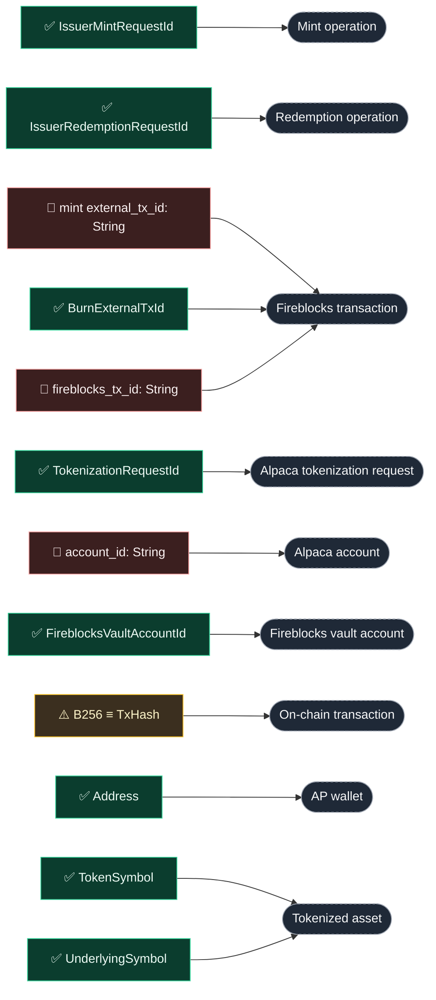
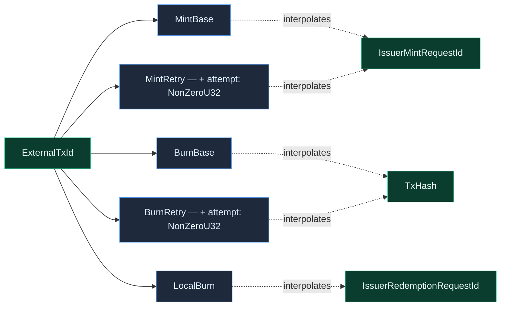

# IDs

This doc catalogs every identifier the system uses, names what it identifies,
and marks whether it's typed correctly today. It's the source of truth for the
typing-bug issues filed against `main`.

## Definitions

- **Bug.** A domain value typed as something the compiler can't distinguish from
  another semantic value. Two forms in this codebase:
  - _Stringly typed._ A bare `String` (or `Option<String>`) for an ID.
  - _Alias collapse._ A type alias whose underlying primitive is shared with
    another alias of different meaning — e.g. `type TxHash = B256;` and
    `type B256 = FixedBytes<32>;`. The compiler treats them as the same type;
    nothing stops `tx_hash` from being passed where a block hash is expected.
- **Dead code.** Parsing, format-detection, or interpolation logic that exists
  only because the type doesn't carry the structure. Every `format!("mint-{…}")`
  at a call site and every `parse_attempt_from(external_tx_id: &str)` helper is
  dead the moment the ID has a proper ADT with constructors and `Display`.
- **Correct.** A domain value has its own type that is structurally incompatible
  with values of other meanings unless explicitly converted.

## Catalog

| Entity                         | ID type today                      | Status | Note                                                                                                                             |
| ------------------------------ | ---------------------------------- | ------ | -------------------------------------------------------------------------------------------------------------------------------- |
| Mint operation                 | `IssuerMintRequestId(Uuid)`        | ✅     | newtype                                                                                                                          |
| Redemption operation           | `IssuerRedemptionRequestId`        | ✅     | enum `Full(TxHash) \| Legacy(FixedBytes<4>)`                                                                                     |
| Fireblocks mint tx (we author) | bare `String` (`external_tx_id`)   | 🐛     | proposed `ExternalTxId` ADT, mint side (see below)                                                                               |
| Fireblocks burn tx (we author) | `BurnExternalTxId(String)`         | ✅     | newtype with `base`/`retry` constructors + `retry_attempt` parser; the proposed `ExternalTxId` ADT unifies it with the mint side |
| Fireblocks tx (they author)    | bare `String` (`fireblocks_tx_id`) | 🐛     | proposed opaque newtype `FireblocksTxId`                                                                                         |
| Alpaca tokenization request    | `TokenizationRequestId(String)`    | ✅     | opaque newtype                                                                                                                   |
| Alpaca account                 | bare `String` (`account_id`)       | 🐛     | proposed opaque newtype `AlpacaAccountId`                                                                                        |
| Fireblocks vault account       | `FireblocksVaultAccountId`         | ✅     | opaque newtype                                                                                                                   |
| On-chain transaction           | `B256` / `TxHash`                  | ⚠️     | alias collapse — both alias `FixedBytes<32>`, indistinguishable to the compiler                                                  |
| AP wallet                      | `Address`                          | ✅     | alloy newtype on `FixedBytes<20>`, distinct from `B256`                                                                          |
| Tokenized asset (token)        | `TokenSymbol(String)`              | ✅     | newtype                                                                                                                          |
| Tokenized asset (underlying)   | `UnderlyingSymbol(String)`         | ✅     | newtype                                                                                                                          |

## Current-state graph

Status icons live on the nodes; entities are stadium-shape, ID types are
rectangles. Nothing in this graph is proposed — every node corresponds to
something that exists on `main` today.



## Proposed ADTs

For every 🐛 row above, the fix is a type whose shape mirrors what gets
interpolated into the string (constructed IDs) or wraps an opaque value with a
specific name (received IDs).

### `ExternalTxId` (constructed)

We author this string and send it to Fireblocks for idempotency. The burn side
is already half-typed: `BurnExternalTxId(String)` (`redemption/mod.rs`) is a
newtype with `base`/`retry` constructors, a `retry_attempt` parser, and a
`Display` impl. The mint side is still a bare `String`, built ad-hoc via
`format!("mint-{…}")` in `mint/mod.rs` with parsing helpers like
`retry_attempt_from_external_tx_id(&str)` that re-derive structure that was
present at construction. The proposed `ExternalTxId` consolidates both into one
enum — folding the existing `BurnExternalTxId` (the `BurnBase`/`BurnRetry`
variants) together with the still-stringly mint side (`MintBase`/`MintRetry`) —
so the string ↔ ADT mapping lives in exactly one place.



Constructors live on the type; `Display` produces the wire string; `FromStr`
parses it. The format helpers and the `VaultOperation` enum in
`fireblocks/vault_service.rs` become dead and get deleted.

### `FireblocksTxId` (received opaque)

```rust
pub(crate) struct FireblocksTxId(String);
```

No internal ADT — Fireblocks authors the value. The type exists so callers can't
pass an `external_tx_id` (which we author) where a `fireblocks_tx_id` (which
Fireblocks authors) is expected.

### `AlpacaAccountId` (received opaque)

```rust
pub(crate) struct AlpacaAccountId(String);
```

Same shape, different node — distinguishes Alpaca-side account ids from every
other `String` that flies through the Alpaca client.

### `TxHash` (alias collapse)

`alloy`'s `TxHash` is `type TxHash = B256 = FixedBytes<32>`. Three names for one
underlying primitive, with no compiler-enforced distinction between "transaction
hash", "storage slot", and "any 32-byte value". A proper fix is a newtype
wrapping `B256`:

```rust
pub(crate) struct TxHash(B256);
```

The change is mechanical but wide (every alloy boundary needs a conversion), so
it gets its own issue and is the lowest-priority of the four — flagged here
because it's the same class of bug as the rest.

## Rules

1. **Every ID has a type.** A bare `String` for an ID field is a bug.
2. **Construction is centralized on the type.** No `format!("mint-…")` at call
   sites — only constructors on the enum. Same rule for parsing (`FromStr`): the
   string ↔ ADT mapping has exactly one definition.
3. **Same entity, multiple formats → one enum.** Legacy → new, base → retry,
   mint → burn — each new format is a new variant on the enum that already
   identifies the entity, not a parallel type.
4. **Received-opaque ≠ stringly typed.** An ID we don't author still gets its
   own newtype. The type tells callers what it points at; the lack of inner
   structure tells them not to inspect it.
5. **Aliases are not types.** `type X = Y;` does nothing for the compiler. If
   two names should be distinguishable, one of them must be a newtype.

## Why this matters

`IssuerRedemptionRequestId` started life as `String`. When the format changed
from `red-{4_bytes_of_hash}` to `0x{full_tx_hash}`, both representations
coexisted in the same `String` field, indistinguishable to the compiler. Code
that branched on the format had to re-parse the string every time, and
forgetting to do so silently treated semantically different IDs as the same
value. The fix (PR #161 / RAI-631) was to lift the format into an ADT —
`Full(TxHash) | Legacy(FixedBytes<4>)` — so the type system carries the
distinction and the format-handling lives in one place.

The lesson generalizes: two ADTs collapsing into one `String` edge loses the
encoding at the type level. That collapse is exactly the failure mode every 🐛
and every ⚠️ in this catalog still reproduces.
